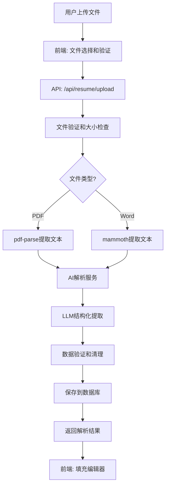

# Design Document: Resume Upload and AI Analysis

## Overview

本设计文档描述了简历上传并AI分析功能的技术实现方案。该功能允许用户上传PDF或Word格式的简历文件，系统自动提取文本内容，使用AI进行结构化解析，并将结果保存到数据库中。前端简历编辑器将自动填充解析后的数据，用户可以进一步编辑和优化。

## Architecture

系统采用三层架构：

1. **前端层（Frontend Layer）**
   - 简历编辑器页面（`app/chat/resume-editor/page.tsx`）
   - 文件上传组件
   - 进度指示器和错误提示

2. **API层（API Layer）**
   - `/api/resume/upload` - 处理文件上传、解析和存储的主端点
   - 使用Next.js API Routes（Node.js runtime）

3. **服务层（Service Layer）**
   - 文件解析服务（PDF和Word）
   - AI解析服务（LLM调用）
   - 数据库服务（Supabase）
   - 文件存储服务



## Components and Interfaces

### 1. API Endpoint: `/api/resume/upload`

**文件路径**: `app/api/resume/upload/route.ts`

**接口定义**:
```typescript
// Request
POST /api/resume/upload
Content-Type: multipart/form-data
Authorization: Required (via cookies)

FormData:
  - file: File (PDF or Word document)
  - sessionId?: string (optional)

// Response (Success)
{
  ok: true,
  resumeId: string,
  parsed: {
    summary: string,
    skills: string[],
    education: Array<{
      school: string,
      degree: string,
      time: string,
      text: string
    }>,
    experiences: Array<{
      company: string,
      title: string,
      time: string,
      text: string
    }>,
    projects: Array<{
      title: string,
      role: string,
      start: string,
      end: string,
      text: string
    }>
  },
  rawText: string,
  storageUrl: string
}

// Response (Error)
{
  ok: false,
  error: string,
  message?: string
}
```

### 2. File Parser Service

**功能**: 从PDF和Word文件中提取文本内容

**实现**:
```typescript
interface FileParserService {
  parsePDF(buffer: Buffer): Promise<string>;
  parseWord(buffer: Buffer): Promise<string>;
}
```

**依赖库**:
- `pdf-parse`: 解析PDF文件
- `mammoth`: 解析Word文件（.docx）

### 3. AI Parser Service

**功能**: 使用LLM将简历文本转换为结构化数据

**实现**:
```typescript
interface AIParserService {
  parseResumeText(rawText: string): Promise<ParsedResumeData>;
}

interface ParsedResumeData {
  summary: string;
  skills: string[];
  education: EducationItem[];
  experiences: ExperienceItem[];
  projects: ProjectItem[];
}
```

**AI Prompt设计**:
```
System: 你是一个专业的简历解析助手。请仔细阅读简历文本，提取所有信息，并严格按照JSON格式返回。

User: 请解析以下简历内容：
[简历文本]

要求：
1. 只返回JSON，不要包含其他文字或markdown代码块标记
2. 如果某个字段没有信息，返回空数组[]或空字符串""
3. 尽量提取完整的信息
4. summary字段要简洁（50-100字）

返回格式：
{
  "summary": "个人简介",
  "skills": ["技能1", "技能2"],
  "education": [{"school": "...", "degree": "...", "time": "...", "text": "..."}],
  "experiences": [{"company": "...", "title": "...", "time": "...", "text": "..."}],
  "projects": [{"title": "...", "role": "...", "start": "...", "end": "...", "text": "..."}]
}
```

### 4. Database Service

**功能**: 保存简历数据到数据库

**表结构**:

1. **resumes表**:
```sql
CREATE TABLE resumes (
  id UUID PRIMARY KEY,
  user_id UUID NOT NULL,
  filename TEXT NOT NULL,
  parsed JSONB NOT NULL,
  storage_url TEXT,
  active BOOLEAN DEFAULT true,
  created_at TIMESTAMPTZ DEFAULT NOW(),
  updated_at TIMESTAMPTZ DEFAULT NOW()
);
```

2. **user_resumes表**:
```sql
CREATE TABLE user_resumes (
  id UUID PRIMARY KEY,
  user_id UUID NOT NULL,
  session_id UUID,
  original_file_url TEXT,
  parsed_text TEXT,
  status TEXT DEFAULT 'pending',
  created_at TIMESTAMPTZ DEFAULT NOW(),
  updated_at TIMESTAMPTZ DEFAULT NOW(),
  parsed_meta JSONB
);
```

3. **resume_changes_log表**:
```sql
CREATE TABLE resume_changes_log (
  id UUID PRIMARY KEY,
  resume_id UUID,
  user_id UUID NOT NULL,
  session_id UUID,
  action_type TEXT NOT NULL,
  action_content JSONB,
  created_at TIMESTAMPTZ DEFAULT NOW()
);
```

**数据库操作**:
```typescript
interface DatabaseService {
  saveResume(data: {
    userId: string;
    sessionId: string;
    filename: string;
    parsed: ParsedResumeData;
    rawText: string;
    storageUrl: string;
  }): Promise<string>; // returns resumeId
  
  logResumeAction(data: {
    resumeId: string;
    userId: string;
    sessionId: string;
    actionType: string;
    actionContent: any;
  }): Promise<void>;
}
```

### 5. Frontend Upload Component

**位置**: `app/chat/resume-editor/page.tsx`

**新增功能**:
- 文件上传按钮
- 拖拽上传区域
- 上传进度指示器
- 错误提示
- 自动填充解析结果

**组件接口**:
```typescript
interface ResumeUploadProps {
  onUploadSuccess: (parsed: ParsedResumeData) => void;
  onUploadError: (error: string) => void;
}
```

## Data Models

### ParsedResumeData

```typescript
interface ParsedResumeData {
  summary: string;              // 个人简介/自我评价
  skills: string[];             // 技能列表
  education: EducationItem[];   // 教育经历
  experiences: ExperienceItem[]; // 工作经历
  projects: ProjectItem[];      // 项目经历
}

interface EducationItem {
  school: string;    // 学校名称
  degree: string;    // 学历（本科/硕士/博士）
  time: string;      // 时间（如：2018-2022）
  text: string;      // 详细描述
}

interface ExperienceItem {
  company: string;   // 公司名称
  title: string;     // 职位名称
  time: string;      // 时间（如：2020-2023）
  text: string;      // 工作描述
}

interface ProjectItem {
  title: string;     // 项目名称
  role: string;      // 角色（如：负责人/参与）
  start: string;     // 开始时间
  end: string;       // 结束时间（或"至今"）
  text: string;      // 项目描述
}
```

### Database Models

```typescript
interface ResumeRecord {
  id: string;
  user_id: string;
  filename: string;
  parsed: ParsedResumeData;
  storage_url: string | null;
  active: boolean;
  created_at: string;
  updated_at: string;
}

interface UserResumeRecord {
  id: string;
  user_id: string;
  session_id: string | null;
  original_file_url: string | null;
  parsed_text: string | null;
  status: 'pending' | 'processing' | 'completed' | 'failed';
  created_at: string;
  updated_at: string;
  parsed_meta: ParsedResumeData | null;
}

interface ResumeChangeLog {
  id: string;
  resume_id: string | null;
  user_id: string;
  session_id: string | null;
  action_type: 'upload' | 'edit' | 'delete' | 'ai_optimize';
  action_content: any;
  created_at: string;
}
```

## Correctness Properties

*A property is a characteristic or behavior that should hold true across all valid executions of a system-essentially, a formal statement about what the system should do. Properties serve as the bridge between human-readable specifications and machine-verifiable correctness guarantees.*

### Property 1: File Type Validation

*For any* uploaded file, if the file extension is not .pdf, .doc, or .docx, then the system should reject the upload and return an error.

**Validates: Requirements 1.1, 1.2**

### Property 2: File Size Validation

*For any* uploaded file, if the file size exceeds 10MB, then the system should reject the upload and return an error.

**Validates: Requirements 1.3**

### Property 3: Text Extraction Success

*For any* valid PDF or Word file with readable content, the text extraction process should return a non-empty string.

**Validates: Requirements 2.1, 2.2, 2.4**

### Property 4: Parsed Data Structure Completeness

*For any* successfully parsed resume, the returned data structure should contain all required fields: summary, skills, education, experiences, and projects (even if some are empty arrays or strings).

**Validates: Requirements 3.2, 3.5**

### Property 5: Database Transaction Atomicity

*For any* resume upload operation, if any database operation fails (resumes, user_resumes, or resume_changes_log), then all operations should be rolled back and no partial data should be saved.

**Validates: Requirements 4.5**

### Property 6: User Authentication Requirement

*For any* request to /api/resume/upload, if the request does not contain valid authentication credentials, then the system should return a 401 Unauthorized error.

**Validates: Requirements 5.5, 8.1**

### Property 7: User Data Isolation

*For any* user, they should only be able to access resume data associated with their own user_id, and attempts to access other users' data should be rejected.

**Validates: Requirements 8.5**

### Property 8: Error Message Clarity

*For any* error condition (invalid file type, file too large, parsing failure, etc.), the system should return a specific, user-friendly error message that helps the user understand what went wrong.

**Validates: Requirements 7.1, 7.2, 7.3, 7.4, 7.5, 7.6**

### Property 9: AI Parsing Fallback

*For any* resume text, if AI parsing fails or times out, the system should still save the raw text and return a basic structure with empty fields rather than failing completely.

**Validates: Requirements 3.3, 3.4**

### Property 10: File Upload Performance

*For any* file smaller than 5MB, the complete upload and parsing process (including AI analysis) should complete within 30 seconds under normal conditions.

**Validates: Requirements 9.1, 9.3**

## Error Handling

### Error Categories

1. **Validation Errors (400 Bad Request)**
   - Invalid file type
   - File too large
   - Missing file
   - Invalid request format

2. **Authentication Errors (401 Unauthorized)**
   - Missing authentication
   - Invalid session
   - Expired token

3. **Processing Errors (500 Internal Server Error)**
   - File parsing failure
   - AI service failure
   - Database operation failure
   - File storage failure

4. **Timeout Errors (504 Gateway Timeout)**
   - AI parsing timeout
   - Database query timeout

### Error Response Format

```typescript
interface ErrorResponse {
  ok: false;
  error: string;        // User-friendly error message
  code?: string;        // Error code for client-side handling
  details?: string;     // Technical details (only in development)
}
```

### Error Handling Strategy

1. **Graceful Degradation**: If AI parsing fails, save raw text and return basic structure
2. **Transaction Rollback**: If database operations fail, rollback all changes
3. **Cleanup**: Delete uploaded files if processing fails
4. **Logging**: Log all errors with context for debugging
5. **User Feedback**: Provide clear, actionable error messages

## Testing Strategy

### Unit Tests

Unit tests will verify specific examples and edge cases:

1. **File Validation Tests**
   - Test valid file types (.pdf, .docx)
   - Test invalid file types (.txt, .jpg, .exe)
   - Test file size limits (exactly 10MB, 10MB + 1 byte)
   - Test empty files

2. **Text Extraction Tests**
   - Test PDF with text content
   - Test PDF with images only (should fail gracefully)
   - Test Word document with text
   - Test corrupted files

3. **AI Parsing Tests**
   - Test with well-formatted resume text
   - Test with minimal information
   - Test with Chinese and English mixed content
   - Test AI service timeout handling

4. **Database Tests**
   - Test successful save to all three tables
   - Test transaction rollback on failure
   - Test duplicate upload handling

5. **Authentication Tests**
   - Test with valid user session
   - Test with missing authentication
   - Test with expired session

### Property-Based Tests

Property-based tests will verify universal properties across all inputs using a PBT library (fast-check for TypeScript):

1. **Property Test 1: File Type Validation**
   - Generate random file objects with various extensions
   - Verify that only .pdf, .doc, .docx are accepted
   - **Feature: resume-upload-ai-analysis, Property 1: File Type Validation**

2. **Property Test 2: File Size Validation**
   - Generate files of various sizes
   - Verify that files > 10MB are rejected
   - **Feature: resume-upload-ai-analysis, Property 2: File Size Validation**

3. **Property Test 3: Parsed Data Structure**
   - Generate various resume texts
   - Verify that parsed output always contains required fields
   - **Feature: resume-upload-ai-analysis, Property 4: Parsed Data Structure Completeness**

4. **Property Test 4: User Data Isolation**
   - Generate requests with different user IDs
   - Verify that users can only access their own data
   - **Feature: resume-upload-ai-analysis, Property 7: User Data Isolation**

5. **Property Test 5: Error Message Format**
   - Generate various error conditions
   - Verify that all errors return proper ErrorResponse format
   - **Feature: resume-upload-ai-analysis, Property 8: Error Message Clarity**

### Integration Tests

1. **End-to-End Upload Flow**
   - Upload a real PDF resume
   - Verify database records are created
   - Verify frontend receives correct data

2. **Error Recovery Flow**
   - Simulate AI service failure
   - Verify graceful degradation
   - Verify cleanup of temporary files

3. **Performance Tests**
   - Upload files of various sizes
   - Measure total processing time
   - Verify timeout handling

### Testing Configuration

- **Property tests**: Minimum 100 iterations per test
- **Test framework**: Jest for unit tests, fast-check for property tests
- **Test coverage target**: 80% code coverage
- **CI/CD**: Run all tests on every commit

## Implementation Notes

### File Storage Strategy

For MVP, we'll use local file storage:
- Store uploaded files in `/tmp` directory during processing
- After successful parsing, optionally move to permanent storage
- Store file path in `storage_url` field
- For production, consider using cloud storage (S3, Supabase Storage)

### AI Parsing Optimization

1. **Caching**: Cache AI parsing results for identical file hashes
2. **Timeout**: Set 30-second timeout for AI requests
3. **Fallback**: If AI fails, return raw text with empty structure
4. **Retry**: Retry AI requests once on timeout

### Security Considerations

1. **File Validation**: Check MIME type, not just extension
2. **Virus Scanning**: Consider integrating ClamAV for production
3. **Rate Limiting**: Limit uploads to 3 per minute per user
4. **File Cleanup**: Delete temporary files after processing
5. **SQL Injection**: Use parameterized queries (Supabase handles this)
6. **XSS Prevention**: Sanitize file names before storage

### Performance Optimization

1. **Streaming**: Use streaming for large file uploads
2. **Connection Pooling**: Reuse database connections
3. **Async Processing**: Consider background job queue for large files
4. **Compression**: Compress stored JSON data
5. **Indexing**: Add database indexes on user_id and session_id

### Frontend Integration

The resume editor page will be enhanced with:

1. **Upload Button**: Prominent "上传简历" button at the top
2. **Drag & Drop Zone**: Allow users to drag files into the editor
3. **Progress Indicator**: Show upload and parsing progress
4. **Auto-fill**: Automatically populate sections with parsed data
5. **Conflict Resolution**: Ask user if they want to replace existing content

### Migration Path

For existing users with resume data in localStorage:
1. Keep localStorage as fallback
2. Prompt users to upload their resume for better AI analysis
3. Gradually migrate localStorage data to database
