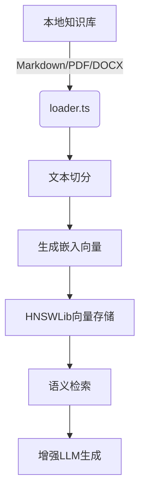

# AI与LLM集成

<cite>
**本文档引用的文件**  
- [llm.ts](file://lib/interview/llm.ts)
- [llm.ts](file://lib/llm.ts)
- [base.ts](file://src/lib/llm/base.ts)
- [index.ts](file://src/lib/llm/index.ts)
- [interview.ts](file://lib/orchestrator/prompts/interview.ts)
- [resume_optimization.ts](file://lib/orchestrator/prompts/resume_optimization.ts)
- [index.ts](file://src/lib/knowledge/index.ts)
- [loader.ts](file://src/lib/rag/loader.ts)
- [hnswlib.ts](file://src/lib/vectorstore/hnswlib.ts)
- [base.ts](file://src/lib/embeddings/base.ts)
- [analyze.ts](file://lib/agents/analyze.ts)
- [求职指南-岗位解析.md](file://src/lib/knowledge/base/求职指南-岗位解析.md)
</cite>

## 目录
1. [LLM调用封装机制](#llm调用封装机制)
2. [提示词模板设计与变量注入](#提示词模板设计与变量注入)
3. [求职指南知识库与RAG系统](#求职指南知识库与rag系统)
4. [AI代理工作流程](#ai代理工作流程)
5. [最佳实践与性能调优](#最佳实践与性能调优)

## LLM调用封装机制

项目通过多层封装实现对OpenAI/DeepSeek等大语言模型API的统一调用。核心封装逻辑位于`lib/llm.ts`和`src/lib/llm/base.ts`中，提供了带超时和重试机制的调用包装器。

`callLLM`函数是主要的调用入口，支持指定模型、温度、最大token数等参数，并能根据环境变量自动选择DeepSeek或OpenAI作为提供商。系统还实现了`LLMProvider`类，支持多种模型类型（deepseek、openai、qwen），并具备回退机制，在LangChain初始化失败时自动切换到OpenAI SDK兼容模式。

在模拟面试模块中，`lib/interview/llm.ts`进一步封装了生成面试题、评估答案和生成面试总结等专用功能。这些函数均内置了stub模式支持，当`LLM_STUB=1`时自动降级为预设的模拟响应，确保系统在无API密钥或网络异常时仍可运行。

**Section sources**
- [llm.ts](file://lib/llm.ts#L1-L163)
- [base.ts](file://src/lib/llm/base.ts#L1-L389)
- [llm.ts](file://lib/interview/llm.ts#L1-L849)

## 提示词模板设计与变量注入

提示词模板集中定义在`lib/orchestrator/prompts/`目录下，采用模块化设计，每个业务场景（如面试、简历优化）都有独立的系统提示词。

`interview.ts`中的`INTERVIEW_SYSTEM_PROMPT`定义了面试官角色的核心任务和原则，包括根据岗位要求设计问题、使用STAR法则评估回答、从多个维度评分等。该提示词强调了引导原则，如每次只问一个问题、等待用户回答后再评估、完成一轮后生成总结报告。

`resume_optimization.ts`中的`RESUME_OPTIMIZATION_SYSTEM_PROMPT`则专注于简历优化任务，要求以专业顾问角色分析简历内容，提供具体优化建议。其优化原则包括使用动词开头、量化成果、突出技术栈、避免空泛描述等，并针对不同简历部分提供针对性建议。

这些提示词通过变量注入机制与动态数据结合。例如，在生成面试题时，系统会将职位描述（JD）、面试轮次类型等信息注入到预设的prompt模板中，形成完整的请求内容。这种设计既保证了提示词的专业性和一致性，又实现了高度的个性化和灵活性。

**Section sources**
- [interview.ts](file://lib/orchestrator/prompts/interview.ts#L1-L32)
- [resume_optimization.ts](file://lib/orchestrator/prompts/resume_optimization.ts#L1-L31)

## 求职指南知识库与RAG系统

项目构建了基于本地Markdown文档的求职指南知识库，位于`src/lib/knowledge/base/`目录下，包含《求职指南-岗位解析.md》、《求职指南-简历写法.md》等多份专业文档。这些文档系统性地整理了互联网、制造业、金融业等多个行业的岗位职责、核心能力要求和职业发展建议。

RAG（检索增强生成）系统通过`src/lib/rag/loader.ts`实现，负责将这些本地文档加载为向量并支持语义检索。`loadKnowledgeBase`函数递归读取知识库目录下的所有支持格式文件（.md、.txt、.pdf、.docx），使用`RecursiveCharacterTextSplitter`将文档切分为500字符的块（重叠50字符），并为每个块添加源文件、文件名、块索引等元数据。

向量存储使用`src/lib/vectorstore/hnswlib.ts`中的`HNSWLibStoreWrapper`类实现，基于hnswlib-node库构建高效的近似最近邻搜索索引。系统使用BAAI/bge-small-zh-v1.5模型生成中文嵌入向量，通过`EmbeddingProvider`类提供嵌入服务。向量索引可保存到磁盘并在启动时加载，确保检索效率。

**Diagram sources**
- [loader.ts](file://src/lib/rag/loader.ts#L1-L214)
- [hnswlib.ts](file://src/lib/vectorstore/hnswlib.ts#L1-L345)
- [base.ts](file://src/lib/embeddings/base.ts#L1-L121)

**Section sources**
- [loader.ts](file://src/lib/rag/loader.ts#L1-L214)
- [hnswlib.ts](file://src/lib/vectorstore/hnswlib.ts#L1-L345)
- [base.ts](file://src/lib/embeddings/base.ts#L1-L121)
- [求职指南-岗位解析.md](file://src/lib/knowledge/base/求职指南-岗位解析.md#L1-L203)

## AI代理工作流程

AI代理的核心工作流程在`lib/agents/analyze.ts`中定义。`analyzeConversation`函数负责分析对话消息，提取结构化数据。该函数接收对话消息数组和当前用户阶段作为输入，返回包含意向角色、关键技能、STAR项目、简历洞察和薪酬策略等信息的分析结果。

尽管当前实现为MVP版本的占位实现，但其设计明确了未来AI智能提取的架构方向。代理的工作流程包括输入解析、上下文构建和响应生成三个阶段。输入解析阶段将原始对话消息转换为标准化格式；上下文构建阶段结合用户历史数据和当前对话状态形成完整上下文；响应生成阶段则调用LLM生成符合当前阶段目标的输出。

该代理机制与提示词模板和RAG系统协同工作，形成完整的AI决策闭环。例如，在简历优化阶段，代理会结合RAG系统检索到的行业最佳实践，生成更具针对性的优化建议。

**Section sources**
- [analyze.ts](file://lib/agents/analyze.ts#L1-L72)

## 最佳实践与性能调优

项目在AI与LLM集成方面体现了多项最佳实践。首先，通过分层封装实现了API调用的统一管理和灵活切换，支持多提供商和多模型类型。其次，采用stub模式确保系统在异常情况下的可用性，提升了用户体验。

在性能调优方面，系统通过向量索引的持久化避免了每次启动时重复计算嵌入向量，显著提升了启动速度和检索效率。同时，合理的超时和重试配置（如面试题生成使用60秒超时）平衡了响应速度和生成质量。

模型切换策略上，系统通过环境变量`LLM_MODEL_TYPE`控制，默认使用DeepSeek，可无缝切换至OpenAI或通义千问。这种设计既保证了核心功能的稳定性，又为未来扩展提供了便利。

**Section sources**
- [llm.ts](file://lib/llm.ts#L1-L163)
- [base.ts](file://src/lib/llm/base.ts#L1-L389)
- [hnswlib.ts](file://src/lib/vectorstore/hnswlib.ts#L1-L345)