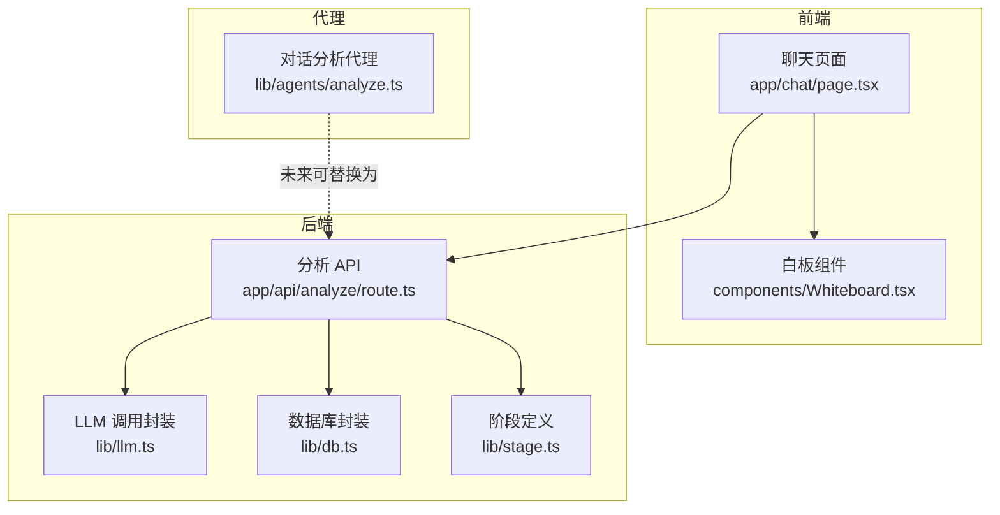
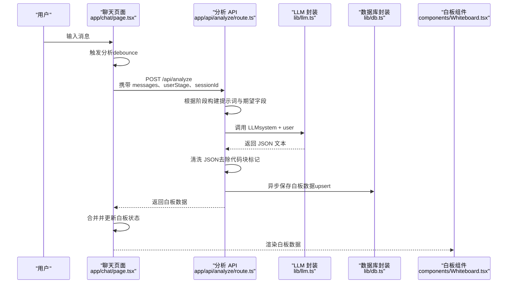
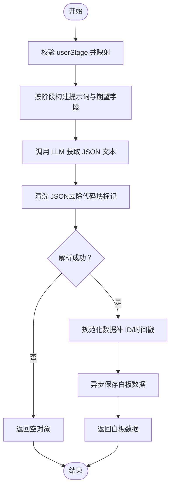
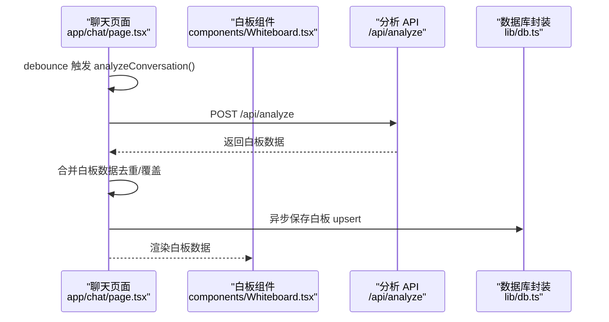
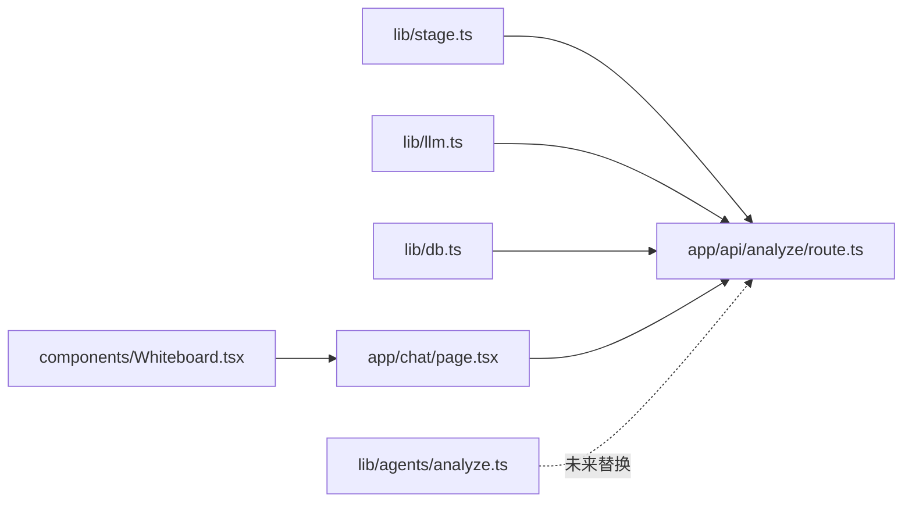

# AI代理与智能分析

<cite>
**本文引用的文件**
- [lib/agents/analyze.ts](file://lib/agents/analyze.ts)
- [app/api/analyze/route.ts](file://app/api/analyze/route.ts)
- [lib/llm.ts](file://lib/llm.ts)
- [lib/stage.ts](file://lib/stage.ts)
- [lib/db.ts](file://lib/db.ts)
- [lib/conversationStore.ts](file://lib/conversationStore.ts)
- [app/chat/page.tsx](file://app/chat/page.tsx)
- [components/Whiteboard.tsx](file://components/Whiteboard.tsx)
</cite>

## 目录
1. [引言](#引言)
2. [项目结构](#项目结构)
3. [核心组件](#核心组件)
4. [架构总览](#架构总览)
5. [详细组件分析](#详细组件分析)
6. [依赖关系分析](#依赖关系分析)
7. [性能考量](#性能考量)
8. [故障排查指南](#故障排查指南)
9. [结论](#结论)
10. [附录](#附录)

## 引言
本文件围绕 lib/agents/analyze.ts 中的“对话分析代理”设计进行深入解读，重点说明：
- AnalyzeResult 接口定义的结构化数据模型及其业务含义
- analyzeConversation 函数作为 MVP 版本的占位实现，当前返回空对象，但已预留接口以便未来集成 AI 模型进行深度信息抽取
- 该代理的预期工作流程：接收完整的对话历史，识别用户在简历优化、面试等环节中透露的关键信息，并结构化存储，用于生成报告或跨阶段复用
- 未来实现方案建议：调用 LLM 解析对话、提取技能关键词，或使用正则匹配识别项目经历
- 强调该模块在构建用户画像和实现个性化辅导中的核心作用

## 项目结构
该功能涉及前后端协作：前端在聊天页面收集用户消息并触发分析；后端 API 将对话历史交给 LLM，按阶段提取结构化数据，并持久化到白板状态中，最终由前端白板组件展示。

图表来源
- [app/chat/page.tsx](file://app/chat/page.tsx#L477-L663)
- [app/api/analyze/route.ts](file://app/api/analyze/route.ts#L89-L448)
- [lib/llm.ts](file://lib/llm.ts#L81-L161)
- [lib/db.ts](file://lib/db.ts#L144-L207)
- [lib/stage.ts](file://lib/stage.ts#L1-L85)
- [lib/agents/analyze.ts](file://lib/agents/analyze.ts#L1-L72)

章节来源
- [app/chat/page.tsx](file://app/chat/page.tsx#L477-L663)
- [app/api/analyze/route.ts](file://app/api/analyze/route.ts#L89-L448)
- [lib/llm.ts](file://lib/llm.ts#L81-L161)
- [lib/db.ts](file://lib/db.ts#L144-L207)
- [lib/stage.ts](file://lib/stage.ts#L1-L85)
- [lib/agents/analyze.ts](file://lib/agents/analyze.ts#L1-L72)

## 核心组件
- AnalyzeResult 接口：定义了结构化分析结果的数据模型，涵盖意向岗位、核心技能、STAR 项目、简历优化建议、薪资策略等字段，用于支撑不同阶段的个性化输出与跨阶段复用。
- analyzeConversation 函数（MVP 占位实现）：当前返回空对象，为后续接入 LLM 提供统一接口契约，便于逐步迭代。
- 分析 API（/api/analyze）：根据用户当前阶段动态构造提示词，调用 LLM 提取结构化 JSON，清洗并规范化数据，异步保存至白板状态，最终返回给前端。
- 前端集成：聊天页面在每次 AI 回复后自动触发分析，合并白板数据并持久化，白板组件负责可视化展示。

章节来源
- [lib/agents/analyze.ts](file://lib/agents/analyze.ts#L6-L30)
- [lib/agents/analyze.ts](file://lib/agents/analyze.ts#L39-L58)
- [app/api/analyze/route.ts](file://app/api/analyze/route.ts#L123-L305)
- [app/api/analyze/route.ts](file://app/api/analyze/route.ts#L349-L442)
- [app/chat/page.tsx](file://app/chat/page.tsx#L477-L663)
- [components/Whiteboard.tsx](file://components/Whiteboard.tsx#L1-L73)

## 架构总览
下图展示了从用户输入到结构化白板数据的端到端流程，包括阶段判定、提示词构建、LLM 调用、JSON 清洗与持久化。

图表来源
- [app/chat/page.tsx](file://app/chat/page.tsx#L477-L663)
- [app/api/analyze/route.ts](file://app/api/analyze/route.ts#L123-L305)
- [app/api/analyze/route.ts](file://app/api/analyze/route.ts#L349-L442)
- [lib/llm.ts](file://lib/llm.ts#L81-L161)
- [lib/db.ts](file://lib/db.ts#L144-L207)
- [components/Whiteboard.tsx](file://components/Whiteboard.tsx#L1-L73)

## 详细组件分析

### AnalyzeResult 接口与业务含义
AnalyzeResult 是结构化分析结果的数据模型，面向不同求职阶段提供关键信息载体：
- intentRole（意向岗位）：用于职业规划阶段，记录用户意向的岗位名称，便于后续投递策略与面试准备的定向化。
- keySkills（核心技能）：用于职业规划与简历优化阶段，记录用户自述的核心技能清单，支持去重合并与跨阶段复用。
- starProjects（STAR 项目）：用于项目梳理阶段，记录项目标题、背景、任务、行动、结果等要素，支持多项目增量合并。
- resumeInsights（简历优化建议）：用于简历优化阶段，记录原句、优化后句子、优化建议及所属部分，支持在编辑器中快速落地。
- salaryStrategy（薪资策略）：用于薪资沟通阶段，记录目标薪资范围、谈判要点与市场数据，形成可执行的策略清单。

这些字段共同构成用户画像的基础数据，支撑个性化辅导与跨阶段复用。

章节来源
- [lib/agents/analyze.ts](file://lib/agents/analyze.ts#L6-L30)

### analyzeConversation（MVP 占位实现）
- 设计定位：作为 MVP 版本的占位实现，当前直接返回空对象，保证接口契约稳定，为后续接入 LLM 提供无缝替换能力。
- 价值：通过统一的 AnalyzeResult 接口，未来可直接替换为基于 LLM 的智能抽取实现，无需改动上层调用方。

章节来源
- [lib/agents/analyze.ts](file://lib/agents/analyze.ts#L39-L58)

### 分析 API（/api/analyze）工作流
- 阶段判定与提示词构建：根据 userStage 选择对应阶段的提示词模板与期望字段集合，确保 LLM 输出严格匹配当前阶段。
- LLM 调用：通过 callLLM 封装调用 DeepSeek/OpenAI，设置温度、最大 Token、超时与重试策略，保证稳定性。
- JSON 清洗与校验：清理可能的代码块标记，提取首个 JSON 对象并解析，解析失败时返回空对象，避免阻断流程。
- 数据规范化与 ID 补全：为数组字段（如 starProjects、resumeInsights、interviewReports、offers）补全唯一 ID 与创建时间，确保前端可稳定渲染与导航。
- 异步持久化：将白板数据 upsert 到数据库，不阻塞响应，保障用户体验。
- 返回前端：返回标准化白板数据，前端负责合并与展示。

图表来源
- [app/api/analyze/route.ts](file://app/api/analyze/route.ts#L123-L305)
- [app/api/analyze/route.ts](file://app/api/analyze/route.ts#L349-L442)
- [lib/llm.ts](file://lib/llm.ts#L81-L161)
- [lib/db.ts](file://lib/db.ts#L144-L207)

章节来源
- [app/api/analyze/route.ts](file://app/api/analyze/route.ts#L89-L448)
- [lib/llm.ts](file://lib/llm.ts#L81-L161)
- [lib/db.ts](file://lib/db.ts#L144-L207)

### 前端集成与白板展示
- 自动分析：聊天页面在每次 AI 回复后，使用防抖策略自动触发分析，合并白板数据并异步保存。
- 数据合并策略：数组字段采用去重合并，非数组字段直接覆盖，确保增量更新与一致性。
- 白板渲染：白板组件根据当前阶段展示不同板块（求职岗位、核心技能、项目经历、简历优化建议、面试报告、目标公司、薪资策略、Offer 列表），并支持跳转到详情页。

图表来源
- [app/chat/page.tsx](file://app/chat/page.tsx#L477-L663)
- [components/Whiteboard.tsx](file://components/Whiteboard.tsx#L1-L73)
- [lib/db.ts](file://lib/db.ts#L144-L207)

章节来源
- [app/chat/page.tsx](file://app/chat/page.tsx#L477-L663)
- [components/Whiteboard.tsx](file://components/Whiteboard.tsx#L1-L73)

## 依赖关系分析
- 阶段定义：lib/stage.ts 提供用户阶段枚举与映射，分析 API 依据阶段选择提示词模板与期望字段。
- LLM 调用：lib/llm.ts 提供统一的 LLM 调用封装，支持超时与重试、Provider 切换与 Stub 模式。
- 数据持久化：lib/db.ts 提供白板 upsert 与查询，支持基于 sessionId 或 userId 的冲突处理。
- 前端状态：app/chat/page.tsx 维护消息与白板状态，组件 Whiteboard.tsx 负责可视化展示。
- 代理模块：lib/agents/analyze.ts 作为占位实现，未来可替换为基于 LLM 的智能抽取逻辑，保持接口一致。

图表来源
- [lib/stage.ts](file://lib/stage.ts#L1-L85)
- [app/api/analyze/route.ts](file://app/api/analyze/route.ts#L89-L448)
- [lib/llm.ts](file://lib/llm.ts#L81-L161)
- [lib/db.ts](file://lib/db.ts#L144-L207)
- [app/chat/page.tsx](file://app/chat/page.tsx#L477-L663)
- [components/Whiteboard.tsx](file://components/Whiteboard.tsx#L1-L73)
- [lib/agents/analyze.ts](file://lib/agents/analyze.ts#L1-L72)

章节来源
- [lib/stage.ts](file://lib/stage.ts#L1-L85)
- [app/api/analyze/route.ts](file://app/api/analyze/route.ts#L89-L448)
- [lib/llm.ts](file://lib/llm.ts#L81-L161)
- [lib/db.ts](file://lib/db.ts#L144-L207)
- [app/chat/page.tsx](file://app/chat/page.tsx#L477-L663)
- [components/Whiteboard.tsx](file://components/Whiteboard.tsx#L1-L73)
- [lib/agents/analyze.ts](file://lib/agents/analyze.ts#L1-L72)

## 性能考量
- LLM 调用稳定性：通过超时与重试策略降低网络波动与服务异常的影响；在 Stub 模式下可快速验证前端逻辑。
- 前端防抖：聊天页面对分析调用进行 1 秒防抖，减少频繁调用带来的资源消耗与 LLM 负载。
- 数据清洗与解析：对 LLM 返回的 JSON 文本进行清洗与提取，避免因格式偏差导致解析失败。
- 异步持久化：保存白板数据采用异步 upsert，不影响响应速度与用户体验。

章节来源
- [lib/llm.ts](file://lib/llm.ts#L12-L73)
- [lib/llm.ts](file://lib/llm.ts#L81-L161)
- [app/chat/page.tsx](file://app/chat/page.tsx#L555-L663)
- [app/api/analyze/route.ts](file://app/api/analyze/route.ts#L349-L442)

## 故障排查指南
- LLM 调用失败
  - 现象：调用 LLM 抛错或超时
  - 排查：检查环境变量（DeepSeek/OpenAI API Key）、Provider 配置、网络连通性；关注超时与重试日志
  - 参考
    - [lib/llm.ts](file://lib/llm.ts#L107-L161)
- JSON 解析失败
  - 现象：分析 API 返回空对象
  - 排查：确认 LLM 输出严格为 JSON；检查清洗逻辑是否正确移除了代码块标记
  - 参考
    - [app/api/analyze/route.ts](file://app/api/analyze/route.ts#L372-L393)
- 白板数据未保存
  - 现象：刷新后数据丢失
  - 排查：确认数据库客户端初始化成功、sessionId 有效、upsert 冲突处理逻辑正常
  - 参考
    - [lib/db.ts](file://lib/db.ts#L144-L207)
- 前端白板不更新
  - 现象：分析后白板未显示新增数据
  - 排查：确认合并策略（数组去重、非数组覆盖）与前端渲染逻辑；检查 sessionId 与用户登录状态
  - 参考
    - [app/chat/page.tsx](file://app/chat/page.tsx#L477-L663)
    - [components/Whiteboard.tsx](file://components/Whiteboard.tsx#L1-L73)

章节来源
- [lib/llm.ts](file://lib/llm.ts#L107-L161)
- [app/api/analyze/route.ts](file://app/api/analyze/route.ts#L372-L393)
- [lib/db.ts](file://lib/db.ts#L144-L207)
- [app/chat/page.tsx](file://app/chat/page.tsx#L477-L663)
- [components/Whiteboard.tsx](file://components/Whiteboard.tsx#L1-L73)

## 结论
lib/agents/analyze.ts 中的对话分析代理以 AnalyzeResult 为核心数据模型，当前作为 MVP 占位实现，为后续接入 LLM 提供了稳定的接口契约。分析 API 通过阶段化提示词与严格的 JSON 输出约束，结合 LLM 封装与数据库 upsert，实现了从对话到结构化白板数据的闭环。前端在每次 AI 回复后自动触发分析，合并并持久化白板数据，最终由白板组件进行可视化呈现。该模块在构建用户画像与实现个性化辅导方面具有核心价值，是贯穿求职全流程的关键数据枢纽。

## 附录

### 未来实现方案建议
- 基于 LLM 的智能抽取
  - 在 analyzeConversation 中接入 LLM，按阶段提取字段，返回 AnalyzeResult
  - 与现有分析 API 协作：若采用 LLM 抽取，可将 analyzeConversation 的返回值映射到白板数据结构
- 关键词提取与正则匹配
  - 对于技能关键词与项目经历，可结合正则规则进行补充抽取，降低 LLM 成本
- 数据增强与交叉验证
  - 将不同阶段的白板数据进行交叉验证（如项目经历与简历优化建议的一致性），提升数据质量
- 用户画像与个性化推荐
  - 基于 intentRole 与 keySkills，结合市场数据与匹配度，为投递策略与面试准备提供更精准的建议

章节来源
- [lib/agents/analyze.ts](file://lib/agents/analyze.ts#L6-L30)
- [lib/agents/analyze.ts](file://lib/agents/analyze.ts#L39-L58)
- [app/api/analyze/route.ts](file://app/api/analyze/route.ts#L123-L305)