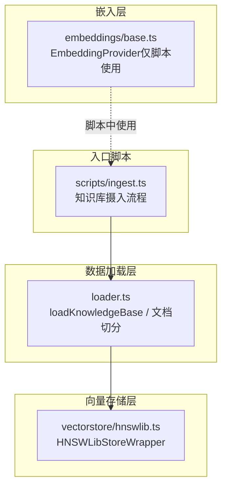
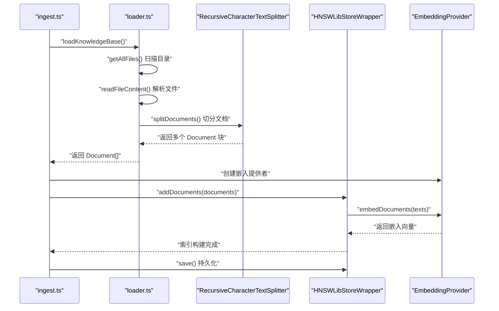
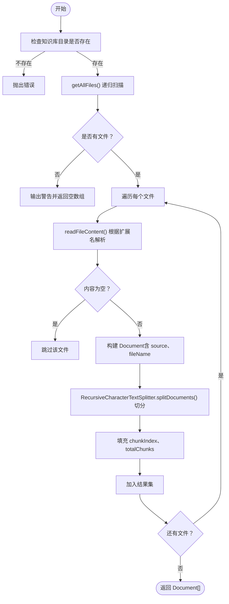
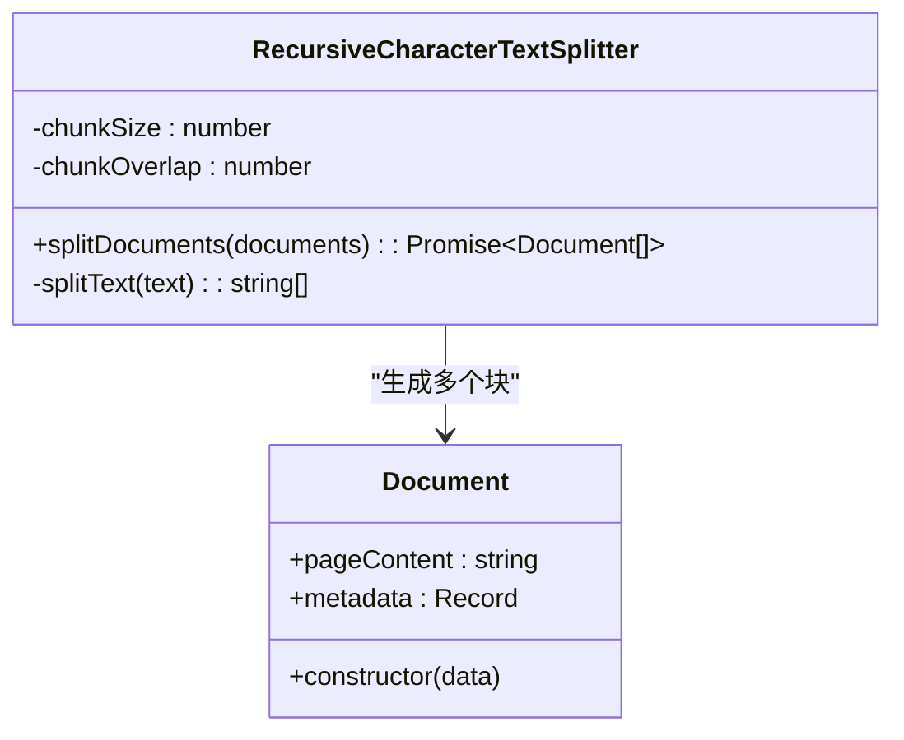
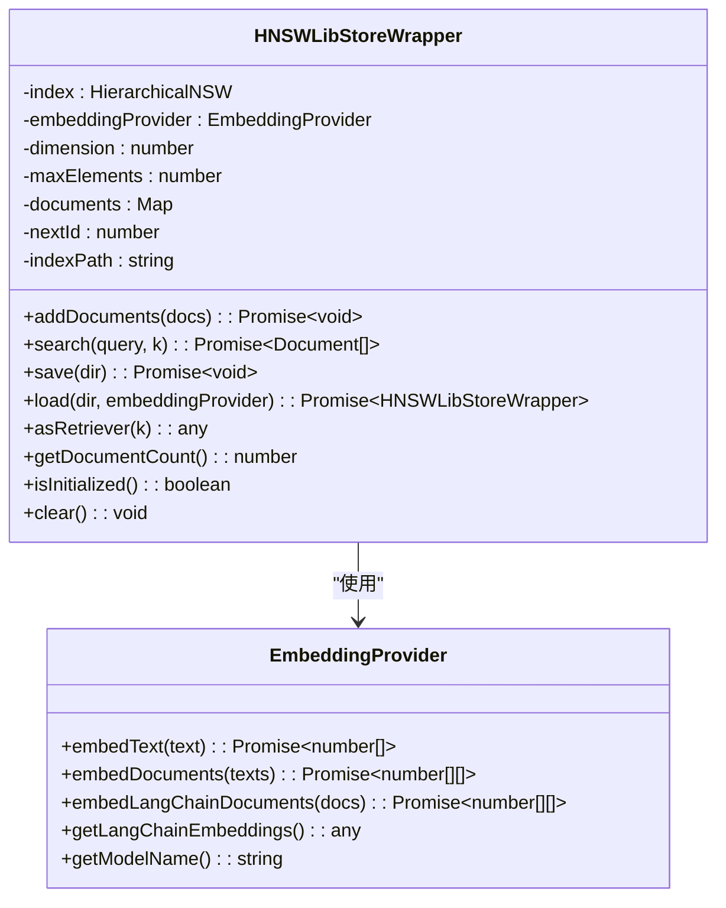
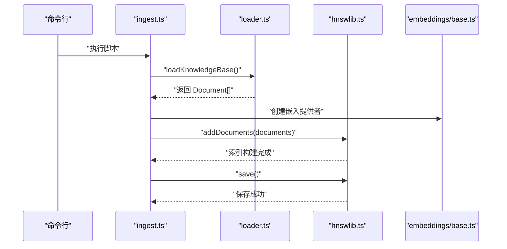
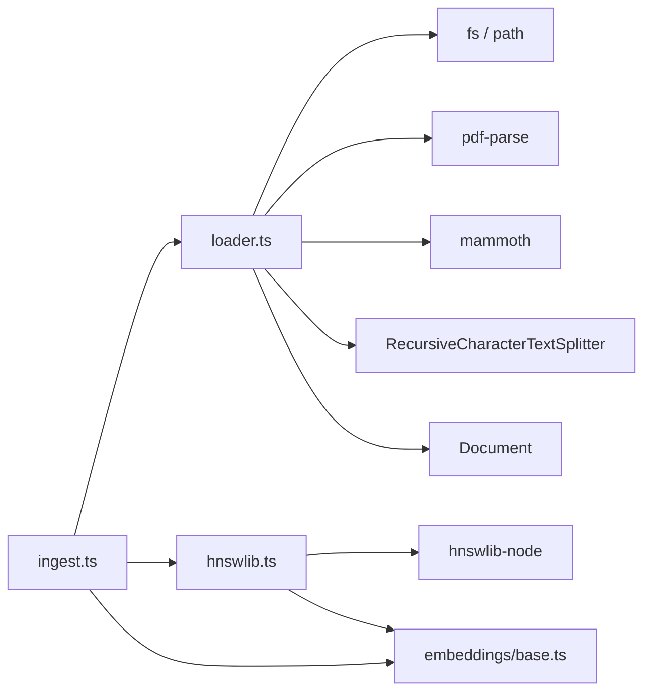

# RAG系统实现

<cite>
**本文引用的文件**
- [src/lib/rag/loader.ts](file://src/lib/rag/loader.ts)
- [src/lib/vectorstore/hnswlib.ts](file://src/lib/vectorstore/hnswlib.ts)
- [src/lib/embeddings/base.ts](file://src/lib/embeddings/base.ts)
- [scripts/ingest.ts](file://scripts/ingest.ts)
- [src/lib/knowledge/base/求职指南-岗位解析.md](file://src/lib/knowledge/base/求职指南-岗位解析.md)
- [src/lib/knowledge/base/求职指南-简历写法.md](file://src/lib/knowledge/base/求职指南-简历写法.md)
- [src/lib/knowledge/base/求职指南-行业分析.md](file://src/lib/knowledge/base/求职指南-行业分析.md)
</cite>

## 目录
1. [简介](#简介)
2. [项目结构](#项目结构)
3. [核心组件](#核心组件)
4. [架构总览](#架构总览)
5. [详细组件分析](#详细组件分析)
6. [依赖分析](#依赖分析)
7. [性能考虑](#性能考虑)
8. [故障排查指南](#故障排查指南)
9. [结论](#结论)
10. [附录](#附录)

## 简介
本文件深入解析 src/lib/rag/loader.ts 实现的检索增强生成（RAG）系统，聚焦以下关键点：
- loadKnowledgeBase 如何递归扫描知识库目录，识别并加载 .md、.txt、.pdf、.docx 四种格式文件；
- readFileContent 如何调用 pdf-parse 和 mammoth 解析二进制文件为纯文本；
- 临时实现的 RecursiveCharacterTextSplitter 将长文本切分为 500 字符的块，并设置 50 字符重叠以保证语义连贯；
- Document 对象的构建过程，包括 pageContent 与包含 source、fileName、chunkIndex 等元数据；
- 该模块为后续向量存储与语义检索提供的数据基础，及其在提升 AI 回答准确性和专业性方面的作用；
- 未来可扩展性，如接入向量数据库（hnswlib-node）进行相似度搜索。

## 项目结构
RAG 系统由三个层次组成：
- 数据加载层：src/lib/rag/loader.ts 负责扫描知识库、解析文件、切分文档并构建 Document；
- 向量存储层：src/lib/vectorstore/hnswlib.ts 提供基于 hnswlib-node 的向量索引与检索；
- 嵌入层：src/lib/embeddings/base.ts 提供嵌入能力（当前在应用中不启用，仅在本地脚本中使用）；
- 入口脚本：scripts/ingest.ts 将知识库文档加载、嵌入并持久化到向量存储。

图表来源
- [src/lib/rag/loader.ts](file://src/lib/rag/loader.ts#L1-L214)
- [src/lib/vectorstore/hnswlib.ts](file://src/lib/vectorstore/hnswlib.ts#L1-L345)
- [src/lib/embeddings/base.ts](file://src/lib/embeddings/base.ts#L1-L121)
- [scripts/ingest.ts](file://scripts/ingest.ts#L1-L77)

章节来源
- [src/lib/rag/loader.ts](file://src/lib/rag/loader.ts#L1-L214)
- [src/lib/vectorstore/hnswlib.ts](file://src/lib/vectorstore/hnswlib.ts#L1-L345)
- [src/lib/embeddings/base.ts](file://src/lib/embeddings/base.ts#L1-L121)
- [scripts/ingest.ts](file://scripts/ingest.ts#L1-L77)

## 核心组件
- Document 类：用于承载 pageContent 与 metadata，作为 RAG 管道中的统一数据结构。
- RecursiveCharacterTextSplitter：临时实现的文本切分器，按固定 chunkSize 与 chunkOverlap 切分文档。
- loadKnowledgeBase：主流程函数，负责扫描目录、解析文件、构建 Document 并切分块。
- HNSWLibStoreWrapper：向量存储与检索封装，支持 addDocuments、search、save/load、asRetriever 等。
- EmbeddingProvider：嵌入提供者（当前仅在脚本中使用）。
- scripts/ingest.ts：端到端摄入流程，串联加载、嵌入、入库与持久化。

章节来源
- [src/lib/rag/loader.ts](file://src/lib/rag/loader.ts#L9-L214)
- [src/lib/vectorstore/hnswlib.ts](file://src/lib/vectorstore/hnswlib.ts#L1-L345)
- [src/lib/embeddings/base.ts](file://src/lib/embeddings/base.ts#L1-L121)
- [scripts/ingest.ts](file://scripts/ingest.ts#L1-L77)

## 架构总览
RAG 系统的数据流如下：
- 从知识库目录递归扫描文件，过滤支持的扩展名；
- 根据扩展名调用对应解析器（文本、PDF、DOCX）；
- 构建 Document 并使用切分器切分为多个块；
- 将块交给向量存储层，生成嵌入并建立索引；
- 检索时对查询生成嵌入，返回最相似的文档块。

图表来源
- [src/lib/rag/loader.ts](file://src/lib/rag/loader.ts#L57-L214)
- [src/lib/vectorstore/hnswlib.ts](file://src/lib/vectorstore/hnswlib.ts#L107-L179)
- [src/lib/embeddings/base.ts](file://src/lib/embeddings/base.ts#L17-L121)
- [scripts/ingest.ts](file://scripts/ingest.ts#L17-L71)

## 详细组件分析

### 组件A：loadKnowledgeBase 与文件扫描
- getAllFiles：递归遍历目录，仅收集 .md、.txt、.pdf、.docx 四种扩展名文件，返回文件路径数组。
- readFileContent：根据扩展名分派到 readTextFile、readPdfFile、readDocxFile。
- readTextFile：直接读取 UTF-8 文本。
- readPdfFile：读取二进制缓冲区后交由 pdf-parse 解析为纯文本。
- readDocxFile：读取二进制缓冲区后交由 mammoth.extractRawText 提取纯文本。
- loadKnowledgeBase：检查目录存在性、调用 getAllFiles、逐个文件调用 readFileContent，构建 Document（包含 source、fileName），随后使用切分器切分为块，并为每个块填充 chunkIndex、totalChunks 元数据。

图表来源
- [src/lib/rag/loader.ts](file://src/lib/rag/loader.ts#L57-L214)

章节来源
- [src/lib/rag/loader.ts](file://src/lib/rag/loader.ts#L57-L214)

### 组件B：文本切分器 RecursiveCharacterTextSplitter
- 参数：chunkSize=500，chunkOverlap=50；
- splitDocuments：对每个 Document 的 pageContent 进行切分，生成多个块，复制原始 Document 的 metadata；
- splitText：滑动窗口切分，每次前进 chunkSize - chunkOverlap，确保相邻块有重叠，提升语义连贯性；
- 输出：每个块都是一个新的 Document，携带相同的 metadata（除新增 chunkIndex、totalChunks）。

图表来源
- [src/lib/rag/loader.ts](file://src/lib/rag/loader.ts#L21-L55)

章节来源
- [src/lib/rag/loader.ts](file://src/lib/rag/loader.ts#L21-L55)

### 组件C：向量存储与检索 HNSWLibStoreWrapper
- addDocuments：接收 Document[]，提取 pageContent，调用 EmbeddingProvider.embedDocuments 获取向量，初始化 HNSW 索引并逐条 addPoint，同时维护文档映射；
- search：对查询文本生成向量，调用 searchKnn 返回邻居 ID，再从文档映射中还原 Document；
- save/load：保存/加载索引文件与元数据，恢复维度、最大容量与文档映射；
- asRetriever：导出可调用的检索器，支持 LangChain 风格的检索接口；
- getDocumentCount/isInitialized/clear：辅助状态查询与清理。

图表来源
- [src/lib/vectorstore/hnswlib.ts](file://src/lib/vectorstore/hnswlib.ts#L1-L345)
- [src/lib/embeddings/base.ts](file://src/lib/embeddings/base.ts#L1-L121)

章节来源
- [src/lib/vectorstore/hnswlib.ts](file://src/lib/vectorstore/hnswlib.ts#L107-L179)
- [src/lib/embeddings/base.ts](file://src/lib/embeddings/base.ts#L17-L121)

### 组件D：知识库摄入脚本 scripts/ingest.ts
- 调用 loadKnowledgeBase 获取 Document[]；
- 统计原始文档数与块数；
- 创建 EmbeddingProvider（当前仅用于脚本）；
- 创建 HNSWLibStoreWrapper 并 addDocuments；
- 保存索引到指定目录。

图表来源
- [scripts/ingest.ts](file://scripts/ingest.ts#L17-L71)
- [src/lib/rag/loader.ts](file://src/lib/rag/loader.ts#L145-L214)
- [src/lib/vectorstore/hnswlib.ts](file://src/lib/vectorstore/hnswlib.ts#L181-L220)
- [src/lib/embeddings/base.ts](file://src/lib/embeddings/base.ts#L17-L42)

章节来源
- [scripts/ingest.ts](file://scripts/ingest.ts#L17-L71)

### 组件E：知识库样例文件
- 求职指南-岗位解析.md、求职指南-简历写法.md、求职指南-行业分析.md 等作为知识库内容，经 loadKnowledgeBase 解析后进入 RAG 管道。

章节来源
- [src/lib/knowledge/base/求职指南-岗位解析.md](file://src/lib/knowledge/base/求职指南-岗位解析.md#L1-L203)
- [src/lib/knowledge/base/求职指南-简历写法.md](file://src/lib/knowledge/base/求职指南-简历写法.md#L1-L96)
- [src/lib/knowledge/base/求职指南-行业分析.md](file://src/lib/knowledge/base/求职指南-行业分析.md#L1-L111)

## 依赖分析
- loader.ts 依赖：
  - fs/path：文件系统与路径处理；
  - pdf-parse：解析 PDF；
  - mammoth：解析 DOCX；
  - 临时 Document 与 RecursiveCharacterTextSplitter；
- vectorstore/hnswlib.ts 依赖：
  - hnswlib-node：HierarchicalNSW 实现；
  - EmbeddingProvider：嵌入提供者；
- embeddings/base.ts：
  - 当前为占位实现，仅在脚本中使用；
- scripts/ingest.ts：
  - 组合上述模块，完成端到端摄入流程。

图表来源
- [src/lib/rag/loader.ts](file://src/lib/rag/loader.ts#L1-L214)
- [src/lib/vectorstore/hnswlib.ts](file://src/lib/vectorstore/hnswlib.ts#L1-L345)
- [src/lib/embeddings/base.ts](file://src/lib/embeddings/base.ts#L1-L121)
- [scripts/ingest.ts](file://scripts/ingest.ts#L1-L77)

章节来源
- [src/lib/rag/loader.ts](file://src/lib/rag/loader.ts#L1-L214)
- [src/lib/vectorstore/hnswlib.ts](file://src/lib/vectorstore/hnswlib.ts#L1-L345)
- [src/lib/embeddings/base.ts](file://src/lib/embeddings/base.ts#L1-L121)
- [scripts/ingest.ts](file://scripts/ingest.ts#L1-L77)

## 性能考虑
- 文本切分：
  - chunkSize=500、chunkOverlap=50，兼顾召回与上下文连贯性；
  - 切分复杂度 O(n)，n 为文本长度；
- 文件解析：
  - PDF/DOCX 解析为 CPU 密集型，建议批量异步处理并限制并发；
- 向量存储：
  - HNSWLibStoreWrapper 在 addDocuments 时逐条 addPoint，建议批量嵌入后一次性 addPoint；
  - 维度变更会触发重建索引，应尽量保持一致的嵌入维度；
- I/O 与持久化：
  - save/load 会写入 index.bin 与 meta.json，注意磁盘空间与权限；
- 嵌入提供者：
  - 当前在应用中不启用，仅脚本使用，避免在运行时引入额外依赖。

[本节为通用性能建议，不直接分析具体文件]

## 故障排查指南
- 目录不存在：
  - loadKnowledgeBase 会在目录不存在时抛出错误，请确认知识库目录路径正确；
- 不支持的文件类型：
  - readFileContent 对未支持扩展名会抛出错误，确保扩展名为 .md/.txt/.pdf/.docx；
- 空内容文件：
  - 跳过空内容文件并输出警告，检查源文件是否损坏；
- PDF/DOCX 解析失败：
  - 检查 pdf-parse 与 mammoth 的版本与依赖安装；
- 嵌入提供者禁用：
  - EmbeddingProvider 在应用中会抛出错误，仅在脚本中使用；
- 索引保存失败：
  - 检查保存目录权限与磁盘空间，确认 index.bin 与 meta.json 正常生成；
- 维度不匹配：
  - 若嵌入维度与现有索引不一致，会重建索引并清空文档映射，注意数据一致性。

章节来源
- [src/lib/rag/loader.ts](file://src/lib/rag/loader.ts#L145-L214)
- [src/lib/rag/loader.ts](file://src/lib/rag/loader.ts#L121-L135)
- [src/lib/embeddings/base.ts](file://src/lib/embeddings/base.ts#L17-L42)
- [src/lib/vectorstore/hnswlib.ts](file://src/lib/vectorstore/hnswlib.ts#L181-L220)
- [src/lib/vectorstore/hnswlib.ts](file://src/lib/vectorstore/hnswlib.ts#L115-L149)

## 结论
本 RAG 实现通过递归扫描知识库、多格式解析、临时切分器与向量存储封装，为后续语义检索提供了坚实的数据基础。尽管当前嵌入提供者在应用中禁用，但脚本已完整打通“加载-嵌入-入库-检索”的闭环。未来可进一步：
- 引入真正的嵌入提供者（如 LangChain/HuggingFace）；
- 优化切分策略（如按句子/段落边界）；
- 扩展支持更多文件格式；
- 与向量数据库（如 hnswlib-node）深度集成，完善检索与召回链路。

[本节为总结性内容，不直接分析具体文件]

## 附录
- 术语说明：
  - Document：RAG 管道中的基本数据单元，包含 pageContent 与 metadata；
  - chunk：切分后的文档片段，携带 chunkIndex、totalChunks 等元数据；
  - 嵌入：将文本映射到向量空间的表示，用于相似度计算；
  - HNSW：Hierarchical Navigable Small World，一种高效的近似最近邻搜索算法。

[本节为概念性内容，不直接分析具体文件]