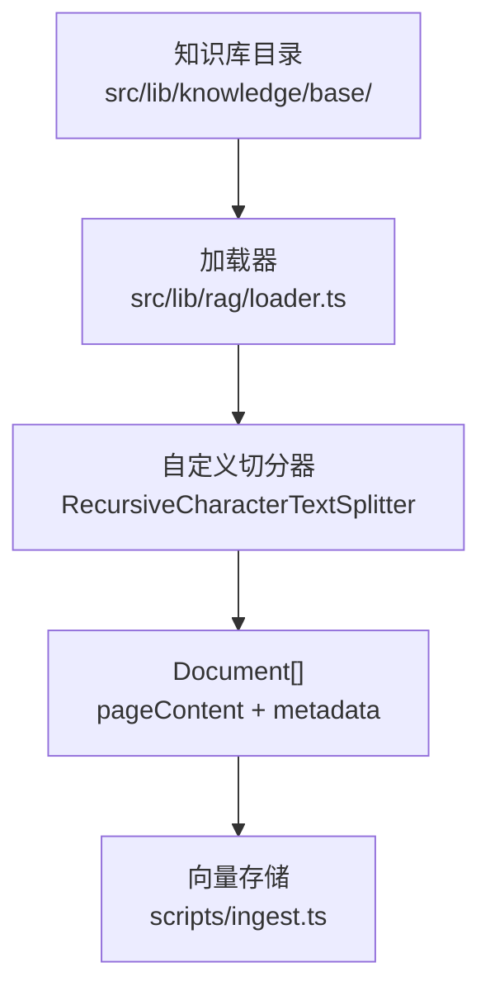
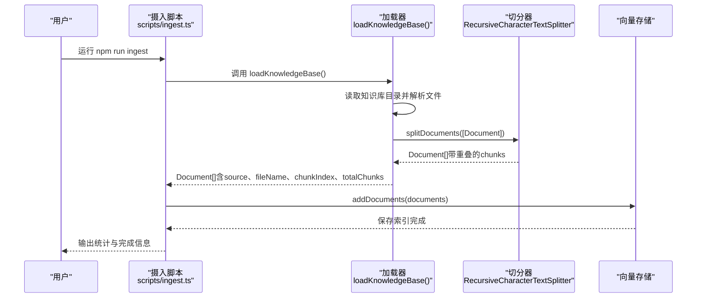
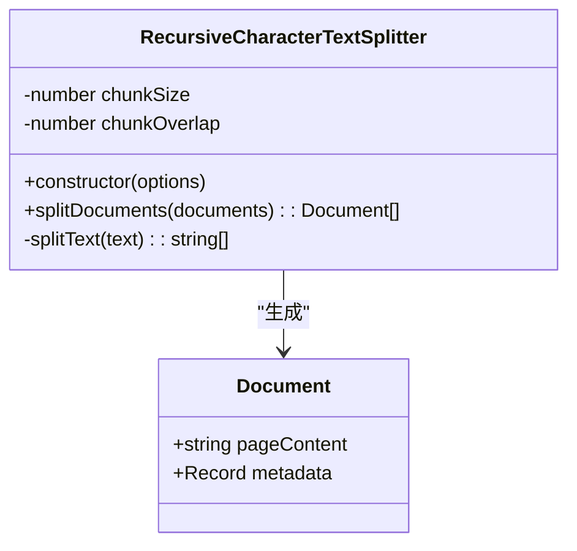
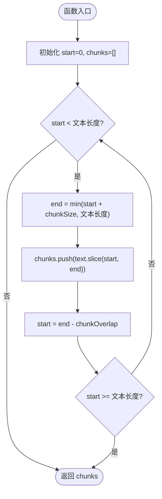
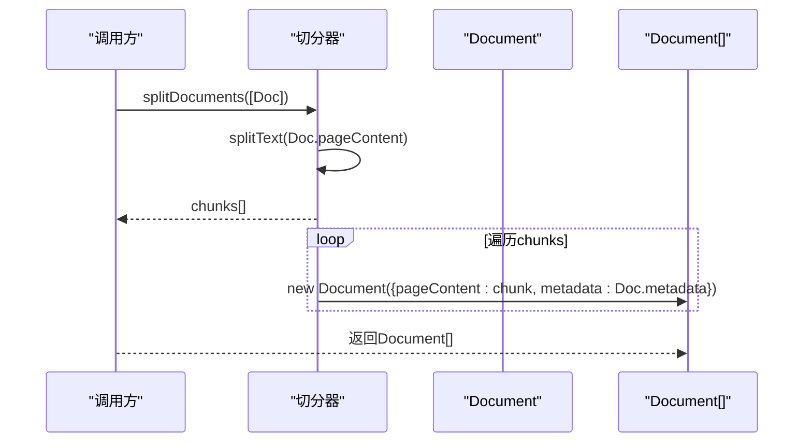
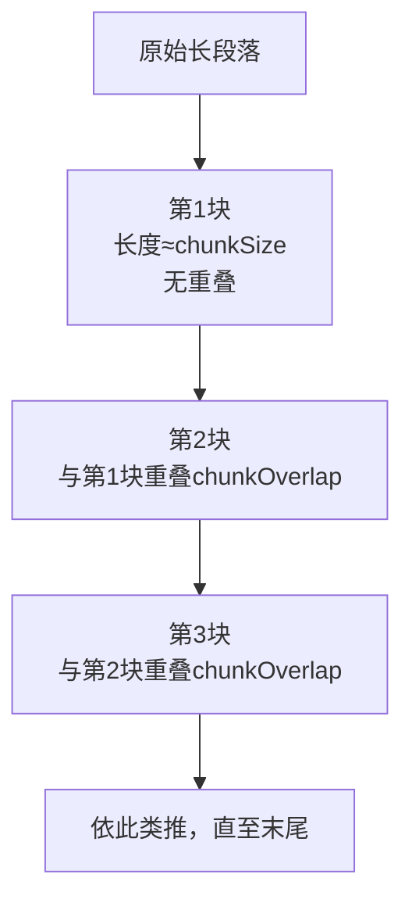
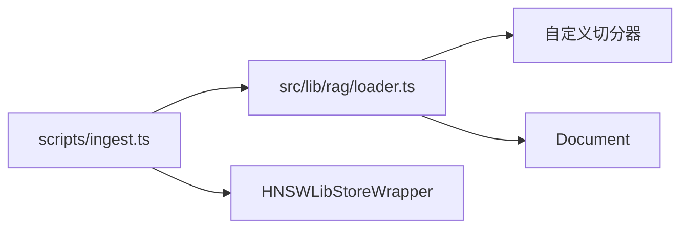

# 文本切分策略

<cite>
**本文引用的文件**
- [loader.ts](file://src/lib/rag/loader.ts)
- [README.md](file://src/lib/README.md)
- [ingest.ts](file://scripts/ingest.ts)
- [求职指南-岗位解析.md](file://src/lib/knowledge/base/求职指南-岗位解析.md)
- [求职指南-简历写法.md](file://src/lib/knowledge/base/求职指南-简历写法.md)
</cite>

## 目录
1. [简介](#简介)
2. [项目结构](#项目结构)
3. [核心组件](#核心组件)
4. [架构总览](#架构总览)
5. [详细组件分析](#详细组件分析)
6. [依赖分析](#依赖分析)
7. [性能考量](#性能考量)
8. [故障排查指南](#故障排查指南)
9. [结论](#结论)
10. [附录](#附录)

## 简介
本节面向RAG系统中的文本切分策略，聚焦于自研的RecursiveCharacterTextSplitter实现。该实现通过chunkSize（500字符）与chunkOverlap（50字符）参数控制文本块大小与相邻块之间的重叠，从而在保证语义连贯性的同时避免信息断裂。本文将剖析splitText与splitDocuments方法的算法逻辑，给出从长段落到多个带重叠文本块的流程示意，并讨论当前实现的局限性与未来升级路径（如集成LangChain标准分词器）。

## 项目结构
RAG文档加载与切分位于src/lib/rag/loader.ts，知识库文档位于src/lib/knowledge/base/，摄入脚本位于scripts/ingest.ts。整体流程为：读取知识库目录→解析文件内容→使用自定义切分器切分为chunks→为每个块保留原始元数据→写入向量存储。

图表来源
- [loader.ts](file://src/lib/rag/loader.ts#L145-L212)
- [README.md](file://src/lib/README.md#L151-L169)
- [ingest.ts](file://scripts/ingest.ts#L1-L77)

章节来源
- [loader.ts](file://src/lib/rag/loader.ts#L145-L212)
- [README.md](file://src/lib/README.md#L151-L169)
- [ingest.ts](file://scripts/ingest.ts#L1-L77)

## 核心组件
- 自定义切分器：RecursiveCharacterTextSplitter
  - 参数：chunkSize=500，chunkOverlap=50
  - 能力：将长文本按固定长度切分，相邻块保留重叠，确保语义连贯
- 文档对象：Document（临时实现）
  - 字段：pageContent（文本内容）、metadata（元数据）
- 加载器：loadKnowledgeBase
  - 读取知识库目录→解析文件→构造Document→调用切分器→追加chunkIndex与totalChunks→返回Document[]
- 摄入脚本：scripts/ingest.ts
  - 调用loadKnowledgeBase→嵌入→保存向量索引

章节来源
- [loader.ts](file://src/lib/rag/loader.ts#L20-L55)
- [loader.ts](file://src/lib/rag/loader.ts#L145-L212)
- [README.md](file://src/lib/README.md#L151-L169)
- [ingest.ts](file://scripts/ingest.ts#L1-L77)

## 架构总览
下图展示了从知识库到向量存储的端到端流程，突出切分器在中间的关键作用。

图表来源
- [ingest.ts](file://scripts/ingest.ts#L17-L72)
- [loader.ts](file://src/lib/rag/loader.ts#L145-L212)
- [loader.ts](file://src/lib/rag/loader.ts#L30-L55)

章节来源
- [ingest.ts](file://scripts/ingest.ts#L1-L77)
- [loader.ts](file://src/lib/rag/loader.ts#L145-L212)

## 详细组件分析

### 自定义切分器：RecursiveCharacterTextSplitter
- 设计要点
  - 固定窗口滑动：每次移动距离为chunkSize减去chunkOverlap，确保相邻块有重叠
  - 语义连贯：重叠有助于跨块检索时减少语义断裂
  - 兼容LangChain：Document结构与LangChain兼容，便于后续替换为官方实现
- 关键方法
  - splitDocuments：接收Document[]，对每个Document的pageContent调用splitText，保留原始metadata，为每个切分块生成新的Document
  - splitText：核心算法，按固定步长切分文本，直到末尾

图表来源
- [loader.ts](file://src/lib/rag/loader.ts#L9-L18)
- [loader.ts](file://src/lib/rag/loader.ts#L20-L55)

章节来源
- [loader.ts](file://src/lib/rag/loader.ts#L20-L55)
- [loader.ts](file://src/lib/rag/loader.ts#L9-L18)

### splitText算法流程（核心逻辑）
- 输入：原始文本
- 步骤：
  1) 从start=0开始
  2) 计算end=min(start+chunkSize, 文本长度)
  3) 截取[start, end)加入chunks
  4) 移动start=end-chunkOverlap
  5) 若start未达到末尾，回到步骤2；否则结束
- 特点：
  - 固定步长滑窗，重叠长度恒定
  - 不按句子边界切分，可能在句中截断
  - 时间复杂度O(n)，空间复杂度O(n)

图表来源
- [loader.ts](file://src/lib/rag/loader.ts#L44-L54)

章节来源
- [loader.ts](file://src/lib/rag/loader.ts#L44-L54)

### splitDocuments处理流程（保留元数据）
- 输入：Document[]
- 步骤：
  1) 遍历每个Document
  2) 调用splitText得到chunks
  3) 为每个chunk创建新的Document，复制原始metadata
  4) 返回合并后的Document[]
- 元数据增强：
  - 在加载器内部，为每个Document追加chunkIndex与totalChunks，便于检索后排序与溯源

图表来源
- [loader.ts](file://src/lib/rag/loader.ts#L30-L55)

章节来源
- [loader.ts](file://src/lib/rag/loader.ts#L30-L55)

### 从长段落到多个带重叠文本块的示例（概念流程）
以下流程图展示了一个较长段落被切分为多个带重叠的文本块的过程，帮助理解chunkSize与chunkOverlap的作用。

图表来源
- [loader.ts](file://src/lib/rag/loader.ts#L44-L54)

章节来源
- [loader.ts](file://src/lib/rag/loader.ts#L44-L54)

### 当前实现的局限性
- 未按句子边界切分：可能导致语义片段不完整，影响检索质量
- 未考虑特殊字符与编码：在多语言混合或特殊格式文本中可能出现截断异常
- 未处理首尾块的边界情况：例如最后一块可能小于chunkSize
- 未提供多级切分策略：无法根据内容结构（如标题、段落）自适应调整切分粒度

章节来源
- [loader.ts](file://src/lib/rag/loader.ts#L44-L54)

### 未来升级路径（集成LangChain标准分词器）
- 替换方案
  - 使用langchain/text_splitter中的RecursiveCharacterTextSplitter，支持按字符、换行、句子、单词等多级切分策略
  - 通过addSeparator与chunkHeader等选项增强语义边界控制
- 迁移建议
  - 保持Document结构不变，仅替换切分器实例化与调用方式
  - 逐步迁移：先在测试环境对比两种切分器的检索效果，再切换生产
- 预期收益
  - 更好的语义连贯性与检索召回
  - 更灵活的切分策略适配不同文档类型

章节来源
- [loader.ts](file://src/lib/rag/loader.ts#L5-L8)
- [README.md](file://src/lib/README.md#L151-L169)

## 依赖分析
- 组件耦合
  - loadKnowledgeBase依赖RecursiveCharacterTextSplitter与Document
  - scripts/ingest.ts依赖loadKnowledgeBase，间接依赖切分器
- 外部依赖
  - 文件解析：pdf-parse、mammoth
  - 向量存储：HNSWLibStoreWrapper（当前摄入脚本使用）
- 潜在环路
  - 当前文件间无循环依赖，模块职责清晰

图表来源
- [loader.ts](file://src/lib/rag/loader.ts#L145-L212)
- [ingest.ts](file://scripts/ingest.ts#L1-L77)

章节来源
- [loader.ts](file://src/lib/rag/loader.ts#L145-L212)
- [ingest.ts](file://scripts/ingest.ts#L1-L77)

## 性能考量
- 时间复杂度
  - splitText：O(n)，n为文本长度
  - splitDocuments：O(m·n)，m为文档数量，n为平均文档长度
- 空间复杂度
  - O(n)用于chunks数组与输出Document[]
- 优化建议
  - 批量处理：在loadKnowledgeBase中并行读取与解析文件（注意I/O限制）
  - 控制chunkSize：在语义连贯与向量存储规模之间权衡
  - 预估内存：大文档切分会产生较多chunks，需评估内存峰值

章节来源
- [loader.ts](file://src/lib/rag/loader.ts#L44-L54)
- [loader.ts](file://src/lib/rag/loader.ts#L145-L212)

## 故障排查指南
- 常见问题
  - 知识库目录不存在：检查路径与权限
  - 文件内容为空：确认文件是否成功解析
  - 切分后块数过多：考虑增大chunkSize或减少chunkOverlap
  - 检索召回不佳：尝试启用更细粒度的切分策略（LangChain分词器）
- 日志与调试
  - 摄入脚本输出Loaded docs与Created chunks统计
  - 加载器打印每个文件的块数信息
- 建议
  - 在测试环境对比不同chunkSize与chunkOverlap组合
  - 对关键文档进行人工抽样校验切分质量

章节来源
- [loader.ts](file://src/lib/rag/loader.ts#L145-L212)
- [ingest.ts](file://scripts/ingest.ts#L17-L72)

## 结论
本项目采用自定义的RecursiveCharacterTextSplitter，以固定窗口滑动的方式实现文本切分，参数chunkSize=500、chunkOverlap=50在保证检索召回的同时兼顾了处理效率。尽管当前实现未按句子边界切分，存在语义片段不完整等局限，但通过保留原始元数据与追加chunkIndex/totalChunks，为后续检索与溯源提供了便利。未来可平滑迁移到LangChain标准分词器，以获得更精细的语义边界控制与更好的检索效果。

## 附录
- 示例文档参考
  - 求职指南-岗位解析.md
  - 求职指南-简历写法.md
- 使用建议
  - 在知识库文档中尽量保持段落完整，减少跨段落的长链式描述
  - 对于PDF/DOCX等富文本，建议先统一清理格式后再切分

章节来源
- [求职指南-岗位解析.md](file://src/lib/knowledge/base/求职指南-岗位解析.md#L1-L203)
- [求职指南-简历写法.md](file://src/lib/knowledge/base/求职指南-简历写法.md#L1-L96)