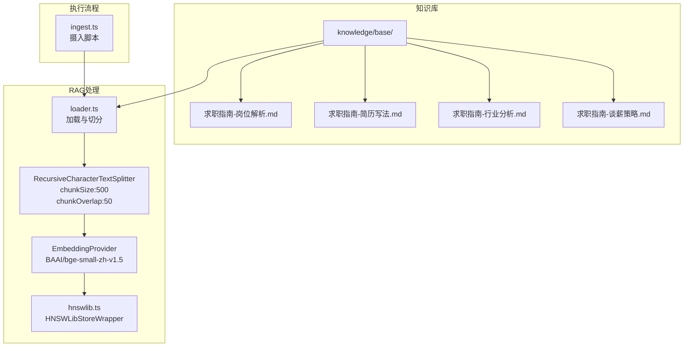
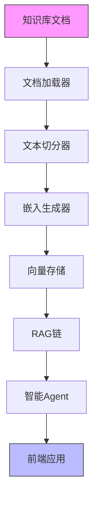
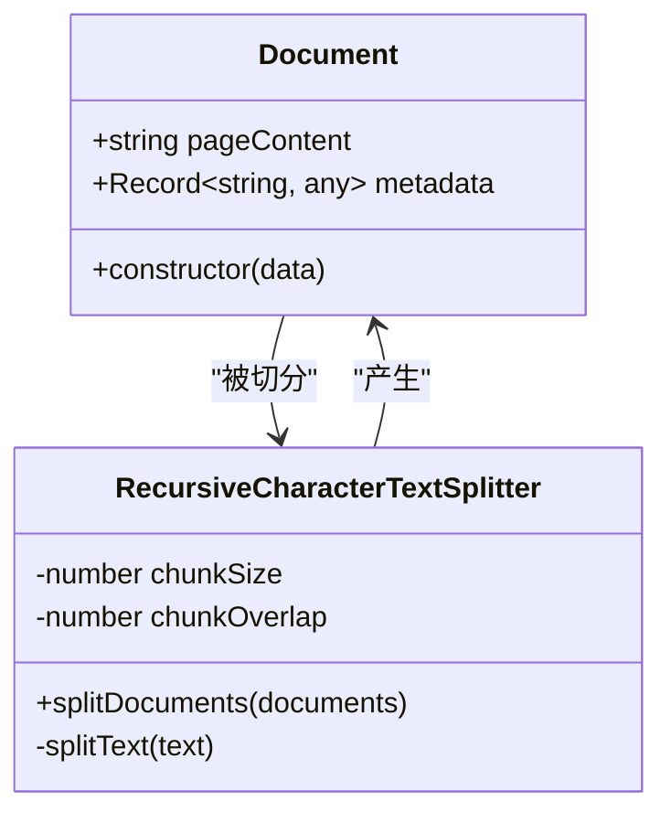
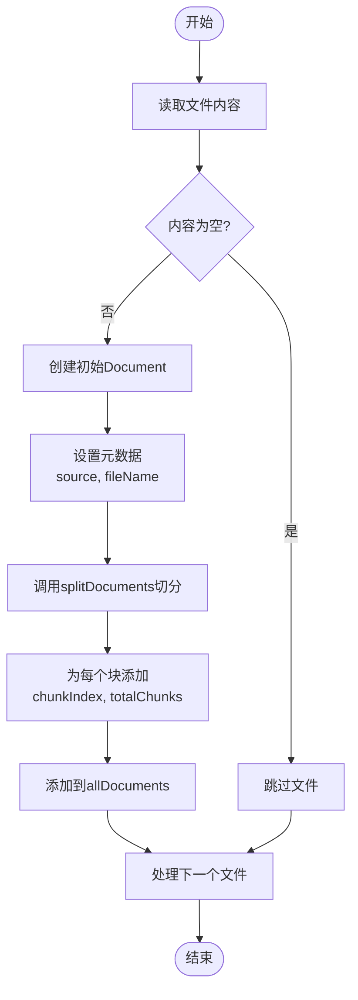
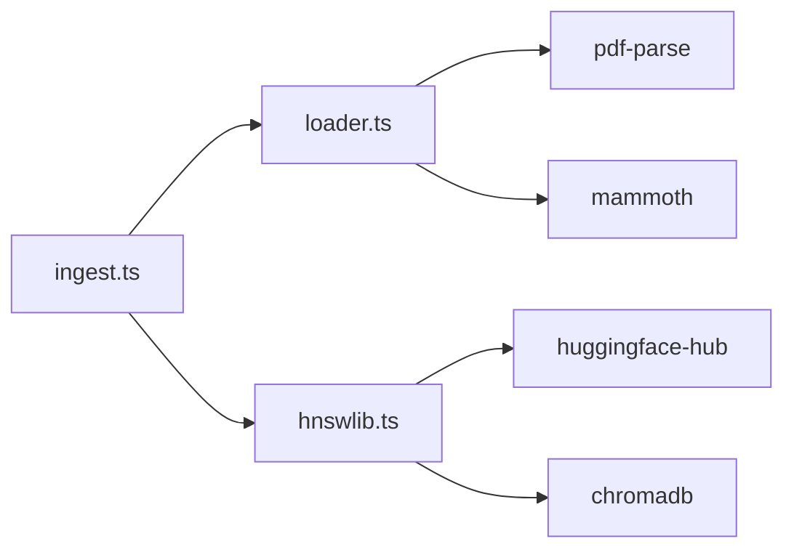

# 文档对象构建

<cite>
**本文档引用的文件**  
- [loader.ts](file://src/lib/rag/loader.ts)
- [hnswlib.ts](file://src/lib/vectorstore/hnswlib.ts)
- [README.md](file://src/lib/README.md)
- [ingest.ts](file://scripts/ingest.ts)
</cite>

## 目录
1. [引言](#引言)
2. [项目结构](#项目结构)
3. [核心组件](#核心组件)
4. [架构概述](#架构概述)
5. [详细组件分析](#详细组件分析)
6. [依赖分析](#依赖分析)
7. [性能考虑](#性能考虑)
8. [故障排除指南](#故障排除指南)
9. [结论](#结论)
10. [附录](#附录)（如有必要）

## 引言
本文档深入讲解RAG系统中Document对象的构建过程及其元数据设计。系统通过自定义的临时Document类模拟LangChain接口，实现对知识库文档的加载、切分和索引。文档对象包含pageContent和metadata两个核心属性，其中元数据在初始创建阶段填充source（相对路径）和fileName等基础信息，在文本切分后进一步补充chunkIndex和totalChunks字段，形成完整的分块索引信息。这些元数据不仅支持后续的溯源和展示，还在调试、监控和前端交互中发挥重要作用。尽管当前实现为临时方案，但其设计充分考虑了与标准LangChain Document的兼容性，为未来平滑迁移奠定了基础。

## 项目结构
项目采用模块化设计，RAG相关功能集中在`src/lib/rag/`目录下。知识库文档存储在`src/lib/knowledge/base/`目录中，支持多种格式（.md、.txt、.pdf、.docx）。文档加载、切分和向量存储功能由`loader.ts`、`hnswlib.ts`等文件实现，通过`scripts/ingest.ts`脚本统一调度。整个流程从文件读取开始，经过内容解析、文本切分、嵌入生成，最终持久化到向量数据库，形成一个完整的知识摄入管道。

**Diagram sources**
- [loader.ts](file://src/lib/rag/loader.ts#L145-L211)
- [hnswlib.ts](file://src/lib/vectorstore/hnswlib.ts#L46-L50)
- [ingest.ts](file://scripts/ingest.ts#L17-L75)

**Section sources**
- [loader.ts](file://src/lib/rag/loader.ts#L1-L212)
- [README.md](file://src/lib/README.md#L151-L165)

## 核心组件
RAG系统的核心组件包括文档加载器、文本切分器和向量存储。`loadKnowledgeBase`函数是文档处理的入口，它递归读取知识库目录下的所有支持文件，创建临时Document对象并进行切分。`RecursiveCharacterTextSplitter`负责将长文本按500字符的块大小和50字符的重叠进行切分。`HNSWLibStoreWrapper`则负责将切分后的文档块进行嵌入并存储到HNSWLib向量数据库中。这些组件协同工作，实现了从原始文档到可检索知识的完整转换。

**Section sources**
- [loader.ts](file://src/lib/rag/loader.ts#L145-L211)
- [hnswlib.ts](file://src/lib/vectorstore/hnswlib.ts#L1-L345)

## 架构概述
系统采用分层架构，从下至上分别为数据层、处理层和应用层。数据层由知识库文档和向量索引组成；处理层包含文档加载、文本切分和嵌入生成等核心逻辑；应用层通过RAG链和智能Agent提供最终服务。整个架构通过`scripts/ingest.ts`脚本驱动，实现了知识的自动化摄入和索引。向量存储层兼容LangChain的Retriever接口，确保了与现有生态的无缝集成。

**Diagram sources**
- [loader.ts](file://src/lib/rag/loader.ts#L145-L211)
- [hnswlib.ts](file://src/lib/vectorstore/hnswlib.ts#L46-L50)
- [README.md](file://src/lib/README.md#L250-L276)

## 详细组件分析
### Document对象构建分析
Document对象的构建过程分为两个关键阶段：初始创建和切分后处理。在初始创建阶段，系统为每个文件创建一个初始Document对象，其元数据包含source（相对于知识库目录的路径）和fileName（文件名）等基础信息。这些信息对于后续的文档溯源至关重要。

#### 对象关系图

**Diagram sources**
- [loader.ts](file://src/lib/rag/loader.ts#L10-L18)
- [loader.ts](file://src/lib/rag/loader.ts#L21-L55)

### 文本切分与元数据增强
在文本切分阶段，`RecursiveCharacterTextSplitter`将初始Document的pageContent按500字符的块大小和50字符的重叠进行切分。切分完成后，系统遍历每个生成的文档块，为其元数据添加`chunkIndex`和`totalChunks`字段。`chunkIndex`表示当前块在原文件中的序号（从0开始），`totalChunks`表示原文件被切分的总块数。这一设计使得前端可以清晰地展示文档的分块进度和位置信息。

#### 处理流程图

**Diagram sources**
- [loader.ts](file://src/lib/rag/loader.ts#L171-L208)

**Section sources**
- [loader.ts](file://src/lib/rag/loader.ts#L171-L208)

### 元数据的实际用途
元数据在系统中扮演着多重角色。在调试阶段，`source`和`fileName`帮助开发者快速定位问题文档；在监控阶段，`chunkIndex`和`totalChunks`可用于统计知识库的摄入进度和分块分布；在前端展示中，这些元数据可以用于构建文档预览、分块导航和引用溯源功能。例如，当RAG系统返回检索结果时，前端可以根据`source`和`chunkIndex`精确地高亮显示原文位置。

### 兼容性与迁移方案
当前的临时Document类通过模拟LangChain的接口（pageContent和metadata）确保了与现有代码的兼容性。`HNSWLibStoreWrapper`的`asRetriever`方法也实现了LangChain的`VectorStoreRetriever`接口，使得RAG链可以无缝使用。未来平滑迁移的技术方案包括：1) 将临时Document类替换为标准的`@langchain/core/documents`实现；2) 使用LangChain内置的`RecursiveCharacterTextSplitter`；3) 将向量存储迁移到LangChain官方支持的FAISS或Chroma实现。由于当前设计已遵循LangChain的接口规范，这些迁移工作将主要涉及依赖替换和配置调整，而无需大规模重构业务逻辑。

**Section sources**
- [loader.ts](file://src/lib/rag/loader.ts#L1-L212)
- [hnswlib.ts](file://src/lib/vectorstore/hnswlib.ts#L291-L313)

## 依赖分析
系统依赖关系清晰，核心依赖包括`pdf-parse`和`mammoth`用于文件解析，`huggingface-hub`用于访问嵌入模型，`chromadb`作为向量数据库。`scripts/ingest.ts`脚本依赖`loader.ts`和`hnswlib.ts`，形成一个完整的知识摄入管道。所有组件都通过明确的接口进行交互，降低了耦合度，提高了可维护性。

**Diagram sources**
- [ingest.ts](file://scripts/ingest.ts#L9-L11)
- [loader.ts](file://src/lib/rag/loader.ts#L3-L4)
- [hnswlib.ts](file://src/lib/vectorstore/hnswlib.ts#L1-L345)

**Section sources**
- [docs/tech/00-dependencies-overview.md](file://docs/tech/00-dependencies-overview.md#L1-L138)

## 性能考虑
文档加载和切分过程采用同步递归方式，对于大型知识库可能成为性能瓶颈。未来可考虑引入流式处理和并行化策略。文本切分算法的时间复杂度为O(n)，其中n为文本长度，对于超长文档可能需要优化。向量存储使用HNSWLib，提供了高效的近似最近邻搜索，适合大规模知识库的快速检索。

## 故障排除指南
常见问题包括知识库目录不存在、文件格式不支持、内容为空等。系统已内置相应的错误处理和日志输出。例如，当目录不存在时会抛出明确的错误信息；对于不支持的文件类型会跳过并记录警告；空文件也会被跳过。在向量存储加载时，系统会捕获并报告索引加载失败的详细错误，便于快速定位问题。

**Section sources**
- [loader.ts](file://src/lib/rag/loader.ts#L150-L151)
- [loader.ts](file://src/lib/rag/loader.ts#L132-L133)
- [loader.ts](file://src/lib/rag/loader.ts#L176-L178)
- [hnswlib.ts](file://src/lib/vectorstore/hnswlib.ts#L277-L282)

## 结论
本文档详细分析了RAG系统中Document对象的构建过程和元数据设计。通过自定义的临时实现，系统成功模拟了LangChain的核心接口，实现了文档的加载、切分和索引。元数据设计充分考虑了溯源、调试和展示的需求，为系统的可维护性和用户体验提供了保障。尽管当前为临时方案，但其良好的接口抽象为未来的平滑迁移铺平了道路。建议在后续开发中，优先实现标准的LangChain集成，以获得更稳定和丰富的功能支持。