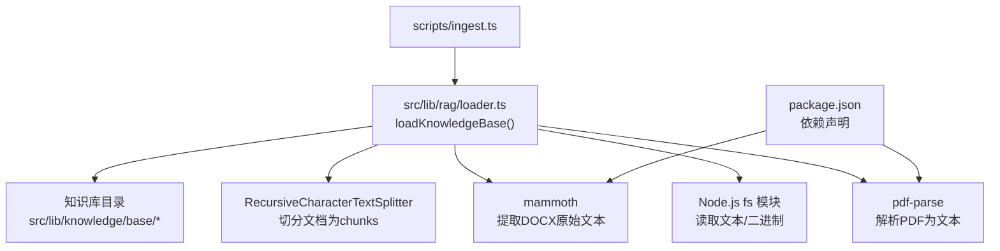
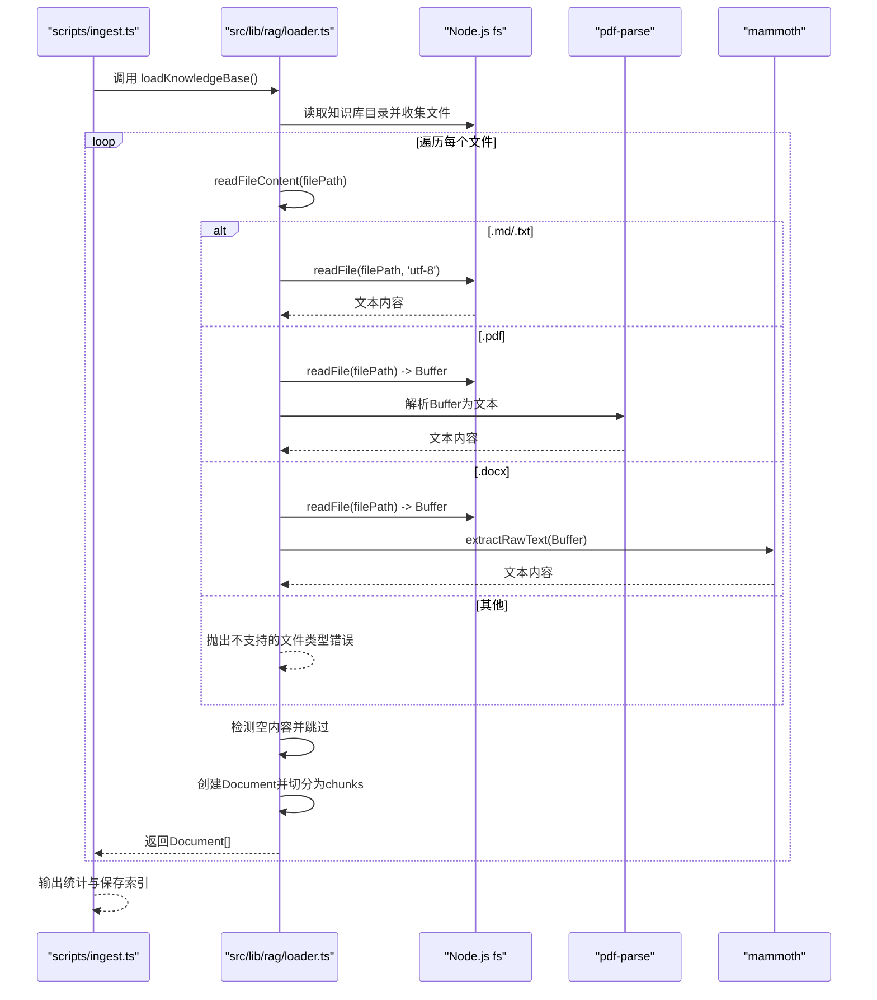
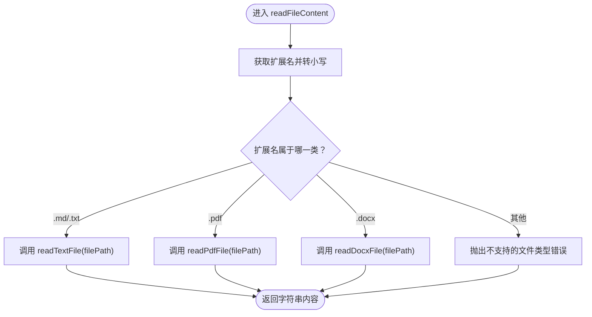
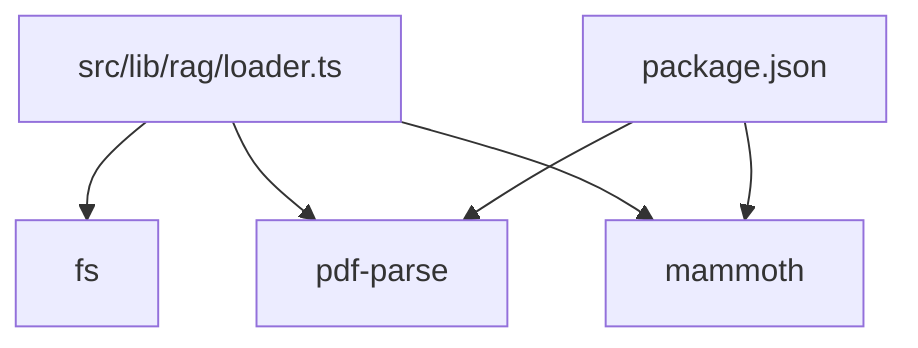

# 文档解析机制

<cite>
**本文引用的文件**
- [loader.ts](file://src/lib/rag/loader.ts)
- [ingest.ts](file://scripts/ingest.ts)
- [package.json](file://package.json)
- [求职指南-岗位解析.md](file://src/lib/knowledge/base/求职指南-岗位解析.md)
- [t.txt](file://t.txt)
</cite>

## 目录
1. [简介](#简介)
2. [项目结构](#项目结构)
3. [核心组件](#核心组件)
4. [架构总览](#架构总览)
5. [详细组件分析](#详细组件分析)
6. [依赖分析](#依赖分析)
7. [性能考虑](#性能考虑)
8. [故障排查指南](#故障排查指南)
9. [结论](#结论)
10. [附录](#附录)

## 简介
本文件面向RAG系统中多格式文档的解析机制，聚焦于src/lib/rag/loader.ts中的readFileContent函数如何根据文件扩展名分发至不同解析器：
- 使用Node.js原生fs模块读取UTF-8编码的.md和.txt文本文件；
- 调用pdf-parse库将PDF二进制缓冲区转换为纯文本内容；
- 利用mammoth库提取DOCX文档的原始文本并忽略格式。

同时，文档阐述了在解析过程中对空文件内容的检测与跳过策略，以及错误捕获机制如何确保单个文件失败不影响整体加载流程。最后，结合src/lib/knowledge/base/下的实际Markdown文件，展示从原始文件到字符串内容的转换过程，并讨论不同文件格式解析的性能差异与潜在优化方案（如流式处理大文件）。

## 项目结构
与文档解析直接相关的文件与职责如下：
- src/lib/rag/loader.ts：实现文件扫描、按扩展名分发解析、内容读取、空内容跳过、错误处理、文档切分与元数据附加。
- scripts/ingest.ts：知识库摄入脚本，调用loadKnowledgeBase并将文档嵌入并持久化。
- package.json：声明pdf-parse与mammoth等依赖。
- src/lib/knowledge/base/下的Markdown文件：作为知识库示例内容，用于演示从原始文件到字符串内容的转换过程。
- t.txt：示例文本文件，用于演示UTF-8文本读取。

图表来源
- [loader.ts](file://src/lib/rag/loader.ts#L1-L214)
- [ingest.ts](file://scripts/ingest.ts#L1-L77)
- [package.json](file://package.json#L1-L42)

章节来源
- [loader.ts](file://src/lib/rag/loader.ts#L1-L214)
- [ingest.ts](file://scripts/ingest.ts#L1-L77)
- [package.json](file://package.json#L1-L42)

## 核心组件
- 文件扫描与过滤：遍历知识库目录，仅收集.md、.txt、.pdf、.docx四种扩展名。
- 按扩展名分发解析：readFileContent根据扩展名路由到readTextFile/readPdfFile/readDocxFile。
- 文本读取：UTF-8文本文件通过fs.promises.readFile('utf-8')读取。
- PDF解析：将PDF读取为二进制缓冲区，交由pdf-parse解析为纯文本。
- DOCX解析：将DOCX读取为二进制缓冲区，交由mammoth提取原始文本。
- 空内容检测与跳过：对空或空白内容的文件进行警告并跳过。
- 错误处理：单文件异常被捕获并继续处理其他文件，保证整体流程不中断。
- 文档切分与元数据：使用递归字符切分器将文档切分为固定大小的块，并附加source、fileName、chunkIndex、totalChunks等元数据。

章节来源
- [loader.ts](file://src/lib/rag/loader.ts#L63-L83)
- [loader.ts](file://src/lib/rag/loader.ts#L90-L114)
- [loader.ts](file://src/lib/rag/loader.ts#L121-L135)
- [loader.ts](file://src/lib/rag/loader.ts#L170-L209)

## 架构总览
下面的序列图展示了从知识库目录到最终文档块的完整流程，包括文件扫描、按扩展名解析、空内容检测、错误处理与文档切分。

图表来源
- [loader.ts](file://src/lib/rag/loader.ts#L145-L214)
- [ingest.ts](file://scripts/ingest.ts#L1-L77)

## 详细组件分析

### 组件A：按扩展名分发解析器（readFileContent）
- 输入：文件路径
- 处理逻辑：
  - 读取扩展名并转为小写；
  - 若为.md或.txt，调用readTextFile；
  - 若为.pdf，调用readPdfFile；
  - 若为.docx，调用readDocxFile；
  - 其他扩展名抛出错误。
- 输出：字符串形式的文件内容

图表来源
- [loader.ts](file://src/lib/rag/loader.ts#L121-L135)
- [loader.ts](file://src/lib/rag/loader.ts#L90-L114)

章节来源
- [loader.ts](file://src/lib/rag/loader.ts#L121-L135)
- [loader.ts](file://src/lib/rag/loader.ts#L90-L114)

### 组件B：文本文件读取（readTextFile）
- 使用fs.promises.readFile(filePath, 'utf-8')以UTF-8编码读取.md与.txt文件。
- 适用于纯文本内容，开销低、速度快。

章节来源
- [loader.ts](file://src/lib/rag/loader.ts#L90-L92)

### 组件C：PDF解析（readPdfFile）
- 步骤：
  - 读取PDF为二进制缓冲区；
  - 使用pdf-parse解析为包含text字段的对象；
  - 返回text字段作为字符串内容。
- 适用场景：结构化或半结构化文本的PDF。

章节来源
- [loader.ts](file://src/lib/rag/loader.ts#L99-L103)
- [package.json](file://package.json#L18-L21)

### 组件D：DOCX解析（readDocxFile）
- 步骤：
  - 读取DOCX为二进制缓冲区；
  - 使用mammoth.extractRawText({ buffer })提取原始文本；
  - 返回value字段作为字符串内容。
- 适用场景：Word文档的纯文本提取。

章节来源
- [loader.ts](file://src/lib/rag/loader.ts#L110-L114)
- [package.json](file://package.json#L18-L21)

### 组件E：空内容检测与跳过策略
- 在读取到内容后，检查内容是否为空或仅包含空白字符；
- 若为空，则发出警告并跳过该文件，继续处理下一个文件；
- 该策略确保无效内容不会污染后续处理链。

章节来源
- [loader.ts](file://src/lib/rag/loader.ts#L176-L179)

### 组件F：错误捕获与容错
- 在处理每个文件时使用try/catch包裹；
- 发生异常时打印错误日志并继续处理其他文件；
- 保证单个文件失败不影响整体加载流程。

章节来源
- [loader.ts](file://src/lib/rag/loader.ts#L203-L207)

### 组件G：文档切分与元数据附加
- 使用递归字符切分器将文档切分为固定大小的块；
- 为每个块附加元数据：source（相对路径）、fileName（文件名）、chunkIndex（块序号）、totalChunks（总块数）；
- 便于后续检索与溯源。

章节来源
- [loader.ts](file://src/lib/rag/loader.ts#L163-L166)
- [loader.ts](file://src/lib/rag/loader.ts#L192-L200)

### 组件H：知识库摄入脚本（ingest.ts）
- 调用loadKnowledgeBase获取Document数组；
- 统计原始文档数量与块数量；
- 创建嵌入提供者与向量存储，添加文档并保存索引；
- 失败时输出详细错误信息并退出。

章节来源
- [ingest.ts](file://scripts/ingest.ts#L1-L77)
- [loader.ts](file://src/lib/rag/loader.ts#L145-L214)

### 组件I：示例文档与转换过程
- Markdown文件位于src/lib/knowledge/base/，例如“求职指南-岗位解析.md”；
- 通过readTextFile以UTF-8读取，得到字符串内容；
- 该内容随后被切分为chunks并进入向量索引流程。

章节来源
- [求职指南-岗位解析.md](file://src/lib/knowledge/base/求职指南-岗位解析.md#L1-L203)
- [loader.ts](file://src/lib/rag/loader.ts#L90-L92)

## 依赖分析
- Node.js原生fs模块：用于读取文件（文本与二进制）。
- pdf-parse：用于将PDF二进制缓冲区解析为纯文本。
- mammoth：用于从DOCX二进制缓冲区提取原始文本。
- 依赖声明来自package.json，确保运行时可用。

图表来源
- [loader.ts](file://src/lib/rag/loader.ts#L1-L5)
- [package.json](file://package.json#L18-L21)

章节来源
- [loader.ts](file://src/lib/rag/loader.ts#L1-L5)
- [package.json](file://package.json#L18-L21)

## 性能考虑
- 文本文件（.md/.txt）：UTF-8读取开销低，适合大批量快速扫描与读取。
- PDF解析（.pdf）：涉及二进制读取与解析，CPU与内存消耗较高，尤其在复杂布局或图像密集PDF上；建议：
  - 预先压缩PDF尺寸与分辨率；
  - 分批处理与并发限制；
  - 对超大PDF采用流式解析策略（若pdf-parse支持）。
- DOCX解析（.docx）：二进制读取后由mammoth提取文本，整体开销低于PDF；建议：
  - 控制并发度，避免同时解析过多大体量DOCX；
  - 对重复内容进行缓存或去重。
- 空内容检测与跳过：减少无效处理，降低后续嵌入与索引成本。
- 错误处理：单文件失败不影响整体流程，有利于批量处理的稳定性。

[本节为通用性能讨论，不直接分析具体文件，故无章节来源]

## 故障排查指南
- 不支持的文件类型：当扩展名不在支持列表时，readFileContent会抛出错误。请检查文件扩展名或在过滤逻辑中增加支持。
- PDF解析失败：检查pdf-parse版本与依赖安装；确认PDF未加密且结构可解析；尝试预处理PDF。
- DOCX解析失败：检查mammoth版本与依赖安装；确认DOCX文件未损坏。
- 空内容文件：系统会跳过空内容文件并给出警告；请检查源文件是否为空或仅包含空白字符。
- 脚本执行失败：ingest.ts会在catch中输出错误详情与堆栈，便于定位问题。

章节来源
- [loader.ts](file://src/lib/rag/loader.ts#L121-L135)
- [loader.ts](file://src/lib/rag/loader.ts#L203-L207)
- [ingest.ts](file://scripts/ingest.ts#L64-L71)

## 结论
本解析机制通过扩展名分发实现了对多格式文档的统一处理：.md/.txt采用UTF-8文本读取，.pdf使用pdf-parse解析，.docx使用mammoth提取原始文本。系统内置空内容检测与跳过策略，并通过try/catch确保单文件异常不影响整体加载流程。配合递归字符切分器与元数据附加，最终形成可用于RAG检索的文档块集合。针对不同格式的性能差异，建议在生产环境中采用分批处理、并发限制与预处理策略，以提升吞吐与稳定性。

[本节为总结性内容，不直接分析具体文件，故无章节来源]

## 附录
- 示例文本文件：t.txt展示了UTF-8文本读取的典型场景。
- 示例Markdown文件：src/lib/knowledge/base/下的多个Markdown文件作为知识库内容，体现了从原始文件到字符串内容的转换过程。

章节来源
- [t.txt](file://t.txt#L1-L315)
- [求职指南-岗位解析.md](file://src/lib/knowledge/base/求职指南-岗位解析.md#L1-L203)