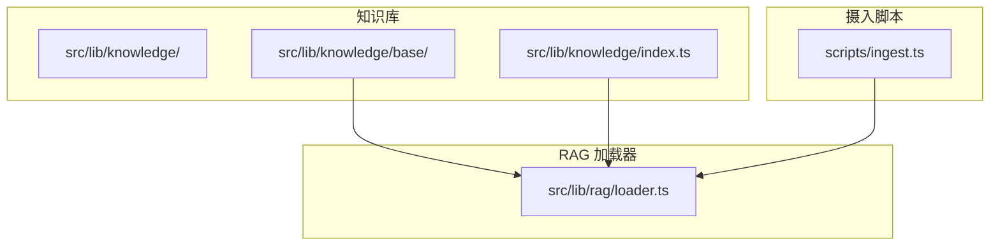
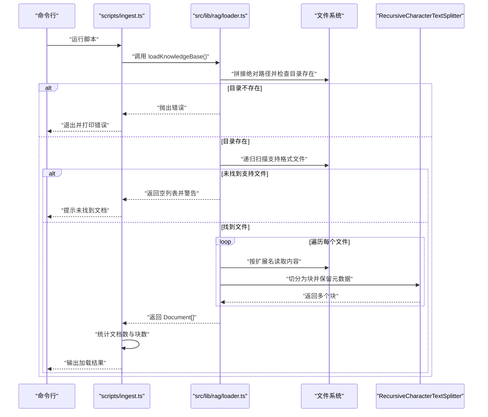
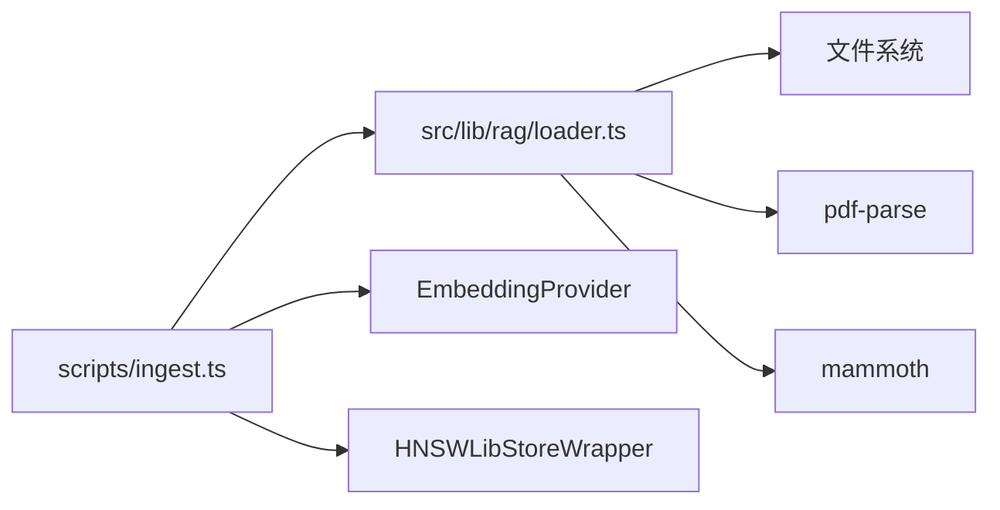
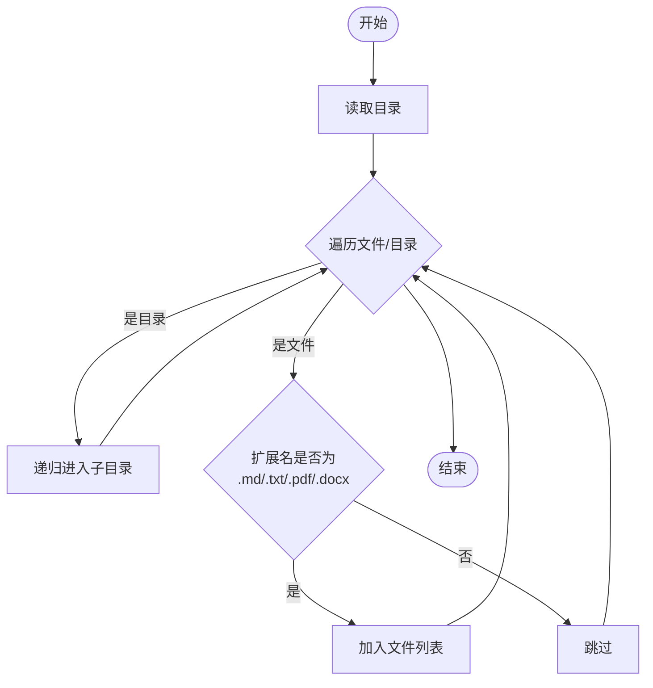
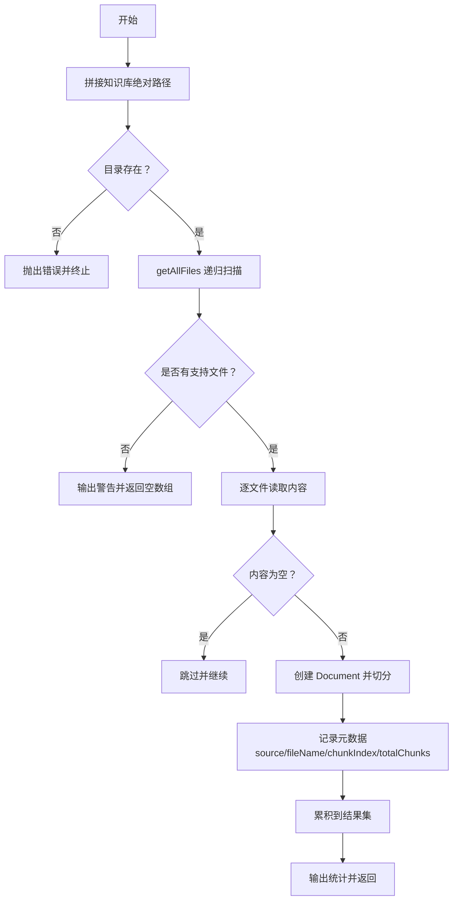

# 知识库加载流程

<cite>
**本文引用的文件**
- [src/lib/rag/loader.ts](file://src/lib/rag/loader.ts)
- [src/lib/knowledge/index.ts](file://src/lib/knowledge/index.ts)
- [src/lib/knowledge/base/求职指南-岗位解析.md](file://src/lib/knowledge/base/求职指南-岗位解析.md)
- [scripts/ingest.ts](file://scripts/ingest.ts)
- [package.json](file://package.json)
</cite>

## 目录
1. [简介](#简介)
2. [项目结构](#项目结构)
3. [核心组件](#核心组件)
4. [架构总览](#架构总览)
5. [详细组件分析](#详细组件分析)
6. [依赖分析](#依赖分析)
7. [性能考量](#性能考量)
8. [故障排查指南](#故障排查指南)
9. [结论](#结论)
10. [附录](#附录)

## 简介
本文件聚焦 RAG 系统中“知识库加载流程”的实现与设计，围绕以下目标展开：
- 解析 loadKnowledgeBase 如何通过 process.cwd() 定位项目根目录，并构造指向 src/lib/knowledge 的绝对路径。
- 说明 getAllFiles 如何递归遍历该目录及其子目录，识别并收集 .md、.txt、.pdf、.docx 四种格式的文件路径。
- 描述知识库目录不存在或未找到支持文件时的异常处理与警告机制。
- 讲解文件列表如何作为后续文档解析的基础输入，以及该流程在整个 RAG 系统中的前置作用。
- 结合代码示例说明文件路径的相对化处理（path.relative）及其在元数据记录中的意义。
- 讨论该设计对知识库可维护性的提升，以及未来支持动态热加载的潜在扩展方向。

## 项目结构
知识库位于 src/lib/knowledge 目录，包含若干 Markdown 文档；RAG 加载器位于 src/lib/rag/loader.ts；知识库摄入脚本位于 scripts/ingest.ts，用于将加载后的文档进行嵌入并持久化到向量存储。

图表来源
- [src/lib/rag/loader.ts](file://src/lib/rag/loader.ts#L145-L212)
- [src/lib/knowledge/index.ts](file://src/lib/knowledge/index.ts#L1-L5)
- [scripts/ingest.ts](file://scripts/ingest.ts#L1-L77)

章节来源
- [src/lib/rag/loader.ts](file://src/lib/rag/loader.ts#L145-L212)
- [src/lib/knowledge/index.ts](file://src/lib/knowledge/index.ts#L1-L5)
- [scripts/ingest.ts](file://scripts/ingest.ts#L1-L77)

## 核心组件
- loadKnowledgeBase：对外导出的主入口，负责定位知识库目录、扫描文件、读取内容、切分文档并返回 Document 列表。
- getAllFiles：递归遍历目录，收集支持格式的文件路径。
- readFileContent/readTextFile/readPdfFile/readDocxFile：按扩展名读取不同格式文件内容。
- RecursiveCharacterTextSplitter：将单个文档切分为固定大小的块，并保留元数据。
- scripts/ingest.ts：调用 loadKnowledgeBase，统计文档与块数，创建嵌入与向量索引并保存。

章节来源
- [src/lib/rag/loader.ts](file://src/lib/rag/loader.ts#L1-L214)
- [scripts/ingest.ts](file://scripts/ingest.ts#L1-L77)

## 架构总览
下图展示了从摄入脚本到知识库加载器的整体流程，以及知识库目录与加载器的关系。

图表来源
- [scripts/ingest.ts](file://scripts/ingest.ts#L17-L76)
- [src/lib/rag/loader.ts](file://src/lib/rag/loader.ts#L145-L212)

## 详细组件分析

### loadKnowledgeBase 函数：根目录定位与路径构造
- 根目录定位：通过 process.cwd() 获取当前工作目录，再拼接 'src/lib/knowledge' 得到知识库绝对路径。
- 目录存在性校验：若不存在则抛出错误，阻止后续流程。
- 文件扫描：调用 getAllFiles 递归收集支持格式文件。
- 异常与警告：
  - 目录不存在：抛出错误，中断流程。
  - 未找到支持文件：输出警告并返回空数组，允许上层继续处理。
- 文档切分：使用自定义 RecursiveCharacterTextSplitter 将每个文件内容切分为固定大小的块，并保留元数据。
- 元数据记录：使用 path.relative 计算相对路径，记录 source 与 fileName；为每个块追加 chunkIndex 与 totalChunks，便于溯源与检索。

章节来源
- [src/lib/rag/loader.ts](file://src/lib/rag/loader.ts#L145-L212)

### getAllFiles 函数：递归遍历与文件过滤
- 递归策略：读取当前目录，遇到子目录则递归进入；遇到文件则判断扩展名是否为 .md、.txt、.pdf、.docx。
- 过滤逻辑：仅收集受支持的文件扩展名，忽略其他类型。
- 返回值：返回一个包含所有匹配文件的绝对路径数组。

章节来源
- [src/lib/rag/loader.ts](file://src/lib/rag/loader.ts#L63-L83)

### 文件读取与内容提取
- 扩展名分发：readFileContent 根据扩展名路由到对应读取函数。
- 文本类文件：readTextFile 使用 UTF-8 读取。
- PDF 文件：readPdfFile 使用 pdf-parse 提取文本。
- DOCX 文件：readDocxFile 使用 mammoth 提取纯文本。
- 错误处理：遇到未知扩展名时抛出错误，由上层捕获并继续处理其他文件。

章节来源
- [src/lib/rag/loader.ts](file://src/lib/rag/loader.ts#L90-L135)

### 文档切分器：RecursiveCharacterTextSplitter
- 切分策略：按 chunkSize 与 chunkOverlap 切分文本，保持相邻块的重叠以便上下文连贯。
- 元数据保留：splitDocuments 会复制初始 Document 的 metadata，便于后续溯源。
- 输出：返回多个 Document，每个包含 pageContent 与 metadata。

章节来源
- [src/lib/rag/loader.ts](file://src/lib/rag/loader.ts#L21-L55)

### 相对化处理与元数据意义
- 相对化：使用 path.relative(knowledgeDir, filePath) 计算相对路径，记录在 metadata.source 中。
- 元数据字段：
  - source：相对路径，便于在检索时定位原始文件位置。
  - fileName：原始文件名，用于统计原始文档数量。
  - chunkIndex/totalChunks：块索引与总数，便于排序与溯源。
- 意义：相对化路径有助于在检索结果中回溯到原始文件，提升可解释性与可维护性。

章节来源
- [src/lib/rag/loader.ts](file://src/lib/rag/loader.ts#L170-L200)

### 摄入脚本：从加载到持久化的闭环
- 调用 loadKnowledgeBase：获取 Document 列表。
- 统计：去重统计原始文档数量（基于 metadata.fileName），并统计块总数。
- 嵌入与向量存储：创建 EmbeddingProvider 与 HNSWLibStoreWrapper，将文档添加到向量存储。
- 保存索引：将 HNSWLib 索引保存到 src/lib/knowledge/hnswlib-index。

章节来源
- [scripts/ingest.ts](file://scripts/ingest.ts#L1-L77)

### 知识库目录与内容样例
- 目录结构：src/lib/knowledge/base 下包含多篇 Markdown 文档，作为知识库的基础内容。
- 示例：求职指南系列文档，覆盖多个行业与岗位，为 RAG 提供丰富的背景知识。

章节来源
- [src/lib/knowledge/index.ts](file://src/lib/knowledge/index.ts#L1-L5)
- [src/lib/knowledge/base/求职指南-岗位解析.md](file://src/lib/knowledge/base/求职指南-岗位解析.md#L1-L203)

## 依赖分析
- 外部依赖：
  - pdf-parse：用于 PDF 文本提取。
  - mammoth：用于 DOCX 文本提取。
- 内部模块：
  - loadKnowledgeBase 依赖 getAllFiles、readFileContent、RecursiveCharacterTextSplitter。
  - scripts/ingest.ts 依赖 loadKnowledgeBase，并进一步依赖 EmbeddingProvider 与 HNSWLibStoreWrapper。

图表来源
- [scripts/ingest.ts](file://scripts/ingest.ts#L1-L77)
- [src/lib/rag/loader.ts](file://src/lib/rag/loader.ts#L1-L214)
- [package.json](file://package.json#L1-L42)

章节来源
- [scripts/ingest.ts](file://scripts/ingest.ts#L1-L77)
- [src/lib/rag/loader.ts](file://src/lib/rag/loader.ts#L1-L214)
- [package.json](file://package.json#L1-L42)

## 性能考量
- I/O 开销：递归扫描与逐文件读取可能随文件数量与体积增加而放大。建议：
  - 在 CI/CD 或本地开发中限制扫描范围，或启用增量加载。
  - 对大文件采用流式读取或分块处理（当前实现按整文件读取）。
- 切分参数：chunkSize 与 chunkOverlap 的权衡会影响检索精度与向量存储规模。可根据下游检索策略调整。
- 并发策略：当前为顺序处理文件，可考虑并发读取与切分，但需注意内存峰值与磁盘 I/O 争用。
- 缓存与索引：摄入完成后保存向量索引，避免每次启动都重新加载与切分。

## 故障排查指南
- 知识库目录不存在
  - 现象：抛出错误并中断。
  - 处理：确认项目根目录与 src/lib/knowledge 路径正确，或在运行前创建目录。
- 未找到支持文件
  - 现象：输出警告并返回空数组。
  - 处理：检查文件扩展名是否为 .md、.txt、.pdf、.docx，确认文件权限与编码。
- 读取失败
  - 现象：对单个文件抛错并继续处理其他文件。
  - 处理：检查文件损坏、编码问题或第三方库版本兼容性。
- 摄入脚本报错
  - 现象：打印错误详情与堆栈并退出。
  - 处理：根据错误信息定位具体步骤（加载、嵌入、保存索引）。

章节来源
- [src/lib/rag/loader.ts](file://src/lib/rag/loader.ts#L145-L212)
- [scripts/ingest.ts](file://scripts/ingest.ts#L17-L76)

## 结论
本流程以 loadKnowledgeBase 为核心，通过 process.cwd() 精确定位知识库目录，递归扫描并过滤支持格式，随后读取内容、切分为块并保留元数据，最终为 RAG 系统提供结构化、可溯源的知识输入。该设计具备以下优点：
- 明确的根目录定位与相对化路径记录，便于溯源与维护。
- 清晰的异常与警告机制，保证流程健壮性。
- 与摄入脚本无缝衔接，形成从加载到持久化的闭环。

未来扩展方向：
- 动态热加载：监听知识库目录变更，增量更新向量索引，减少重启成本。
- 并发与流式处理：提升大体量知识库的加载效率。
- 配置化与插件化：支持更多文件格式与自定义切分策略。

## 附录

### 关键流程图：getAllFiles 递归扫描

图表来源
- [src/lib/rag/loader.ts](file://src/lib/rag/loader.ts#L63-L83)

### 关键流程图：loadKnowledgeBase 主流程

图表来源
- [src/lib/rag/loader.ts](file://src/lib/rag/loader.ts#L145-L212)