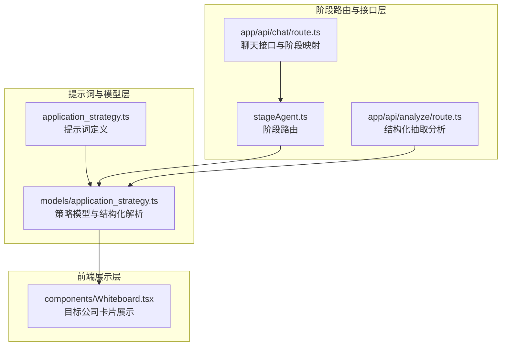
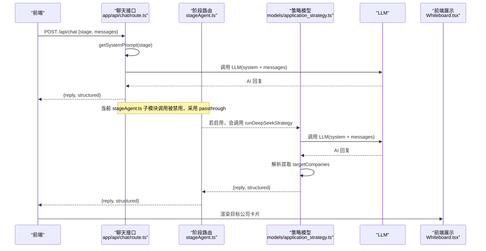
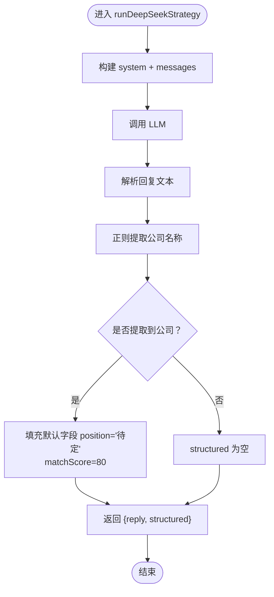
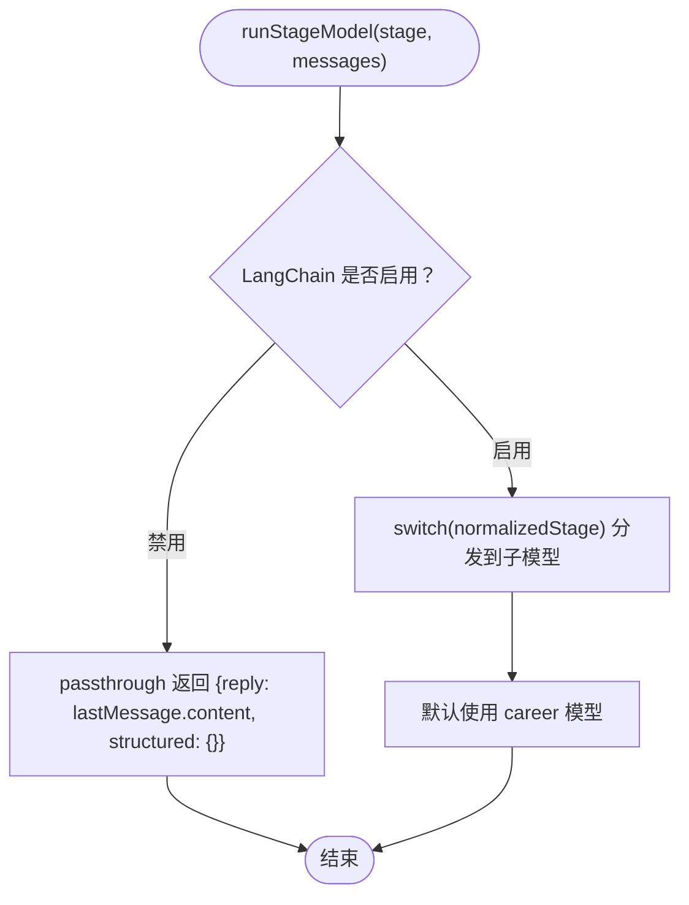
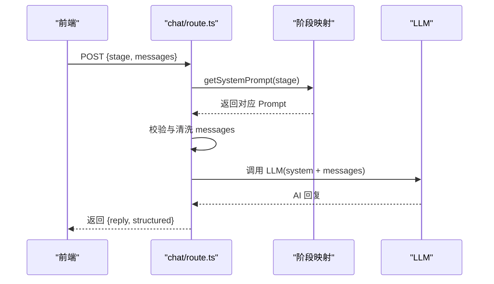
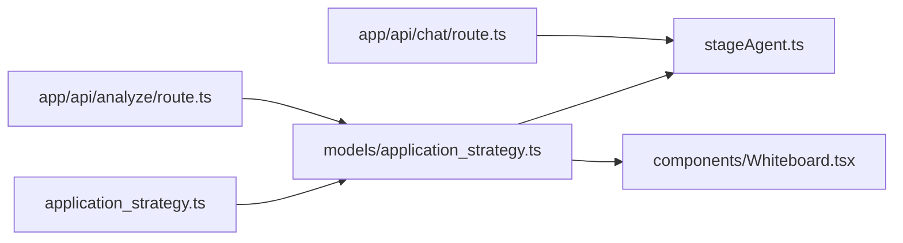

# 投递策略提示词设计

<cite>
**本文引用的文件**
- [lib/orchestrator/prompts/application_strategy.ts](file://lib/orchestrator/prompts/application_strategy.ts)
- [lib/orchestrator/models/application_strategy.ts](file://lib/orchestrator/models/application_strategy.ts)
- [lib/orchestrator/stageAgent.ts](file://lib/orchestrator/stageAgent.ts)
- [app/api/chat/route.ts](file://app/api/chat/route.ts)
- [app/api/analyze/route.ts](file://app/api/analyze/route.ts)
- [components/Whiteboard.tsx](file://components/Whiteboard.tsx)
</cite>

## 目录
1. [引言](#引言)
2. [项目结构](#项目结构)
3. [核心组件](#核心组件)
4. [架构总览](#架构总览)
5. [详细组件分析](#详细组件分析)
6. [依赖关系分析](#依赖关系分析)
7. [性能考量](#性能考量)
8. [故障排查指南](#故障排查指南)
9. [结论](#结论)
10. [附录](#附录)

## 引言
本文件围绕 lib/orchestrator/prompts/application_strategy.ts 中“投递策略”阶段的提示词实现展开系统性分析，重点说明如何基于用户简历内容与目标岗位匹配度生成优先级排序建议；解析提示词中对“黄金时间投递”、“内推渠道利用”、“岗位热度分析”等策略的表达方式；阐述如何通过 ${targetCompany}、${industryTrend} 等变量实现动态策略调整；描述输出格式的结构化设计，支持前端展示多维度建议卡片；强调提示词需避免过度承诺或给出不实建议的风险控制机制；并提供修改示例（如增加地域偏好权重），说明需同步测试 stageAgent.ts 的决策链路兼容性。

## 项目结构
与投递策略提示词直接相关的模块分布如下：
- 提示词定义：lib/orchestrator/prompts/application_strategy.ts
- 策略模型与结构化解析：lib/orchestrator/models/application_strategy.ts
- 阶段路由与调用入口：lib/orchestrator/stageAgent.ts
- 前端聊天接口与阶段映射：app/api/chat/route.ts
- 结构化抽取分析接口：app/api/analyze/route.ts
- 前端白板展示组件：components/Whiteboard.tsx

图表来源
- [lib/orchestrator/prompts/application_strategy.ts](file://lib/orchestrator/prompts/application_strategy.ts#L1-L30)
- [lib/orchestrator/models/application_strategy.ts](file://lib/orchestrator/models/application_strategy.ts#L1-L78)
- [lib/orchestrator/stageAgent.ts](file://lib/orchestrator/stageAgent.ts#L1-L99)
- [app/api/chat/route.ts](file://app/api/chat/route.ts#L125-L143)
- [app/api/analyze/route.ts](file://app/api/analyze/route.ts#L257-L282)
- [components/Whiteboard.tsx](file://components/Whiteboard.tsx#L452-L479)

章节来源
- [lib/orchestrator/prompts/application_strategy.ts](file://lib/orchestrator/prompts/application_strategy.ts#L1-L30)
- [lib/orchestrator/models/application_strategy.ts](file://lib/orchestrator/models/application_strategy.ts#L1-L78)
- [lib/orchestrator/stageAgent.ts](file://lib/orchestrator/stageAgent.ts#L1-L99)
- [app/api/chat/route.ts](file://app/api/chat/route.ts#L125-L143)
- [app/api/analyze/route.ts](file://app/api/analyze/route.ts#L257-L282)
- [components/Whiteboard.tsx](file://components/Whiteboard.tsx#L452-L479)

## 核心组件
- 提示词定义（application_strategy.ts）：定义投递策略顾问的角色、核心任务、策略原则、引导原则与输出要求，明确结构化输出字段 targetCompanies 的组织形式。
- 策略模型（models/application_strategy.ts）：封装调用 LLM 的流程，构建 system+user 消息序列，调用底层 LLM 并解析对话文本以提取目标公司列表，形成结构化数据。
- 阶段路由（stageAgent.ts）：根据用户阶段选择对应模型；当前仓库中 stageAgent.ts 的子模块调用被暂时禁用，采用 passthrough 返回兜底结果。
- 聊天接口（app/api/chat/route.ts）：将前端传入的 stage 映射到对应 Prompt，并注入 system 消息后调用 LLM。
- 结构化抽取（app/api/analyze/route.ts）：提供专用分析接口，从对话中抽取 targetCompanies 字段，严格返回 JSON。
- 前端展示（components/Whiteboard.tsx）：渲染目标公司卡片，包含公司名、岗位、匹配度等字段。

章节来源
- [lib/orchestrator/prompts/application_strategy.ts](file://lib/orchestrator/prompts/application_strategy.ts#L1-L30)
- [lib/orchestrator/models/application_strategy.ts](file://lib/orchestrator/models/application_strategy.ts#L1-L78)
- [lib/orchestrator/stageAgent.ts](file://lib/orchestrator/stageAgent.ts#L1-L99)
- [app/api/chat/route.ts](file://app/api/chat/route.ts#L125-L143)
- [app/api/analyze/route.ts](file://app/api/analyze/route.ts#L257-L282)
- [components/Whiteboard.tsx](file://components/Whiteboard.tsx#L452-L479)

## 架构总览
整体流程：前端通过聊天接口传入 stage 与 messages，接口根据 stage 获取对应 Prompt 并注入 system 消息后调用 LLM；策略模型在后台独立运行时负责解析 LLM 回复并提取目标公司列表；最终结构化数据在前端白板组件中以卡片形式展示。

图表来源
- [app/api/chat/route.ts](file://app/api/chat/route.ts#L125-L143)
- [lib/orchestrator/stageAgent.ts](file://lib/orchestrator/stageAgent.ts#L35-L71)
- [lib/orchestrator/models/application_strategy.ts](file://lib/orchestrator/models/application_strategy.ts#L20-L78)
- [components/Whiteboard.tsx](file://components/Whiteboard.tsx#L452-L479)

## 详细组件分析

### 提示词定义（application_strategy.ts）
- 角色与任务：明确投递策略顾问的角色定位，核心任务包括确定目标公司、分析岗位匹配度、制定投递优先级、提供投递时间建议。
- 策略原则：强调以用户技能与经历为基础进行匹配，考虑行业、规模、发展阶段等因素；引导原则聚焦提问与逐步聚焦，输出简洁、聚焦策略建议。
- 输出要求：提供自然对话回复；若确定目标公司，在结构化字段中返回 targetCompanies 数组，包含 name、position、matchScore、notes 等字段。

提示词中对“黄金时间投递”、“内推渠道利用”、“岗位热度分析”的表达方式：
- 当前提示词未直接出现“黄金时间投递”“内推渠道利用”“岗位热度分析”等字眼。若需引入这些策略，可在提示词中新增相应原则与引导，例如：
  - 在策略原则中加入“结合招聘周期与公司发布节奏，给出投递窗口建议”
  - 在引导原则中加入“询问是否有内推人或内部推荐渠道”
  - 在输出要求中补充“若可获得岗位热度指标，可在 notes 中附加简要分析”

提示词中对动态变量的使用：
- 提示词未直接使用 ${targetCompany}、${industryTrend} 等变量占位符。若需实现动态策略调整，可在提示词中引入变量占位符，并在调用侧拼接上下文，例如：
  - “结合行业趋势 ${industryTrend} 与公司 ${targetCompany} 的发展状态，调整投递优先级”
  - “若 ${targetCompany} 处于扩张期，建议优先投递其高潜力岗位”

输出格式的结构化设计：
- 结构化字段 targetCompanies：包含 name、position、matchScore、notes。前端白板组件据此渲染目标公司卡片，展示公司名、岗位、匹配度等信息。

章节来源
- [lib/orchestrator/prompts/application_strategy.ts](file://lib/orchestrator/prompts/application_strategy.ts#L1-L30)
- [components/Whiteboard.tsx](file://components/Whiteboard.tsx#L452-L479)

### 策略模型（models/application_strategy.ts）
- 调用流程：构建 system 消息与用户消息序列，调用底层 LLM，得到回复文本。
- 结构化解析：通过正则模式从回复中提取公司名称，构造目标公司列表；默认填充 position 为“待定”，matchScore 设为固定值（当前逻辑为默认 80）。
- 返回结构：包含 reply（自然回复）与 structured（目标公司列表）两部分，供上层阶段路由或前端展示使用。

图表来源
- [lib/orchestrator/models/application_strategy.ts](file://lib/orchestrator/models/application_strategy.ts#L20-L78)

章节来源
- [lib/orchestrator/models/application_strategy.ts](file://lib/orchestrator/models/application_strategy.ts#L1-L78)

### 阶段路由（stageAgent.ts）
- 当前实现：stageAgent.ts 中的子模块调用被禁用，采用 passthrough 返回最后一条消息的 content 与空的 structured，便于开发调试。
- 启用条件：若后续启用子模块调用，runStageModel 将根据 stage 分发到对应模型（如 application_strategy 对应 runDeepSeekStrategy）。

图表来源
- [lib/orchestrator/stageAgent.ts](file://lib/orchestrator/stageAgent.ts#L35-L71)

章节来源
- [lib/orchestrator/stageAgent.ts](file://lib/orchestrator/stageAgent.ts#L1-L99)

### 聊天接口与阶段映射（app/api/chat/route.ts）
- 阶段映射：根据前端传入的 stage，映射到对应 Prompt key（如 application_strategy -> strategy），并注入 system 消息后调用 LLM。
- 安全与校验：阻止客户端直接提交 LLM 密钥；过滤非法消息项；若无消息则自动补一个兜底消息；若已有 system 消息则替换为最新 system prompt。

图表来源
- [app/api/chat/route.ts](file://app/api/chat/route.ts#L125-L143)
- [app/api/chat/route.ts](file://app/api/chat/route.ts#L188-L224)

章节来源
- [app/api/chat/route.ts](file://app/api/chat/route.ts#L125-L143)
- [app/api/chat/route.ts](file://app/api/chat/route.ts#L188-L224)

### 结构化抽取分析（app/api/analyze/route.ts）
- 用途：提供专用分析接口，从对话中抽取 targetCompanies 字段，严格返回 JSON。
- 字段定义：targetCompanies 数组，元素包含 name、position、matchScore、notes。
- 适用场景：在需要稳定结构化输出的后处理或离线分析场景使用。

章节来源
- [app/api/analyze/route.ts](file://app/api/analyze/route.ts#L257-L282)
- [app/api/analyze/route.ts](file://app/api/analyze/route.ts#L64-L87)

### 前端展示（components/Whiteboard.tsx）
- 展示逻辑：当存在 targetCompanies 时，渲染目标公司卡片，包含公司名、岗位、匹配度等字段。
- 交互体验：卡片采用渐显动画，提升用户阅读体验。

章节来源
- [components/Whiteboard.tsx](file://components/Whiteboard.tsx#L452-L479)

## 依赖关系分析
- 提示词与模型：提示词定义文件被策略模型导入，模型在运行时注入 system 消息并调用 LLM。
- 阶段路由与模型：stageAgent.ts 在启用状态下负责将 stage 分发到对应模型；当前处于 passthrough 状态。
- 接口与路由：聊天接口根据 stage 获取 Prompt 并注入 system 消息后调用 LLM；分析接口提供结构化抽取能力。
- 前端展示：白板组件消费结构化数据，渲染目标公司卡片。

图表来源
- [lib/orchestrator/prompts/application_strategy.ts](file://lib/orchestrator/prompts/application_strategy.ts#L1-L30)
- [lib/orchestrator/models/application_strategy.ts](file://lib/orchestrator/models/application_strategy.ts#L1-L78)
- [lib/orchestrator/stageAgent.ts](file://lib/orchestrator/stageAgent.ts#L35-L71)
- [app/api/chat/route.ts](file://app/api/chat/route.ts#L125-L143)
- [app/api/analyze/route.ts](file://app/api/analyze/route.ts#L257-L282)
- [components/Whiteboard.tsx](file://components/Whiteboard.tsx#L452-L479)

章节来源
- [lib/orchestrator/prompts/application_strategy.ts](file://lib/orchestrator/prompts/application_strategy.ts#L1-L30)
- [lib/orchestrator/models/application_strategy.ts](file://lib/orchestrator/models/application_strategy.ts#L1-L78)
- [lib/orchestrator/stageAgent.ts](file://lib/orchestrator/stageAgent.ts#L1-L99)
- [app/api/chat/route.ts](file://app/api/chat/route.ts#L125-L143)
- [app/api/analyze/route.ts](file://app/api/analyze/route.ts#L257-L282)
- [components/Whiteboard.tsx](file://components/Whiteboard.tsx#L452-L479)

## 性能考量
- LLM 调用成本：策略模型与聊天接口均会调用 LLM，需控制消息长度与 token 上限，避免不必要的重复调用。
- 结构化解析开销：正则提取公司名称的复杂度与回复长度成正比，建议在提示词中约束输出长度，减少解析负担。
- 前端渲染：目标公司卡片较多时，注意虚拟滚动与懒加载，避免一次性渲染过多节点。

## 故障排查指南
- 未启用子模块导致无结构化输出：当前 stageAgent.ts 的子模块调用被禁用，返回的是 passthrough 结果。若需要结构化输出，请启用子模块调用并在 stageAgent.ts 中解除注释。
- 结构化抽取失败：若分析接口返回的 JSON 不符合预期字段，检查提示词中输出要求与前端白板组件的字段映射是否一致。
- 匹配度缺失：当前模型默认 matchScore 为 80，若需更精确的评分，应在提示词中引入评分规则，并在模型解析阶段增加评分提取逻辑。
- 动态变量未生效：提示词中未使用 ${targetCompany}、${industryTrend} 等变量占位符，若需动态调整策略，需在提示词中引入变量并在调用侧拼接上下文。

章节来源
- [lib/orchestrator/stageAgent.ts](file://lib/orchestrator/stageAgent.ts#L35-L71)
- [lib/orchestrator/models/application_strategy.ts](file://lib/orchestrator/models/application_strategy.ts#L20-L78)
- [app/api/analyze/route.ts](file://app/api/analyze/route.ts#L257-L282)
- [components/Whiteboard.tsx](file://components/Whiteboard.tsx#L452-L479)

## 结论
当前投递策略提示词明确了角色、任务与输出规范，策略模型实现了基本的结构化解析与默认匹配度填充。阶段路由目前处于 passthrough 状态，前端白板组件已具备渲染目标公司卡片的能力。为进一步增强策略的动态性与准确性，可在提示词中引入动态变量与更丰富的策略原则，并在模型解析阶段完善评分与字段提取逻辑。同时，需强化风险控制机制，避免过度承诺或给出不实建议。

## 附录

### 动态策略调整与风险控制建议
- 动态变量引入：在提示词中引入 ${targetCompany}、${industryTrend} 等变量占位符，并在调用侧拼接上下文，使策略随目标公司与行业趋势动态调整。
- 地域偏好权重：可在提示词中新增“考虑地域偏好”的策略原则，并在结构化输出中扩展字段（如在 notes 中附加地域偏好说明），前端白板组件同步渲染该字段。
- 风险控制机制：
  - 明确提示词中的“避免过度承诺”原则，限定建议的时效性与适用范围。
  - 在结构化输出中增加“免责声明”字段（如 notes 中包含风险提示），并在前端白板组件中展示。
  - 对评分与建议进行分级标注（如“高/中/低置信度”），并在前端以颜色或图标提示用户谨慎参考。

### 修改示例：增加地域偏好权重
- 提示词修改：在策略原则中新增“考虑地域偏好与通勤便利性”，在输出要求中补充“若涉及地域偏好，可在 notes 中说明理由”。
- 模型解析：在正则提取公司名称后，增加对地域偏好的关键词匹配与权重计算逻辑（如“优先投递本地公司”），并将结果写入 notes。
- 前端展示：在白板组件中渲染地域偏好说明与权重分数，便于用户理解建议依据。
- 测试兼容性：若 stageAgent.ts 后续启用子模块调用，需同步更新 runStageModel 的分支逻辑，确保 application_strategy 阶段正确调用 runDeepSeekStrategy，并在测试中覆盖新增字段与风险控制逻辑。

章节来源
- [lib/orchestrator/prompts/application_strategy.ts](file://lib/orchestrator/prompts/application_strategy.ts#L1-L30)
- [lib/orchestrator/models/application_strategy.ts](file://lib/orchestrator/models/application_strategy.ts#L20-L78)
- [lib/orchestrator/stageAgent.ts](file://lib/orchestrator/stageAgent.ts#L35-L71)
- [components/Whiteboard.tsx](file://components/Whiteboard.tsx#L452-L479)