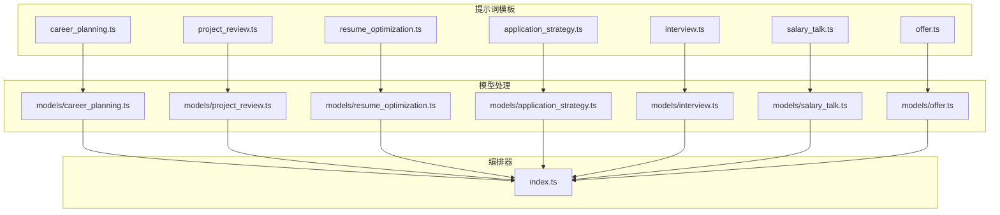

# 提示词工程与模板管理

<cite>
**本文档引用文件**  
- [interview.ts](file://lib/orchestrator/prompts/interview.ts)
- [resume_optimization.ts](file://lib/orchestrator/prompts/resume_optimization.ts)
- [application_strategy.ts](file://lib/orchestrator/prompts/application_strategy.ts)
- [interview.ts](file://lib/orchestrator/models/interview.ts)
- [application_strategy.ts](file://lib/orchestrator/models/application_strategy.ts)
- [career_planning.ts](file://lib/orchestrator/prompts/career_planning.ts)
- [project_review.ts](file://lib/orchestrator/prompts/project_review.ts)
- [salary_talk.ts](file://lib/orchestrator/prompts/salary_talk.ts)
- [offer.ts](file://lib/orchestrator/prompts/offer.ts)
- [index.ts](file://lib/orchestrator/index.ts)
- [route.ts](file://app/api/interview/route.ts)
- [start/route.ts](file://app/api/interview/start/route.ts)
- [types.ts](file://lib/interview/types.ts)
- [llm.ts](file://lib/interview/llm.ts)
- [llm.ts](file://lib/llm.ts)
</cite>

## 目录
1. [引言](#引言)
2. [提示词模板设计概览](#提示词模板设计概览)
3. [多轮对话系统提示结构解析](#多轮对话系统提示结构解析)
4. [动态上下文注入机制](#动态上下文注入机制)
5. [简历优化提示词对比分析](#简历优化提示词对比分析)
6. [投递策略生成机制](#投递策略生成机制)
7. [结构化输出设计与前端解析](#结构化输出设计与前端解析)
8. [提示词修改最佳实践](#提示词修改最佳实践)
9. [测试验证流程](#测试验证流程)
10. [结论](#结论)

## 引言
本项目通过一系列提示词模板（prompt templates）实现求职辅导的智能化流程，涵盖职业规划、项目梳理、简历优化、投递策略、模拟面试、薪资谈判和Offer评估等关键环节。每个模板均以系统提示（system prompt）为核心，定义了AI代理的角色、任务、原则和输出格式，确保LLM输出的结构化与一致性。本文将系统化分析`lib/orchestrator/prompts/`目录下各提示词模板的设计原理与实现机制。

**本文档引用文件**  
- [interview.ts](file://lib/orchestrator/prompts/interview.ts)
- [resume_optimization.ts](file://lib/orchestrator/prompts/resume_optimization.ts)
- [application_strategy.ts](file://lib/orchestrator/prompts/application_strategy.ts)

## 提示词模板设计概览
项目中的提示词模板采用模块化设计，每个模板文件对应一个特定的求职阶段，如`career_planning.ts`、`project_review.ts`、`resume_optimization.ts`、`application_strategy.ts`、`interview.ts`、`salary_talk.ts`和`offer.ts`。这些模板均位于`lib/orchestrator/prompts/`目录下，通过常量导出系统提示内容，如`INTERVIEW_SYSTEM_PROMPT`、`RESUME_OPTIMIZATION_SYSTEM_PROMPT`等。对应的模型处理逻辑位于`lib/orchestrator/models/`目录下，通过`runOrchestrator`函数根据用户当前阶段选择合适的模型进行处理。

**图表来源**  
- [interview.ts](file://lib/orchestrator/prompts/interview.ts)
- [resume_optimization.ts](file://lib/orchestrator/prompts/resume_optimization.ts)
- [application_strategy.ts](file://lib/orchestrator/prompts/application_strategy.ts)
- [index.ts](file://lib/orchestrator/index.ts)

## 多轮对话系统提示结构解析
以`interview.ts`中的`INTERVIEW_SYSTEM_PROMPT`为例，其系统提示结构清晰地定义了AI代理的角色、核心任务、面试原则、引导原则和输出要求。角色设定为“专业的面试官”，核心任务包括设计面试问题、进行模拟面试、评估回答质量和提供改进建议。面试原则强调问题的针对性、使用STAR法则评估回答、从多个维度评分以及提供具体的改进建议。引导原则规定了对话流程，即每次问一个问题，等待用户回答后再评估，给出评分和反馈，继续下一个问题，完成一轮面试后生成总结报告。输出要求明确指出在完成一轮面试后，需在`structured`字段中返回`interviewReports`数组，包含轮次、问题、综合评分、优势和改进建议。

**本文档引用文件**  
- [interview.ts](file://lib/orchestrator/prompts/interview.ts)

## 动态上下文注入机制
提示词模板中使用`${variable}`语法注入动态上下文，如简历内容、项目经历等。虽然在提供的`interview.ts`、`resume_optimization.ts`和`application_strategy.ts`文件中未直接体现该语法，但通过分析API路由和LLM调用逻辑可以推断其机制。在`app/api/interview/start/route.ts`中，`generateInterviewQuestions`函数接收职位描述（jd）、面试轮次类型（roundType）和题目数量（questionCount）作为输入参数，并将其传递给LLM。在`lib/interview/llm.ts`中，`generateInterviewQuestions`函数构建的`userPrompt`字符串中直接嵌入了`jd`和`roundType`变量，实现了动态上下文的注入。这种机制确保了生成的面试问题能够紧密结合用户的实际岗位需求和个人背景。

**本文档引用文件**  
- [start/route.ts](file://app/api/interview/start/route.ts)
- [llm.ts](file://lib/interview/llm.ts)

## 简历优化提示词对比分析
`resume_optimization.ts`中的`RESUME_OPTIMIZATION_SYSTEM_PROMPT`与`interview.ts`相比，更侧重于简历内容的优化而非多轮对话。其核心任务是分析用户简历、提供优化建议、帮助用户用更专业的语言描述经历，并突出量化成果和核心技能。优化原则强调使用动词开头、量化成果、突出技术栈和工具使用、避免空泛描述，并针对不同简历部分提供针对性建议。引导原则要求每次聚焦一个部分，提供原句和优化后的对比，并解释优化原因。输出要求在`structured`中返回`resumeInsights`数组，包含原句、优化后句子、建议和所属部分。与`interview.ts`相比，`resume_optimization.ts`特别强调了STAR法则的引导和关键词提取要求，如“用动词开头”、“量化成果”、“突出技术栈”等，旨在帮助用户将简历内容转化为更具竞争力的表述。

**本文档引用文件**  
- [resume_optimization.ts](file://lib/orchestrator/prompts/resume_optimization.ts)
- [interview.ts](file://lib/orchestrator/prompts/interview.ts)

## 投递策略生成机制
`application_strategy.ts`中的`APPLICATION_STRATEGY_SYSTEM_PROMPT`旨在结合用户画像生成精准的投递策略。其核心任务包括确定目标公司列表、分析岗位匹配度、制定投递优先级和提供投递时间建议。策略原则强调根据用户的技能和经历匹配目标公司，分析岗位要求与用户能力的匹配度，提供投递顺序建议，并考虑行业、规模、发展阶段等因素。引导原则要求询问用户的目标公司和岗位，分析匹配度，提供投递建议，并保持输出简洁。输出要求在`structured`中返回`targetCompanies`数组，包含公司名称、岗位、匹配度和备注。该模板通过系统化的分析框架，将用户的个人画像与外部岗位信息进行匹配，生成个性化的求职策略，帮助用户提高求职效率和成功率。

**本文档引用文件**  
- [application_strategy.ts](file://lib/orchestrator/prompts/application_strategy.ts)

## 结构化输出设计与前端解析
所有提示词模板的设计都确保了LLM输出的结构化与一致性，便于前端解析。每个模板的输出要求都明确规定了在`structured`字段中返回特定格式的JSON数据。例如，`interview.ts`返回`interviewReports`数组，`resume_optimization.ts`返回`resumeInsights`数组，`application_strategy.ts`返回`targetCompanies`数组。这些结构化的数据通过API路由（如`app/api/interview/route.ts`）传递给前端，前端组件（如`components/interview/InterviewPanel.tsx`）可以直接解析和渲染这些数据，生成面试报告、简历优化建议或投递策略列表。这种设计模式实现了前后端的高效协作，确保了用户体验的一致性和数据的可预测性。

**本文档引用文件**  
- [interview.ts](file://lib/orchestrator/prompts/interview.ts)
- [resume_optimization.ts](file://lib/orchestrator/prompts/resume_optimization.ts)
- [application_strategy.ts](file://lib/orchestrator/prompts/application_strategy.ts)
- [route.ts](file://app/api/interview/route.ts)

## 提示词修改最佳实践
修改提示词时应遵循以下最佳实践：首先，保持指令清晰，使用简洁明了的语言定义AI代理的角色、任务和原则，避免使用模糊或歧义的表述。其次，设置输出边界，明确指定输出格式（如JSON）、数据结构和字段要求，确保LLM输出的可预测性和一致性。再次，避免歧义，对关键术语进行明确定义，如“STAR法则”、“量化成果”等，确保AI代理能够准确理解任务要求。此外，应定期审查和更新提示词，根据用户反馈和实际效果进行优化，确保其始终符合业务需求和技术发展。

**本文档引用文件**  
- [interview.ts](file://lib/orchestrator/prompts/interview.ts)
- [resume_optimization.ts](file://lib/orchestrator/prompts/resume_optimization.ts)
- [application_strategy.ts](file://lib/orchestrator/prompts/application_strategy.ts)

## 测试验证流程
修改提示词后，必须进行严格的测试验证流程。首先，在开发环境中进行单元测试，验证修改后的提示词是否能够生成预期的输出格式和内容。其次，进行集成测试，确保修改后的提示词与前后端逻辑的兼容性，特别是`structured`字段的解析和渲染。再次，进行用户测试，收集真实用户的反馈，评估修改后的提示词在实际使用中的效果和用户体验。最后，进行性能测试，确保修改后的提示词不会导致LLM调用时间过长或资源消耗过大。通过这一系列测试验证流程，可以确保提示词修改的质量和稳定性，避免对系统功能造成负面影响。

**本文档引用文件**  
- [interview.ts](file://lib/orchestrator/prompts/interview.ts)
- [llm.ts](file://lib/llm.ts)
- [route.ts](file://app/api/interview/route.ts)

## 结论
本项目通过精心设计的提示词模板，实现了求职辅导流程的智能化和自动化。每个模板都通过系统提示明确定义了AI代理的角色、任务、原则和输出格式，确保了LLM输出的结构化与一致性。动态上下文注入机制使得AI代理能够结合用户的实际背景提供个性化服务。结构化输出设计便于前端解析和渲染，提升了用户体验。遵循最佳实践进行提示词修改，并通过严格的测试验证流程确保修改质量，是维护系统稳定性和提升服务质量的关键。

**本文档引用文件**  
- [interview.ts](file://lib/orchestrator/prompts/interview.ts)
- [resume_optimization.ts](file://lib/orchestrator/prompts/resume_optimization.ts)
- [application_strategy.ts](file://lib/orchestrator/prompts/application_strategy.ts)