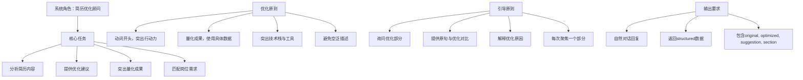
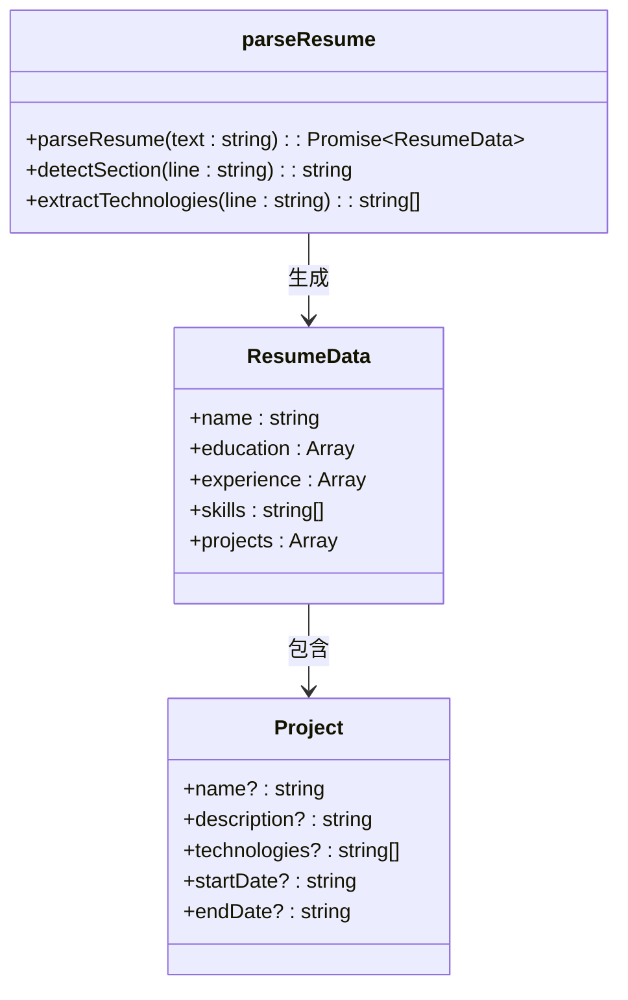
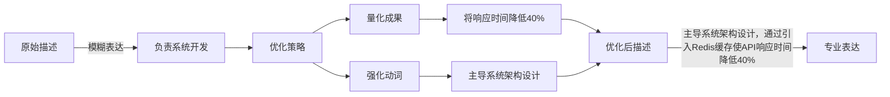
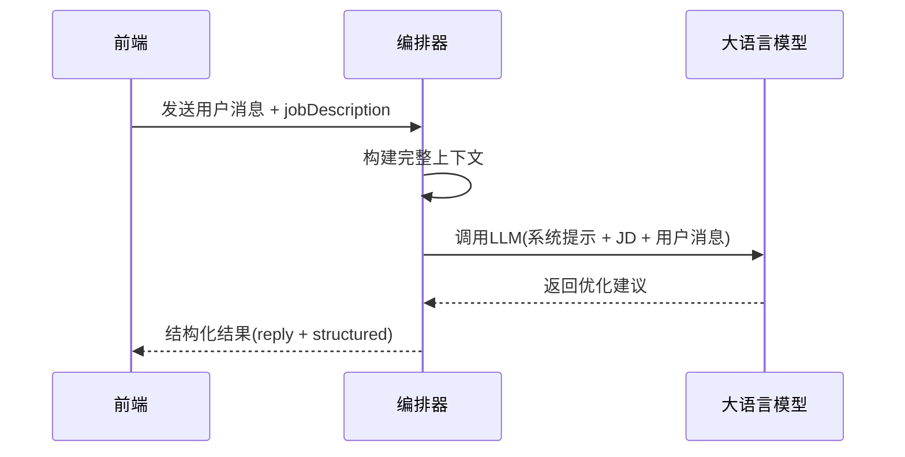
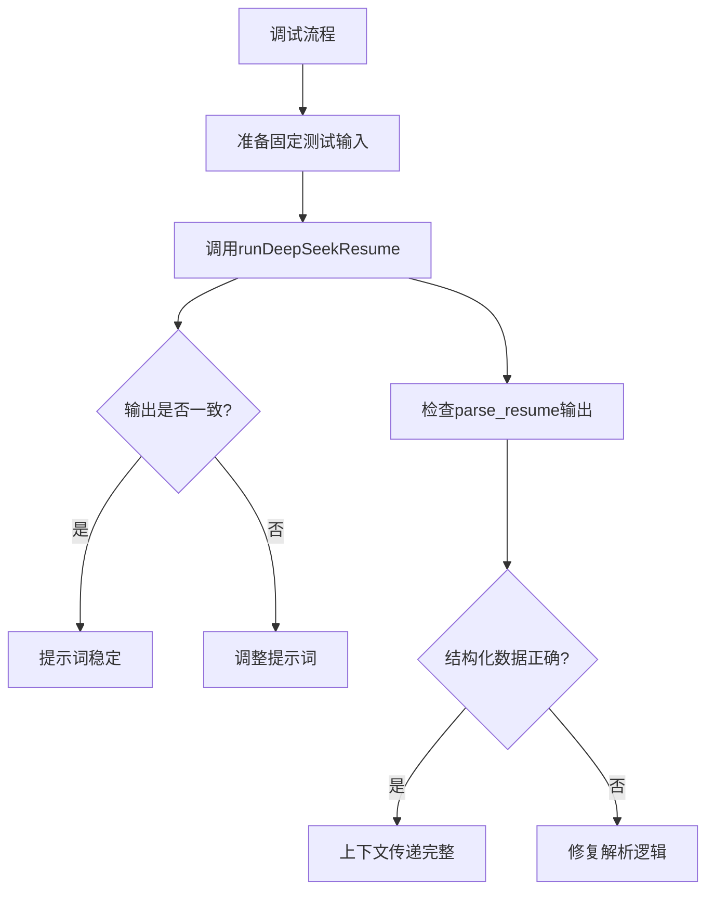

# 简历优化提示词设计

<cite>
**本文档引用文件**  
- [resume_optimization.ts](file://lib/orchestrator/prompts/resume_optimization.ts)
- [parse_resume.ts](file://lib/chains/parse_resume.ts)
- [ResumeDiffView.tsx](file://components/ResumeDiffView.tsx)
- [runDeepSeekResume.ts](file://lib/orchestrator/models/resume_optimization.ts)
- [llm.ts](file://lib/llm.ts)
- [stageAgent.ts](file://lib/orchestrator/stageAgent.ts)
- [route.ts](file://app/api/resume/parse/route.ts)
</cite>

## 目录
1. [简介](#简介)
2. [核心提示词策略](#核心提示词策略)
3. [STAR法则与技术关键词提取](#star法则与技术关键词提取)
4. [成果量化与动词强化](#成果量化与动词强化)
5. [动态岗位JD注入机制](#动态岗位jd注入机制)
6. [输出格式与前端渲染](#输出格式与前端渲染)
7. [调试与验证技巧](#调试与验证技巧)

## 简介
本系统通过精心设计的提示词策略，引导大语言模型（LLM）对用户简历进行专业优化。系统结合简历解析、上下文传递与结构化输出，实现从原始文本到优化建议的自动化处理流程。核心功能包括：基于STAR法则重构经历、提取技术关键词、匹配目标岗位JD、量化成果表达、强化动词使用，并通过结构化数据支持前端对比渲染。

**Section sources**
- [resume_optimization.ts](file://lib/orchestrator/prompts/resume_optimization.ts#L1-L31)
- [parse_resume.ts](file://lib/chains/parse_resume.ts#L1-L231)

## 核心提示词策略
系统提示词定义了简历优化顾问的角色与任务，明确优化原则与输出要求。提示词通过引导式对话，聚焦于提升简历的专业性与竞争力。



**Diagram sources**
- [resume_optimization.ts](file://lib/orchestrator/prompts/resume_optimization.ts#L5-L29)

**Section sources**
- [resume_optimization.ts](file://lib/orchestrator/prompts/resume_optimization.ts#L1-L31)

## STAR法则与技术关键词提取
提示词策略强制要求模型遵循STAR法则（情境-Situation、任务-Task、行动-Action、结果-Result）重构用户经历。通过结构化引导，确保每段经历描述具备清晰的背景、目标、执行过程与可衡量成果。

同时，系统在`parse_resume.ts`中实现技术关键词提取逻辑，通过预设技术栈关键词列表（如React、Node.js、Python等），在解析项目经历时自动识别并归类技术能力。



**Diagram sources**
- [parse_resume.ts](file://lib/chains/parse_resume.ts#L8-L202)

**Section sources**
- [parse_resume.ts](file://lib/chains/parse_resume.ts#L1-L231)

## 成果量化与动词强化
提示词明确要求“量化成果，使用具体数据和指标”，引导模型将模糊描述转化为可衡量的业绩。例如，将“提升了系统性能”优化为“通过缓存优化使系统响应时间降低40%”。

在动词使用上，提示词强调“用动词开头，突出行动力”，并建议使用更强有力的动词如“主导”、“设计”、“重构”、“优化”等，替代“负责”、“参与”等弱动词，以增强经历的主动性与影响力。



**Section sources**
- [resume_optimization.ts](file://lib/orchestrator/prompts/resume_optimization.ts#L14-L17)

## 动态岗位JD注入机制
系统通过模板变量`${jobDescription}`实现岗位JD的动态注入。在实际调用中，前端或编排器会将用户目标岗位的职位描述（Job Description）作为上下文传入，使LLM能够针对性地调整优化方向，确保简历内容与目标岗位高度匹配。

该机制在`runDeepSeekResume`模型中实现，通过构建包含系统提示、岗位JD和用户消息的完整上下文，引导模型生成精准优化建议。



**Diagram sources**
- [resume_optimization.ts](file://lib/orchestrator/prompts/resume_optimization.ts#L5-L29)
- [runDeepSeekResume.ts](file://lib/orchestrator/models/resume_optimization.ts#L21-L59)

**Section sources**
- [resume_optimization.ts](file://lib/orchestrator/prompts/resume_optimization.ts#L5-L29)
- [runDeepSeekResume.ts](file://lib/orchestrator/models/resume_optimization.ts#L21-L59)

## 输出格式与前端渲染
系统要求LLM输出结构化数据，包含`original`（原句）、`optimized`（优化句）、`suggestion`（建议）和`section`（所属部分）。该结构化输出被`ResumeDiffView`组件用于渲染对比视图。

`ResumeDiffView`组件通过左右分栏展示原始与优化文本，并支持高亮差异、编辑、下载与接受优化等功能，为用户提供直观的交互体验。

```mermaid
graph TB
A["LLM输出"] --> B["structured.resumeInsights[]"]
B --> C["original: 原始句子"]
B --> D["optimized: 优化句子"]
B --> E["suggestion: 优化建议"]
B --> F["section: 所属部分"]
G["前端组件"] --> H["ResumeDiffView"]
H --> I["左侧：原始文本"]
H --> J["右侧：优化文本"]
H --> K["高亮差异"]
H --> L["编辑/下载/接受"]
B --> H : 数据传递
```

**Diagram sources**
- [runDeepSeekResume.ts](file://lib/orchestrator/models/resume_optimization.ts#L38-L53)
- [ResumeDiffView.tsx](file://components/ResumeDiffView.tsx#L6-L168)

**Section sources**
- [runDeepSeekResume.ts](file://lib/orchestrator/models/resume_optimization.ts#L38-L53)
- [ResumeDiffView.tsx](file://components/ResumeDiffView.tsx#L6-L168)

## 调试与验证技巧
为确保提示词稳定性与上下文传递完整性，建议采用以下调试技巧：

1. **固定输入测试**：使用固定的简历片段和岗位JD作为输入，多次调用LLM，验证输出的一致性与稳定性。
2. **上下文验证**：通过`parse_resume.ts`验证简历解析结果的准确性，确保结构化数据正确传递至提示词上下文。
3. **日志监控**：在`llm.ts`中启用详细日志，监控API调用、超时与重试情况，及时发现潜在问题。
4. **阶段代理测试**：利用`stageAgent.ts`模拟不同用户阶段，验证编排器能否正确路由至`resume_optimization`模型。



**Section sources**
- [parse_resume.ts](file://lib/chains/parse_resume.ts#L41-L217)
- [llm.ts](file://lib/llm.ts#L12-L163)
- [stageAgent.ts](file://lib/orchestrator/stageAgent.ts#L35-L71)