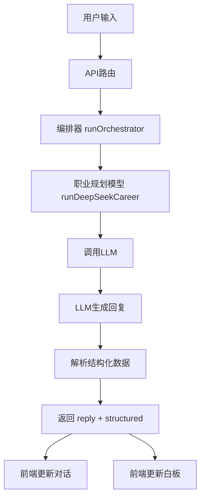

# 职业规划提示词设计

<cite>
**本文档引用文件**  
- [career_planning.ts](file://lib/orchestrator/prompts/career_planning.ts)
- [career_planning_model.ts](file://lib/orchestrator/models/career_planning.ts)
- [stageAgent.ts](file://lib/orchestrator/stageAgent.ts)
- [index.ts](file://lib/orchestrator/index.ts)
- [chat_route.ts](file://app/api/chat/route.ts)
- [llm.ts](file://lib/llm.ts)
- [Whiteboard.tsx](file://components/Whiteboard.tsx)
- [stage.ts](file://lib/stage.ts)
</cite>

## 目录
1. [引言](#引言)
2. [职业规划提示词架构](#职业规划提示词架构)
3. [引导式提问机制](#引导式提问机制)
4. [用户画像构建逻辑](#用户画像构建逻辑)
5. [输出结构设计原则](#输出结构设计原则)
6. [上下文注入与个性化建议](#上下文注入与个性化建议)
7. [优化方向与测试策略](#优化方向与测试策略)
8. [系统集成与数据流](#系统集成与数据流)
9. [结论](#结论)

## 引言

本项目为“AI求职教练”系统，旨在通过智能化引导帮助用户完成从职业规划到Offer选择的全流程求职辅导。其中，职业规划阶段是整个流程的起点，负责帮助用户明确职业方向、识别核心技能并制定发展路径。该阶段通过精心设计的提示词（prompt）架构，结合用户教育背景、工作经验等画像信息，提供个性化的建议。系统采用多模型编排器（Orchestrator）架构，根据用户当前阶段自动选择对应的模型和提示词，确保各阶段的专业性和连贯性。

## 职业规划提示词架构

职业规划阶段的提示词架构由系统提示词（System Prompt）和模型处理逻辑两部分构成。系统提示词定义了AI的角色、任务、引导原则和输出要求，而模型处理逻辑则负责调用大语言模型（LLM）并解析其输出。

系统提示词将AI定位为“深谙中国就业市场的资深职业顾问”，明确了其四大核心任务：引导用户明确职业方向、确定目标岗位、识别核心技能和提供个性化建议。在引导原则上，强调使用开放性问题深入了解用户的兴趣、能力与价值观，保持温和鼓励的语气，并根据用户回答逐步缩小职业范围。输出要求上，提示词规定了AI需提供自然的对话回复，并在结构化数据中返回用户的意向岗位（intentRole）和核心技能（keySkills）。

该提示词通过`CAREER_PLANNING_SYSTEM_PROMPT`常量在`lib/orchestrator/prompts/career_planning.ts`文件中定义，作为模型调用时的系统消息注入到对话上下文中。

**Section sources**
- [career_planning.ts](file://lib/orchestrator/prompts/career_planning.ts#L1-L25)

## 引导式提问机制

职业规划阶段的引导式提问机制遵循“循循善诱”的原则，旨在通过一系列精心设计的对话，帮助用户自我发现职业方向。该机制不直接提供答案，而是通过提问激发用户思考，逐步聚焦其职业目标。

引导过程始于对用户兴趣、能力和价值观的开放式探索。AI会提出如“你对哪些技术领域最感兴趣？”或“你希望未来的工作环境是怎样的？”这类问题，以收集用户的初步意向。随着对话的深入，AI会根据用户的回答，逐步引导其思考更具体的维度，如行业偏好、技术栈倾向和长期发展目标。

例如，当用户表达对技术的兴趣时，AI会进一步询问其对前端、后端还是AI领域的偏好；当用户提及职业发展时，AI会探讨其是倾向于技术深耕还是管理转型。这种单点突破、步步为营的提问方式，有效避免了给用户造成压力，同时确保了信息收集的深度和广度。当AI通过关键词匹配或语义分析识别到用户明确表达了目标岗位时，系统便会自动推进到下一阶段。

**Section sources**
- [career_planning.ts](file://lib/orchestrator/prompts/career_planning.ts#L13-L19)
- [chat_route.ts](file://app/api/chat/route.ts#L10-L26)

## 用户画像构建逻辑

用户画像的构建是生成个性化发展路径建议的核心。系统通过分析用户的教育背景、工作经验、项目经历和技能掌握情况，构建一个全面的用户画像，并据此生成针对性的建议。

在代码实现上，用户画像信息主要通过对话历史（messages）传递给模型。模型在`runDeepSeekCareer`函数中接收包含用户所有历史消息的数组，这些消息中包含了用户主动提供的个人信息。例如，当用户提到“我有三年后端开发经验”或“我的专业是计算机科学”时，这些信息便成为构建画像的基础。

基于此画像，系统能够生成如“鉴于你有后端开发经验，建议你向AI方向转型，可以先学习Python和机器学习基础”或“你有丰富的项目经验，适合深耕后端架构，建议深入研究微服务和分布式系统”等具体建议。这些建议不仅考虑了用户的当前状态，还结合了市场趋势和职业发展路径，为用户提供切实可行的指导。

**Section sources**
- [career_planning_model.ts](file://lib/orchestrator/models/career_planning.ts#L16-L74)
- [stage.ts](file://lib/stage.ts#L6-L85)

## 输出结构设计原则

输出结构的设计旨在确保返回内容的结构化和可操作性，便于前端展示和后续流程使用。系统采用统一的返回格式，包含`reply`（对话回复）和`structured`（结构化数据）两个字段。

`reply`字段是AI生成的自然语言回复，用于与用户进行对话。`structured`字段则是一个JSON对象，用于承载关键的结构化信息。在职业规划阶段，该字段主要包含`intentRole`（意向岗位）和`keySkills`（核心技能）两个属性。

这种设计原则确保了返回内容不仅包含对用户的直接回复，还包含了可供前端组件（如智能白板）使用的结构化数据。例如，当`structured`中包含`intentRole: "前端开发"`时，前端可以立即将此信息展示在白板的“求职岗位”区域，实现信息的实时同步和可视化。



**Diagram sources**
- [career_planning_model.ts](file://lib/orchestrator/models/career_planning.ts#L16-L74)
- [Whiteboard.tsx](file://components/Whiteboard.tsx#L8-L73)

**Section sources**
- [career_planning_model.ts](file://lib/orchestrator/models/career_planning.ts#L8-L14)
- [Whiteboard.tsx](file://components/Whiteboard.tsx#L8-L73)

## 上下文注入与个性化建议

变量`${userProfile}`的上下文注入是实现个性化建议生成的关键。虽然在当前代码中未直接使用模板变量`${userProfile}`，但其功能通过将完整的对话历史（messages）作为上下文注入到LLM调用中来实现。

在`runDeepSeekCareer`函数中，系统将系统提示词和用户的所有历史消息组合成一个消息数组（`llmMessages`），然后传递给LLM。这意味着LLM在生成回复时，能够看到用户之前的所有对话内容，包括其教育背景、工作经验、技能和职业目标等信息。这种全量上下文的注入方式，使得LLM能够基于完整的用户画像进行深度分析，从而生成高度个性化的建议。

例如，当用户在对话中提到自己是“计算机专业硕士，有两年Java开发经验，希望转行AI”，LLM在生成回复时，会综合这些信息，推荐学习Python、机器学习框架（如TensorFlow/PyTorch）和相关数学知识，并建议参与AI项目以积累经验。这种方式确保了建议的相关性和可行性，极大地提升了用户体验。

**Section sources**
- [career_planning_model.ts](file://lib/orchestrator/models/career_planning.ts#L20-L23)
- [chat_route.ts](file://app/api/chat/route.ts#L212-L214)

## 优化方向与测试策略

为进一步提升职业规划建议的质量和权威性，系统可从以下几个方向进行优化：

1.  **引入市场趋势数据**：当前建议主要基于用户画像和通用知识。未来可集成实时的招聘市场数据（如热门技能、薪资水平、岗位需求量），使建议更具数据支撑。例如，当AI检测到用户有意图转向AI领域时，可结合当前市场对大模型工程师的高需求和薪资水平，增强建议的说服力。

2.  **改进结构化数据提取**：目前对`intentRole`和`keySkills`的提取依赖于简单的正则表达式和关键词匹配，准确率有限。未来可优化为要求LLM直接以JSON格式输出结构化数据，或使用专门的NLP工具进行实体识别，提高数据提取的准确性和鲁棒性。

3.  **增强个性化模型**：可以为不同背景的用户（如应届生、转行者、资深工程师）训练或微调不同的模型，使建议更加精准。

在测试方面，需模拟不同用户画像来验证输出的多样性。测试用例应覆盖：
*   **不同教育背景**：如本科、硕士、非科班转行。
*   **不同工作经验**：如应届生、3年经验、10年经验。
*   **不同职业目标**：如技术专家、管理者、创业者。
*   **不同技术栈倾向**：如前端、后端、AI、数据科学。

通过这些测试，可以确保系统对各种用户都能生成合理、多样且有针对性的建议，避免建议的同质化。

**Section sources**
- [career_planning_model.ts](file://lib/orchestrator/models/career_planning.ts#L35-L66)
- [README.md](file://lib/orchestrator/README.md#L165-L171)

## 系统集成与数据流

职业规划功能深度集成于整个应用架构中。其数据流始于前端`ChatFlow`组件的用户输入，经由`/api/chat`路由处理。该路由根据`userStage`参数选择对应的系统提示词，并调用`runOrchestrator`编排器。

编排器根据`userStage`路由到`runDeepSeekCareer`模型，该模型负责构建包含系统提示和用户消息的完整上下文，并调用底层的`callLLM`函数。`callLLM`函数封装了与DeepSeek等LLM提供商的API交互，包括超时、重试和错误处理。

最终的回复返回前端后，`ChatFlow`组件更新对话界面，同时`Whiteboard`组件监听`structured`数据的变化，实时更新白板上的“意向岗位”和“核心技能”等信息，形成一个完整的闭环。

```mermaid
graph TB
subgraph "前端"
A[ChatFlow] --> B[Whiteboard]
end
subgraph "后端"
C[/api/chat] --> D[runOrchestrator]
D --> E[runDeepSeekCareer]
E --> F[callLLM]
F --> G[DeepSeek API]
end
A --> C
G --> E
E --> A
E --> B
```

**Diagram sources**
- [chat_route.ts](file://app/api/chat/route.ts#L144-L238)
- [index.ts](file://lib/orchestrator/index.ts#L34-L126)
- [llm.ts](file://lib/llm.ts#L81-L163)

**Section sources**
- [chat_route.ts](file://app/api/chat/route.ts#L144-L238)
- [index.ts](file://lib/orchestrator/index.ts#L34-L126)

## 结论

职业规划阶段的提示词架构是AI求职教练系统的核心组成部分。它通过定义清晰的AI角色和引导原则，利用引导式提问机制帮助用户探索职业方向。系统通过分析对话历史构建用户画像，并据此生成个性化的转型或深耕建议。输出结构的设计确保了信息的结构化和可操作性，而全量对话历史的上下文注入则保证了建议的高度个性化。未来通过引入市场数据和优化数据提取方式，可进一步提升系统的智能水平和建议权威性。整个功能与前后端组件紧密集成，形成了一个流畅、智能的用户体验闭环。