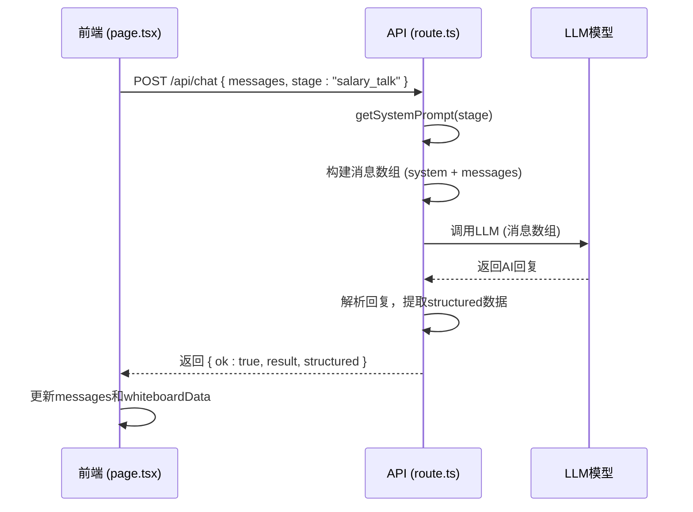

# 薪资谈判提示词设计

<cite>
**本文档引用的文件**   
- [salary_talk.ts](file://lib/orchestrator/prompts/salary_talk.ts)
- [offer.ts](file://lib/orchestrator/prompts/offer.ts)
- [salary_talk.ts](file://lib/orchestrator/models/salary_talk.ts)
- [offer.ts](file://lib/orchestrator/models/offer.ts)
- [index.ts](file://lib/orchestrator/index.ts)
- [stageAgent.ts](file://lib/orchestrator/stageAgent.ts)
- [llm.ts](file://lib/llm.ts)
- [route.ts](file://app/api/chat/route.ts)
- [page.tsx](file://app/chat/page.tsx)
- [Whiteboard.tsx](file://components/Whiteboard.tsx)
- [stage.ts](file://lib/stage.ts)
</cite>

## 目录
1. [引言](#引言)
2. [薪资谈判提示词设计](#薪资谈判提示词设计)
3. [Offer决策提示词设计](#offer决策提示词设计)
4. [变量注入与个性化建议](#变量注入与个性化建议)
5. [系统架构与工作流](#系统架构与工作流)
6. [优化建议](#优化建议)
7. [结论](#结论)

## 引言

本项目是一个AI求职教练系统，旨在通过多阶段引导帮助用户完成职业规划、简历优化、面试准备、薪资谈判和Offer选择等求职全流程。系统采用模块化设计，每个阶段都有独立的提示词和模型处理逻辑。本文档重点分析薪资谈判（salary_talk）和Offer决策（offer）两个阶段的提示词设计，深入探讨其如何引导AI模拟HR对话场景、提供话术建议、拆解薪酬结构以及实现多Offer对比评估。

**Section sources**
- [salary_talk.ts](file://lib/orchestrator/prompts/salary_talk.ts#L1-L31)
- [offer.ts](file://lib/orchestrator/prompts/offer.ts#L1-L32)

## 薪资谈判提示词设计

薪资谈判阶段的提示词设计旨在将AI塑造成专业的薪资谈判顾问，其核心任务是帮助用户确定目标薪资范围、提供市场数据参考、制定谈判策略和话术，并准备谈判要点。提示词通过明确的策略原则和引导原则，确保AI的输出既专业又实用。

提示词首先定义了AI的角色和核心任务，强调基于用户能力、经验、市场行情来确定合理范围，并考虑福利、股票、期权等非现金部分。引导原则则规定了AI应如何与用户互动，包括了解用户期望薪资、分析市场行情、制定谈判策略和提供话术建议。输出要求明确指出，AI应提供自然的对话回复，并在structured字段中返回salaryStrategy对象，包含目标范围（targetRange）、谈判要点（negotiationPoints）和市场数据（marketData）。

在实际应用中，当用户进入“谈薪策略”阶段时，系统会调用`runDeepSeekSalary`函数，该函数使用`SALARY_TALK_SYSTEM_PROMPT`作为系统提示词，引导AI生成符合要求的策略和话术。例如，AI可能会建议用户使用“我希望薪资能在X范围内，基于我的技术贡献和市场价值”这样的话术，既表达了期望，又提供了合理的依据。

```mermaid
classDiagram
class SalaryTalkResult {
+reply : string
+structured : SalaryStrategy
}
class SalaryStrategy {
+targetRange? : string
+negotiationPoints? : string[]
+marketData? : string
}
class runDeepSeekSalary {
+messages : Array<{ role : "user" | "assistant"; content : string }>
+return : Promise<SalaryTalkResult>
}
class SALARY_TALK_SYSTEM_PROMPT {
+role : string
+coreTasks : string[]
+strategyPrinciples : string[]
+guidancePrinciples : string[]
+outputRequirements : string[]
}
runDeepSeekSalary --> SalaryTalkResult : "返回"
runDeepSeekSalary --> SALARY_TALK_SYSTEM_PROMPT : "使用"
SalaryTalkResult --> SalaryStrategy : "包含"
```

**Diagram sources**
- [salary_talk.ts](file://lib/orchestrator/prompts/salary_talk.ts#L5-L29)
- [salary_talk.ts](file://lib/orchestrator/models/salary_talk.ts#L8-L16)

**Section sources**
- [salary_talk.ts](file://lib/orchestrator/prompts/salary_talk.ts#L1-L31)
- [salary_talk.ts](file://lib/orchestrator/models/salary_talk.ts#L1-L71)

## Offer决策提示词设计

Offer决策阶段的提示词设计将AI定位为专业的Offer评估顾问，其核心任务是帮助用户分析多个Offer，从薪资待遇、职业发展、公司文化、工作内容和地理位置等多个维度进行评估，并提供选择建议。该提示词的设计逻辑与薪资谈判阶段一脉相承，但更侧重于综合比较和决策支持。

提示词明确列出了评估的五个核心维度：薪资待遇（包括薪资、福利、股票等）、职业发展（成长空间、学习机会）、公司文化（团队氛围、工作环境）、工作内容（是否匹配兴趣和能力）和地理位置（通勤、生活成本）。引导原则强调AI应帮助用户分析每个Offer的优缺点，并协助用户明确自己的优先级，从而做出最适合自己的选择。

在技术实现上，`runDeepSeekOffer`函数负责处理Offer评估逻辑。它接收用户与AI的对话消息，调用LLM，并尝试从AI的回复中解析出结构化的Offer信息。解析逻辑通过正则表达式匹配“公司”、“薪资”等关键词来提取信息，并将其填充到`structured.offers`数组中。这使得前端的智能白板能够将非结构化的对话内容转化为清晰的结构化数据，方便用户进行对比。

```mermaid
classDiagram
class OfferResult {
+reply : string
+structured : { offers? : Offer[] }
}
class Offer {
+company : string
+position : string
+salary? : string
+benefits? : string[]
+pros? : string[]
+cons? : string[]
}
class runDeepSeekOffer {
+messages : Array<{ role : "user" | "assistant"; content : string }>
+return : Promise<OfferResult>
}
class OFFER_SYSTEM_PROMPT {
+role : string
+coreTasks : string[]
+evaluationDimensions : string[]
+guidancePrinciples : string[]
+outputRequirements : string[]
}
runDeepSeekOffer --> OfferResult : "返回"
runDeepSeekOffer --> OFFER_SYSTEM_PROMPT : "使用"
OfferResult --> Offer : "包含"
```

**Diagram sources**
- [offer.ts](file://lib/orchestrator/prompts/offer.ts#L5-L30)
- [offer.ts](file://lib/orchestrator/models/offer.ts#L8-L20)

**Section sources**
- [offer.ts](file://lib/orchestrator/prompts/offer.ts#L1-L32)
- [offer.ts](file://lib/orchestrator/models/offer.ts#L1-L62)

## 变量注入与个性化建议

系统通过`app/api/chat/route.ts`中的`STAGE_PROMPTS`对象和`getSystemPrompt`函数，实现了根据不同阶段动态注入系统提示词的机制。虽然当前代码中没有直接使用`currentOffer`和`marketSalary`这样的变量，但其设计模式为个性化建议的实现奠定了基础。

在`route.ts`文件中，`STAGE_PROMPTS`为每个阶段（如career、offer等）定义了详细的系统提示词，这些提示词包含了角色设定、核心指令、绝对禁止项和交互逻辑。当用户发起聊天请求时，`getSystemPrompt`函数会根据请求中的`stage`参数映射到对应的提示词，并将其作为系统消息注入到LLM的对话流中。这种方式确保了AI在不同阶段扮演不同的专业角色，提供高度情境化的建议。

对于`currentOffer`和`marketSalary`等变量，虽然在现有代码中未显式注入，但可以通过扩展`messages`数组来实现。例如，在用户进入薪资谈判阶段时，前端可以将用户的当前Offer详情和市场薪资数据作为一条系统消息或用户消息发送给后端。后端在调用LLM时，这些信息将成为上下文的一部分，从而让AI生成的建议更加个性化和精准。`Whiteboard.tsx`组件中的`data`对象已经定义了`salaryStrategy`和`offers`等结构，这表明系统具备接收和展示个性化数据的能力。



**Diagram sources**
- [route.ts](file://app/api/chat/route.ts#L9-L122)
- [page.tsx](file://app/chat/page.tsx#L814-L834)
- [Whiteboard.tsx](file://components/Whiteboard.tsx#L58-L73)

**Section sources**
- [route.ts](file://app/api/chat/route.ts#L1-L238)
- [page.tsx](file://app/chat/page.tsx#L1-L1114)
- [llm.ts](file://lib/llm.ts#L81-L163)

## 系统架构与工作流

整个系统的架构遵循清晰的分层模式。前端（如`page.tsx`）负责用户交互和状态管理；API路由（`route.ts`）作为中间层，处理认证、请求验证和业务逻辑编排；而核心的AI逻辑则由`lib/orchestrator`目录下的模型和提示词文件实现。

工作流始于用户在前端选择“谈薪策略”或“Offer选择”阶段。`page.tsx`中的`handleSelectStage`函数会更新`userStage`状态，并触发`sendStageGreeting`向`/api/stage-greeting`发送请求，获取该阶段的开场白。当用户发送消息时，`sendMessage`函数会将当前的聊天记录和`userStage`一起发送到`/api/chat`。后端的`route.ts`根据`userStage`选择对应的系统提示词，调用`callLLM`与AI模型交互。AI的回复被解析后，结构化数据（如`salaryStrategy`或`offers`）会被合并到`whiteboardData`中，并通过`Whiteboard.tsx`组件以可视化的方式呈现给用户。

`index.ts`和`stageAgent.ts`文件中定义的编排器（Orchestrator）和阶段代理（StageAgent）虽然当前被注释，但揭示了系统未来可能采用的更高级的自动化流程。它们的设计意图是根据用户当前所处的阶段，自动调用相应的模型，实现无缝的阶段过渡。

```mermaid
graph TB
subgraph "前端"
A[page.tsx]
B[ChatFlow.tsx]
C[Whiteboard.tsx]
end
subgraph "API"
D[route.ts]
E[stage-greeting/route.ts]
end
subgraph "核心逻辑"
F[models/salary_talk.ts]
G[models/offer.ts]
H[prompts/salary_talk.ts]
I[prompts/offer.ts]
J[llm.ts]
end
A --> D: 发送聊天请求
D --> F & G: 根据stage调用模型
F & G --> H & I: 使用提示词
H & I --> J: 调用LLM
J --> F & G: 获取回复
F & G --> D: 返回结果
D --> A: 返回AI回复和structured数据
A --> C: 更新白板数据
B --> A: 提供输入
C --> A: 展示数据
```

**Diagram sources**
- [page.tsx](file://app/chat/page.tsx#L1-L1114)
- [route.ts](file://app/api/chat/route.ts#L1-L238)
- [index.ts](file://lib/orchestrator/index.ts#L1-L126)
- [stageAgent.ts](file://lib/orchestrator/stageAgent.ts#L1-L99)
- [Whiteboard.tsx](file://components/Whiteboard.tsx#L1-L541)

**Section sources**
- [page.tsx](file://app/chat/page.tsx#L1-L1114)
- [route.ts](file://app/api/chat/route.ts#L1-L238)
- [index.ts](file://lib/orchestrator/index.ts#L1-L126)

## 优化建议

为了进一步提升系统的专业性和实用性，可以考虑以下优化建议：

1.  **增加法律合规性提醒**：在薪资谈判和Offer决策的提示词中，增加关于劳动法合规性的提醒。例如，AI可以建议用户注意劳动合同中的试用期时长、五险一金缴纳比例、竞业限制条款等是否符合当地法律法规。这可以通过在`SALARY_TALK_SYSTEM_PROMPT`和`OFFER_SYSTEM_PROMPT`中添加相关指令来实现。

2.  **增强变量注入机制**：目前系统通过`messages`数组传递上下文。可以设计一个更结构化的变量注入机制，允许前端直接传递`currentOffer`、`marketSalary`等JSON对象。后端在调用LLM前，将这些变量动态插入到系统提示词中，确保AI能获得最准确的个性化信息。

3.  **完善多Offer对比模型**：当前的`runDeepSeekOffer`函数对结构化数据的解析较为简单。可以改进为使用更复杂的正则表达式或甚至调用专门的解析模型，以更准确地从AI回复中提取多个Offer的详细信息，包括完整的福利列表和优缺点分析。

4.  **验证建议连贯性**：任何对提示词的修改都必须通过完整的面试流程进行验证。这包括在前端模拟用户从职业规划到Offer选择的完整旅程，检查AI在各个阶段的建议是否逻辑连贯、数据传递是否正确，以及白板展示是否准确。

## 结论

综上所述，该AI求职教练系统在薪资谈判和Offer决策阶段的提示词设计上，展现了清晰的逻辑和专业的定位。通过精心设计的系统提示词，AI能够有效地模拟HR对话场景，提供有价值的策略和话术建议。系统架构合理，前端、API和核心逻辑分离，通过结构化数据实现了对话内容的可视化。未来通过增加法律合规性提醒和优化变量注入机制，可以进一步提升系统的专业性和用户体验。