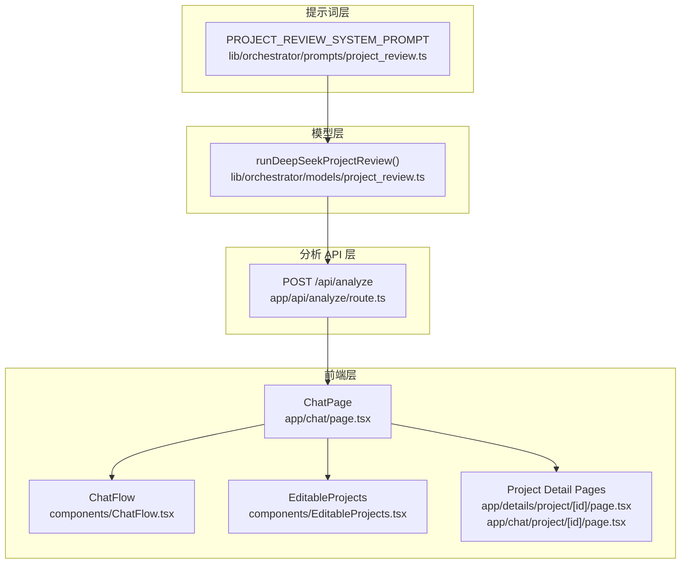
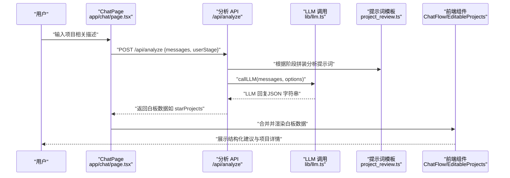
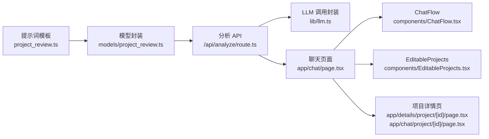

# 项目复盘提示词设计

<cite>
**本文引用的文件**
- [lib/orchestrator/prompts/project_review.ts](file://lib/orchestrator/prompts/project_review.ts)
- [lib/orchestrator/models/project_review.ts](file://lib/orchestrator/models/project_review.ts)
- [lib/orchestrator/index.ts](file://lib/orchestrator/index.ts)
- [app/api/analyze/route.ts](file://app/api/analyze/route.ts)
- [lib/llm.ts](file://lib/llm.ts)
- [app/chat/page.tsx](file://app/chat/page.tsx)
- [components/ChatFlow.tsx](file://components/ChatFlow.tsx)
- [components/EditableProjects.tsx](file://components/EditableProjects.tsx)
- [app/details/project/[id]/page.tsx](file://app/details/project/[id]/page.tsx)
- [app/chat/project/[id]/page.tsx](file://app/chat/project/[id]/page.tsx)
</cite>

## 目录
1. [引言](#引言)
2. [项目结构](#项目结构)
3. [核心组件](#核心组件)
4. [架构总览](#架构总览)
5. [详细组件分析](#详细组件分析)
6. [依赖关系分析](#依赖关系分析)
7. [性能考量](#性能考量)
8. [故障排查指南](#故障排查指南)
9. [结论](#结论)
10. [附录](#附录)

## 引言
本文件围绕 lib/orchestrator/prompts/project_review.ts 中“项目复盘”阶段的提示词设计展开，系统解析其如何引导大模型（LLM）对用户项目经历进行深度拆解，识别技术亮点与改进空间，并定义“技术深度”“业务价值”“团队协作”三大评估维度的落地方案。同时阐明输出结构的统一性要求，确保前端可结构化展示改进建议；解释 ${projectContext} 变量的上下文传递机制及其在精准反馈生成中的作用；并提供调试方法与边界案例测试思路，结合聊天组件验证建议呈现效果。

## 项目结构
项目复盘相关能力由“提示词模板 + 模型封装 + 分析 API + 前端渲染”四层构成：
- 提示词层：定义系统角色、任务目标、STAR 框架与输出规范
- 模型层：封装消息构建、调用 LLM、结构化解析
- 分析 API 层：按阶段抽取结构化白板数据，统一输出格式
- 前端层：聊天界面、白板数据展示、项目详情页

图表来源
- [lib/orchestrator/prompts/project_review.ts](file://lib/orchestrator/prompts/project_review.ts#L1-L31)
- [lib/orchestrator/models/project_review.ts](file://lib/orchestrator/models/project_review.ts#L1-L84)
- [app/api/analyze/route.ts](file://app/api/analyze/route.ts#L1-L448)
- [app/chat/page.tsx](file://app/chat/page.tsx#L1-L1114)
- [components/ChatFlow.tsx](file://components/ChatFlow.tsx#L1-L167)
- [components/EditableProjects.tsx](file://components/EditableProjects.tsx#L1-L147)
- [app/details/project/[id]/page.tsx](file://app/details/project/[id]/page.tsx#L37-L134)
- [app/chat/project/[id]/page.tsx](file://app/chat/project/[id]/page.tsx#L44-L134)

章节来源
- [lib/orchestrator/prompts/project_review.ts](file://lib/orchestrator/prompts/project_review.ts#L1-L31)
- [lib/orchestrator/models/project_review.ts](file://lib/orchestrator/models/project_review.ts#L1-L84)
- [app/api/analyze/route.ts](file://app/api/analyze/route.ts#L1-L448)
- [app/chat/page.tsx](file://app/chat/page.tsx#L1-L1114)
- [components/ChatFlow.tsx](file://components/ChatFlow.tsx#L1-L167)
- [components/EditableProjects.tsx](file://components/EditableProjects.tsx#L1-L147)
- [app/details/project/[id]/page.tsx](file://app/details/project/[id]/page.tsx#L37-L134)
- [app/chat/project/[id]/page.tsx](file://app/chat/project/[id]/page.tsx#L44-L134)

## 核心组件
- 提示词模板（PROJECT_REVIEW_SYSTEM_PROMPT）：定义系统角色、STAR 框架、引导原则与输出要求，确保对话聚焦、结构化、可解析
- 模型封装（runDeepSeekProjectReview）：构建消息数组、调用 LLM、简单抽取项目标题并返回结构化结果
- 分析 API（/api/analyze）：按阶段抽取白板数据，统一输出格式，为前端提供结构化建议
- 前端渲染：聊天界面、白板数据展示、项目详情页，支撑建议呈现与交互

章节来源
- [lib/orchestrator/prompts/project_review.ts](file://lib/orchestrator/prompts/project_review.ts#L1-L31)
- [lib/orchestrator/models/project_review.ts](file://lib/orchestrator/models/project_review.ts#L1-L84)
- [app/api/analyze/route.ts](file://app/api/analyze/route.ts#L146-L177)
- [app/chat/page.tsx](file://app/chat/page.tsx#L478-L663)

## 架构总览
项目复盘的端到端流程如下：
- 前端聊天页面维护用户会话与阶段状态，将历史消息与当前阶段传递给分析 API
- 分析 API 根据阶段构建不同提示词，调用 LLM 抽取结构化数据（如 starProjects）
- 前端将返回的白板数据合并到本地状态，驱动 UI 更新与项目详情页渲染

图表来源
- [app/chat/page.tsx](file://app/chat/page.tsx#L478-L663)
- [app/api/analyze/route.ts](file://app/api/analyze/route.ts#L123-L177)
- [lib/llm.ts](file://lib/llm.ts#L81-L161)
- [lib/orchestrator/prompts/project_review.ts](file://lib/orchestrator/prompts/project_review.ts#L1-L31)

## 详细组件分析

### 提示词设计：如何引导深度拆解与结构化输出
- 角色与任务
  - 系统角色：专业的项目经历梳理顾问，擅长使用 STAR 法则帮助用户深度挖掘项目价值
  - 核心任务：按照 STAR 格式梳理项目、深挖细节与成果、提炼亮点、确保描述突出能力与贡献
- STAR 结构
  - Situation（背景）：项目背景、面临的挑战
  - Task（任务）：职责与目标
  - Action（行动）：采取的具体行动与方法
  - Result（结果）：成果、数据指标、影响
- 引导原则
  - 针对每个项目逐一深挖四要素
  - 多问“为什么”和“怎么样”，引导用户提供具体细节
  - 帮助用户量化成果（数据、指标、影响范围）
  - 完成一个项目的完整 STAR 描述时可标记完成
  - 输出简洁，每次聚焦一个方面
- 输出要求
  - 提供自然的对话回复
  - 若完成一个项目的 STAR 梳理，在结构化字段中返回 starProjects 数组
  - 每个项目包含 title、situation、task、action、result

提示词设计要点
- 通过“聚焦一个方面”的输出要求，降低 LLM 输出冗余，便于后续结构化解析
- 通过“量化成果”“多问为什么/怎么样”等原则，提升用户输入质量，间接增强 LLM 输出的可解析性
- 通过“完成标记”机制，为前端阶段推进提供信号

章节来源
- [lib/orchestrator/prompts/project_review.ts](file://lib/orchestrator/prompts/project_review.ts#L1-L31)

### 模型封装：消息构建、调用 LLM 与结构化解析
- 消息构建
  - 在传入 messages 前插入系统消息（PROJECT_REVIEW_SYSTEM_PROMPT）
  - 保持消息顺序：system → user/assistant …
- LLM 调用
  - 使用 callLLM，指定 provider 为 deepseek，temperature 与 maxTokens 适配对话场景
- 结构化解析
  - runDeepSeekProjectReview 对 messages 与 LLM 回复进行拼接，尝试从文本中抽取项目标题，形成 starProjects 列表
  - 为每个项目生成唯一 id，便于前端去重与持久化
- 返回结构
  - reply：LLM 的自然语言回复
  - structured：包含 starProjects 的结构化数据

提示词与模型封装的协同
- 提示词强调“输出 starProjects 数组”，模型封装通过正则匹配标题并补全字段，形成统一的结构化输出，便于前端消费

章节来源
- [lib/orchestrator/models/project_review.ts](file://lib/orchestrator/models/project_review.ts#L1-L84)
- [lib/orchestrator/prompts/project_review.ts](file://lib/orchestrator/prompts/project_review.ts#L1-L31)
- [lib/llm.ts](file://lib/llm.ts#L81-L161)

### 分析 API：按阶段抽取结构化白板数据
- 阶段识别与规范化
  - 根据 userStage 参数识别当前阶段，若为 project_review，则构建项目复盘分析提示词
- 提示词构造
  - 项目复盘阶段的提示词要求：只返回 JSON，不要包含任何其他文字
  - 提取字段：starProjects（title、situation、task、action、result）
  - 注意事项：只提取完整或部分 STAR 结构的项目；若项目信息不完整，只返回已有字段
- LLM 调用与 JSON 解析
  - 调用 callLLM，system 提示词强调严格输出 JSON、禁止 markdown 代码块、字段缺失则不返回或设为 null/空数组
  - 清理可能的 markdown 包裹，提取首个 JSON 对象并解析
- 数据规范化
  - 为数组字段（如 starProjects）补充 id 与 createdAt，保证前端可展示与去重
- 返回与持久化
  - 返回白板数据（JSON），并在后台异步保存到数据库

章节来源
- [app/api/analyze/route.ts](file://app/api/analyze/route.ts#L123-L177)
- [app/api/analyze/route.ts](file://app/api/analyze/route.ts#L349-L447)
- [lib/llm.ts](file://lib/llm.ts#L81-L161)

### 前端集成：聊天组件与项目详情页
- 聊天页面
  - 维护 messages、userStage、sessionId 等状态
  - 发送消息时将历史消息转换为 {role, content} 格式并调用 /api/analyze
  - 自动分析：debounce 合并多次输入，减少 API 调用频率
  - 合并白板数据：将返回的 starProjects 合并到本地状态，避免重复并保留已有数据
- 聊天组件
  - ChatFlow 负责渲染消息、输入与发送按钮，支持自动高度调整与回车发送
- 项目详情页
  - 项目详情页与聊天中的项目详情页均采用统一的 STAR 结构展示（S/T/A/R），确保前后端一致
  - EditableProjects 组件支持编辑项目名称与描述（STAR 格式），便于人工补充与修正

章节来源
- [app/chat/page.tsx](file://app/chat/page.tsx#L478-L663)
- [components/ChatFlow.tsx](file://components/ChatFlow.tsx#L1-L167)
- [components/EditableProjects.tsx](file://components/EditableProjects.tsx#L1-L147)
- [app/details/project/[id]/page.tsx](file://app/details/project/[id]/page.tsx#L37-L134)
- [app/chat/project/[id]/page.tsx](file://app/chat/project/[id]/page.tsx#L44-L134)

### “技术深度”“业务价值”“团队协作”评估维度的落地
- 技术深度
  - 通过 Action（行动）与 Result（结果）引导用户描述技术选型、实现方法、性能指标、复杂度与创新点
  - 在 Result 中强调量化指标（如 QPS、延迟、覆盖率、资源节省等），便于后续结构化抽取
- 业务价值
  - 通过 Result（结果）引导用户描述业务指标（如收入增长、成本降低、用户规模、留存率等）
  - 在 Situation 中明确业务背景与挑战，帮助识别业务意义
- 团队协作
  - 在 Task 与 Action 中引导用户描述角色分工、跨部门协作、沟通协调、知识沉淀等
  - 在 Result 中体现协作带来的效率提升、风险规避、知识传承等软性收益

统一评估入口
- 由于提示词模板未直接定义“技术深度/业务价值/团队协作”的评估字段，可在分析 API 的项目复盘阶段提示词中增加字段定义与抽取规则，例如：
  - 新增字段：techDepth（技术深度）、businessImpact（业务价值）、teamCollaboration（团队协作）
  - 在提示词中明确这些字段的含义与评分维度，确保 LLM 输出可解析
- 前端渲染
  - 在白板数据中新增上述字段，并在项目详情页以统一卡片形式展示，便于用户对比与优化

章节来源
- [lib/orchestrator/prompts/project_review.ts](file://lib/orchestrator/prompts/project_review.ts#L1-L31)
- [app/api/analyze/route.ts](file://app/api/analyze/route.ts#L146-L177)

### 输出结构统一性与前端可展示性
- 统一结构
  - 项目复盘阶段统一返回 starProjects 数组，每项包含 id、title、situation、task、action、result
  - 前端在合并白板数据时，基于 id 去重，避免重复展示
- 前端消费
  - EditableProjects 与项目详情页均采用统一的 STAR 结构，确保前后端一致
  - 前端可直接将 starProjects 渲染为卡片或列表，支持编辑与查看详情

章节来源
- [lib/orchestrator/models/project_review.ts](file://lib/orchestrator/models/project_review.ts#L1-L84)
- [app/api/analyze/route.ts](file://app/api/analyze/route.ts#L395-L426)
- [components/EditableProjects.tsx](file://components/EditableProjects.tsx#L1-L147)
- [app/details/project/[id]/page.tsx](file://app/details/project/[id]/page.tsx#L37-L134)
- [app/chat/project/[id]/page.tsx](file://app/chat/project/[id]/page.tsx#L44-L134)

### ${projectContext} 变量的上下文传递机制
- 语义说明
  - 在提示词模板中，虽然未直接出现 ${projectContext} 变量，但分析 API 的项目复盘阶段提示词会将“对话内容”拼接到提示词中，形成“上下文”
- 传递机制
  - 前端将 messages（历史对话）与 userStage 传递给 /api/analyze
  - 分析 API 将 messages 转换为“role: content”格式并拼接到项目复盘提示词中
  - LLM 基于完整上下文生成结构化输出
- 精准反馈的重要性
  - 完整的上下文有助于 LLM 更准确地识别项目名称、背景、职责与成果，从而提升抽取精度
  - 对于边界案例（如用户未完整描述 STAR、项目名称模糊、结果未量化），上下文能帮助 LLM 进行合理推断与引导

章节来源
- [app/chat/page.tsx](file://app/chat/page.tsx#L478-L663)
- [app/api/analyze/route.ts](file://app/api/analyze/route.ts#L146-L177)

### 调试方法与边界案例测试
- 控制台调试
  - 在 ChatPage 中暴露 analyzeConversation 与 fsm，便于手动触发分析与阶段切换
  - 在浏览器控制台调用 window.analyzeConversation() 触发 /api/analyze，观察返回的白板数据
- 边界案例测试
  - 未完整 STAR：仅提供 title，未提供 situation/task/action/result
  - 项目名称模糊：使用近似名称或缩写
  - 结果未量化：仅描述主观感受，未给出数据指标
  - 多项目混杂：多个项目在同一段话中描述
- 建议呈现验证
  - 在 EditableProjects 中编辑项目描述（STAR 格式），观察前端渲染效果
  - 在项目详情页查看 S/T/A/R 展示是否符合预期

章节来源
- [app/chat/page.tsx](file://app/chat/page.tsx#L690-L760)
- [components/EditableProjects.tsx](file://components/EditableProjects.tsx#L1-L147)
- [app/details/project/[id]/page.tsx](file://app/details/project/[id]/page.tsx#L37-L134)
- [app/chat/project/[id]/page.tsx](file://app/chat/project/[id]/page.tsx#L44-L134)

## 依赖关系分析
- 提示词模板依赖模型封装与分析 API 的共同约定（STAR 结构、输出字段）
- 模型封装依赖 LLM 调用封装（lib/llm.ts），负责超时与重试
- 分析 API 依赖阶段识别与规范化、白板数据结构定义
- 前端依赖聊天页面与组件，负责状态管理与 UI 渲染

图表来源
- [lib/orchestrator/prompts/project_review.ts](file://lib/orchestrator/prompts/project_review.ts#L1-L31)
- [lib/orchestrator/models/project_review.ts](file://lib/orchestrator/models/project_review.ts#L1-L84)
- [app/api/analyze/route.ts](file://app/api/analyze/route.ts#L1-L448)
- [lib/llm.ts](file://lib/llm.ts#L81-L161)
- [app/chat/page.tsx](file://app/chat/page.tsx#L1-L1114)
- [components/ChatFlow.tsx](file://components/ChatFlow.tsx#L1-L167)
- [components/EditableProjects.tsx](file://components/EditableProjects.tsx#L1-L147)
- [app/details/project/[id]/page.tsx](file://app/details/project/[id]/page.tsx#L37-L134)
- [app/chat/project/[id]/page.tsx](file://app/chat/project/[id]/page.tsx#L44-L134)

## 性能考量
- debounce 优化：聊天页面对分析请求进行 1 秒防抖，减少频繁调用
- 温度与 Token：模型封装与分析 API 的 temperature 与 maxTokens 设置适中，兼顾稳定性与输出长度
- 前端合并策略：白板数据合并时基于 id 去重，避免重复渲染与存储

章节来源
- [app/chat/page.tsx](file://app/chat/page.tsx#L556-L663)
- [lib/orchestrator/models/project_review.ts](file://lib/orchestrator/models/project_review.ts#L22-L41)
- [app/api/analyze/route.ts](file://app/api/analyze/route.ts#L395-L426)

## 故障排查指南
- LLM 调用失败
  - 检查 API Key 是否配置正确（DEEPSEEK_API_KEY/OpenAI_API_KEY）
  - 观察超时与重试逻辑（lib/llm.ts），必要时增大超时或减少重试次数
- JSON 解析失败
  - 分析 API 对响应进行清理与 JSON 提取，若仍失败，检查提示词是否强制只返回 JSON
- 白板数据为空
  - 确认前端是否正确传递 messages 与 userStage
  - 检查阶段是否为 project_review，以及 starProjects 是否被正确抽取
- 建议呈现异常
  - 在 EditableProjects 中检查项目名称与描述是否符合 STAR 格式
  - 在项目详情页核对 S/T/A/R 字段是否完整

章节来源
- [lib/llm.ts](file://lib/llm.ts#L81-L161)
- [app/api/analyze/route.ts](file://app/api/analyze/route.ts#L372-L426)
- [app/chat/page.tsx](file://app/chat/page.tsx#L478-L663)
- [components/EditableProjects.tsx](file://components/EditableProjects.tsx#L1-L147)

## 结论
项目复盘提示词通过明确的角色定位、严格的 STAR 框架与输出规范，有效引导 LLM 对用户项目经历进行深度拆解。模型封装与分析 API 将自然语言对话转化为统一的结构化白板数据，前端组件据此实现建议呈现与交互。为进一步完善评估体系，可在分析 API 的项目复盘提示词中引入“技术深度”“业务价值”“团队协作”等评估字段，确保输出更具指导性与可操作性。通过边界案例测试与前端验证，可持续提升提示词的鲁棒性与用户体验。

## 附录
- 项目复盘阶段的关键文件路径
  - 提示词模板：lib/orchestrator/prompts/project_review.ts
  - 模型封装：lib/orchestrator/models/project_review.ts
  - 分析 API：app/api/analyze/route.ts
  - 聊天页面：app/chat/page.tsx
  - 聊天组件：components/ChatFlow.tsx
  - 项目详情页：app/details/project/[id]/page.tsx、app/chat/project/[id]/page.tsx
  - 项目编辑组件：components/EditableProjects.tsx