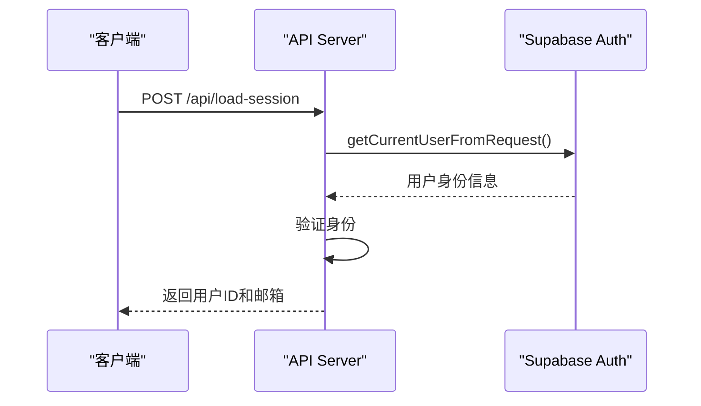
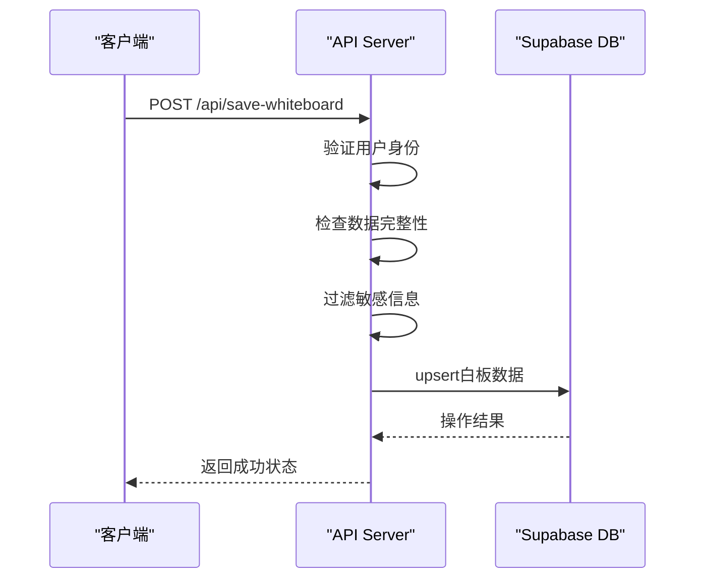
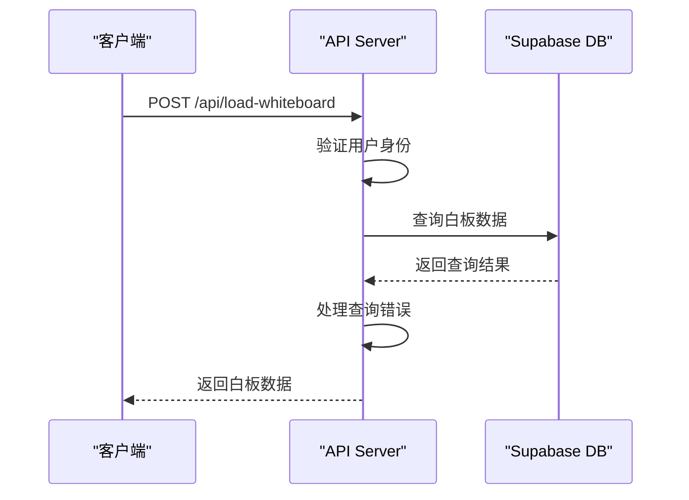
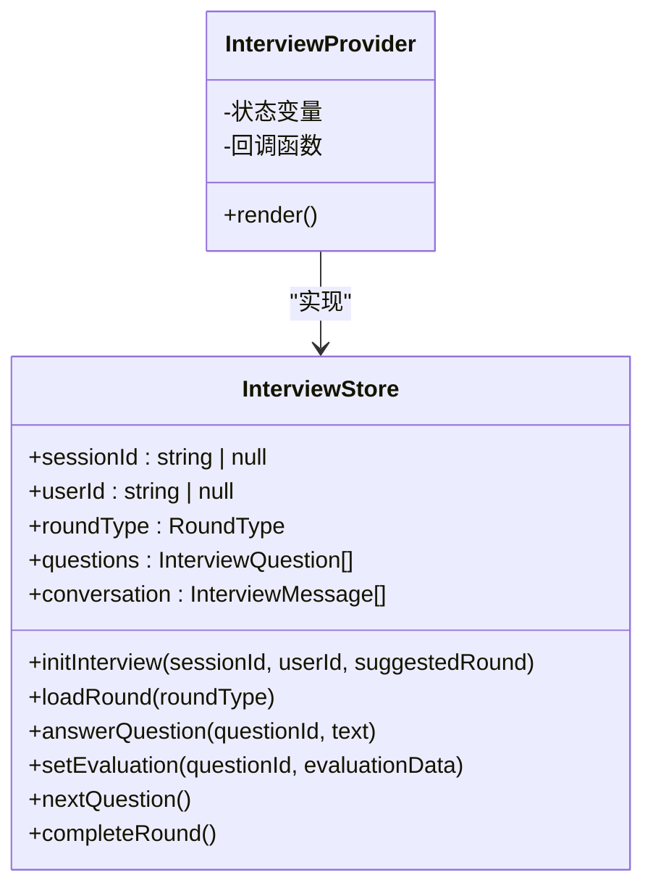
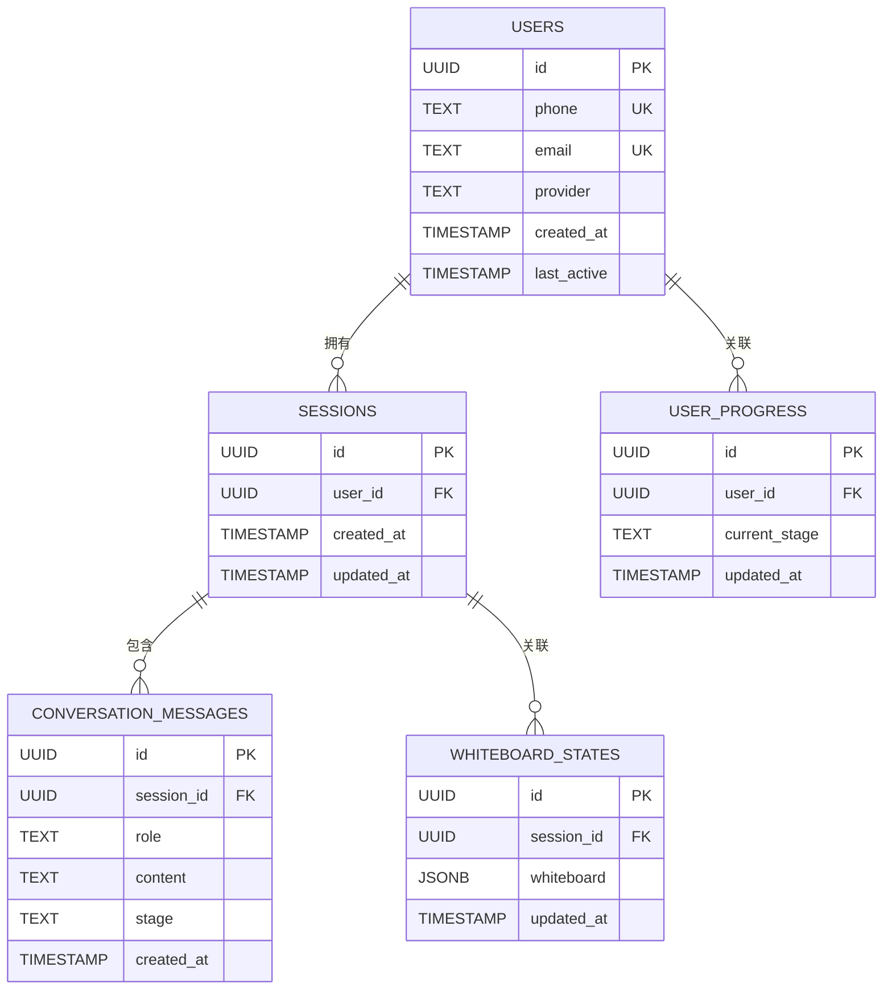
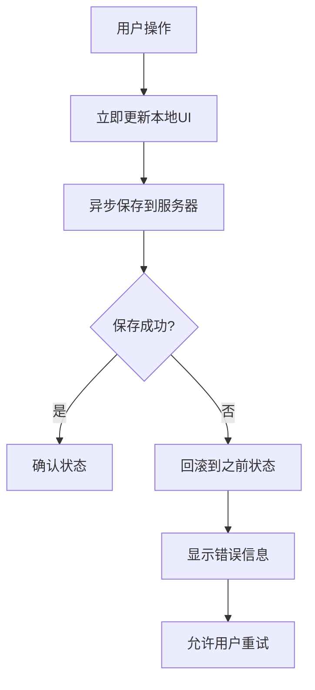
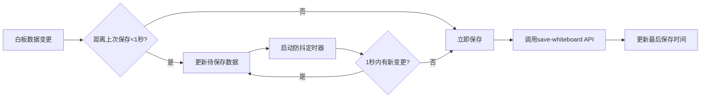

# 会话与状态管理API

<cite>
**本文档引用的文件**   
- [load-session/route.ts](file://app/api/load-session/route.ts)
- [save-whiteboard/route.ts](file://app/api/save-whiteboard/route.ts)
- [load-whiteboard/route.ts](file://app/api/load-whiteboard/route.ts)
- [interviewStore.tsx](file://store/interviewStore.tsx)
- [Whiteboard.tsx](file://components/Whiteboard.tsx)
- [db.ts](file://lib/db.ts)
- [auth.ts](file://lib/auth.ts)
- [schema.sql](file://supabase/schema.sql)
</cite>

## 目录
1. [简介](#简介)
2. [核心API接口](#核心api接口)
3. [状态管理机制](#状态管理机制)
4. [数据结构设计](#数据结构设计)
5. [数据库同步机制](#数据库同步机制)
6. [乐观更新与冲突解决](#乐观更新与冲突解决)
7. [白板组件调用控制](#白板组件调用控制)
8. [性能优化建议](#性能优化建议)

## 简介
本文档详细说明AI求职教练应用中的会话持久化与状态同步API，包括加载会话、保存白板和加载白板接口。文档阐述了这些接口如何与Zustand状态管理协同工作，实现跨设备的状态恢复，以及与Supabase数据库的同步机制。

## 核心API接口

### 加载会话接口 (/api/load-session)
加载会话接口用于验证用户身份并返回用户基本信息。该接口通过Supabase认证系统获取当前用户信息，为后续的会话恢复提供身份验证。



**接口响应格式**
```json
{
  "ok": true,
  "user": {
    "id": "用户唯一标识",
    "email": "用户邮箱"
  }
}
```

**Diagram sources**
- [load-session/route.ts](file://app/api/load-session/route.ts#L1-L30)

**Section sources**
- [load-session/route.ts](file://app/api/load-session/route.ts#L1-L30)
- [auth.ts](file://lib/auth.ts#L1-L40)

### 保存白板接口 (/api/save-whiteboard)
保存白板接口用于将用户的白板状态持久化到数据库。该接口接收前端提交的白板数据，经过安全验证后存储到Supabase数据库中。



**接口请求格式**
```json
{
  "data": {
    "白板状态数据"
  }
}
```

**接口响应格式**
```json
{
  "ok": true
}
```

**Diagram sources**
- [save-whiteboard/route.ts](file://app/api/save-whiteboard/route.ts#L1-L50)

**Section sources**
- [save-whiteboard/route.ts](file://app/api/save-whiteboard/route.ts#L1-L50)
- [db.ts](file://lib/db.ts#L144-L188)

### 加载白板接口 (/api/load-whiteboard)
加载白板接口用于从数据库中恢复用户的白板状态。该接口根据用户身份查询并返回存储的白板数据，实现跨设备的状态同步。



**接口响应格式**
```json
{
  "ok": true,
  "data": {
    "白板状态数据"
  }
}
```

**Diagram sources**
- [load-whiteboard/route.ts](file://app/api/load-whiteboard/route.ts#L1-L39)

**Section sources**
- [load-whiteboard/route.ts](file://app/api/load-whiteboard/route.ts#L1-L39)
- [db.ts](file://lib/db.ts#L193-L207)

## 状态管理机制
应用使用自定义的React Context状态管理器（interviewStore.tsx）来管理面试流程的状态。该状态管理器不依赖Zustand，而是使用原生React Context API实现。



**关键状态属性**
- **sessionId**: 会话唯一标识
- **userId**: 用户唯一标识
- **roundType**: 当前面试轮次类型
- **questions**: 面试问题列表
- **conversation**: 对话消息历史
- **flowStep**: 流程步骤状态

**状态恢复流程**
1. 用户登录后调用`/api/load-session`验证身份
2. 从localStorage或服务器获取sessionId和userId
3. 调用`initInterview`初始化状态
4. 调用`/api/load-whiteboard`恢复白板状态
5. 根据用户进度恢复相应的面试轮次

**Diagram sources**
- [interviewStore.tsx](file://store/interviewStore.tsx#L74-L736)

**Section sources**
- [interviewStore.tsx](file://store/interviewStore.tsx#L1-L789)
- [providers.tsx](file://app/providers.tsx#L1-L13)

## 数据结构设计
白板状态的数据结构设计涵盖了多个求职阶段的关键信息，包括消息历史、白板内容和当前阶段。

### 白板数据结构
```typescript
interface WhiteboardData {
  // 职业规划阶段
  intentRole?: string;
  keySkills?: string[];
  
  // 项目复盘阶段
  starProjects?: Array<{
    id: string;
    title: string;
    situation?: string;
    task?: string;
    action?: string;
    result?: string;
    createdAt?: string;
  }>;
  
  // 简历优化阶段
  resumeInsights?: Array<{
    id: string;
    original?: string;
    optimized?: string;
    suggestion?: string;
    section?: string;
  }>;
  
  // 面试阶段
  interviewReports?: Array<{
    id: string;
    round: string;
    questions?: Array<{
      question: string;
      userAnswer?: string;
      aiFeedback?: string;
      score?: number;
    }>;
    overallScore?: number;
    strengths?: string[];
    improvements?: string[];
    createdAt?: string;
  }>;
  
  // 投递策略阶段
  targetCompanies?: Array<{
    name: string;
    position: string;
    matchScore?: number;
    notes?: string;
  }>;
  
  // 谈薪策略阶段
  salaryStrategy?: {
    targetRange?: string;
    negotiationPoints?: string[];
    marketData?: string;
  };
  
  // Offer阶段
  offers?: Array<{
    company: string;
    position: string;
    salary?: string;
    benefits?: string[];
    pros?: string[];
    cons?: string[];
  }>;
}
```

### 面试问题数据结构
```typescript
interface InterviewQuestion {
  id: string;
  q: string; // 问题内容
  tips: QuestionTips; // 提示信息
  userAnswer?: string; // 用户回答
  evaluation?: QuestionEvaluation; // 评估结果
  status: QuestionStatus; // 问题状态
}
```

**Section sources**
- [Whiteboard.tsx](file://components/Whiteboard.tsx#L8-L73)
- [interviewStore.tsx](file://store/interviewStore.tsx#L57-L64)

## 数据库同步机制
应用使用Supabase作为后端数据库，通过`lib/db.ts`中的封装函数实现与数据库的交互。

### 数据库表结构


### 同步流程
1. **客户端**：用户操作触发状态变更
2. **状态管理**：更新本地状态并标记需要同步
3. **API调用**：通过fetch调用相应的API端点
4. **服务器验证**：验证用户身份和数据完整性
5. **数据库操作**：执行upsert或select操作
6. **响应处理**：返回操作结果并更新UI

**Diagram sources**
- [schema.sql](file://supabase/schema.sql#L1-L84)
- [db.ts](file://lib/db.ts#L16-L48)

**Section sources**
- [db.ts](file://lib/db.ts#L1-L327)
- [schema.sql](file://supabase/schema.sql#L1-L84)

## 乐观更新与冲突解决
系统采用乐观更新策略来提升用户体验，并通过合理的冲突解决机制确保数据一致性。

### 乐观更新流程


### 冲突解决策略
1. **基于时间戳的解决**：使用`updated_at`字段确定最新版本
2. **Upsert操作**：使用数据库的upsert功能避免重复记录
3. **错误重试机制**：当upsert失败时，先删除再插入
4. **静默失败处理**：数据库不可用时使用localStorage作为降级方案

```typescript
// Upsert with conflict resolution
const { error } = await client
  .from('whiteboard_states')
  .upsert(upsertData, {
    onConflict: userId ? 'user_id' : 'session_id',
  });

// Fallback: delete then insert
if (error) {
  await client
    .from('whiteboard_states')
    .delete()
    .eq(userId ? 'user_id' : 'session_id', id);
  const { error: insertError } = await client
    .from('whiteboard_states')
    .insert(upsertData);
}
```

**Section sources**
- [db.ts](file://lib/db.ts#L161-L187)
- [save-whiteboard/route.ts](file://app/api/save-whiteboard/route.ts#L35-L41)

## 白板组件调用控制
Whiteboard组件通过防抖和频率控制机制优化API调用，减少不必要的网络请求。

### 防抖实现
组件通过以下方式控制保存频率：
1. **状态变更监听**：监听白板数据的变化
2. **防抖定时器**：设置300-500ms的延迟
3. **批量更新**：将短时间内多次变更合并为一次保存
4. **节流控制**：限制单位时间内的保存次数

### 调用频率控制


**Section sources**
- [Whiteboard.tsx](file://components/Whiteboard.tsx#L1-L541)
- [interviewStore.tsx](file://store/interviewStore.tsx#L700-L736)

## 性能优化建议

### 增量保存
实现增量保存机制，只传输变更的部分数据，减少网络传输量。

```typescript
// 保存时只发送变更的数据
function getChangedData(currentData, lastSavedData) {
  const changed = {};
  for (const [key, value] of Object.entries(currentData)) {
    if (!isEqual(value, lastSavedData[key])) {
      changed[key] = value;
    }
  }
  return changed;
}
```

### 数据压缩
对大型数据进行压缩处理，提高传输效率。

```typescript
// 使用Gzip或类似算法压缩数据
async function compressData(data) {
  const jsonString = JSON.stringify(data);
  const encoder = new TextEncoder();
  const dataBuffer = encoder.encode(jsonString);
  // 使用压缩库进行压缩
  const compressed = await compress(dataBuffer);
  return compressed;
}
```

### 缓存策略
1. **内存缓存**：在内存中缓存最近的白板状态
2. **本地存储**：使用localStorage作为持久化缓存
3. **条件请求**：添加ETag或Last-Modified头进行条件请求

### 其他优化建议
- **连接复用**：保持HTTP连接复用，减少握手开销
- **批处理**：将多个小的保存操作合并为批量操作
- **离线支持**：在网络不可用时先保存到本地，恢复后同步
- **数据分片**：对大型白板数据进行分片处理和分批传输

**Section sources**
- [db.ts](file://lib/db.ts#L144-L188)
- [Whiteboard.tsx](file://components/Whiteboard.tsx#L1-L541)