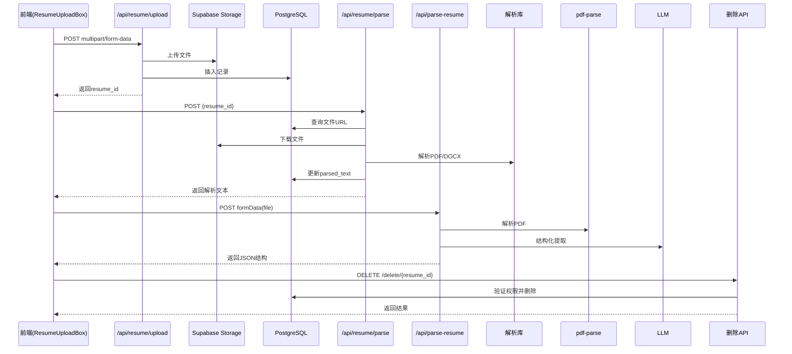
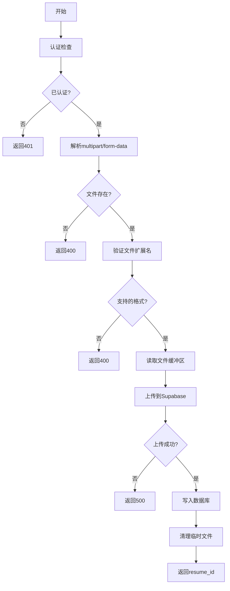
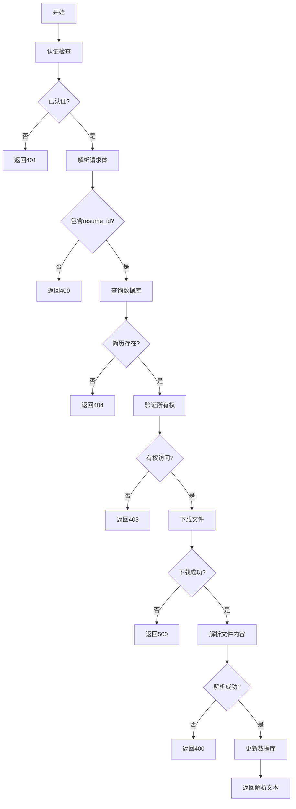
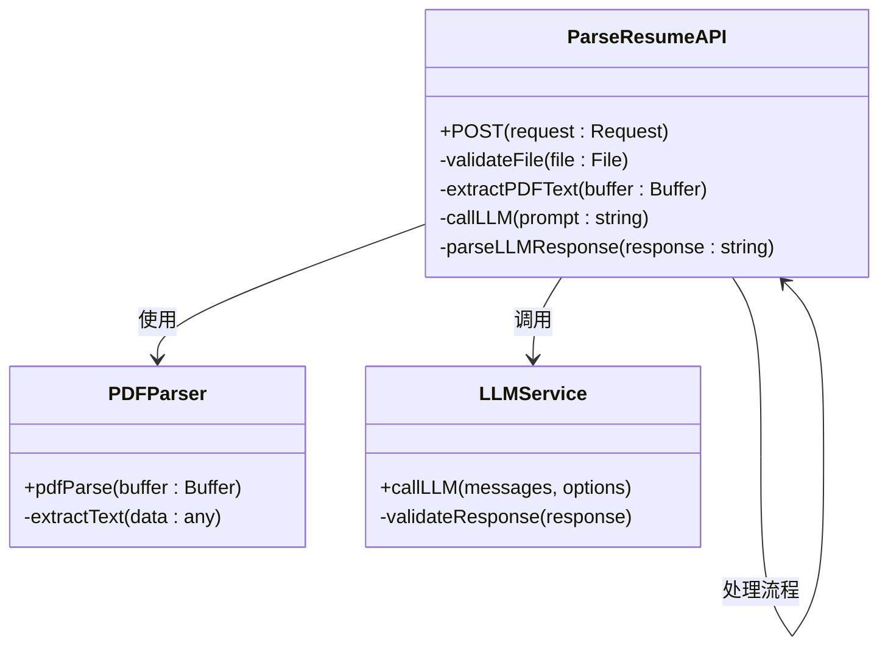
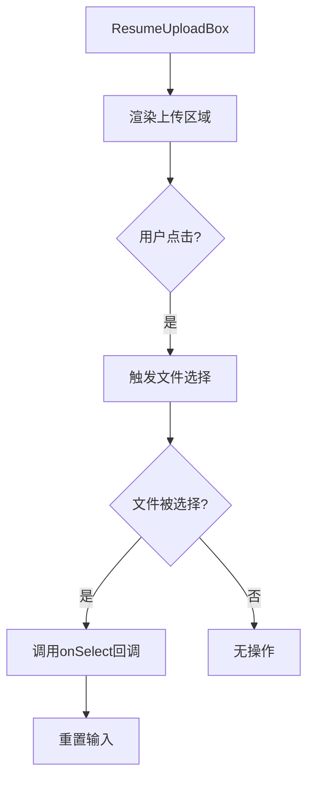
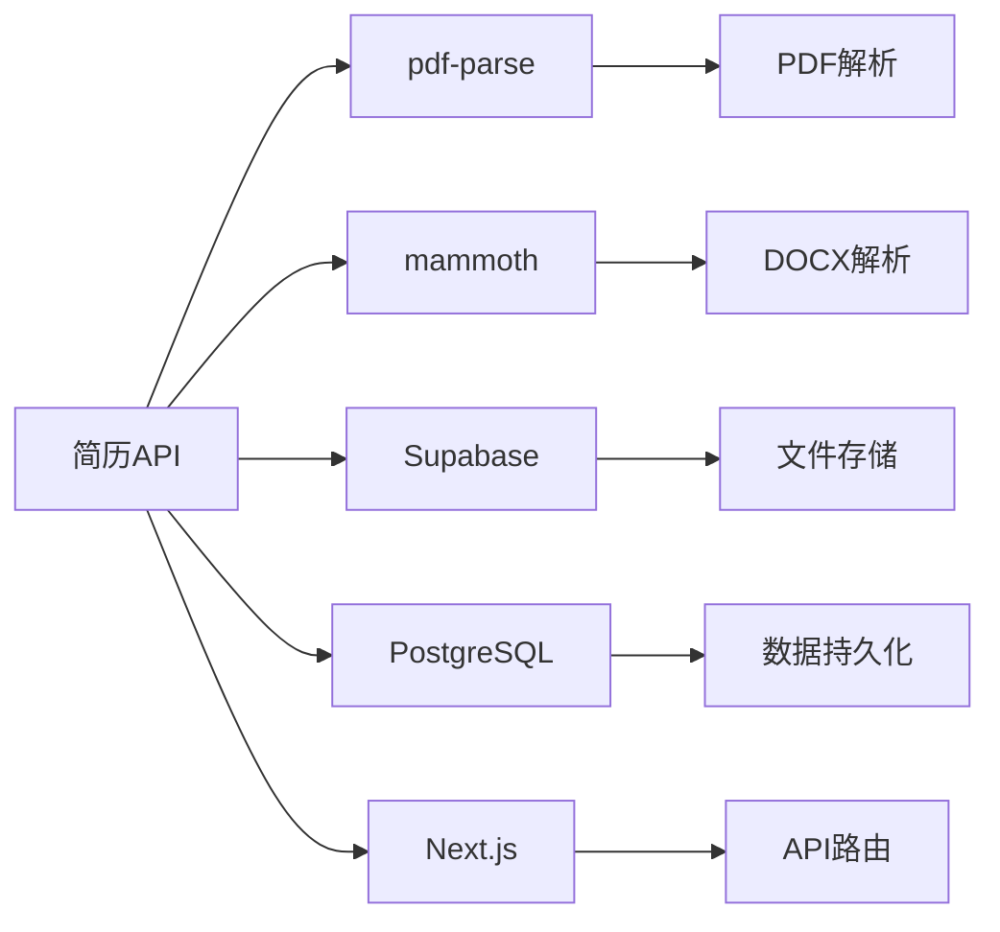

# 简历API

<cite>
**本文档中引用的文件**  
- [upload/route.ts](file://app/api/resume/upload/route.ts)
- [parse/route.ts](file://app/api/resume/parse/route.ts)
- [parse-resume/route.ts](file://app/api/parse-resume/route.ts)
- [ResumeUploadBox.tsx](file://components/resume/ResumeUploadBox.tsx)
</cite>

## 目录
1. [简介](#简介)
2. [项目结构](#项目结构)
3. [核心组件](#核心组件)
4. [架构概述](#架构概述)
5. [详细组件分析](#详细组件分析)
6. [依赖分析](#依赖分析)
7. [性能考虑](#性能考虑)
8. [故障排除指南](#故障排除指南)
9. [结论](#结论)

## 简介
本项目是一个AI求职教练系统，提供简历上传、解析、删除和内容提取等核心功能。API基于Next.js构建，通过Supabase存储文件，并利用pdf-parse和mammoth库处理PDF和DOCX格式的简历文件。系统支持结构化数据提取，前端组件提供用户友好的上传界面。

## 项目结构

```mermaid
graph TD
subgraph "API 路由"
A[/api/resume/upload]
B[/api/resume/parse]
C[/api/resume/delete{resume_id}]
D[/api/parse-resume]
end
subgraph "前端组件"
E[ResumeUploadBox.tsx]
end
subgraph "后端服务"
F[pdf-parse]
G[mammoth]
H[Supabase Storage]
I[PostgreSQL]
end
E --> A
A --> H
B --> I
C --> I
D --> F
D --> G
```

**图示来源**
- [upload/route.ts](file://app/api/resume/upload/route.ts#L1-L140)
- [parse/route.ts](file://app/api/resume/parse/route.ts#L1-L228)
- [parse-resume/route.ts](file://app/api/parse-resume/route.ts#L1-L196)
- [ResumeUploadBox.tsx](file://components/resume/ResumeUploadBox.tsx#L1-L56)

**本节来源**
- [app/api/resume](file://app/api/resume)

## 核心组件

简历处理系统包含四个主要API端点：上传、解析、删除和内容提取。上传接口处理multipart/form-data格式的文件上传，支持PDF、DOC和DOCX格式。解析接口从Supabase下载文件并提取纯文本内容。内容提取接口使用LLM将简历文本转换为结构化JSON数据。删除接口实现权限控制和数据库级联删除。

**本节来源**
- [upload/route.ts](file://app/api/resume/upload/route.ts#L12-L139)
- [parse/route.ts](file://app/api/resume/parse/route.ts#L99-L228)
- [parse-resume/route.ts](file://app/api/parse-resume/route.ts#L12-L196)

## 架构概述



**图示来源**
- [upload/route.ts](file://app/api/resume/upload/route.ts#L12-L139)
- [parse/route.ts](file://app/api/resume/parse/route.ts#L99-L228)
- [parse-resume/route.ts](file://app/api/parse-resume/route.ts#L12-L196)
- [ResumeUploadBox.tsx](file://components/resume/ResumeUploadBox.tsx#L1-L56)

## 详细组件分析

### 上传接口分析



**图示来源**
- [upload/route.ts](file://app/api/resume/upload/route.ts#L12-L139)

**本节来源**
- [upload/route.ts](file://app/api/resume/upload/route.ts#L12-L139)

### 解析接口分析



**图示来源**
- [parse/route.ts](file://app/api/resume/parse/route.ts#L99-L228)

**本节来源**
- [parse/route.ts](file://app/api/resume/parse/route.ts#L99-L228)

### 内容提取接口分析



**图示来源**
- [parse-resume/route.ts](file://app/api/parse-resume/route.ts#L12-L196)

**本节来源**
- [parse-resume/route.ts](file://app/api/parse-resume/route.ts#L12-L196)

### 前端组件分析



**图示来源**
- [ResumeUploadBox.tsx](file://components/resume/ResumeUploadBox.tsx#L1-L56)

**本节来源**
- [ResumeUploadBox.tsx](file://components/resume/ResumeUploadBox.tsx#L1-L56)

## 依赖分析



**图示来源**
- [upload/route.ts](file://app/api/resume/upload/route.ts#L4-L6)
- [parse/route.ts](file://app/api/resume/parse/route.ts#L5-L6)
- [parse-resume/route.ts](file://app/api/parse-resume/route.ts#L3-L4)

**本节来源**
- [upload/route.ts](file://app/api/resume/upload/route.ts#L1-L140)
- [parse/route.ts](file://app/api/resume/parse/route.ts#L1-L228)
- [parse-resume/route.ts](file://app/api/parse-resume/route.ts#L1-L196)

## 性能考虑
对于大文件上传，建议在服务器配置中设置适当的超时时间。Supabase存储的上传超时默认为30秒，对于大于5MB的文件可能需要调整。建议前端实现上传进度显示，并设置合理的文件大小限制（当前为10MB）。解析大型PDF文件时，pdf-parse库的性能与文件复杂度相关，建议对超过20页的简历进行优化处理。

## 故障排除指南
常见问题包括文件上传失败、解析错误和权限问题。上传失败通常与Supabase配置或网络问题有关。解析错误可能是由于文件损坏或格式不支持。权限问题通常出现在跨用户访问简历时。建议检查日志中的错误信息，并验证认证状态和文件URL的正确性。

## 结论
简历处理API提供了完整的文件上传、解析和管理功能。系统采用模块化设计，各组件职责清晰。通过Supabase实现可靠的文件存储，利用专业库处理不同格式的文档。前端组件提供简洁的用户界面，后端API实现安全的权限控制。整体架构可扩展，便于未来添加新的文件格式支持或增强解析功能。