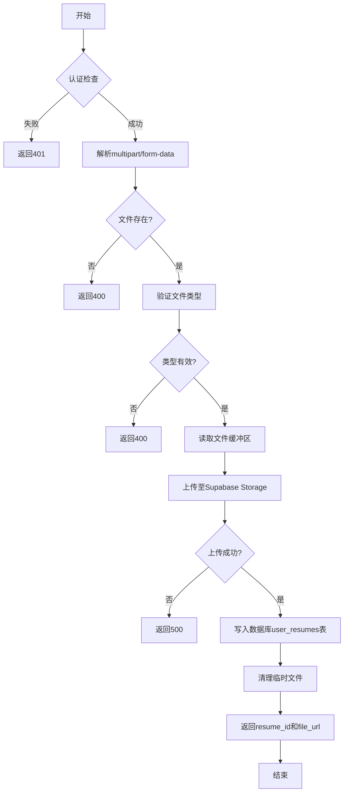

# 简历上传接口

<cite>
**本文档引用的文件**  
- [app/api/resume/upload/route.ts](file://app/api/resume/upload/route.ts)
- [components/resume/ResumeUploadBox.tsx](file://components/resume/ResumeUploadBox.tsx)
- [lib/db.ts](file://lib/db.ts)
- [next.config.ts](file://next.config.ts)
</cite>

## 目录
1. [接口概述](#接口概述)
2. [请求方法与格式](#请求方法与格式)
3. [服务端处理流程](#服务端处理流程)
4. [前端上传组件](#前端上传组件)
5. [错误处理与状态码](#错误处理与状态码)
6. [调用示例](#调用示例)
7. [配置建议](#配置建议)

## 接口概述

简历上传接口 `/api/resume/upload` 是 AI 求职助手应用中的核心功能之一，用于接收用户上传的简历文件。该接口通过 POST 方法接收 `multipart/form-data` 格式的文件上传请求，支持 PDF 和 DOCX 两种文件类型。上传成功后，服务端会生成唯一的 `resume_id` 并返回给客户端，用于后续的简历解析和优化操作。

该接口结合了身份认证、文件解析、云存储和数据库持久化等多个功能模块，确保了上传过程的安全性和可靠性。

**本节来源**  
- [app/api/resume/upload/route.ts](file://app/api/resume/upload/route.ts#L1-L140)

## 请求方法与格式

该接口使用 **POST** 方法，请求内容类型为 `multipart/form-data`，要求在表单中包含名为 `file` 的文件字段。

### 支持的文件类型
- `.pdf`
- `.doc`
- `.docx`

### 最大文件大小
- 10MB（由 `formidable` 的 `maxFileSize` 配置限制）

### 认证要求
- 请求必须包含有效的用户会话信息，否则将返回 401 状态码。
- 服务端通过 `getCurrentUserFromRequest()` 函数验证用户身份。

**本节来源**  
- [app/api/resume/upload/route.ts](file://app/api/resume/upload/route.ts#L14-L25)

## 服务端处理流程

服务端处理流程分为以下几个关键步骤：

1. **认证检查**：验证用户是否已登录。
2. **文件解析**：使用 `formidable` 解析 `multipart/form-data` 请求体。
3. **文件类型验证**：检查上传文件的扩展名是否为 `.pdf`、`.doc` 或 `.docx`。
4. **文件读取**：使用 Node.js 的 `fs/promises` 模块读取临时文件内容。
5. **云存储上传**：将文件上传至 Supabase Storage，存储路径为 `${userId}/${resumeId}/${filename}`。
6. **数据库记录**：调用 `db.ts` 中的 `getDbClient()` 获取数据库客户端，并在 `user_resumes` 表中插入新记录。
7. **临时文件清理**：上传完成后删除本地临时文件。
8. **返回结果**：返回包含 `resume_id` 和文件公共 URL 的 JSON 响应。



**图表来源**  
- [app/api/resume/upload/route.ts](file://app/api/resume/upload/route.ts#L26-L131)

**本节来源**  
- [app/api/resume/upload/route.ts](file://app/api/resume/upload/route.ts#L26-L131)
- [lib/db.ts](file://lib/db.ts#L16-L48)

## 前端上传组件

前端通过 `ResumeUploadBox.tsx` 组件实现简历上传功能。该组件为客户端组件（使用 `"use client"` 指令），提供用户友好的文件选择界面。

### 主要功能
- 点击区域触发文件选择对话框。
- 支持拖拽或点击上传。
- 显示支持的文件格式提示（PDF 和 Word）。
- 选择文件后通过 `onSelect` 回调将文件对象传递给父组件。

### 组件结构
- 使用 `lucide-react` 的 `Upload` 图标。
- 通过 `ref` 引用隐藏的 `<input type="file">` 元素。
- 使用 `accept=".pdf,.doc,.docx"` 限制可选文件类型。
- 文件选择后自动重置 input 值，允许重复选择同一文件。

**本节来源**  
- [components/resume/ResumeUploadBox.tsx](file://components/resume/ResumeUploadBox.tsx#L1-L56)

## 错误处理与状态码

该接口定义了多种错误情况及其对应的 HTTP 状态码：

| 错误情况 | HTTP 状态码 | 返回内容 |
|---------|------------|---------|
| 未认证 | 401 | `{ ok: false, error: "未认证，请先登录" }` |
| 未找到上传文件 | 400 | `{ ok: false, error: "未找到上传文件" }` |
| 文件类型不支持 | 400 | `{ ok: false, error: "仅支持 .pdf .doc .docx 文件" }` |
| 文件过大（>10MB） | 413 | 由 `formidable` 自动处理 |
| Supabase 配置缺失 | 500 | `{ ok: false, error: "Supabase 配置缺失" }` |
| 数据库不可用 | 500 | `{ ok: false, error: "数据库不可用" }` |
| 上传失败 | 500 | `{ ok: false, error: "文件上传失败" }` |

**本节来源**  
- [app/api/resume/upload/route.ts](file://app/api/resume/upload/route.ts#L16-L93)

## 调用示例

### curl 命令示例

```bash
curl -X POST http://localhost:3000/api/resume/upload \
  -H "Authorization: Bearer <your-session-token>" \
  -F "file=@/path/to/resume.pdf" \
  -H "Content-Type: multipart/form-data"
```

### 前端 fetch 调用示例

```javascript
async function uploadResume(file) {
  const formData = new FormData();
  formData.append('file', file);

  const response = await fetch('/api/resume/upload', {
    method: 'POST',
    body: formData,
    headers: {
      'Authorization': `Bearer ${sessionToken}`
    }
  });

  if (response.ok) {
    const result = await response.json();
    console.log('上传成功:', result.resume_id);
    return result.resume_id;
  } else {
    const error = await response.json();
    console.error('上传失败:', error.error);
    throw new Error(error.error);
  }
}
```

**本节来源**  
- [app/api/resume/upload/route.ts](file://app/api/resume/upload/route.ts#L12-L131)
- [components/resume/ResumeUploadBox.tsx](file://components/resume/ResumeUploadBox.tsx#L1-L56)

## 配置建议

为了支持最大 10MB 文件上传，建议在 Next.js API 路由中显式配置 `bodyParser` 选项。虽然当前使用 `formidable` 手动解析请求体，但可以通过以下方式优化配置：

```ts
export const config = {
  api: {
    bodyParser: false, // 禁用默认解析器，由 formidable 处理
  },
};
```

此外，确保以下环境变量已正确配置：
- `NEXT_PUBLIC_SUPABASE_URL`: Supabase 项目 URL
- `SUPABASE_SERVICE_ROLE_KEY`: Supabase 服务角色密钥，用于文件上传

**本节来源**  
- [app/api/resume/upload/route.ts](file://app/api/resume/upload/route.ts#L64-L78)
- [next.config.ts](file://next.config.ts#L1-L55)