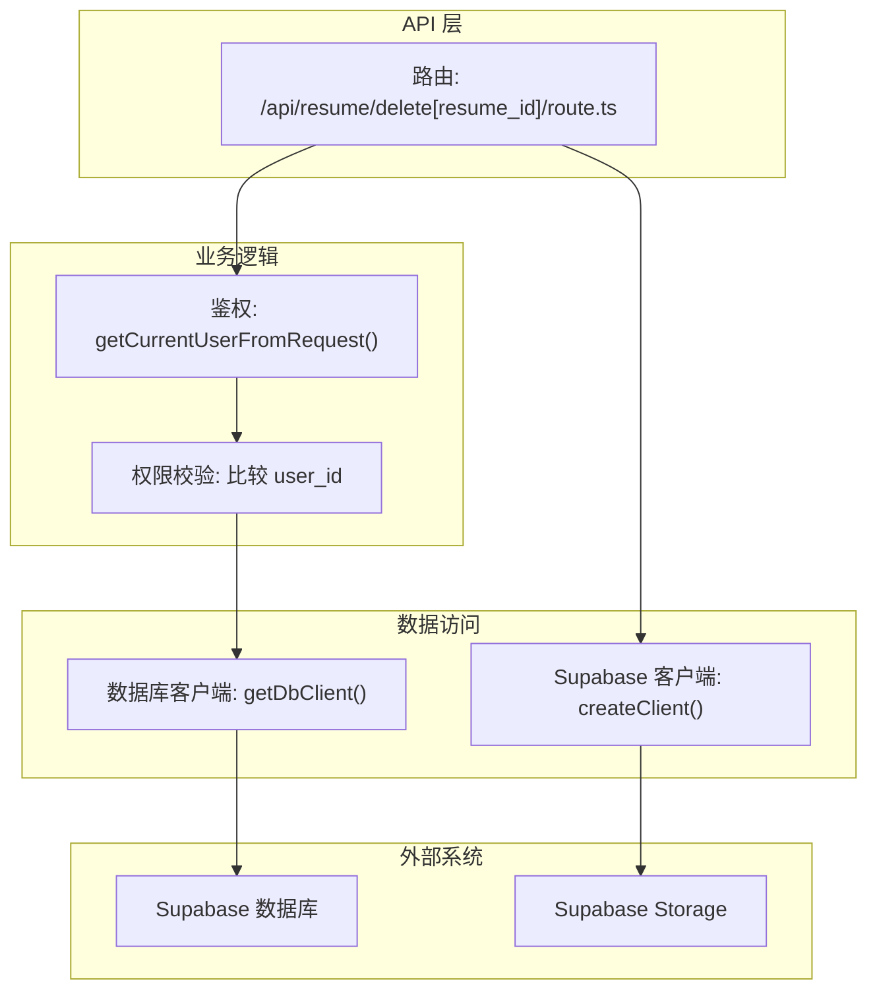
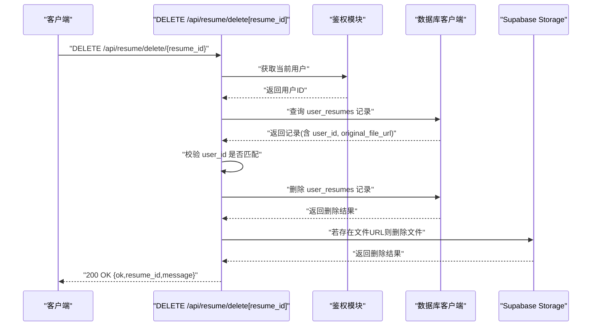
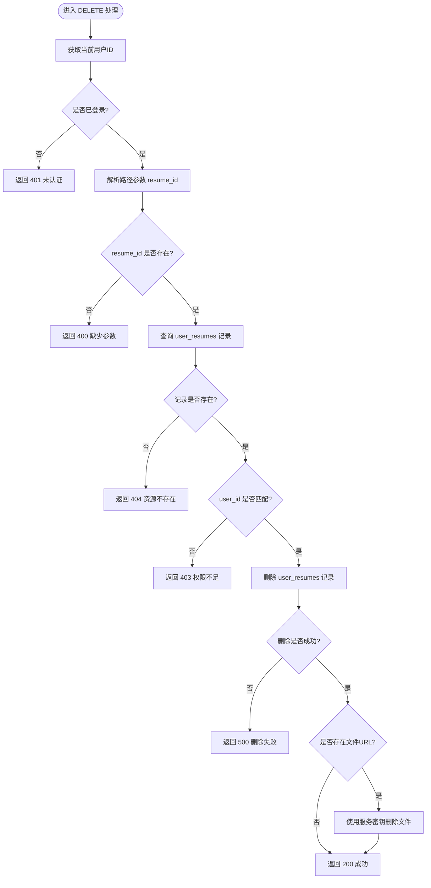
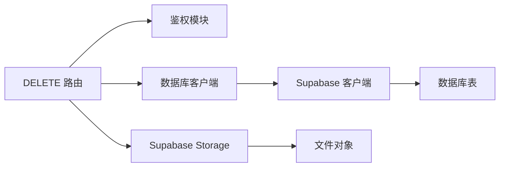

# 简历删除接口

<cite>
**本文引用的文件**
- [app/api/resume/delete[resume_id]/route.ts](file://app/api/resume/delete[resume_id]/route.ts)
- [lib/db.ts](file://lib/db.ts)
- [app/api/resume/upload/route.ts](file://app/api/resume/upload/route.ts)
- [supabase/schema.sql](file://supabase/schema.sql)
- [mysql/schema.sql](file://mysql/schema.sql)
</cite>

## 目录
1. [简介](#简介)
2. [项目结构](#项目结构)
3. [核心组件](#核心组件)
4. [架构总览](#架构总览)
5. [详细组件分析](#详细组件分析)
6. [依赖分析](#依赖分析)
7. [性能考虑](#性能考虑)
8. [故障排查指南](#故障排查指南)
9. [结论](#结论)
10. [附录](#附录)

## 简介
本文件为简历删除接口 /api/resume/delete[resume_id] 的技术文档，面向后端与前端开发者，说明该接口如何通过 DELETE 方法接收简历ID路径参数，执行前进行用户身份与资源归属权限校验；描述数据库层调用 Supabase 执行删除的实现逻辑；明确成功与常见错误的返回格式；强调删除操作的不可逆性并建议前端增加二次确认交互；提供调用示例与高并发场景下的乐观锁处理建议。

## 项目结构
该接口位于 Next.js App Router 的 API 路由目录下，采用路径参数形式接收 resume_id。数据库访问通过统一的数据库客户端封装模块完成，文件存储使用 Supabase Storage。

图表来源
- [app/api/resume/delete[resume_id]/route.ts](file://app/api/resume/delete[resume_id]/route.ts#L44-L143)
- [lib/db.ts](file://lib/db.ts#L16-L48)

章节来源
- [app/api/resume/delete[resume_id]/route.ts](file://app/api/resume/delete[resume_id]/route.ts#L44-L143)
- [lib/db.ts](file://lib/db.ts#L16-L48)

## 核心组件
- 接口路径与方法
  - 方法: DELETE
  - 路径: /api/resume/delete[resume_id]
  - 路径参数: resume_id（简历ID）

- 请求与响应
  - 成功响应: 200 OK，返回 { ok: true, resume_id, message }
  - 常见错误:
    - 400 缺少参数: { ok: false, error }
    - 401 未认证: { ok: false, error }
    - 403 权限不足: { ok: false, error }
    - 404 资源不存在: { ok: false, error }
    - 500 服务器错误: { ok: false, error }

- 删除流程要点
  - 鉴权: 从请求中获取当前用户ID
  - 校验: 从 user_resumes 表按 resume_id 查询，比对 user_id
  - 删除: 从 user_resumes 表删除对应记录
  - 存储: 若存在 original_file_url，则使用服务角色密钥创建 Supabase 客户端删除对应文件
  - 返回: 即使文件删除失败，只要数据库记录删除成功即返回 200

章节来源
- [app/api/resume/delete[resume_id]/route.ts](file://app/api/resume/delete[resume_id]/route.ts#L44-L143)

## 架构总览
该接口遵循“鉴权 -> 校验 -> 删除记录 -> 删除文件”的顺序，数据库与文件存储均通过 Supabase 客户端完成。数据库客户端封装了 Supabase 客户端，便于在不同部署环境下切换。

图表来源
- [app/api/resume/delete[resume_id]/route.ts](file://app/api/resume/delete[resume_id]/route.ts#L44-L143)
- [lib/db.ts](file://lib/db.ts#L16-L48)

## 详细组件分析

### 接口实现与控制流
- 鉴权与参数校验
  - 从请求中获取当前用户ID，若为空返回 401
  - 从路径参数解析 resume_id，若为空返回 400
- 数据查询与权限校验
  - 使用数据库客户端查询 user_resumes 表，按 id 精确匹配
  - 若记录不存在或查询异常，返回 404
  - 比对记录中的 user_id 与当前用户ID，不一致返回 403
- 数据删除
  - 使用数据库客户端删除 user_resumes 记录，条件为 id 与 user_id
  - 若删除失败返回 500
- 文件删除
  - 若记录包含 original_file_url，则使用服务角色密钥创建 Supabase 客户端
  - 从 URL 提取 bucket 与路径并删除文件
  - 即使文件删除失败，仍返回 200（数据库记录已删除）
- 异常处理
  - 捕获未知异常并返回 500

图表来源
- [app/api/resume/delete[resume_id]/route.ts](file://app/api/resume/delete[resume_id]/route.ts#L44-L143)

章节来源
- [app/api/resume/delete[resume_id]/route.ts](file://app/api/resume/delete[resume_id]/route.ts#L44-L143)

### 数据库与文件存储交互
- 数据库客户端
  - 通过 getDbClient() 获取 Supabase 客户端实例，封装 from 方法以供查询与写入
- 文件存储
  - 通过服务角色密钥创建 Supabase 客户端，从 public URL 中解析 bucket 与路径并删除对象
  - 删除失败不会影响数据库记录的删除结果

章节来源
- [lib/db.ts](file://lib/db.ts#L16-L48)
- [app/api/resume/delete[resume_id]/route.ts](file://app/api/resume/delete[resume_id]/route.ts#L113-L129)

### 与简历上传的关系
- 上传时会将文件上传至 Supabase Storage 的 resume-files 桶，并将 public URL 写入 user_resumes 表
- 删除时若存在 original_file_url 则删除对应文件对象
- 该流程与上传流程形成闭环，确保文件与记录的一致性

章节来源
- [app/api/resume/upload/route.ts](file://app/api/resume/upload/route.ts#L80-L117)

### 关系与约束说明
- Supabase Schema
  - 会话与消息、白板、进度等表存在外键与级联删除约束，但未发现 user_resumes 表的外键约束
- MySQL Schema
  - 未发现 user_resumes 表的定义，因此无法确认其外键与约束
- 结论
  - 删除 user_resumes 记录不会自动级联删除其他关联数据（如会话或面试记录），需谨慎处理

章节来源
- [supabase/schema.sql](file://supabase/schema.sql#L1-L84)
- [mysql/schema.sql](file://mysql/schema.sql#L53-L82)

## 依赖分析
- 组件耦合
  - 接口路由依赖鉴权模块与数据库客户端
  - 数据库客户端封装 Supabase 客户端，降低部署差异带来的影响
- 外部依赖
  - Supabase 数据库与 Storage
  - 环境变量: SUPABASE_URL、SUPABASE_SERVICE_ROLE_KEY、NEXT_PUBLIC_SUPABASE_URL
- 潜在风险
  - 文件删除失败不影响数据库记录删除，可能导致“记录已删但文件残留”的不一致
  - 由于 user_resumes 未见外键约束，删除不会级联清理其他数据

图表来源
- [app/api/resume/delete[resume_id]/route.ts](file://app/api/resume/delete[resume_id]/route.ts#L44-L143)
- [lib/db.ts](file://lib/db.ts#L16-L48)

章节来源
- [app/api/resume/delete[resume_id]/route.ts](file://app/api/resume/delete[resume_id]/route.ts#L44-L143)
- [lib/db.ts](file://lib/db.ts#L16-L48)

## 性能考虑
- 并发删除
  - 接口未使用数据库事务或行级锁，删除操作为单条记录删除
  - 建议在高并发场景下引入乐观锁（如基于 updated_at 字段）以避免竞态
- 文件删除
  - 文件删除为独立操作，失败不会回滚数据库记录
- 响应时间
  - 主要受网络与 Supabase 服务延迟影响，建议前端做超时与重试策略

[本节为通用性能建议，无需特定文件来源]

## 故障排查指南
- 400 缺少参数
  - 检查请求路径是否包含 resume_id
- 401 未认证
  - 确认登录状态与 Cookie/Token 是否正确传递
- 403 权限不足
  - 确认当前用户与简历所属用户一致
- 404 资源不存在
  - 确认 resume_id 是否有效或已被删除
- 500 服务器错误
  - 查看服务端日志，检查数据库连接与 Supabase 配置
- 文件未删除
  - 检查 original_file_url 是否存在，确认服务密钥与桶名称配置正确

章节来源
- [app/api/resume/delete[resume_id]/route.ts](file://app/api/resume/delete[resume_id]/route.ts#L44-L143)

## 结论
- 该接口实现了“先鉴权、再校验、后删除”的标准流程，支持删除数据库记录与文件对象
- 删除操作不可逆，建议前端增加二次确认
- 当前未发现 user_resumes 的外键约束，删除不会级联清理其他数据
- 高并发场景建议引入乐观锁机制，提升一致性

[本节为总结性内容，无需特定文件来源]

## 附录

### API 规范
- 方法: DELETE
- 路径: /api/resume/delete[resume_id]
- 路径参数:
  - resume_id: string（必填）
- 成功响应: 200 OK
  - 示例: { ok: true, resume_id: "xxxx", message: "删除成功" }
- 错误响应:
  - 400: { ok: false, error: "缺少 resume_id 参数" }
  - 401: { ok: false, error: "未认证，请先登录" }
  - 403: { ok: false, error: "无权删除此简历" }
  - 404: { ok: false, error: "简历不存在" }
  - 500: { ok: false, error: "删除失败" }

章节来源
- [app/api/resume/delete[resume_id]/route.ts](file://app/api/resume/delete[resume_id]/route.ts#L44-L143)

### 调用示例
- curl
  - curl -X DELETE "$BASE_URL/api/resume/delete[resume_id]" -H "Cookie: ..." -H "Authorization: ..."
- fetch
  - fetch("/api/resume/delete[resume_id]", { method: "DELETE", credentials: "include" })

[本节为通用示例，无需特定文件来源]

### 高并发与乐观锁建议
- 引入 updated_at 字段参与删除条件，避免并发删除导致的数据竞争
- 前端在点击删除按钮后禁用操作按钮，并提示“处理中”
- 服务端记录删除前后的审计日志，便于排查

[本节为通用建议，无需特定文件来源]