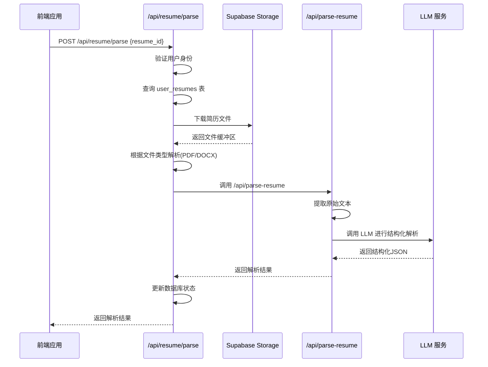
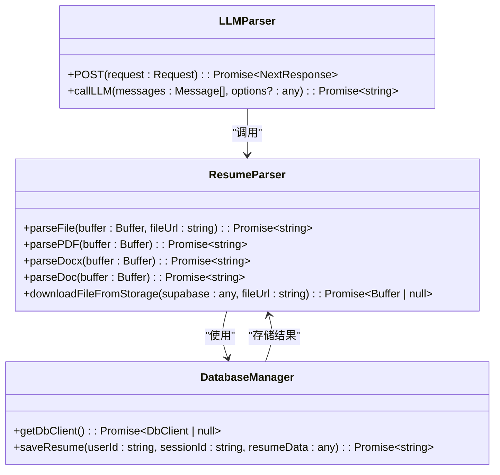
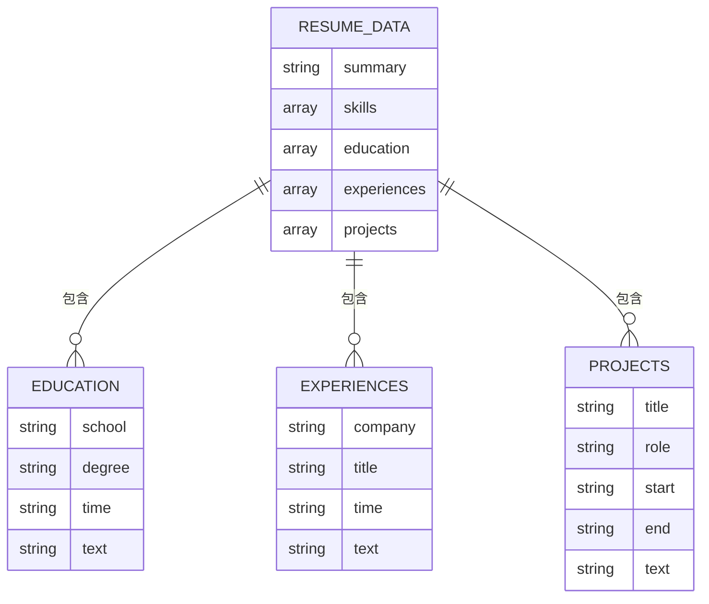

# 简历解析接口

<cite>
**本文档引用文件**  
- [app/api/resume/parse/route.ts](file://app/api/resume/parse/route.ts)
- [app/api/parse-resume/route.ts](file://app/api/parse-resume/route.ts)
- [lib/chains/parse_resume.ts](file://lib/chains/parse_resume.ts)
- [lib/llm.ts](file://lib/llm.ts)
- [lib/db.ts](file://lib/db.ts)
- [app/api/resume/upload/route.ts](file://app/api/resume/upload/route.ts)
- [mysql/schema.sql](file://mysql/schema.sql)
- [supabase/schema.sql](file://supabase/schema.sql)
- [package.json](file://package.json)
</cite>

## 目录
1. [简介](#简介)
2. [项目结构](#项目结构)
3. [核心组件](#核心组件)
4. [架构概述](#架构概述)
5. [详细组件分析](#详细组件分析)
6. [依赖分析](#依赖分析)
7. [性能考虑](#性能考虑)
8. [故障排除指南](#故障排除指南)
9. [结论](#结论)

## 简介
本项目是一个AI求职教练系统，提供简历解析功能。系统包含两个核心简历解析接口：`/api/resume/parse` 和 `/api/parse-resume`。前者是高阶封装接口，用于处理已上传的简历文件；后者是底层解析服务，直接处理文件上传并进行结构化信息抽取。系统支持PDF和DOCX格式的简历文件解析，使用pdf-parse和mammoth库提取文本内容，并通过LangChain链进行信息结构化。

## 项目结构

```mermaid
graph TD
A[前端界面] --> B[/api/resume/upload]
B --> C[Supabase Storage]
C --> D[/api/resume/parse]
D --> E[user_resumes 表]
E --> F[/api/parse-resume]
F --> G[LLM 结构化解析]
G --> H[parsed_data]
```

**图示来源**  
- [app/api/resume/upload/route.ts](file://app/api/resume/upload/route.ts)
- [app/api/resume/parse/route.ts](file://app/api/resume/parse/route.ts)
- [app/api/parse-resume/route.ts](file://app/api/parse-resume/route.ts)

**本节来源**  
- [app/api/resume/upload/route.ts](file://app/api/resume/upload/route.ts)
- [app/api/resume/parse/route.ts](file://app/api/resume/parse/route.ts)
- [app/api/parse-resume/route.ts](file://app/api/parse-resume/route.ts)

## 核心组件

系统包含两个主要的简历解析接口：`/api/resume/parse` 和 `/api/parse-resume`。前者作为高阶封装接口，处理数据库中的简历记录；后者作为底层解析服务，直接处理文件上传和文本提取。两个接口协同工作，实现完整的简历解析流程。

**本节来源**  
- [app/api/resume/parse/route.ts](file://app/api/resume/parse/route.ts#L99-L228)
- [app/api/parse-resume/route.ts](file://app/api/parse-resume/route.ts#L12-L196)

## 架构概述



**图示来源**  
- [app/api/resume/parse/route.ts](file://app/api/resume/parse/route.ts)
- [app/api/parse-resume/route.ts](file://app/api/parse-resume/route.ts)
- [lib/llm.ts](file://lib/llm.ts)

## 详细组件分析

### 接口调用关系分析

```mermaid
flowchart TD
A[/api/resume/parse] --> B{接收 resume_id}
B --> C[查询数据库]
C --> D[验证用户权限]
D --> E[从存储下载文件]
E --> F{判断文件类型}
F --> |PDF| G[pdf-parse 库]
F --> |DOCX| H[mammoth 库]
F --> |DOC| I[不支持]
G --> J[提取文本]
H --> J
J --> K[/api/parse-resume]
K --> L[LLM 结构化解析]
L --> M[返回JSON结构]
M --> N[更新数据库]
N --> O[返回结果]
```

**图示来源**  
- [app/api/resume/parse/route.ts](file://app/api/resume/parse/route.ts#L84-L96)
- [app/api/parse-resume/route.ts](file://app/api/parse-resume/route.ts#L49-L53)
- [lib/chains/parse_resume.ts](file://lib/chains/parse_resume.ts)

**本节来源**  
- [app/api/resume/parse/route.ts](file://app/api/resume/parse/route.ts#L81-L97)
- [app/api/parse-resume/route.ts](file://app/api/parse-resume/route.ts#L49-L53)

### 文件解析流程



**图示来源**  
- [app/api/resume/parse/route.ts](file://app/api/resume/parse/route.ts)
- [app/api/parse-resume/route.ts](file://app/api/parse-resume/route.ts)
- [lib/db.ts](file://lib/db.ts)

**本节来源**  
- [app/api/resume/parse/route.ts](file://app/api/resume/parse/route.ts#L48-L96)
- [app/api/parse-resume/route.ts](file://app/api/parse-resume/route.ts#L12-L196)
- [lib/db.ts](file://lib/db.ts)

### JSON返回格式定义



**图示来源**  
- [app/api/parse-resume/route.ts](file://app/api/parse-resume/route.ts#L80-L110)

**本节来源**  
- [app/api/parse-resume/route.ts](file://app/api/parse-resume/route.ts#L80-L110)

## 依赖分析

```mermaid
graph LR
A[pdf-parse] --> B[/api/parse-resume]
C[mammoth] --> B
D[Supabase] --> E[/api/resume/parse]
E --> F[LLM 服务]
F --> G[DeepSeek/OpenAI]
H[Next.js] --> E
H --> B
I[uuid] --> E
J[formidable] --> K[/api/resume/upload]
style A fill:#f9f,stroke:#333
style C fill:#f9f,stroke:#333
style G fill:#bbf,stroke:#333
```

**图示来源**  
- [package.json](file://package.json)
- [app/api/resume/parse/route.ts](file://app/api/resume/parse/route.ts)
- [app/api/parse-resume/route.ts](file://app/api/parse-resume/route.ts)

**本节来源**  
- [package.json](file://package.json#L18-L21)
- [app/api/resume/parse/route.ts](file://app/api/resume/parse/route.ts#L5-L6)
- [app/api/parse-resume/route.ts](file://app/api/parse-resume/route.ts#L3)

## 性能考虑

系统在简历解析过程中实现了异步处理机制和超时重试策略。底层LLM调用封装了超时和重试逻辑，确保在高负载情况下仍能稳定运行。对于大文件解析，系统采用流式处理方式，避免内存溢出。建议在生产环境中设置合理的超时阈值，并监控API调用频率。

**本节来源**  
- [lib/llm.ts](file://lib/llm.ts#L12-L73)

## 故障排除指南

当简历解析失败时，可能的原因包括：文件格式不支持、文本提取失败、LLM调用超时或解析结果不符合JSON格式。对于乱码或格式错乱问题，建议检查原始文件是否损坏。在生产环境中，建议配置OCR备用方案以处理扫描版PDF文件。调试时可检查日志中的错误信息，特别是"PDF 解析失败"、"LLM 调用失败"等关键错误。

**本节来源**  
- [app/api/resume/parse/route.ts](file://app/api/resume/parse/route.ts#L56-L69)
- [app/api/parse-resume/route.ts](file://app/api/parse-resume/route.ts#L55-L68)
- [lib/llm.ts](file://lib/llm.ts#L148-L159)

## 结论

本系统提供了完整的简历解析解决方案，通过两个层级的接口设计实现了高内聚低耦合的架构。高阶接口`/api/resume/parse`负责业务逻辑和数据持久化，底层接口`/api/parse-resume`专注于文本提取和结构化。系统支持主流简历格式，具备良好的扩展性和稳定性。建议在生产环境中增加OCR支持以处理扫描件，并优化LLM提示词以提高解析准确率。