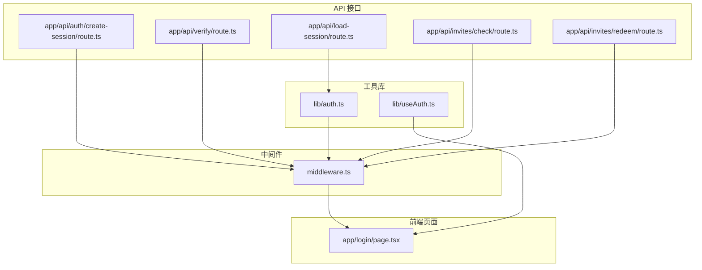
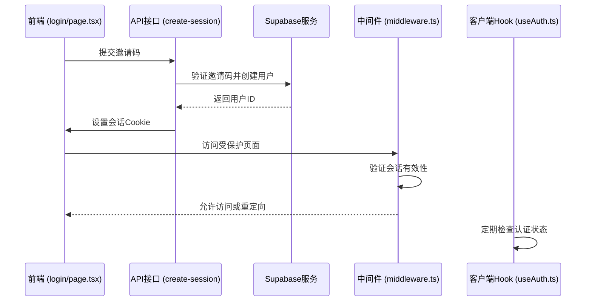
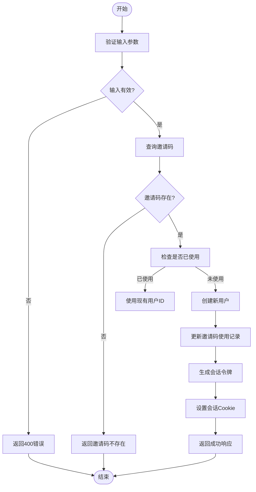
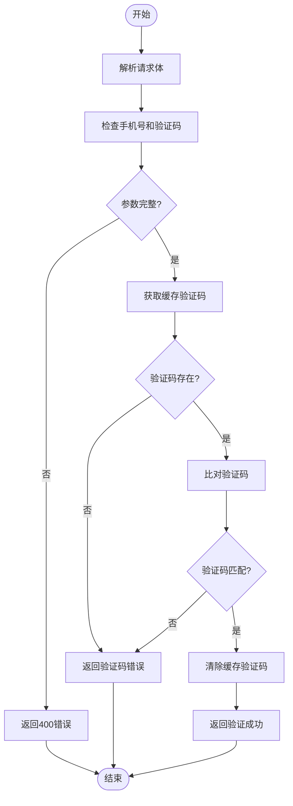
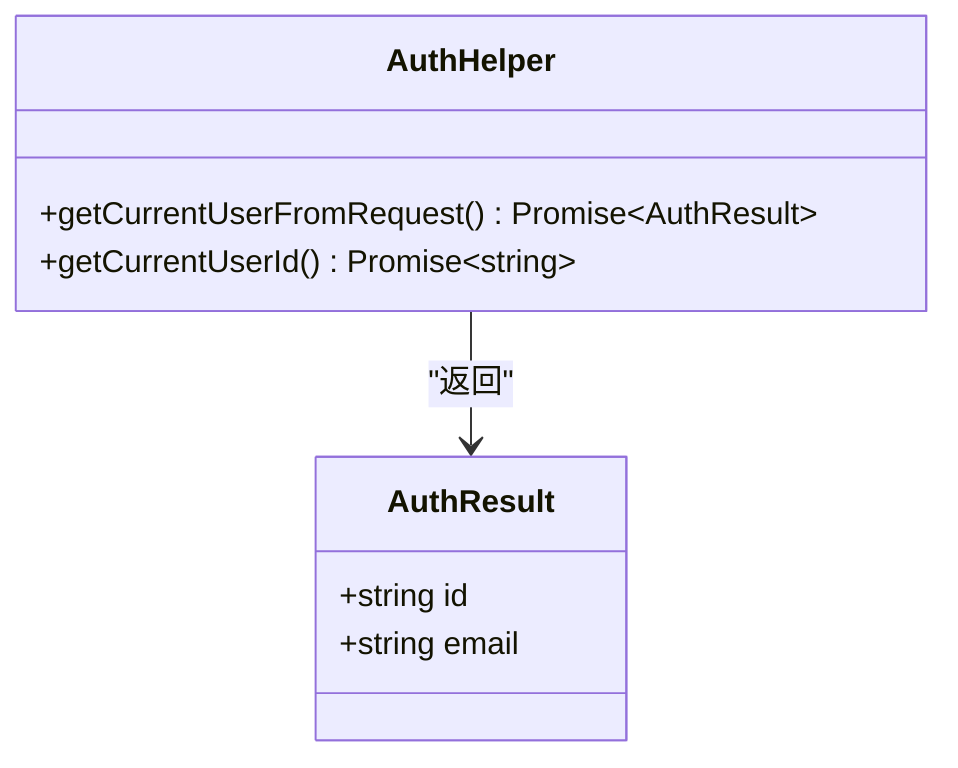
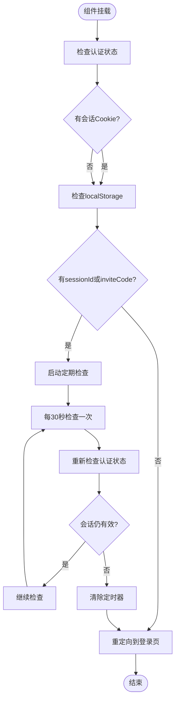
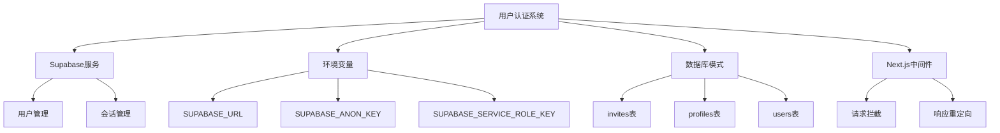

# 用户认证

<cite>
**本文档引用的文件**   
- [create-session/route.ts](file://app/api/auth/create-session/route.ts)
- [verify/route.ts](file://app/api/verify/route.ts)
- [auth.ts](file://lib/auth.ts)
- [useAuth.ts](file://lib/useAuth.ts)
- [middleware.ts](file://middleware.ts)
- [load-session/route.ts](file://app/api/load-session/route.ts)
- [login/page.tsx](file://app/login/page.tsx)
- [invites/check/route.ts](file://app/api/invites/check/route.ts)
- [invites/redeem/route.ts](file://app/api/invites/redeem/route.ts)
- [supabase/schema.sql](file://supabase/schema.sql)
</cite>

## 目录
1. [简介](#简介)
2. [项目结构](#项目结构)
3. [核心组件](#核心组件)
4. [架构概述](#架构概述)
5. [详细组件分析](#详细组件分析)
6. [依赖分析](#依赖分析)
7. [性能考虑](#性能考虑)
8. [故障排除指南](#故障排除指南)
9. [结论](#结论)

## 简介
本文档详细说明了AI求职教练项目的用户认证系统，重点涵盖会话创建和身份验证两个核心接口。系统采用基于邀请码的认证机制，通过Supabase作为后端身份验证服务，实现了安全的用户会话管理和身份验证流程。认证系统包含服务器端API接口、中间件拦截、客户端React Hook等多个组件，共同构建了一个完整的认证解决方案。

## 项目结构
用户认证相关文件分布在项目的多个目录中，形成了清晰的分层架构。核心认证逻辑位于`app/api/auth/`目录下，而辅助函数和客户端Hook则存放在`lib/`目录中。

**图示来源**
- [create-session/route.ts](file://app/api/auth/create-session/route.ts)
- [verify/route.ts](file://app/api/verify/route.ts)
- [auth.ts](file://lib/auth.ts)
- [useAuth.ts](file://lib/useAuth.ts)
- [middleware.ts](file://middleware.ts)
- [login/page.tsx](file://app/login/page.tsx)

## 核心组件
本系统的核心组件包括会话创建接口、身份验证接口、认证辅助函数和客户端Hook。会话创建接口负责处理邀请码验证并创建用户会话，身份验证接口用于验证用户凭证。`lib/auth.ts`提供了服务器端认证辅助函数，而`lib/useAuth.ts`则为前端组件提供了React Hook来管理认证状态。

**本节来源**
- [create-session/route.ts](file://app/api/auth/create-session/route.ts#L22-L219)
- [verify/route.ts](file://app/api/verify/route.ts#L6-L39)
- [auth.ts](file://lib/auth.ts#L9-L40)
- [useAuth.ts](file://lib/useAuth.ts#L10-L59)

## 架构概述
系统采用分层架构设计，从前端登录页面到后端API接口，再到Supabase身份验证服务，形成了完整的认证流程。中间件在请求到达具体页面前进行拦截，确保只有经过认证的用户才能访问受保护的资源。

**图示来源**
- [create-session/route.ts](file://app/api/auth/create-session/route.ts)
- [middleware.ts](file://middleware.ts)
- [useAuth.ts](file://lib/useAuth.ts)
- [login/page.tsx](file://app/login/page.tsx)

## 详细组件分析

### 会话创建接口分析
`/api/auth/create-session`接口是用户认证流程的核心，负责处理邀请码验证并创建用户会话。该接口首先验证请求体中的邀请码，然后通过Supabase Admin API检查或创建用户，最后生成会话令牌并设置Cookie。

**图示来源**
- [create-session/route.ts](file://app/api/auth/create-session/route.ts#L22-L219)
- [invites/redeem/route.ts](file://app/api/invites/redeem/route.ts#L22-L317)

**本节来源**
- [create-session/route.ts](file://app/api/auth/create-session/route.ts#L22-L219)

### 身份验证接口分析
`/api/verify`接口用于验证用户提交的验证码，是短信验证流程的一部分。该接口检查请求中的手机号和验证码，与缓存中的验证码进行比对，验证通过后清除缓存中的验证码。

**图示来源**
- [verify/route.ts](file://app/api/verify/route.ts#L6-L39)
- [sms/utils.ts](file://app/api/sms/utils.ts)

**本节来源**
- [verify/route.ts](file://app/api/verify/route.ts#L6-L39)

### 认证辅助函数分析
`lib/auth.ts`文件提供了服务器端认证辅助函数，主要用于在API路由中获取当前用户信息。这些函数封装了与Supabase的交互逻辑，简化了认证相关的代码实现。

**图示来源**
- [auth.ts](file://lib/auth.ts#L4-L40)

**本节来源**
- [auth.ts](file://lib/auth.ts#L4-L40)

### 客户端认证Hook分析
`lib/useAuth.ts`文件实现了客户端认证检查Hook，作为中间件的补充，确保前端组件也能正确处理认证状态。该Hook在组件挂载时检查会话状态，并定期验证会话有效性。

**图示来源**
- [useAuth.ts](file://lib/useAuth.ts#L10-L59)

**本节来源**
- [useAuth.ts](file://lib/useAuth.ts#L10-L59)

## 依赖分析
认证系统依赖于多个外部服务和内部组件，形成了复杂的依赖关系网络。主要依赖包括Supabase身份验证服务、环境变量配置和数据库模式。

**图示来源**
- [middleware.ts](file://middleware.ts)
- [supabase/schema.sql]
- [.env.example](file://.env.example)

**本节来源**
- [middleware.ts](file://middleware.ts#L1-L170)
- [supabase/schema.sql]
- [.env.example](file://.env.example)

## 性能考虑
认证系统的性能主要受网络延迟、数据库查询效率和加密操作的影响。系统通过合理的缓存策略和异步处理来优化性能，确保用户能够快速完成认证流程。

- 会话有效期设置为7天，平衡了用户体验和安全性
- 使用Base64编码而非复杂加密算法生成会话令牌，减少计算开销
- 中间件中实现了多层验证机制，避免不必要的数据库查询
- 客户端Hook使用30秒间隔的定期检查，避免过于频繁的验证请求

## 故障排除指南
当认证系统出现问题时，可以按照以下步骤进行排查：

**本节来源**
- [create-session/route.ts](file://app/api/auth/create-session/route.ts#L210-L217)
- [verify/route.ts](file://app/api/verify/route.ts#L32-L36)
- [middleware.ts](file://middleware.ts#L110-L111)
- [auth.ts](file://lib/auth.ts#L30-L33)

## 结论
AI求职教练项目的用户认证系统设计合理，通过邀请码机制实现了安全的用户访问控制。系统充分利用了Supabase的身份验证功能，结合自定义的中间件和客户端Hook，构建了一个完整、安全的认证解决方案。建议未来可以考虑增加更多的安全措施，如双因素认证和更复杂的会话管理策略，以进一步提升系统的安全性。