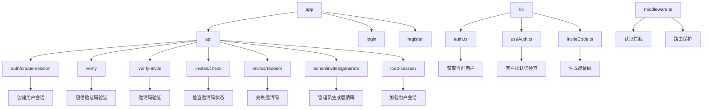
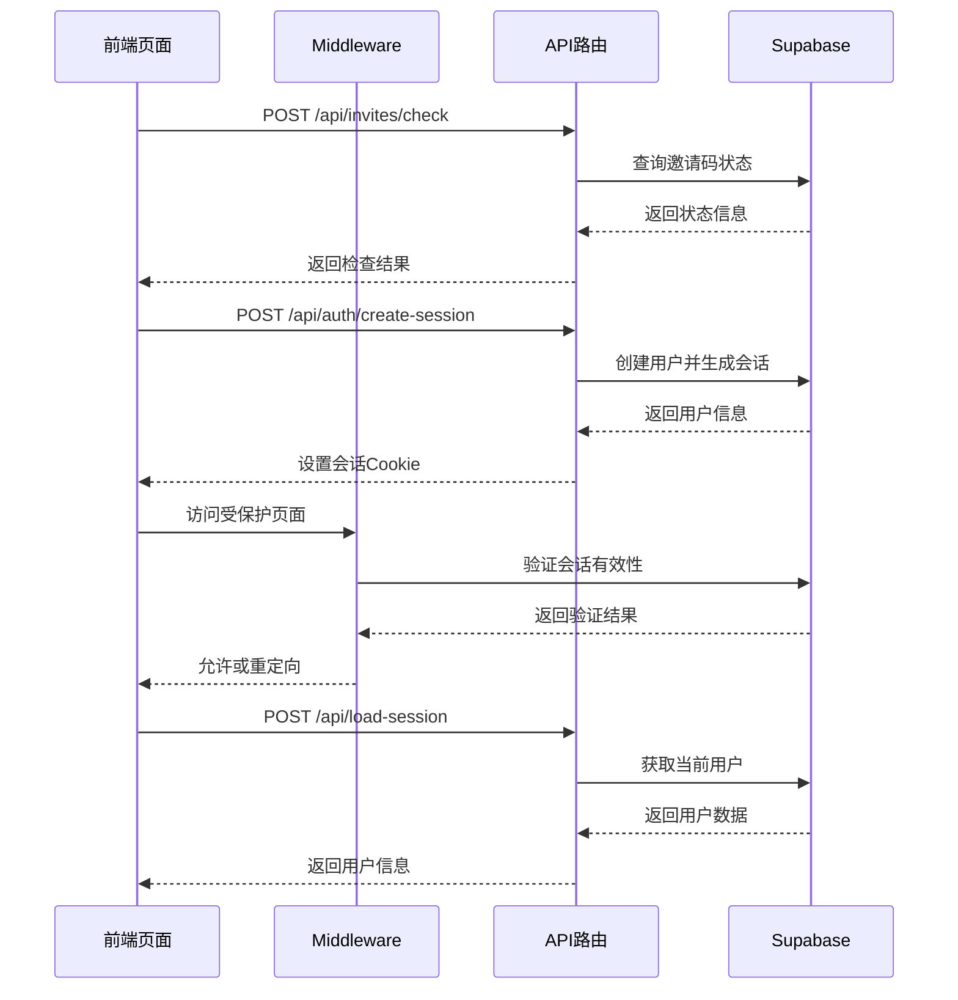
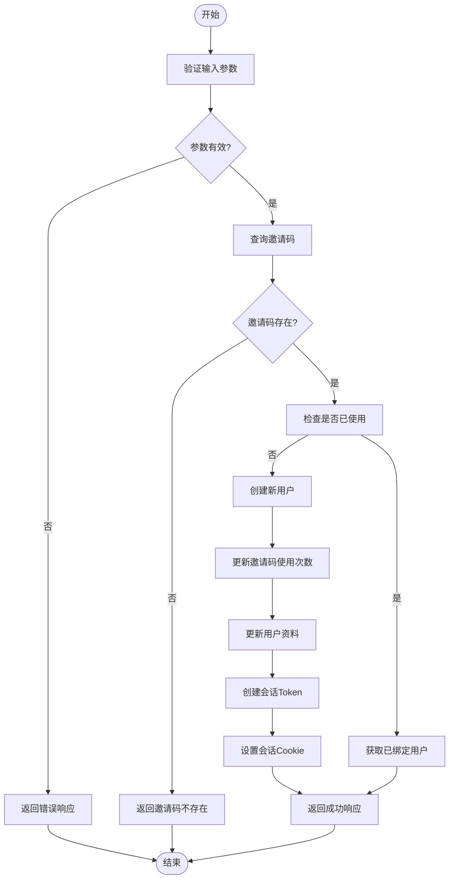
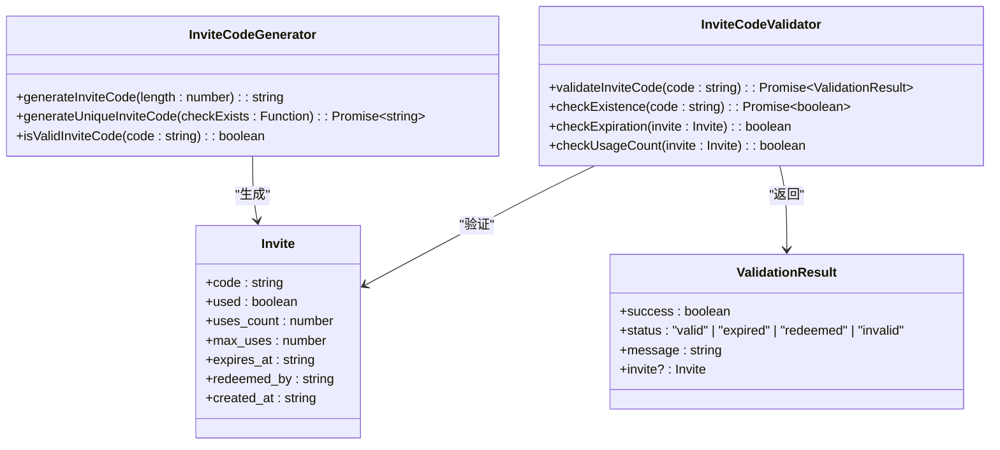
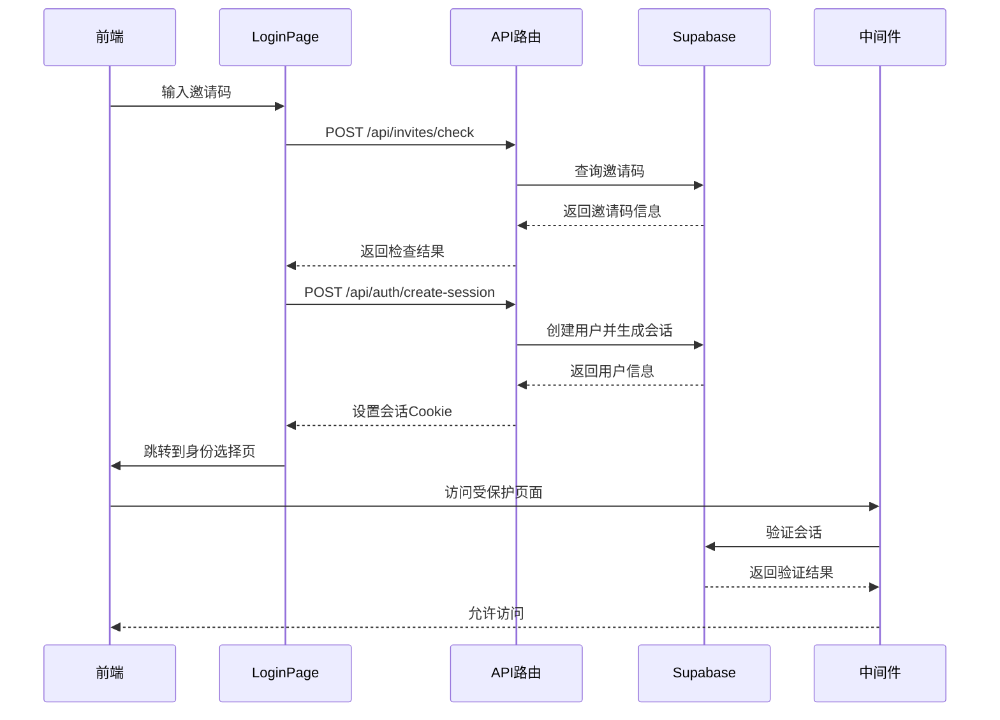
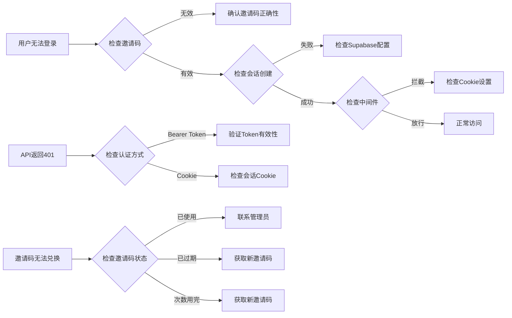

# 认证与会话API

<cite>
**本文档引用的文件**  
- [app/api/auth/create-session/route.ts](file://app/api/auth/create-session/route.ts)
- [app/api/verify/route.ts](file://app/api/verify/route.ts)
- [app/api/verify-invite/route.ts](file://app/api/verify-invite/route.ts)
- [app/api/invites/check/route.ts](file://app/api/invites/check/route.ts)
- [app/api/invites/redeem/route.ts](file://app/api/invites/redeem/route.ts)
- [app/api/admin/invites/generate/route.ts](file://app/api/admin/invites/generate/route.ts)
- [lib/auth.ts](file://lib/auth.ts)
- [lib/useAuth.ts](file://lib/useAuth.ts)
- [app/api/load-session/route.ts](file://app/api/load-session/route.ts)
- [middleware.ts](file://middleware.ts)
- [app/login/page.tsx](file://app/login/page.tsx)
- [lib/inviteCode.ts](file://lib/inviteCode.ts)
</cite>

## 目录
1. [简介](#简介)
2. [项目结构](#项目结构)
3. [核心组件](#核心组件)
4. [架构概述](#架构概述)
5. [详细组件分析](#详细组件分析)
6. [依赖分析](#依赖分析)
7. [性能考虑](#性能考虑)
8. [故障排除指南](#故障排除指南)
9. [结论](#结论)

## 简介
本项目是一个AI求职教练系统，其认证系统基于Supabase Auth构建，采用邀请码机制进行用户访问控制。系统通过JWT令牌和Bearer Token实现安全的身份验证，包含完整的用户会话管理、邀请码验证和权限分级机制。前端通过Next.js App Router实现服务端渲染和中间件拦截，确保未授权用户无法访问受保护的页面。

## 项目结构



**图示来源**
- [app/api/auth/create-session/route.ts](file://app/api/auth/create-session/route.ts)
- [app/api/verify/route.ts](file://app/api/verify/route.ts)
- [app/api/verify-invite/route.ts](file://app/api/verify-invite/route.ts)
- [app/api/invites/check/route.ts](file://app/api/invites/check/route.ts)
- [app/api/invites/redeem/route.ts](file://app/api/invites/redeem/route.ts)
- [app/api/admin/invites/generate/route.ts](file://app/api/admin/invites/generate/route.ts)
- [lib/auth.ts](file://lib/auth.ts)
- [lib/useAuth.ts](file://lib/useAuth.ts)
- [lib/inviteCode.ts](file://lib/inviteCode.ts)
- [middleware.ts](file://middleware.ts)

**章节来源**
- [app/api](file://app/api)
- [lib](file://lib)
- [middleware.ts](file://middleware.ts)

## 核心组件

认证系统的核心组件包括用户会话创建、身份验证、邀请码验证、邀请码状态检查、邀请码兑换和管理员生成邀请码等接口。系统使用Supabase作为后端即服务(BaaS)，通过Service Role Key进行管理操作，Anon Key进行公开访问。JWT令牌用于会话管理，Bearer Token用于API认证。

**章节来源**
- [app/api/auth/create-session/route.ts](file://app/api/auth/create-session/route.ts#L1-L219)
- [app/api/verify/route.ts](file://app/api/verify/route.ts#L1-L39)
- [app/api/verify-invite/route.ts](file://app/api/verify-invite/route.ts#L1-L149)

## 架构概述



**图示来源**
- [middleware.ts](file://middleware.ts#L1-L170)
- [app/api/auth/create-session/route.ts](file://app/api/auth/create-session/route.ts#L1-L219)
- [app/api/invites/check/route.ts](file://app/api/invites/check/route.ts#L1-L306)
- [app/api/load-session/route.ts](file://app/api/load-session/route.ts#L1-L30)

## 详细组件分析

### 用户会话创建分析



**图示来源**
- [app/api/auth/create-session/route.ts](file://app/api/auth/create-session/route.ts#L1-L219)

**章节来源**
- [app/api/auth/create-session/route.ts](file://app/api/auth/create-session/route.ts#L1-L219)

### 邀请码验证分析



**图示来源**
- [app/api/invites/check/route.ts](file://app/api/invites/check/route.ts#L1-L306)
- [lib/inviteCode.ts](file://lib/inviteCode.ts#L1-L84)

**章节来源**
- [app/api/invites/check/route.ts](file://app/api/invites/check/route.ts#L1-L306)
- [lib/inviteCode.ts](file://lib/inviteCode.ts#L1-L84)

### 身份验证流程分析



**图示来源**
- [app/login/page.tsx](file://app/login/page.tsx#L1-L388)
- [app/api/auth/create-session/route.ts](file://app/api/auth/create-session/route.ts#L1-L219)
- [middleware.ts](file://middleware.ts#L1-L170)

**章节来源**
- [app/login/page.tsx](file://app/login/page.tsx#L1-L388)

## 依赖分析

```mermaid
graph TD
A[app/api/auth/create-session/route.ts] --> B[@supabase/supabase-js]
A --> C[NextResponse]
D[app/api/verify/route.ts] --> E[@supabase/supabase-js]
D --> F[NextResponse]
G[app/api/verify-invite/route.ts] --> H[@supabase/supabase-js]
G --> I[NextResponse]
J[app/api/invites/check/route.ts] --> K[@supabase/supabase-js]
J --> L[NextResponse]
M[app/api/invites/redeem/route.ts] --> N[@supabase/supabase-js]
M --> O[NextResponse]
P[app/api/admin/invites/generate/route.ts] --> Q[@supabase/supabase-js]
P --> R[NextResponse]
P --> S[lib/inviteCode]
T[lib/auth.ts] --> U[@supabase/auth-helpers-nextjs]
T --> V[next/headers]
W[lib/useAuth.ts] --> X[react]
W --> Y[next/navigation]
Z[middleware.ts] --> AA[@supabase/supabase-js]
Z --> AB[NextRequest]
Z --> AC[NextResponse]
```

**图示来源**
- [package.json](file://package.json)
- [app/api](file://app/api)
- [lib](file://lib)

**章节来源**
- [package.json](file://package.json#L1-L100)

## 性能考虑
系统在设计时考虑了性能优化，包括使用Supabase的Anon Key进行公开查询，Service Role Key进行管理操作，避免了不必要的权限提升。邀请码验证接口支持GET和POST两种方式，提高了灵活性。系统使用内存缓存存储短信验证码，减少了数据库查询次数。中间件对静态资源和API路由进行放行，避免了不必要的认证检查。

## 故障排除指南



**章节来源**
- [app/api/auth/create-session/route.ts](file://app/api/auth/create-session/route.ts#L210-L216)
- [app/api/invites/redeem/route.ts](file://app/api/invites/redeem/route.ts#L308-L314)
- [middleware.ts](file://middleware.ts#L142-L149)

## 结论
本认证系统通过Supabase Auth实现了安全可靠的用户管理，采用邀请码机制控制用户访问，确保了系统的安全性。系统架构清晰，组件职责分明，通过中间件实现了路由保护，通过JWT令牌和Bearer Token实现了安全的身份验证。邀请码系统支持有效期、使用次数限制和权限分级，满足了不同场景的需求。整体设计考虑了性能优化和错误处理，为用户提供流畅的使用体验。