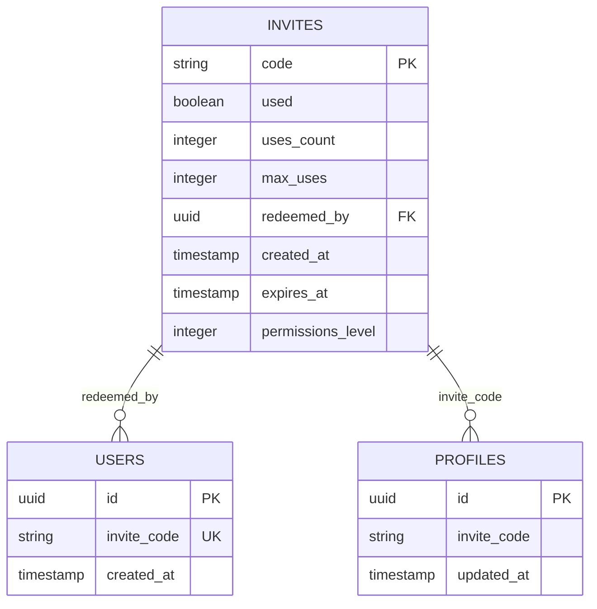
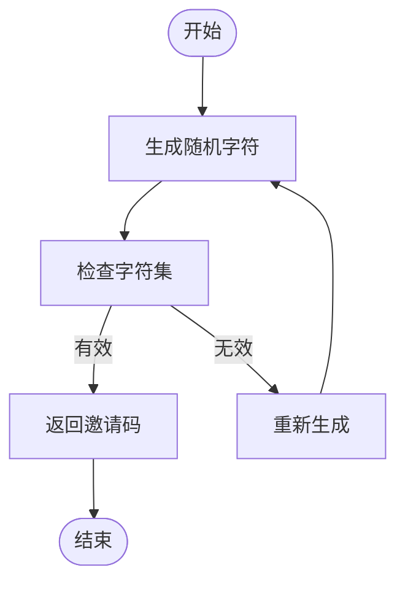
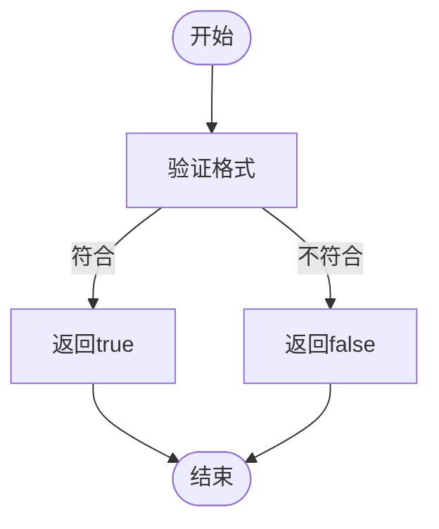
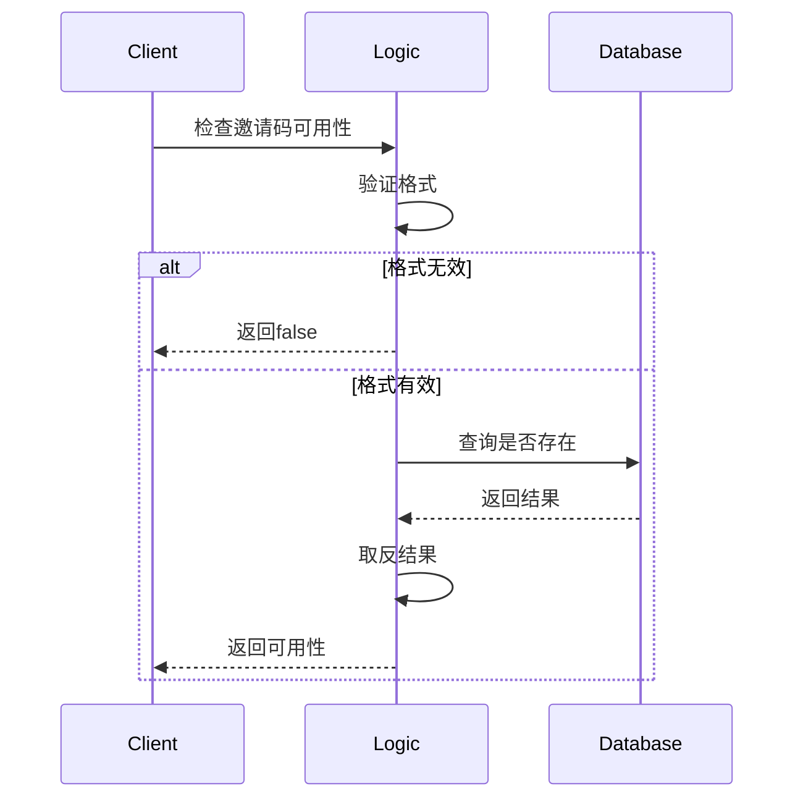
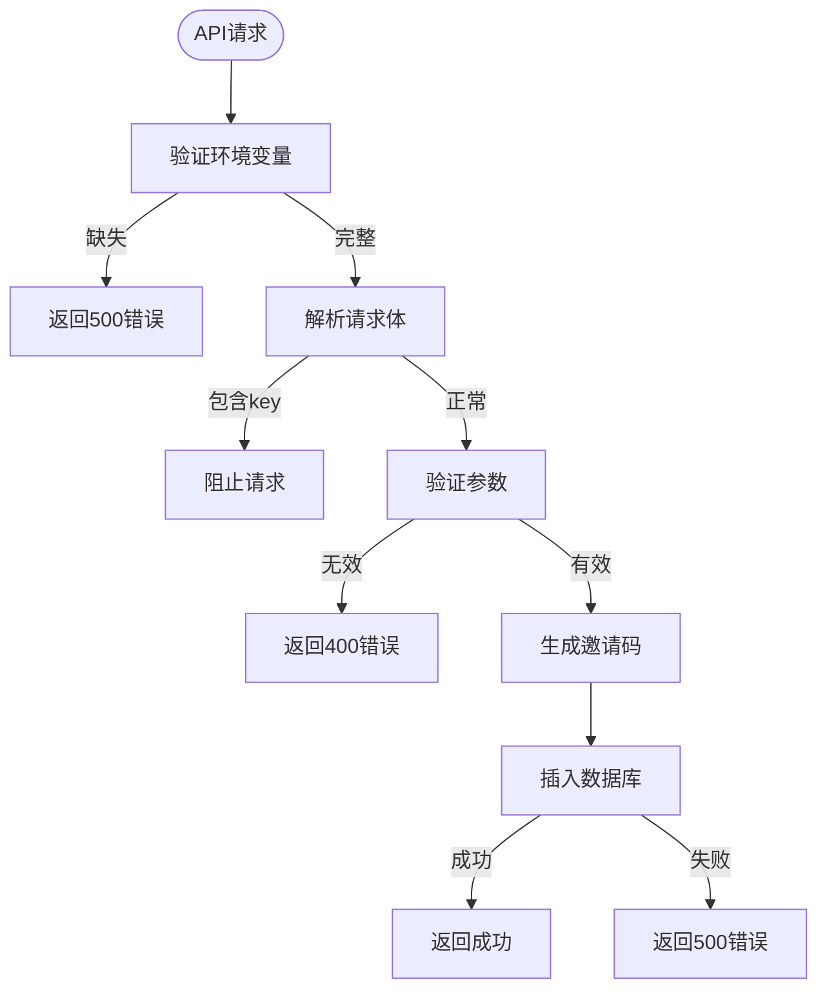
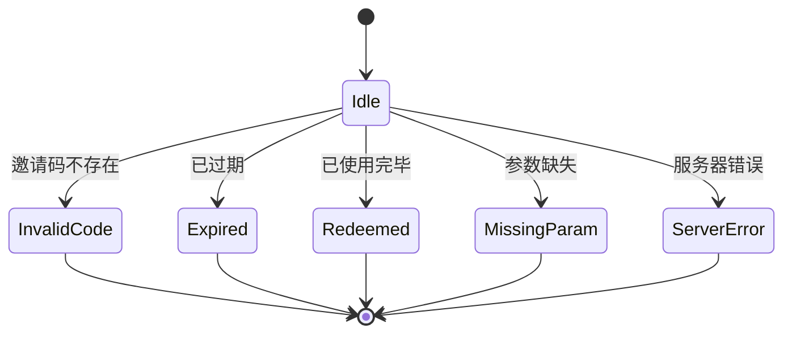
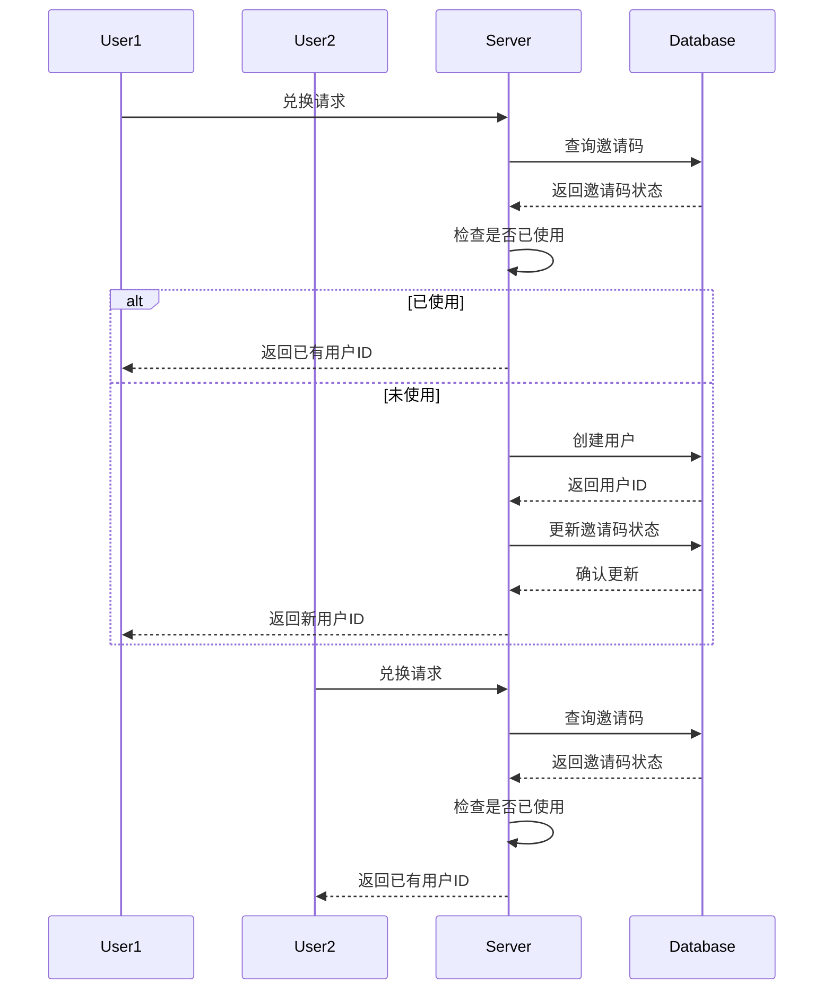
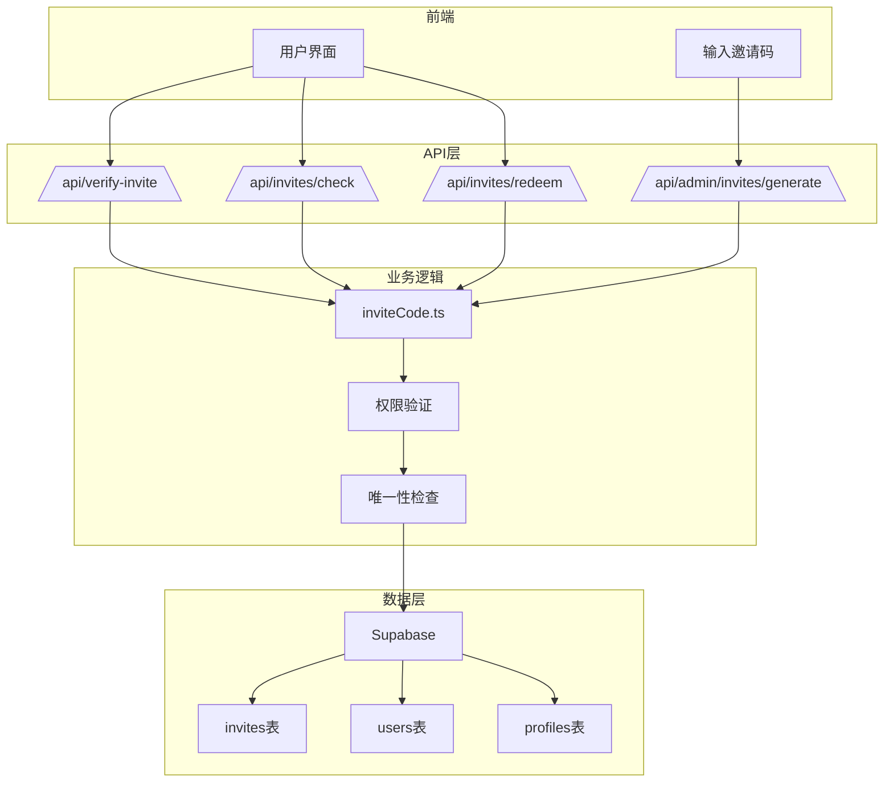

# 邀请码管理

<cite>
**本文档引用的文件**   
- [verify-invite/route.ts](file://app/api/verify-invite/route.ts)
- [invites/check/route.ts](file://app/api/invites/check/route.ts)
- [invites/redeem/route.ts](file://app/api/invites/redeem/route.ts)
- [admin/invites/generate/route.ts](file://app/api/admin/invites/generate/route.ts)
- [inviteCode.ts](file://lib/inviteCode.ts)
- [supabase/schema.sql](file://supabase/schema.sql)
- [database-init.sql](file://database-init.sql)
</cite>

## 目录
1. [简介](#简介)
2. [邀请码数据结构设计](#邀请码数据结构设计)
3. [核心接口全生命周期操作](#核心接口全生命周期操作)
4. [业务逻辑函数详解](#业务逻辑函数详解)
5. [管理员生成安全策略](#管理员生成安全策略)
6. [常见错误场景与处理](#常见错误场景与处理)
7. [并发控制与幂等性实现](#并发控制与幂等性实现)
8. [系统架构与数据流](#系统架构与数据流)

## 简介

邀请码管理系统是AI求职教练平台的核心用户增长机制，负责管理邀请码的验证、状态查询、兑换和管理员生成等全生命周期操作。系统基于Supabase作为后端数据库，通过Next.js API路由实现RESTful接口，确保邀请码的安全性、唯一性和可追溯性。

本系统支持多种邀请码类型，包括单次使用、多次使用和永久有效等模式，满足不同业务场景需求。通过严格的权限控制和审计机制，确保只有授权管理员才能生成邀请码，同时所有操作都有完整的日志记录。

**Section sources**
- [verify-invite/route.ts](file://app/api/verify-invite/route.ts#L1-L149)
- [invites/check/route.ts](file://app/api/invites/check/route.ts#L1-L306)

## 邀请码数据结构设计

邀请码系统的核心数据结构存储在Supabase数据库的`invites`表中，包含以下关键字段：

| 字段名 | 类型 | 必填 | 描述 |
|--------|------|------|------|
| code | TEXT | 是 | 邀请码字符串，唯一标识符 |
| used | BOOLEAN | 是 | 是否已被使用 |
| uses_count | INTEGER | 否 | 当前使用次数 |
| max_uses | INTEGER | 否 | 最大使用次数（null表示无限制） |
| redeemed_by | UUID | 否 | 兑换该邀请码的用户ID |
| created_at | TIMESTAMPTZ | 是 | 创建时间 |
| expires_at | TIMESTAMPTZ | 否 | 过期时间 |
| permissions_level | INTEGER | 否 | 权限等级（1-5级） |

此外，用户表`users`中包含`invite_code`字段，用于记录用户注册时使用的邀请码，建立用户与邀请码的关联关系。



**Diagram sources**
- [supabase/schema.sql](file://supabase/schema.sql#L1-L84)
- [database-init.sql](file://database-init.sql#L1-L45)

**Section sources**
- [supabase/schema.sql](file://supabase/schema.sql#L1-L84)
- [database-init.sql](file://database-init.sql#L1-L45)

## 核心接口全生命周期操作

### 验证接口 (/api/verify-invite)

验证接口用于检查邀请码的基本有效性，主要验证存在性和过期时间，不限制使用次数。该接口允许匿名访问，适用于前端实时验证场景。

**请求方式**: POST  
**请求体**: `{ "code": "ABC12345" }`  
**成功响应**: 
```json
{
  "success": true,
  "status": "valid",
  "message": "邀请码有效",
  "invite": { ... }
}
```

**失败响应**:
```json
{
  "success": false,
  "status": "invalid" | "expired",
  "message": "错误信息"
}
```

### 状态查询接口 (/api/invites/check)

状态查询接口提供详细的邀请码状态信息，支持GET和POST两种方式。该接口返回邀请码的完整状态，包括剩余使用次数等详细信息。

**请求方式**: GET/POST  
**查询参数**: `?code=ABC12345`  
**请求体**: `{ "code": "ABC12345" }`  
**成功响应**:
```json
{
  "ok": true,
  "status": "valid" | "remaining" | "expired" | "redeemed" | "invalid",
  "code": "ABC12345",
  "message": "状态描述",
  "data": {
    "created_at": "...",
    "expires_at": "...",
    "used": false,
    "uses_count": 0,
    "max_uses": 1
  }
}
```

### 兑换接口 (/api/invites/redeem)

兑换接口是邀请码系统的核心，负责将有效的邀请码转换为用户账户。该接口具有严格的幂等性保证和并发控制机制。

**请求方式**: POST  
**请求体**: `{ "code": "AIJC-AAAAAA" }`  
**成功响应**:
```json
{
  "ok": true,
  "userId": "uuid"
}
```

### 管理员生成接口 (/api/admin/invites/generate)

管理员专用接口，用于批量生成邀请码。需要管理员权限才能访问，确保邀请码生成的安全性。

**请求方式**: POST  
**请求体**: `{ "count": 10, "max_uses": 1 }`  
**成功响应**:
```json
{
  "ok": true,
  "codes": ["ABC12345", "XYZ67890", ...],
  "count": 10
}
```

**Section sources**
- [verify-invite/route.ts](file://app/api/verify-invite/route.ts#L1-L149)
- [invites/check/route.ts](file://app/api/invites/check/route.ts#L1-L306)
- [invites/redeem/route.ts](file://app/api/invites/redeem/route.ts#L1-L317)
- [admin/invites/generate/route.ts](file://app/api/admin/invites/generate/route.ts#L1-L232)

## 业务逻辑函数详解

### 生成唯一邀请码

`generateInviteCode`函数负责生成符合规范的邀请码，采用6-8位大写字母和数字组合，排除容易混淆的字符（0, O, I, 1）。



**Diagram sources**
- [inviteCode.ts](file://lib/inviteCode.ts#L12-L22)

### 校验有效性

`isValidInviteCode`函数验证邀请码格式，确保其符合6-20位大写字母和数字的要求。



**Diagram sources**
- [inviteCode.ts](file://lib/inviteCode.ts#L29-L32)

### 检查可用性

`isInviteCodeAvailable`函数结合格式验证和数据库查询，确保邀请码既符合格式要求又未被使用。



**Diagram sources**
- [inviteCode.ts](file://lib/inviteCode.ts#L40-L50)

**Section sources**
- [inviteCode.ts](file://lib/inviteCode.ts#L1-L84)

## 管理员生成安全策略

### 权限验证

管理员生成接口采用Service Role Key进行身份验证，确保只有服务器端代码才能调用。该密钥具有完整的数据库权限，但不会暴露给前端。



**Diagram sources**
- [admin/invites/generate/route.ts](file://app/api/admin/invites/generate/route.ts#L1-L232)

### 审计日志

所有邀请码生成操作都会记录在数据库中，包括生成时间、数量和操作者信息。虽然当前实现中未直接记录操作者，但可以通过API调用日志追溯。

- 生成时间：`created_at`字段自动记录
- 生成数量：通过`count`参数控制，最大100个
- 唯一性保证：生成前查询现有邀请码，避免重复
- 失败重试：最多100次重试，防止无限循环

**Section sources**
- [admin/invites/generate/route.ts](file://app/api/admin/invites/generate/route.ts#L1-L232)

## 常见错误场景与处理

### 邀请码不存在

**HTTP状态码**: 400  
**错误消息**: "邀请码不存在"  
**触发条件**: 数据库中没有匹配的邀请码记录

### 已过期

**HTTP状态码**: 400  
**错误消息**: "邀请码已过期"  
**触发条件**: 当前时间超过`expires_at`字段指定的时间

### 已使用完毕

**HTTP状态码**: 400  
**错误消息**: "邀请码使用次数已用完"  
**触发条件**: `uses_count`达到`max_uses`限制

### 参数缺失

**HTTP状态码**: 400  
**错误消息**: "缺少 code 字段" 或 "count 必须是 1-100 之间的数字"  
**触发条件**: 请求体缺少必需参数或参数格式错误

### 服务器错误

**HTTP状态码**: 500  
**错误消息**: "服务器内部错误" 或具体错误描述  
**触发条件**: 数据库连接失败、环境变量未配置等服务器端问题



**Diagram sources**
- [verify-invite/route.ts](file://app/api/verify-invite/route.ts#L1-L149)
- [invites/check/route.ts](file://app/api/invites/check/route.ts#L1-L306)
- [invites/redeem/route.ts](file://app/api/invites/redeem/route.ts#L1-L317)

**Section sources**
- [verify-invite/route.ts](file://app/api/verify-invite/route.ts#L1-L149)
- [invites/check/route.ts](file://app/api/invites/check/route.ts#L1-L306)
- [invites/redeem/route.ts](file://app/api/invites/redeem/route.ts#L1-L317)

## 并发控制与幂等性实现

### 幂等性处理

兑换接口设计为幂等操作，即同一邀请码的多次兑换请求会产生相同的结果。当邀请码已被使用时，直接返回已绑定的用户ID，而不是报错。



**Diagram sources**
- [invites/redeem/route.ts](file://app/api/invites/redeem/route.ts#L1-L317)

### 并发控制

系统通过数据库的条件更新（Conditional Update）机制防止并发问题。在更新邀请码状态时，添加`used = false`条件，确保只有未使用的邀请码才能被更新。

- **原子性操作**: 使用Supabase的`update().eq("used", false)`实现原子性更新
- **回滚机制**: 如果更新失败，尝试删除刚创建的用户，保持数据一致性
- **错误提示**: 当并发冲突发生时，返回"邀请码已被其他用户使用，请重试"的友好提示

**Section sources**
- [invites/redeem/route.ts](file://app/api/invites/redeem/route.ts#L1-L317)

## 系统架构与数据流

### 整体架构



**Diagram sources**
- [supabase/schema.sql](file://supabase/schema.sql#L1-L84)
- [app/api](file://app/api)

### 数据流分析

1. **验证流程**: 用户输入 → 验证接口 → 格式检查 → 数据库查询 → 返回结果
2. **兑换流程**: 用户提交 → 兑换接口 → 完整验证 → 创建用户 → 更新状态 → 返回用户ID
3. **生成流程**: 管理员请求 → 生成接口 → 参数验证 → 批量生成 → 数据库插入 → 返回邀请码列表

**Section sources**
- [supabase/schema.sql](file://supabase/schema.sql#L1-L84)
- [app/api](file://app/api)