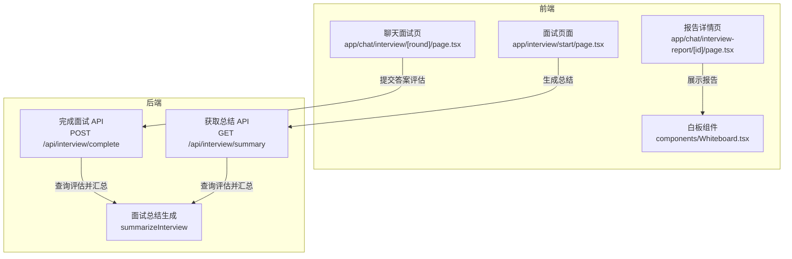
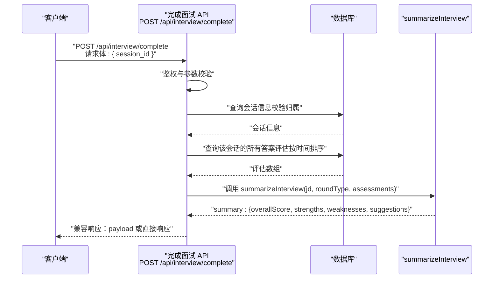
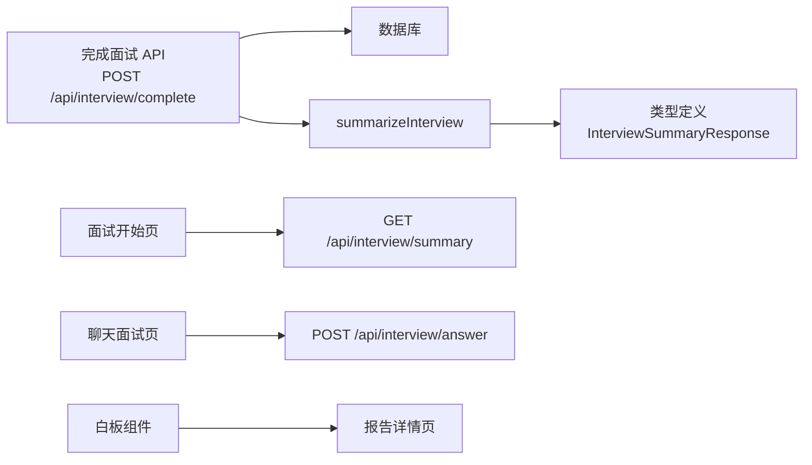

# 完成面试

<cite>
**本文引用的文件**
- [app/api/interview/complete/route.ts](file://app/api/interview/complete/route.ts)
- [lib/interview/llm.ts](file://lib/interview/llm.ts)
- [lib/interview/types.ts](file://lib/interview/types.ts)
- [app/api/interview/summary/route.ts](file://app/api/interview/summary/route.ts)
- [app/chat/interview/[round]/page.tsx](file://app/chat/interview/[round]/page.tsx)
- [app/interview/start/page.tsx](file://app/interview/start/page.tsx)
- [app/chat/interview-report/[id]/page.tsx](file://app/chat/interview-report/[id]/page.tsx)
- [components/Whiteboard.tsx](file://components/Whiteboard.tsx)
- [INTERVIEW_FRONTEND_CODE_COLLECTION.md](file://INTERVIEW_FRONTEND_CODE_COLLECTION.md)
- [mysql/schema.sql](file://mysql/schema.sql)
</cite>

## 目录
1. [简介](#简介)
2. [项目结构](#项目结构)
3. [核心组件](#核心组件)
4. [架构概览](#架构概览)
5. [详细组件分析](#详细组件分析)
6. [依赖关系分析](#依赖关系分析)
7. [性能考量](#性能考量)
8. [故障排查指南](#故障排查指南)
9. [结论](#结论)
10. [附录](#附录)

## 简介
本文件面向“完成面试”API（POST /api/interview/complete）的全面文档，聚焦以下目标：
- 明确请求仅需 session_id 参数
- 描述核心流程：查询会话内所有答案的评估结果，调用 summarizeInterview 生成综合总结
- 详细定义响应格式：包含 session_id、summary 对象（overallScore、strengths、weaknesses、suggestions）
- 解释兼容性设计：同时支持直接响应和 payload 包装格式以适配前端需求
- 结合代码说明如何触发面试报告生成
- 覆盖错误场景：会话不存在（404）、无答案记录（400）等
- 提供最佳实践：建议在面试结束后调用此接口获取最终反馈

## 项目结构
与“完成面试”API相关的后端与前端组件分布如下：
- 后端 API：app/api/interview/complete/route.ts
- LLM 总结生成：lib/interview/llm.ts（summarizeInterview）
- 类型定义：lib/interview/types.ts
- 前端触发与展示：
  - app/chat/interview/[round]/page.tsx（提交答案并触发评估）
  - app/interview/start/page.tsx（生成总结并写入白板）
  - app/chat/interview-report/[id]/page.tsx（报告详情页）
  - components/Whiteboard.tsx（白板展示与点击跳转）

图表来源
- [app/api/interview/complete/route.ts](file://app/api/interview/complete/route.ts#L1-L200)
- [app/api/interview/summary/route.ts](file://app/api/interview/summary/route.ts#L59-L141)
- [lib/interview/llm.ts](file://lib/interview/llm.ts#L684-L847)
- [app/interview/start/page.tsx](file://app/interview/start/page.tsx#L258-L348)
- [app/chat/interview/[round]/page.tsx](file://app/chat/interview/[round]/page.tsx#L106-L160)
- [app/chat/interview-report/[id]/page.tsx](file://app/chat/interview-report/[id]/page.tsx#L1-L88)
- [components/Whiteboard.tsx](file://components/Whiteboard.tsx#L415-L438)

章节来源
- [app/api/interview/complete/route.ts](file://app/api/interview/complete/route.ts#L1-L200)
- [lib/interview/llm.ts](file://lib/interview/llm.ts#L684-L847)
- [lib/interview/types.ts](file://lib/interview/types.ts#L58-L116)
- [app/interview/start/page.tsx](file://app/interview/start/page.tsx#L258-L348)
- [app/chat/interview/[round]/page.tsx](file://app/chat/interview/[round]/page.tsx#L106-L160)
- [app/chat/interview-report/[id]/page.tsx](file://app/chat/interview-report/[id]/page.tsx#L1-L88)
- [components/Whiteboard.tsx](file://components/Whiteboard.tsx#L415-L438)

## 核心组件
- 完成面试 API（POST /api/interview/complete）
  - 鉴权：校验登录态
  - 参数校验：session_id 必填且为字符串
  - 会话校验：确认会话存在且属于当前用户
  - 数据查询：按时间顺序查询该会话的所有答案评估
  - 调用 LLM：summarizeInterview 生成综合总结
  - 响应兼容：同时提供 payload 包装格式与直接响应格式
- LLM 总结生成（summarizeInterview）
  - 输入：jd、roundType、assessments
  - 输出：overallScore、strengths、weaknesses、suggestions
  - 错误降级：stub 模式兜底
- 类型定义（lib/interview/types.ts）
  - InterviewSummaryResponse：定义 summary 字段结构
- 前端触发与展示
  - 提交答案评估：app/chat/interview/[round]/page.tsx
  - 生成总结并写入白板：app/interview/start/page.tsx
  - 报告详情页：app/chat/interview-report/[id]/page.tsx
  - 白板点击跳转：components/Whiteboard.tsx

章节来源
- [app/api/interview/complete/route.ts](file://app/api/interview/complete/route.ts#L44-L198)
- [lib/interview/llm.ts](file://lib/interview/llm.ts#L684-L847)
- [lib/interview/types.ts](file://lib/interview/types.ts#L58-L116)
- [app/chat/interview/[round]/page.tsx](file://app/chat/interview/[round]/page.tsx#L106-L160)
- [app/interview/start/page.tsx](file://app/interview/start/page.tsx#L258-L348)
- [app/chat/interview-report/[id]/page.tsx](file://app/chat/interview-report/[id]/page.tsx#L1-L88)
- [components/Whiteboard.tsx](file://components/Whiteboard.tsx#L415-L438)

## 架构概览
POST /api/interview/complete 的端到端流程如下：

图表来源
- [app/api/interview/complete/route.ts](file://app/api/interview/complete/route.ts#L44-L198)
- [lib/interview/llm.ts](file://lib/interview/llm.ts#L684-L847)

## 详细组件分析

### 完成面试 API（POST /api/interview/complete）
- 请求
  - 方法：POST
  - 路径：/api/interview/complete
  - 请求体：仅需 session_id（字符串）
- 处理流程
  - 鉴权：校验登录态
  - 参数校验：session_id 存在且为字符串
  - 会话校验：查询 interview_sessions 并校验 user_id
  - 数据查询：查询 interview_answers（按 created_at 升序）
  - 评估提取：从 answers 中提取 assessment 字段
  - 调用 LLM：summarizeInterview 生成 summary
  - 响应兼容：同时提供 payload 包装格式与直接响应格式
- 响应
  - 直接响应格式：包含 session_id 与 summary
  - payload 包装格式：包含 type、payload、meta
  - summary 对象字段：overallScore、strengths、weaknesses、suggestions
- 错误场景
  - 未认证：401
  - 无效 JSON：400
  - 缺少或无效 session_id：400
  - 会话不存在：404
  - 会话无权访问：403
  - 数据库查询失败：500
  - 无答案记录：400
  - 服务器内部错误：500

章节来源
- [app/api/interview/complete/route.ts](file://app/api/interview/complete/route.ts#L1-L200)

### LLM 总结生成（summarizeInterview）
- 输入
  - jd：职位描述
  - roundType：面试轮次类型
  - assessments：所有题目的评估结果数组
- 输出
  - overallScore：综合得分（0-100，整数）
  - strengths：优势表现（字符串数组）
  - weaknesses：薄弱环节（字符串数组）
  - suggestions：改进建议（字符串数组）
- 兼容性
  - 支持旧格式（含 score、dimensions、summary）与新格式（assessment 对象）
  - 错误时降级到 stub 模式

章节来源
- [lib/interview/llm.ts](file://lib/interview/llm.ts#L684-L847)
- [lib/interview/types.ts](file://lib/interview/types.ts#L58-L116)

### 前端触发与展示
- 提交答案评估（聊天面试页）
  - 发起 /api/interview/assess（或 /api/interview/answer）提交答案
  - 展示评估结果
- 生成总结并写入白板（面试开始页）
  - 在所有题目完成后，调用 /api/interview/summary 获取总结
  - 将 summary 写入白板 interviewReports
  - 点击白板项跳转至报告详情页
- 报告详情页
  - 从本地存储或全局状态读取报告数据
  - 展示 round、overallScore、strengths、improvements 等

章节来源
- [app/chat/interview/[round]/page.tsx](file://app/chat/interview/[round]/page.tsx#L106-L160)
- [app/interview/start/page.tsx](file://app/interview/start/page.tsx#L258-L348)
- [app/chat/interview-report/[id]/page.tsx](file://app/chat/interview-report/[id]/page.tsx#L1-L88)
- [components/Whiteboard.tsx](file://components/Whiteboard.tsx#L415-L438)

### 数据模型与数据库
- 会话与答案
  - interview_sessions：包含 id、user_id、round_type、jd 等
  - interview_answers：包含 session_id、assessment 等
- 前端白板数据
  - whiteboardStates：存储白板 JSON 数据
- 前端路由
  - /chat/interview-report/[id]：报告详情页

章节来源
- [mysql/schema.sql](file://mysql/schema.sql#L1-L83)
- [app/chat/interview-report/[id]/page.tsx](file://app/chat/interview-report/[id]/page.tsx#L1-L88)

## 依赖关系分析
- 完成面试 API 依赖
  - 认证：getCurrentUserFromRequest
  - 数据库：getDbClient
  - LLM：summarizeInterview
- summarizeInterview 依赖
  - callLLM（统一 LLM 调用封装）
  - 类型：RoundType、InterviewSummaryResult
- 前端依赖
  - 调用 /api/interview/answer 提交答案
  - 调用 /api/interview/summary 生成总结
  - 读取白板数据并渲染报告详情

图表来源
- [app/api/interview/complete/route.ts](file://app/api/interview/complete/route.ts#L1-L200)
- [lib/interview/llm.ts](file://lib/interview/llm.ts#L684-L847)
- [lib/interview/types.ts](file://lib/interview/types.ts#L58-L116)
- [app/interview/start/page.tsx](file://app/interview/start/page.tsx#L258-L348)
- [app/chat/interview/[round]/page.tsx](file://app/chat/interview/[round]/page.tsx#L106-L160)
- [components/Whiteboard.tsx](file://components/Whiteboard.tsx#L415-L438)

## 性能考量
- LLM 调用耗时
  - summarizeInterview 为 IO 密集型，可能耗时约 20-60 秒
  - 建议在前端采用异步加载与进度提示，避免阻塞 UI
- 数据查询
  - 按 created_at 升序查询，保证评估顺序一致
  - 评估数组过大时，建议前端分页或延迟加载
- 兼容性
  - 同时返回 payload 与直接响应，便于前端灵活消费
  - stub 模式兜底，保障在无 LLM 或异常情况下仍可返回稳定结构

[本节为通用指导，无需特定文件来源]

## 故障排查指南
- 常见错误与处理
  - 401 未认证：检查登录态；确保请求携带正确的认证头
  - 400 无效 JSON 或缺少 session_id：检查请求体格式与字段
  - 404 会话不存在：确认 session_id 是否正确；检查会话归属
  - 403 无权访问：确认当前用户与会话 user_id 一致
  - 400 无答案记录：确保已完成至少一题并生成评估
  - 500 数据库或服务器错误：查看后端日志，检查数据库连接与 LLM 调用
- 前端调试
  - 在聊天面试页提交答案后，确认评估成功返回
  - 在面试结束页调用 /api/interview/summary，确认白板写入成功
  - 在报告详情页检查 summary 字段是否完整

章节来源
- [app/api/interview/complete/route.ts](file://app/api/interview/complete/route.ts#L44-L198)
- [app/api/interview/summary/route.ts](file://app/api/interview/summary/route.ts#L59-L141)
- [app/chat/interview/[round]/page.tsx](file://app/chat/interview/[round]/page.tsx#L106-L160)
- [app/interview/start/page.tsx](file://app/interview/start/page.tsx#L258-L348)

## 结论
POST /api/interview/complete 提供了完成面试并生成综合总结的标准入口。其核心流程清晰：鉴权 → 参数校验 → 会话校验 → 查询评估 → LLM 汇总 → 兼容响应。配合前端的提交答案与总结生成流程，可形成完整的面试反馈闭环。建议在面试结束后立即调用此接口，以便获得最终反馈并写入白板，便于后续回顾与沉淀。

[本节为总结性内容，无需特定文件来源]

## 附录

### 请求与响应规范
- 请求
  - 方法：POST
  - 路径：/api/interview/complete
  - 请求体：{ session_id: string }
- 响应
  - 直接响应：{ session_id, summary: { overallScore, strengths[], weaknesses[], suggestions[] } }
  - payload 包装：{ type, payload: { session_id, summary }, meta: { source, generated_at } }

章节来源
- [app/api/interview/complete/route.ts](file://app/api/interview/complete/route.ts#L1-L200)
- [lib/interview/types.ts](file://lib/interview/types.ts#L58-L116)

### 前端触发流程参考
- 提交答案评估：/api/interview/answer
- 生成总结：/api/interview/summary
- 白板写入与跳转：/chat/interview-report/[id]

章节来源
- [app/chat/interview/[round]/page.tsx](file://app/chat/interview/[round]/page.tsx#L106-L160)
- [app/interview/start/page.tsx](file://app/interview/start/page.tsx#L258-L348)
- [app/chat/interview-report/[id]/page.tsx](file://app/chat/interview-report/[id]/page.tsx#L1-L88)
- [INTERVIEW_FRONTEND_CODE_COLLECTION.md](file://INTERVIEW_FRONTEND_CODE_COLLECTION.md#L18-L594)