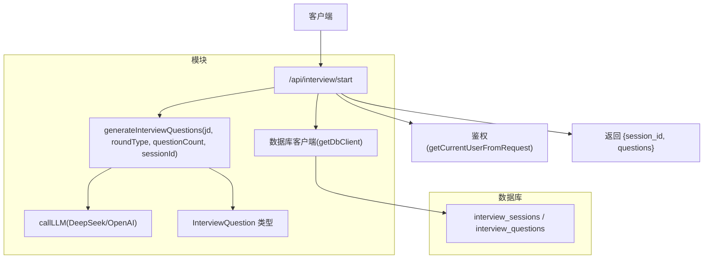
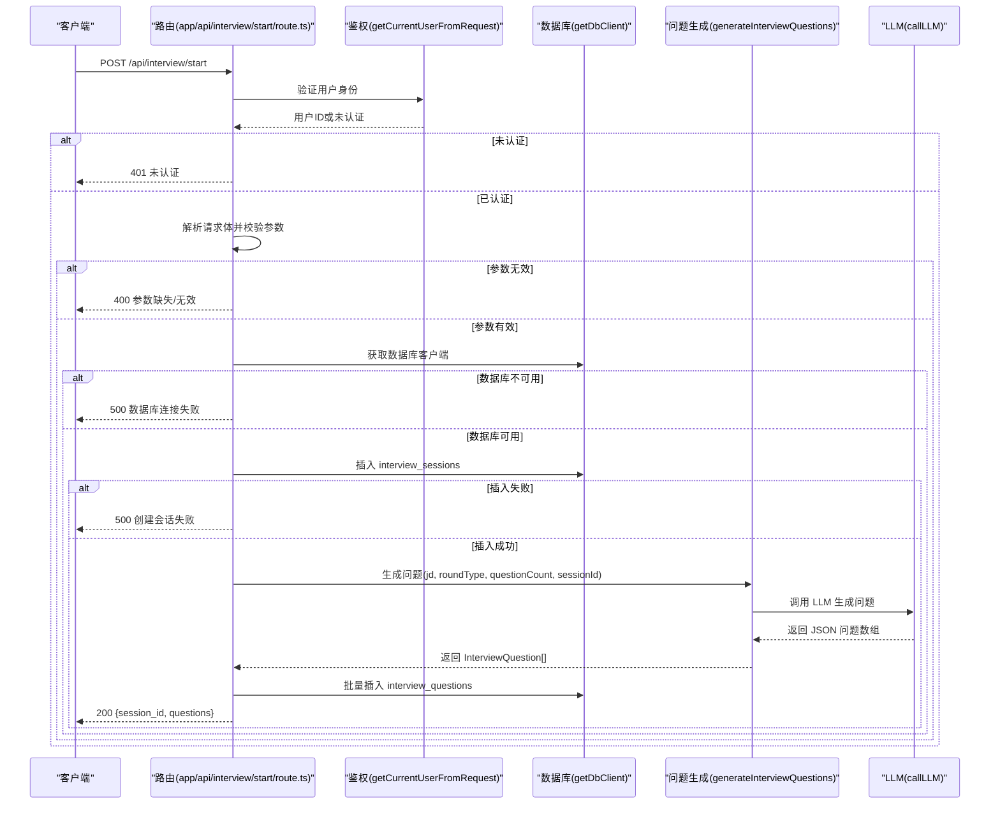
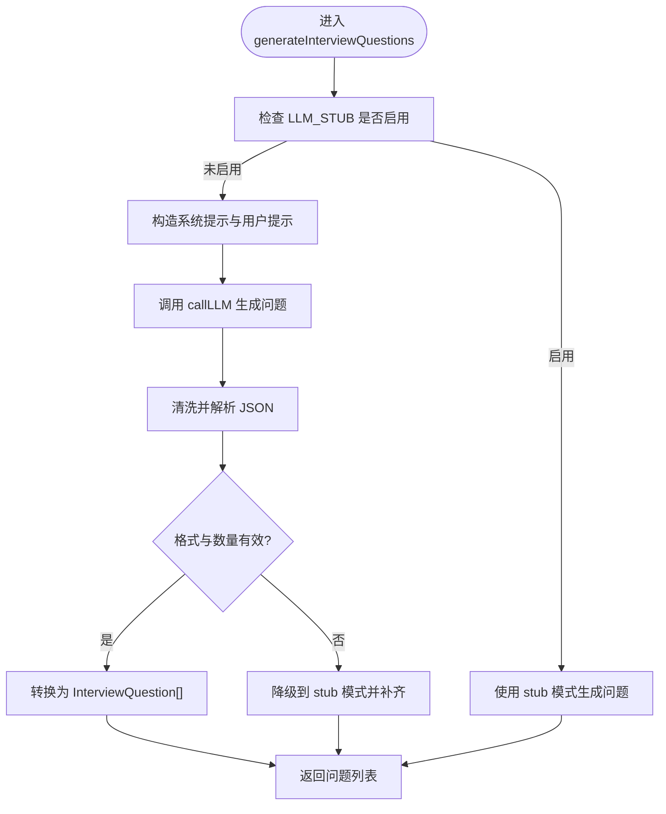
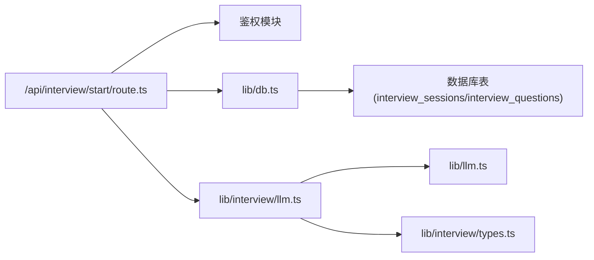

# 开始面试

<cite>
**本文引用的文件**
- [app/api/interview/start/route.ts](file://app/api/interview/start/route.ts)
- [lib/interview/llm.ts](file://lib/interview/llm.ts)
- [lib/db.ts](file://lib/db.ts)
- [lib/interview/types.ts](file://lib/interview/types.ts)
- [lib/llm.ts](file://lib/llm.ts)
</cite>

## 目录
1. [简介](#简介)
2. [项目结构](#项目结构)
3. [核心组件](#核心组件)
4. [架构总览](#架构总览)
5. [详细组件分析](#详细组件分析)
6. [依赖关系分析](#依赖关系分析)
7. [性能考量](#性能考量)
8. [故障排查指南](#故障排查指南)
9. [结论](#结论)

## 简介
本文档面向“开始面试”API，即 POST /api/interview/start 端点，完整说明其请求体结构（jd、roundType、questionCount）、响应格式（session_id、questions），以及与数据库交互、创建面试会话并调用问题生成模块的流程。同时提供错误处理机制说明（400、401、500）及前端调用示例，并给出调试技巧以便追踪问题生成过程。

## 项目结构
- API入口位于 app/api/interview/start/route.ts，负责鉴权、参数校验、数据库写入、调用问题生成模块并返回响应。
- 问题生成逻辑位于 lib/interview/llm.ts，封装了基于 LLM 的问题生成与降级策略。
- 数据库客户端封装位于 lib/db.ts，提供 Supabase 客户端初始化与基础 CRUD 能力。
- 类型定义位于 lib/interview/types.ts，统一了会话、问题、评估等数据结构。
- LLM 调用封装位于 lib/llm.ts，提供超时与重试、stub 模式、Provider 选择等能力。

图表来源
- [app/api/interview/start/route.ts](file://app/api/interview/start/route.ts#L33-L174)
- [lib/interview/llm.ts](file://lib/interview/llm.ts#L246-L426)
- [lib/db.ts](file://lib/db.ts#L16-L48)
- [lib/llm.ts](file://lib/llm.ts#L81-L163)
- [lib/interview/types.ts](file://lib/interview/types.ts#L29-L35)

章节来源
- [app/api/interview/start/route.ts](file://app/api/interview/start/route.ts#L33-L174)
- [lib/interview/llm.ts](file://lib/interview/llm.ts#L246-L426)
- [lib/db.ts](file://lib/db.ts#L16-L48)
- [lib/interview/types.ts](file://lib/interview/types.ts#L29-L35)

## 核心组件
- 请求体字段
  - jd: string，职位描述，必填且非空
  - roundType: "业务面"|"技术面"|"HR面"|"项目深挖"|"总监面"，必填
  - questionCount: number，>=1，必填
- 响应体字段
  - session_id: string，UUID，本次面试会话标识
  - questions: InterviewQuestion[]，生成的问题列表
- 数据库交互
  - 创建 interview_sessions 记录（包含 user_id、jd、round_type、question_count、created_at）
  - 将生成的问题批量写入 interview_questions（id、session_id、question_text、tips、created_at）

章节来源
- [app/api/interview/start/route.ts](file://app/api/interview/start/route.ts#L33-L174)
- [lib/interview/types.ts](file://lib/interview/types.ts#L9-L16)
- [lib/interview/types.ts](file://lib/interview/types.ts#L29-L35)

## 架构总览
POST /api/interview/start 的调用序列如下：

图表来源
- [app/api/interview/start/route.ts](file://app/api/interview/start/route.ts#L33-L174)
- [lib/interview/llm.ts](file://lib/interview/llm.ts#L246-L426)
- [lib/db.ts](file://lib/db.ts#L16-L48)
- [lib/llm.ts](file://lib/llm.ts#L81-L163)

## 详细组件分析

### 请求体与响应体规范
- 请求体
  - jd: string，必填且非空
  - roundType: "业务面"|"技术面"|"HR面"|"项目深挖"|"总监面"，必填
  - questionCount: number，>=1，必填
- 响应体
  - session_id: string，UUID
  - questions: InterviewQuestion[]，每项包含 id、session_id、question_text、tips、created_at

章节来源
- [app/api/interview/start/route.ts](file://app/api/interview/start/route.ts#L33-L174)
- [lib/interview/types.ts](file://lib/interview/types.ts#L29-L35)

### 鉴权与参数校验
- 鉴权：从请求中提取当前用户，若不存在返回 401
- 参数校验：
  - jd 存在且为非空字符串
  - roundType 存在且为字符串
  - questionCount 存在且为数字且 >= 1
- 无效 JSON：解析失败返回 400

章节来源
- [app/api/interview/start/route.ts](file://app/api/interview/start/route.ts#L33-L174)

### 数据库交互
- 获取数据库客户端：getDbClient() 返回 Supabase 客户端或 null
- 创建会话：向 interview_sessions 插入记录（包含 user_id、jd、round_type、question_count、created_at）
- 保存问题：向 interview_questions 批量插入（id、session_id、question_text、tips、created_at）
- 错误处理：任一步失败均记录日志并返回 500；问题保存失败不会中断主流程

章节来源
- [lib/db.ts](file://lib/db.ts#L16-L48)
- [app/api/interview/start/route.ts](file://app/api/interview/start/route.ts#L104-L149)

### 问题生成与 LLM 调用
- 入口：generateInterviewQuestions(jd, roundType, count, sessionId?)
- 生成策略：
  - 若启用 stub 模式（LLM_STUB=1），直接返回基于模板的问题列表
  - 否则构建系统提示与用户提示，调用 LLM（DeepSeek/OpenAI），解析 JSON 并清洗异常字符
  - 若 LLM 返回不足或格式异常，自动降级到 stub 模式并补齐
- 返回：InterviewQuestion[]，包含 id、session_id、question_text、tips、created_at

图表来源
- [lib/interview/llm.ts](file://lib/interview/llm.ts#L246-L426)
- [lib/llm.ts](file://lib/llm.ts#L81-L163)

章节来源
- [lib/interview/llm.ts](file://lib/interview/llm.ts#L246-L426)
- [lib/llm.ts](file://lib/llm.ts#L81-L163)

### 错误处理机制
- 400（参数缺失/无效）
  - 无效 JSON
  - 缺少或无效的 jd、roundType、questionCount
- 401（未认证）
  - 鉴权失败
- 500（数据库错误/会话创建失败）
  - 数据库客户端不可用
  - 插入 interview_sessions 失败
  - 服务器内部异常（catch 捕获）
- 问题保存失败
  - 不中断主流程，仍返回成功响应

章节来源
- [app/api/interview/start/route.ts](file://app/api/interview/start/route.ts#L33-L174)

### 前端调用示例（不同轮次类型）
- 技术面
  - 请求体：{ jd, roundType: "技术面", questionCount }
  - 响应：{ session_id, questions }
- 业务面
  - 请求体：{ jd, roundType: "业务面", questionCount }
  - 响应：{ session_id, questions }
- HR面/项目深挖/总监面
  - 请求体：{ jd, roundType: "HR面"/"项目深挖"/"总监面", questionCount }
  - 响应：{ session_id, questions }

说明：前端只需构造上述请求体并发起 POST /api/interview/start，即可获得会话ID与问题列表，随后可在后续接口中使用 session_id 进行答题与评估。

章节来源
- [app/api/interview/start/route.ts](file://app/api/interview/start/route.ts#L33-L174)
- [lib/interview/types.ts](file://lib/interview/types.ts#L6-L6)

### 调试技巧
- 日志定位
  - 会话创建失败：查看路由中对 sessionError 的日志
  - 问题保存失败：查看路由中对 questionsError 的日志
  - LLM 生成失败：查看 generateInterviewQuestions 中的错误日志与降级行为
- 环境变量
  - LLM_STUB=1：强制使用 stub 模式，便于快速验证流程
  - DEEPSEEK_API_KEY/OpenAI API Key：决定是否启用真实 LLM
- 超时与重试
  - LLM 调用具有超时与重试机制，必要时可调整超时时间
- 数据库可用性
  - 若 getDbClient 返回 null，表示未配置数据库，应用将以本地存储替代持久化

章节来源
- [app/api/interview/start/route.ts](file://app/api/interview/start/route.ts#L117-L149)
- [lib/interview/llm.ts](file://lib/interview/llm.ts#L246-L426)
- [lib/db.ts](file://lib/db.ts#L16-L48)
- [lib/llm.ts](file://lib/llm.ts#L81-L163)

## 依赖关系分析
- 路由依赖
  - 鉴权：getCurrentUserFromRequest（来自 auth 模块）
  - 数据库：getDbClient（Supabase 客户端）
  - 问题生成：generateInterviewQuestions
- 问题生成依赖
  - LLM：callLLM（DeepSeek/OpenAI）
  - 类型：InterviewQuestion、Tips、RoundType
- 数据库表
  - interview_sessions：会话记录
  - interview_questions：问题记录

图表来源
- [app/api/interview/start/route.ts](file://app/api/interview/start/route.ts#L33-L174)
- [lib/interview/llm.ts](file://lib/interview/llm.ts#L246-L426)
- [lib/db.ts](file://lib/db.ts#L16-L48)
- [lib/llm.ts](file://lib/llm.ts#L81-L163)
- [lib/interview/types.ts](file://lib/interview/types.ts#L29-L35)

章节来源
- [app/api/interview/start/route.ts](file://app/api/interview/start/route.ts#L33-L174)
- [lib/interview/llm.ts](file://lib/interview/llm.ts#L246-L426)
- [lib/db.ts](file://lib/db.ts#L16-L48)
- [lib/llm.ts](file://lib/llm.ts#L81-L163)
- [lib/interview/types.ts](file://lib/interview/types.ts#L29-L35)

## 性能考量
- 问题生成耗时
  - LLM 生成多个问题可能耗时较长（默认超时 60 秒），建议前端做好加载态与超时处理
- 批量写入
  - 问题批量插入 interview_questions，若数据量较大，建议关注数据库写入性能
- 重试与降级
  - LLM 调用具备重试与降级策略，保障服务可用性

章节来源
- [lib/interview/llm.ts](file://lib/interview/llm.ts#L303-L317)
- [lib/llm.ts](file://lib/llm.ts#L81-L163)

## 故障排查指南
- 400 错误
  - 检查请求体是否为合法 JSON
  - 检查 jd、roundType、questionCount 是否齐全且类型正确
- 401 错误
  - 确认用户已登录，路由能正确解析当前用户
- 500 错误
  - 数据库客户端不可用：确认 SUPABASE_URL/SUPABASE_ANON_KEY 环境变量
  - 会话创建失败：查看 sessionError 日志
  - 服务器异常：查看 catch 中的错误日志
- 问题保存失败
  - 不影响主流程，但建议记录日志并重试或上报

章节来源
- [app/api/interview/start/route.ts](file://app/api/interview/start/route.ts#L33-L174)
- [lib/db.ts](file://lib/db.ts#L16-L48)

## 结论
POST /api/interview/start 提供了从鉴权、参数校验、会话创建到问题生成与持久化的完整流程。通过 LLM_STUB 与真实 LLM 的双轨策略，既能保证开发调试效率，也能在生产环境中提供高质量的问题生成能力。建议前端在调用时携带合理的 questionCount，并在 UI 上对超时与错误进行友好提示；后端可通过日志与环境变量进行快速定位与切换。