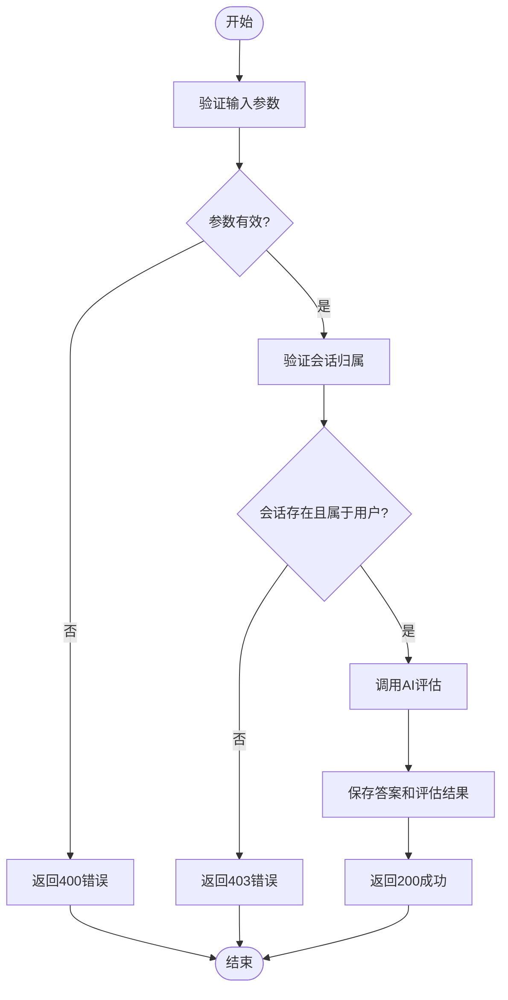
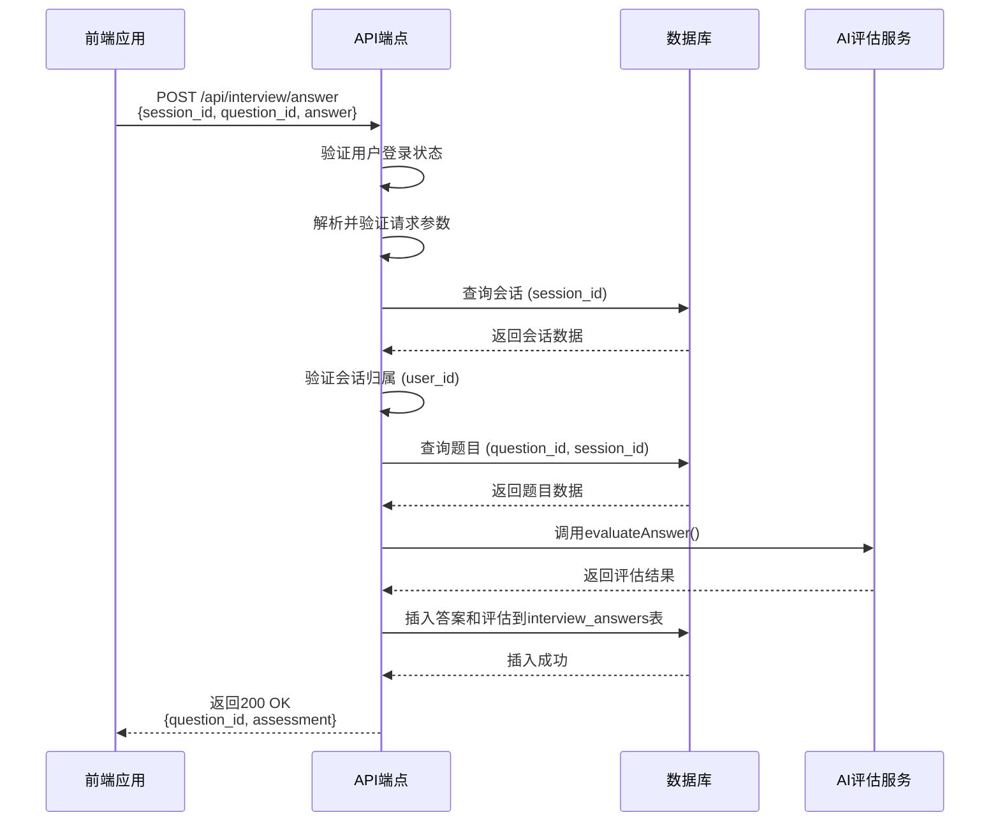
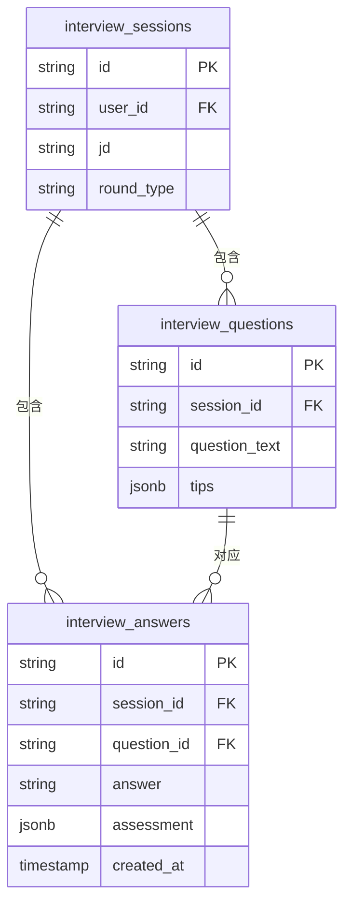

# 提交回答

<cite>
**本文档引用的文件**   
- [route.ts](file://app/api/interview/answer/route.ts)
- [types.ts](file://lib/interview/types.ts)
- [llm.ts](file://lib/interview/llm.ts)
- [db.ts](file://lib/db.ts)
- [schema.sql](file://supabase/schema.sql)
</cite>

## 目录
1. [简介](#简介)
2. [请求参数](#请求参数)
3. [后端处理流程](#后端处理流程)
4. [响应结构](#响应结构)
5. [前端代码示例](#前端代码示例)
6. [安全验证机制](#安全验证机制)
7. [性能提示](#性能提示)
8. [数据库设计](#数据库设计)

## 简介
`POST /api/interview/answer` 端点用于提交用户在模拟面试中的回答，并获取AI生成的评估反馈。该API是模拟面试功能的核心，负责接收用户回答、调用AI模型进行评估、并将结果持久化存储。整个流程确保了用户只能访问和操作属于自己的面试会话数据。

**Section sources**
- [route.ts](file://app/api/interview/answer/route.ts#L1-L205)

## 请求参数
该API通过POST请求接收以下JSON格式的请求体参数：

- **session_id**: 字符串类型，表示当前面试会话的唯一标识符（UUID）。此ID在用户开始面试时生成。
- **question_id**: 字符串类型，表示当前问题的唯一标识符（UUID）。此ID由系统在生成面试问题时分配。
- **answer**: 字符串类型，表示用户对当前问题的回答内容。内容不能为空或仅包含空白字符。

这些参数在请求体中必须全部提供且格式正确，否则API将返回400错误。



**Diagram sources**
- [route.ts](file://app/api/interview/answer/route.ts#L48-L90)
- [route.ts](file://app/api/interview/answer/route.ts#L104-L129)

**Section sources**
- [route.ts](file://app/api/interview/answer/route.ts#L62-L90)
- [types.ts](file://lib/interview/types.ts#L89-L93)

## 后端处理流程
当API接收到请求后，会执行一系列严格的处理步骤：

1.  **鉴权检查**: 首先，API会调用 `getCurrentUserFromRequest` 函数验证用户是否已登录。如果用户未认证，将返回401状态码。
2.  **参数解析与验证**: 解析JSON请求体，并对 `session_id`、`question_id` 和 `answer` 三个字段进行存在性和类型验证。任何验证失败都将导致400错误。
3.  **会话归属验证**: 使用 `getDbClient` 获取数据库连接，查询 `interview_sessions` 表以确认 `session_id` 对应的会话存在，并且该会话的 `user_id` 与当前登录用户匹配。如果会话不存在或不属于该用户，将返回403 Forbidden错误，确保数据安全。
4.  **题目归属验证**: 查询 `interview_questions` 表，确认 `question_id` 存在且属于当前 `session_id` 的会话。
5.  **AI评估**: 调用 `evaluateAnswer` 函数，传入问题文本、职位描述（JD）、用户回答和轮次类型等信息，由AI模型生成评估结果。此过程可能耗时20-60秒。
6.  **数据持久化**: 将用户的回答和AI生成的评估结果作为一条新记录插入 `interview_answers` 表。



**Diagram sources**
- [route.ts](file://app/api/interview/answer/route.ts#L33-L189)
- [llm.ts](file://lib/interview/llm.ts#L475-L649)
- [db.ts](file://lib/db.ts#L158-L168)

**Section sources**
- [route.ts](file://app/api/interview/answer/route.ts#L33-L189)
- [llm.ts](file://lib/interview/llm.ts#L475-L649)

## 响应结构
API成功处理请求后，会返回一个包含以下字段的JSON对象，HTTP状态码为200：

- **question_id**: 字符串类型，回显客户端提交的问题ID。
- **assessment**: 一个包含评估详情的对象，其结构在 `lib/interview/types.ts` 中定义为 `Assessment` 接口。该对象包含：
  - `score`: 总体得分（0-100）。
  - `dimensions`: 包含多个评估维度的数组，如逻辑性、准确性、数据指标与量化能力、沟通表达等，每个维度包含分数和评语。
  - `summary`: AI生成的总结性评价。



**Diagram sources**
- [types.ts](file://lib/interview/types.ts#L38-L45)
- [schema.sql](file://supabase/schema.sql#L1-L84)

**Section sources**
- [types.ts](file://lib/interview/types.ts#L96-L99)
- [route.ts](file://app/api/interview/answer/route.ts#L182-L185)

## 前端代码示例
以下是一个使用 `fetch` API 调用此端点的前端代码示例：

```javascript
async function submitAnswer(sessionId, questionId, userAnswer) {
  try {
    const response = await fetch('/api/interview/answer', {
      method: 'POST',
      headers: {
        'Content-Type': 'application/json',
      },
      body: JSON.stringify({
        session_id: sessionId,
        question_id: questionId,
        answer: userAnswer,
      }),
    });

    if (!response.ok) {
      const errorData = await response.json();
      throw new Error(errorData.error || '提交失败');
    }

    const result = await response.json();
    console.log('评估结果:', result.assessment);
    // 处理评估反馈，例如在UI中展示
  } catch (error) {
    console.error('提交回答时出错:', error);
    // 向用户显示错误信息
  }
}
```

**Section sources**
- [api-client.ts](file://lib/api-client.ts#L10-L35)

## 安全验证机制
该API实现了严格的安全验证，确保用户数据的隔离和安全：

- **用户认证**: 通过 `getCurrentUserFromRequest` 强制要求用户登录，未认证请求会被拒绝（401）。
- **会话归属检查**: 在数据库查询中，不仅检查 `session_id` 的存在性，还通过 `session.user_id !== userId` 的比较，确保当前用户是该会话的所有者。如果用户尝试访问不属于自己的会话，API将返回403 Forbidden状态码，有效防止了越权访问。

**Section sources**
- [route.ts](file://app/api/interview/answer/route.ts#L35-L47)
- [route.ts](file://app/api/interview/answer/route.ts#L121-L129)

## 性能提示
调用 `evaluateAnswer` 函数进行AI评估是一个计算密集型任务，通常需要 **20至60秒** 才能完成。因此，前端应用在提交回答后，应立即显示加载状态（如加载动画或“评估中...”的提示），以提供良好的用户体验。避免让用户误以为操作无响应而重复提交。

**Section sources**
- [route.ts](file://app/api/interview/answer/route.ts#L149-L155)
- [llm.ts](file://lib/interview/llm.ts#L555-L556)

## 数据库设计
评估结果和用户回答被持久化存储在 `interview_answers` 表中。该表通过外键 `session_id` 和 `question_id` 分别与 `interview_sessions` 和 `interview_questions` 表关联，确保了数据的完整性和可追溯性。`assessment` 字段使用JSONB类型存储复杂的评估结果对象。

**Section sources**
- [schema.sql](file://supabase/schema.sql#L1-L84)
- [route.ts](file://app/api/interview/answer/route.ts#L158-L168)