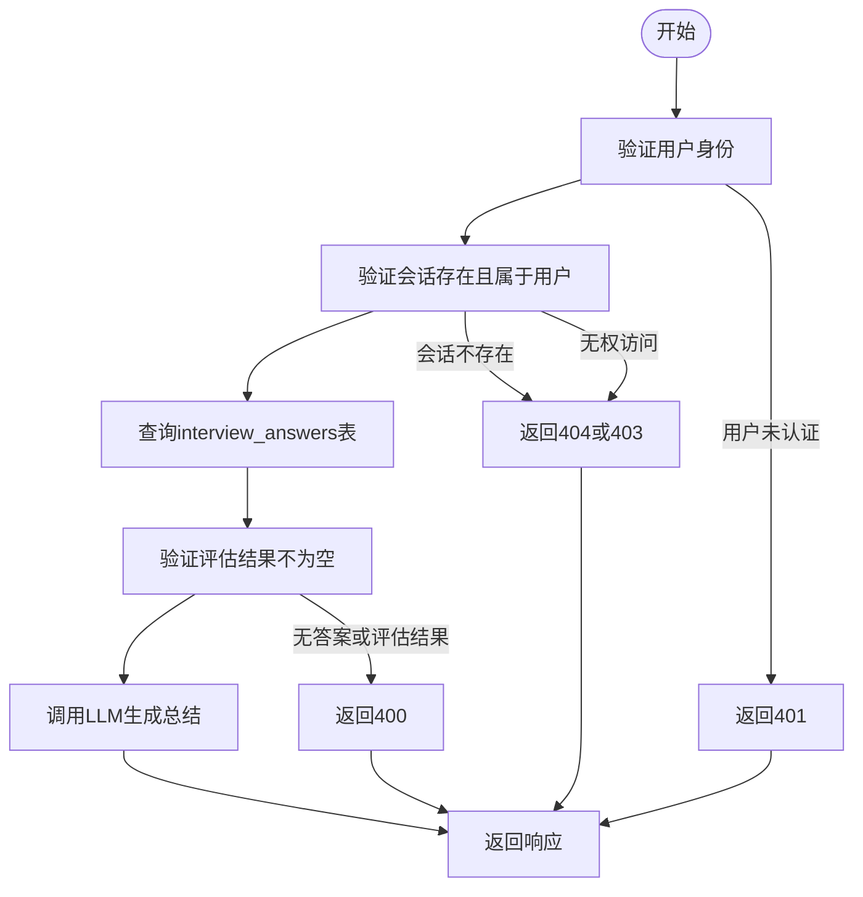

# 获取总结

<cite>
**本文档引用的文件**
- [route.ts](file://app/api/interview/summary/route.ts)
- [types.ts](file://lib/interview/types.ts)
- [llm.ts](file://lib/interview/llm.ts)
- [db.ts](file://lib/db.ts)
- [auth.ts](file://lib/auth.ts)
- [complete\route.ts](file://app/api/interview/complete/route.ts)
</cite>

## 目录
1. [简介](#简介)
2. [端点详情](#端点详情)
3. [鉴权流程](#鉴权流程)
4. [数据聚合逻辑](#数据聚合逻辑)
5. [响应结构](#响应结构)
6. [与complete接口的区别](#与complete接口的区别)
7. [使用示例](#使用示例)
8. [错误处理](#错误处理)
9. [结论](#结论)

## 简介
本文档详细说明了AI求职教练项目中`GET /api/interview/summary`端点的实现。该API用于通过`session_id`查询参数获取指定面试会话的总结报告。文档涵盖了鉴权流程、数据聚合逻辑、响应结构定义、与`complete`接口的区别、使用示例以及错误处理策略。

## 端点详情
`GET /api/interview/summary`端点用于获取指定面试会话的总结报告。该端点接受`session_id`作为查询参数，并返回包含综合评分、优势、薄弱点和建议的总结信息。

**请求方法**: GET  
**路径**: `/api/interview/summary`  
**查询参数**: `session_id` (必需，字符串类型)

**Section sources**
- [route.ts](file://app/api/interview/summary/route.ts#L28-L143)

## 鉴权流程
该API的鉴权流程包含两个关键步骤：用户身份验证和会话归属权限验证。

1. **用户身份验证**：首先调用`getCurrentUserId()`函数验证用户是否已登录。如果用户未认证，API将返回401状态码和"未认证"错误信息。
2. **会话归属权限验证**：在获取`session_id`后，API会查询数据库中的`interview_sessions`表，验证该会话是否存在且属于当前用户。如果会话不存在，返回404状态码；如果用户无权访问该会话（即会话不属于当前用户），则返回403状态码。

**Section sources**
- [route.ts](file://app/api/interview/summary/route.ts#L30-L78)
- [auth.ts](file://lib/auth.ts#L36-L39)

## 数据聚合逻辑
该API的数据聚合逻辑主要包括从数据库收集评估结果并调用LLM生成综合性反馈。

1. **数据收集**：API通过`getDbClient()`获取数据库客户端，然后查询`interview_answers`表，收集指定`session_id`下所有问题的评估结果。
2. **数据验证**：在调用LLM之前，API会验证收集到的评估结果是否为空。如果没有任何答案或评估结果，将返回400状态码。
3. **LLM调用**：使用`summarizeInterview()`函数调用LLM，传入职位描述（JD）、轮次类型和所有评估结果，生成综合性反馈。此过程不会触发新的LLM调用，而是基于已有的评估结果进行总结。



**Diagram sources**
- [route.ts](file://app/api/interview/summary/route.ts#L80-L119)
- [llm.ts](file://lib/interview/llm.ts#L684-L799)

## 响应结构
API的响应结构定义了面试总结报告的格式，包含综合评分、优势、薄弱点和建议等字段。

```json
{
  "session_id": "uuid",
  "overallScore": 75,
  "strengths": ["优势1", "优势2"],
  "weaknesses": ["薄弱点1", "薄弱点2"],
  "suggestions": ["建议1", "建议2"]
}
```

**字段说明**:
- `session_id`: 面试会话ID
- `overallScore`: 综合得分（0-100）
- `strengths`: 优势表现列表
- `weaknesses`: 薄弱环节列表
- `suggestions`: 改进建议列表

**Section sources**
- [route.ts](file://app/api/interview/summary/route.ts#L122-L128)
- [types.ts](file://lib/interview/types.ts#L58-L64)

## 与complete接口的区别
`GET /api/interview/summary`与`POST /api/interview/complete`接口有显著区别：

1. **操作类型**：`summary`接口是只读查询操作（GET），而`complete`接口是完成操作（POST），会触发新的LLM调用。
2. **功能目的**：`summary`接口用于获取历史总结报告，不触发新的LLM调用；`complete`接口用于完成面试会话并生成新的总结报告，会触发LLM调用。
3. **请求方式**：`summary`使用查询参数`session_id`，而`complete`使用请求体包含`session_id`。

**Section sources**
- [route.ts](file://app/api/interview/summary/route.ts#L28-L143)
- [complete\route.ts](file://app/api/interview/complete/route.ts#L44-L200)

## 使用示例
以下是如何在面试报告页面加载历史总结的使用示例：

```typescript
// 在面试报告页面加载历史总结
async function loadInterviewSummary(sessionId: string) {
  try {
    const response = await fetch(`/api/interview/summary?session_id=${sessionId}`);
    const data = await response.json();
    
    if (response.ok) {
      // 显示总结报告
      displaySummary(data);
    } else {
      // 处理错误
      handleSummaryError(data.error);
    }
  } catch (error) {
    console.error('加载面试总结失败:', error);
  }
}
```

**Section sources**
- [route.ts](file://app/api/interview/summary/route.ts#L28-L143)

## 错误处理
该API实现了全面的错误处理策略，针对不同情况返回相应的HTTP状态码和错误信息。

**错误类型及处理**:
- **400 Bad Request**: 当缺少或无效的`session_id`查询参数，或该会话没有答案时返回。
- **401 Unauthorized**: 当用户未认证时返回。
- **403 Forbidden**: 当用户无权访问指定的面试会话时返回。
- **404 Not Found**: 当指定的面试会话不存在时返回。
- **500 Internal Server Error**: 当数据库连接失败或其他服务器内部错误发生时返回。

**Section sources**
- [route.ts](file://app/api/interview/summary/route.ts#L33-L36)
- [route.ts](file://app/api/interview/summary/route.ts#L44-L47)
- [route.ts](file://app/api/interview/summary/route.ts#L67-L70)
- [route.ts](file://app/api/interview/summary/route.ts#L74-L77)
- [route.ts](file://app/api/interview/summary/route.ts#L53-L56)

## 结论
`GET /api/interview/summary`端点为AI求职教练项目提供了获取面试总结报告的核心功能。该API通过严格的鉴权流程确保数据安全，利用已有的评估结果生成综合性反馈，避免了不必要的LLM调用。其清晰的响应结构和全面的错误处理机制使得前端能够可靠地加载和显示历史面试总结，为用户提供有价值的反馈和改进建议。