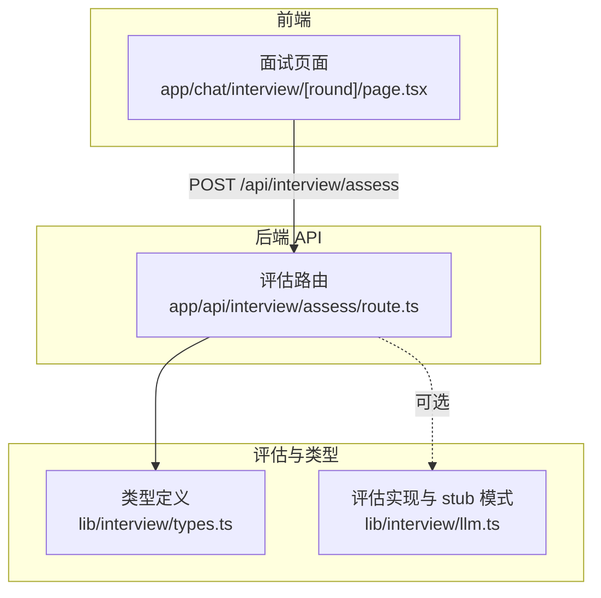
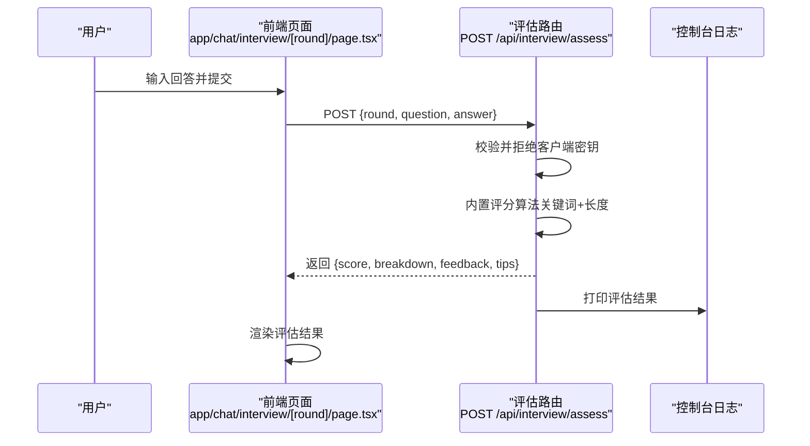
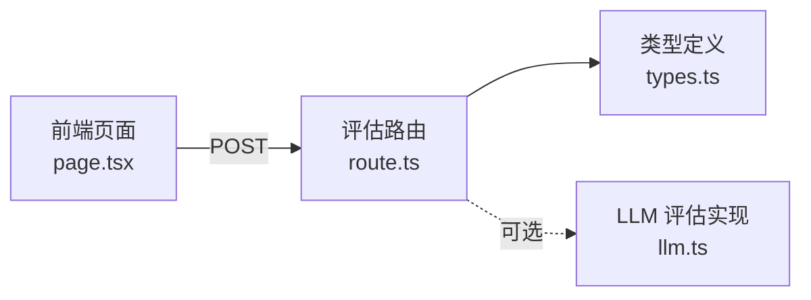

# 获取评估

<cite>
**本文引用的文件**
- [app/api/interview/assess/route.ts](file://app/api/interview/assess/route.ts)
- [app/chat/interview/[round]/page.tsx](file://app/chat/interview/[round]/page.tsx)
- [lib/interview/llm.ts](file://lib/interview/llm.ts)
- [lib/interview/types.ts](file://lib/interview/types.ts)
- [docs/interview_api.md](file://docs/interview_api.md)
- [docs/interview_api_debug.md](file://docs/interview_api_debug.md)
</cite>

## 目录
1. [简介](#简介)
2. [项目结构](#项目结构)
3. [核心组件](#核心组件)
4. [架构概览](#架构概览)
5. [详细组件分析](#详细组件分析)
6. [依赖分析](#依赖分析)
7. [性能考量](#性能考量)
8. [故障排查指南](#故障排查指南)
9. [结论](#结论)

## 简介
本技术文档面向 POST /api/interview/assess 评估接口，聚焦“获取评估”的使用场景与实现细节。该接口用于对用户的面试回答进行即时评估，返回总分与分项评分（准确性、完整性、逻辑性、表达清晰度），并提供反馈与答题要点提示。文档同时说明内置评分逻辑（关键词匹配与回答长度的模拟算法）、安全措施（拒绝客户端提交 API 密钥）、调试方法（通过控制台日志查看评估结果），以及在 stub 模式下的行为特征。

## 项目结构
与评估接口相关的文件分布如下：
- API 路由：app/api/interview/assess/route.ts
- 前端调用：app/chat/interview/[round]/page.tsx
- 评估与提示的类型定义：lib/interview/types.ts
- LLM 评估与 stub 模式实现：lib/interview/llm.ts
- API 文档与调试指南：docs/interview_api.md、docs/interview_api_debug.md

图表来源
- [app/api/interview/assess/route.ts](file://app/api/interview/assess/route.ts#L1-L167)
- [app/chat/interview/[round]/page.tsx](file://app/chat/interview/[round]/page.tsx#L106-L160)
- [lib/interview/types.ts](file://lib/interview/types.ts#L1-L117)
- [lib/interview/llm.ts](file://lib/interview/llm.ts#L1-L800)

章节来源
- [app/api/interview/assess/route.ts](file://app/api/interview/assess/route.ts#L1-L167)
- [app/chat/interview/[round]/page.tsx](file://app/chat/interview/[round]/page.tsx#L106-L160)
- [lib/interview/types.ts](file://lib/interview/types.ts#L1-L117)
- [lib/interview/llm.ts](file://lib/interview/llm.ts#L1-L800)

## 核心组件
- 评估路由（POST /api/interview/assess）
  - 输入：round（轮次类型）、question（问题文本）、answer（回答内容）
  - 输出：score（总分）、breakdown（准确性、完整性、逻辑性、表达清晰度）、feedback（优点、改进建议、总体评价）、tips（考察意图、回答要点）
  - 安全：拒绝客户端提交 apiKey/key/token
  - 逻辑：内置评分算法（关键词匹配 + 回答长度），并生成反馈与 tips
- 前端调用
  - 在面试页面中，用户提交回答后调用 /api/interview/assess 并打印评估结果到控制台
- 类型定义
  - 与评估相关的类型（如 roundType、Assessment 等）便于前后端契约一致
- LLM 评估与 stub 模式
  - 评估接口本身为内置模拟实现；但项目中存在基于 LLM 的评估实现与 stub 降级逻辑，便于理解整体评估体系

章节来源
- [app/api/interview/assess/route.ts](file://app/api/interview/assess/route.ts#L1-L167)
- [app/chat/interview/[round]/page.tsx](file://app/chat/interview/[round]/page.tsx#L106-L160)
- [lib/interview/types.ts](file://lib/interview/types.ts#L1-L117)
- [lib/interview/llm.ts](file://lib/interview/llm.ts#L428-L650)

## 架构概览
评估接口的调用链路如下：

图表来源
- [app/chat/interview/[round]/page.tsx](file://app/chat/interview/[round]/page.tsx#L106-L160)
- [app/api/interview/assess/route.ts](file://app/api/interview/assess/route.ts#L30-L167)

## 详细组件分析

### 评估路由（POST /api/interview/assess）
- 请求体字段
  - round：轮次类型（例如业务面、技术面、HR面等）
  - question：问题文本
  - answer：回答内容
- 响应数据结构
  - score：总分（0-100）
  - breakdown：四项分项评分
    - accuracy：准确性
    - completeness：完整性
    - logic：逻辑性
    - communication：表达清晰度
  - feedback：评估反馈
    - strengths：优点
    - improvements：改进建议
    - overall：总体评价
  - tips：答题要点提示（可选）
    - intent：考察意图
    - keypoints：回答要点
- 内置评分逻辑（关键词匹配 + 回答长度）
  - 关键词匹配
    - 根据问题文本判断相关关键词集合（如“项目”、“用户/洞察”、“数据/决策”）
    - 若回答包含关键词，则加分
  - 回答长度
    - 通过回答长度阈值与线性增量计算分项分数
    - 长度越长，完整性与表达清晰度越容易获得更高分
  - 分项公式（简化说明）
    - accuracy：基础分 + 关键词命中加分 + 长度加分
    - completeness：基础分 + 长度加分 + 超长加分
    - logic：基础分 + 超长加分 + 逻辑连接词加分
    - communication：基础分 + 长度加分 + 超长加分
    - score：四分平均并四舍五入
- 安全措施
  - 拒绝客户端提交 apiKey、key、token，避免密钥泄露
- 错误处理
  - 异常时返回默认评估结构（各项为0），并携带错误提示
- 日志与调试
  - 控制台输出评估结果 JSON，便于前端与本地调试

章节来源
- [app/api/interview/assess/route.ts](file://app/api/interview/assess/route.ts#L1-L167)

### 前端调用与渲染
- 调用方式
  - 前端在面试页面中构造请求体（包含 round、question、answer），调用 /api/interview/assess
  - 调用成功后将评估结果打印到控制台
- 渲染展示
  - 页面根据返回的 score、breakdown、feedback、tips 渲染评估卡片与分项评分

章节来源
- [app/chat/interview/[round]/page.tsx](file://app/chat/interview/[round]/page.tsx#L106-L160)
- [app/chat/interview/[round]/page.tsx](file://app/chat/interview/[round]/page.tsx#L256-L305)

### 类型定义与评估契约
- 轮次类型（RoundType）与面试相关类型（如 InterviewQuestion、Assessment 等）定义了评估接口的类型契约，便于前后端一致性与可维护性

章节来源
- [lib/interview/types.ts](file://lib/interview/types.ts#L1-L117)

### LLM 评估与 stub 模式（参考）
- 评估接口本身为内置模拟实现；项目中存在基于 LLM 的评估实现与 stub 降级逻辑，有助于理解整体评估体系与在 stub 模式下的行为特征
- stub 模式特征
  - 无需 API 密钥
  - 快速响应
  - 数据固定，适合开发与测试

章节来源
- [lib/interview/llm.ts](file://lib/interview/llm.ts#L428-L650)
- [docs/interview_api.md](file://docs/interview_api.md#L240-L262)

## 依赖分析
- 评估路由依赖
  - 输入校验与安全：拒绝客户端密钥
  - 评分算法：关键词匹配与回答长度
  - 响应构建：score、breakdown、feedback、tips
- 前端依赖
  - 调用 /api/interview/assess 并渲染结果
- 类型依赖
  - 评估相关类型定义，保证前后端契约一致

图表来源
- [app/chat/interview/[round]/page.tsx](file://app/chat/interview/[round]/page.tsx#L106-L160)
- [app/api/interview/assess/route.ts](file://app/api/interview/assess/route.ts#L1-L167)
- [lib/interview/types.ts](file://lib/interview/types.ts#L1-L117)
- [lib/interview/llm.ts](file://lib/interview/llm.ts#L428-L650)

## 性能考量
- 评估接口为内置模拟实现，无外部 LLM 调用，响应快速稳定
- 若未来迁移到 LLM 评估，需关注：
  - 超时与重试策略
  - 错误降级（stub 模式）
  - 日志与监控
- 本接口当前不涉及外部依赖，性能主要取决于前端渲染与日志输出

[本节为一般性指导，不直接分析具体文件]

## 故障排查指南
- 控制台日志
  - 评估路由会在成功时输出评估结果 JSON，失败时输出错误信息，便于本地调试
- 常见问题
  - 客户端提交了密钥：接口会拒绝并返回 400
  - 请求体字段缺失：接口会捕获异常并返回默认评估结构
- 调试步骤
  - 在浏览器控制台查看评估结果
  - 检查响应结构是否包含 score、breakdown、feedback、tips
  - 若返回默认评估结构，确认 answer 是否为空或异常

章节来源
- [app/api/interview/assess/route.ts](file://app/api/interview/assess/route.ts#L30-L167)
- [docs/interview_api_debug.md](file://docs/interview_api_debug.md#L1-L433)

## 结论
POST /api/interview/assess 提供了即时、稳定的面试回答评估能力，内置评分逻辑以关键词匹配与回答长度为核心，辅以反馈与答题要点提示，帮助用户快速了解回答质量与改进方向。接口具备安全防护（拒绝客户端密钥），并通过控制台日志便于调试。在 stub 模式下，接口无需外部密钥即可运行，适合开发与测试阶段使用。