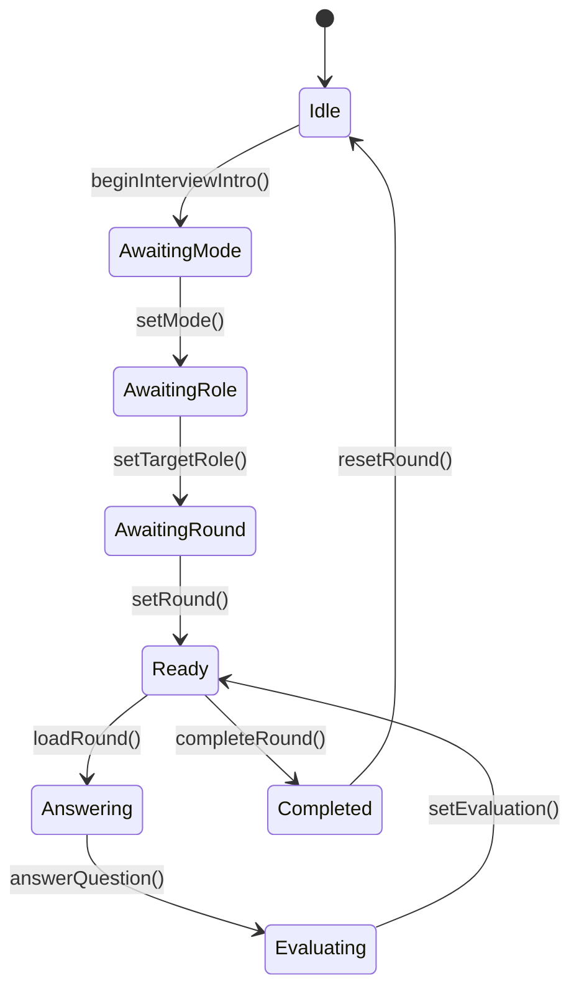

# 面试API

<cite>
**本文档引用的文件**   
- [interview_api.md](file://docs/interview_api.md)
- [interview_api_debug.md](file://docs/interview_api_debug.md)
- [route.ts](file://app/api/interview/route.ts)
- [start/route.ts](file://app/api/interview/start/route.ts)
- [answer/route.ts](file://app/api/interview/answer/route.ts)
- [assess/route.ts](file://app/api/interview/assess/route.ts)
- [complete/route.ts](file://app/api/interview/complete/route.ts)
- [summary/route.ts](file://app/api/interview/summary/route.ts)
- [types.ts](file://lib/interview/types.ts)
- [llm.ts](file://lib/interview/llm.ts)
- [interviewStore.tsx](file://store/interviewStore.tsx)
</cite>

## 目录
1. [介绍](#介绍)
2. [API概览](#api概览)
3. [端点详细说明](#端点详细说明)
4. [面试状态机](#面试状态机)
5. [数据结构与JSON Schema](#数据结构与json-schema)
6. [错误码](#错误码)
7. [集成测试示例](#集成测试示例)
8. [调试技巧](#调试技巧)

## 介绍

本API文档详细描述了AI求职教练项目中的面试功能模块。该模块提供了一套完整的模拟面试解决方案，覆盖从开始面试、提交回答、获取评估到生成总结的完整流程。API设计支持两种工作模式：当配置了`DEEPSEEK_API_KEY`时使用真实的LLM模型生成动态内容；当未配置时自动降级到stub模式，返回预设的模拟数据，确保开发和测试的连续性。

**Section sources**
- [interview_api.md](file://docs/interview_api.md#L1-L342)
- [interview_api_debug.md](file://docs/interview_api_debug.md#L1-L433)

## API概览

面试API采用统一的POST端点`/api/interview`，通过`action`参数区分不同的操作类型。这种设计简化了前端调用，同时保持了接口的灵活性和可扩展性。

### 统一请求格式

所有请求都遵循以下JSON结构：

```json
{
  "action": "start_round",
  "sessionId": "session_123",
  "userId": "user_456",
  "roundType": "技术面"
}
```

### 统一响应格式

所有响应都遵循以下JSON结构：

```json
{
  "type": "next-question",
  "payload": {
    "question": {
      "id": "q_123",
      "q": "问题内容",
      "tips": {
        "intent": "考察意图",
        "keyPoints": ["要点1", "要点2"]
      }
    }
  },
  "debug": {
    "mode": "stub"
  }
}
```

**Section sources**
- [interview_api.md](file://docs/interview_api.md#L15-L49)
- [route.ts](file://app/api/interview/route.ts#L21-L61)

## 端点详细说明

### 开始面试 (/api/interview/start)

此端点用于创建新的面试会话并生成第一道面试题。

**HTTP方法**: POST

**认证要求**: Bearer Token（通过`getCurrentUserFromRequest`验证）

**请求参数**:

| 参数 | 类型 | 必需 | 说明 |
|------|------|------|------|
| jd | string | 是 | 职位描述 |
| roundType | string | 是 | 面试轮次类型 |
| questionCount | number | 是 | 题目数量 |

**请求体示例**:
```json
{
  "jd": "高级前端工程师职位描述...",
  "roundType": "技术面",
  "questionCount": 3
}
```

**响应格式**:
```json
{
  "session_id": "uuid",
  "questions": [
    {
      "id": "uuid",
      "question_text": "问题内容",
      "tips": {
        "intent": "考察意图",
        "keyPoints": ["要点1", "要点2"],
        "framework": "回答框架"
      }
    }
  ]
}
```

**Section sources**
- [start/route.ts](file://app/api/interview/start/route.ts#L1-L175)
- [types.ts](file://lib/interview/types.ts#L76-L86)

### 提交回答 (/api/interview/answer)

此端点用于提交用户对面试问题的回答，并获取评估结果。

**HTTP方法**: POST

**认证要求**: Bearer Token

**请求参数**:

| 参数 | 类型 | 必需 | 说明 |
|------|------|------|------|
| session_id | string | 是 | 面试会话ID |
| question_id | string | 是 | 问题ID |
| answer | string | 是 | 用户回答内容 |

**请求体示例**:
```json
{
  "session_id": "session_123",
  "question_id": "q_123",
  "answer": "我的回答内容..."
}
```

**响应格式**:
```json
{
  "question_id": "q_123",
  "assessment": {
    "accuracy": 75,
    "detail": 80,
    "logic": 70,
    "confidence": 85,
    "tips": "改进建议"
  }
}
```

**Section sources**
- [answer/route.ts](file://app/api/interview/answer/route.ts#L1-L205)
- [types.ts](file://lib/interview/types.ts#L88-L99)

### 获取评估 (/api/interview/assess)

此端点用于对用户回答进行评估，返回详细的评分和反馈。

**HTTP方法**: POST

**认证要求**: 无（此端点不验证用户身份）

**请求参数**:

| 参数 | 类型 | 必需 | 说明 |
|------|------|------|------|
| round | string | 是 | 面试轮次类型 |
| question | string | 是 | 面试问题 |
| answer | string | 是 | 用户回答 |

**请求体示例**:
```json
{
  "round": "技术面",
  "question": "请描述一个你解决过的技术难题",
  "answer": "我最近解决了一个数据库性能瓶颈问题..."
}
```

**响应格式**:
```json
{
  "score": 75,
  "breakdown": {
    "accuracy": 75,
    "completeness": 80,
    "logic": 70,
    "communication": 85
  },
  "feedback": {
    "strengths": ["优点1", "优点2"],
    "improvements": ["改进建议1", "改进建议2"],
    "overall": "总体评价"
  },
  "tips": {
    "intent": "考察意图",
    "keypoints": ["要点1", "要点2"]
  }
}
```

**Section sources**
- [assess/route.ts](file://app/api/interview/assess/route.ts#L1-L167)

### 完成面试 (/api/interview/complete)

此端点用于完成面试会话并生成总结报告。

**HTTP方法**: POST

**认证要求**: Bearer Token

**请求参数**:

| 参数 | 类型 | 必需 | 说明 |
|------|------|------|------|
| session_id | string | 是 | 面试会话ID |

**请求体示例**:
```json
{
  "session_id": "session_123"
}
```

**响应格式**:
```json
{
  "type": "session-summary",
  "payload": {
    "session_id": "session_123",
    "summary": {
      "overallScore": 75,
      "strengths": ["优势1", "优势2"],
      "weaknesses": ["薄弱点1", "薄弱点2"],
      "suggestions": ["建议1", "建议2"]
    }
  }
}
```

**Section sources**
- [complete/route.ts](file://app/api/interview/complete/route.ts#L1-L200)

### 生成总结 (/api/interview/summary)

此端点用于获取面试总结，支持通过查询参数指定会话ID。

**HTTP方法**: GET

**认证要求**: Bearer Token

**查询参数**:

| 参数 | 类型 | 必需 | 说明 |
|------|------|------|------|
| session_id | string | 是 | 面试会话ID |

**URL示例**:
```
/api/interview/summary?session_id=session_123
```

**响应格式**:
```json
{
  "session_id": "session_123",
  "overallScore": 75,
  "strengths": ["优势1", "优势2"],
  "weaknesses": ["薄弱点1", "薄弱点2"],
  "suggestions": ["建议1", "建议2"]
}
```

**Section sources**
- [summary/route.ts](file://app/api/interview/summary/route.ts#L1-L143)

## 面试状态机

面试流程遵循一个明确的状态机流转逻辑，确保用户体验的一致性和完整性。



**Diagram sources**
- [interviewStore.tsx](file://store/interviewStore.tsx#L11-L19)

## 数据结构与JSON Schema

### InterviewRound 类型

`InterviewRound`类型在面试流程的不同阶段具有不同的数据结构：

**开始阶段**:
```json
{
  "roundType": "技术面",
  "currentQuestionIndex": 0,
  "questions": [
    {
      "id": "q_123",
      "q": "问题内容",
      "tips": {
        "intent": "考察意图",
        "keyPoints": ["要点1", "要点2"]
      },
      "status": "pending"
    }
  ]
}
```

**回答阶段**:
```json
{
  "roundType": "技术面",
  "currentQuestionIndex": 0,
  "questions": [
    {
      "id": "q_123",
      "q": "问题内容",
      "tips": {
        "intent": "考察意图",
        "keyPoints": ["要点1", "要点2"]
      },
      "userAnswer": "用户回答内容",
      "status": "answered"
    }
  ]
}
```

**评估阶段**:
```json
{
  "roundType": "技术面",
  "currentQuestionIndex": 0,
  "questions": [
    {
      "id": "q_123",
      "q": "问题内容",
      "tips": {
        "intent": "考察意图",
        "keyPoints": ["要点1", "要点2"]
      },
      "userAnswer": "用户回答内容",
      "evaluation": {
        "accuracy": 75,
        "detail": 80,
        "logic": 70,
        "confidence": 85,
        "tips": "改进建议"
      },
      "status": "evaluated"
    }
  ]
}
```

**Section sources**
- [interviewStore.tsx](file://store/interviewStore.tsx#L57-L64)

## 错误码

API返回标准的HTTP状态码和自定义错误信息：

| 状态码 | 错误类型 | 说明 |
|--------|----------|------|
| 400 | Bad Request | 请求参数无效或缺失 |
| 401 | Unauthorized | 未认证，用户未登录 |
| 403 | Forbidden | 无权访问，会话不属于当前用户 |
| 404 | Not Found | 资源不存在，会话或问题不存在 |
| 500 | Internal Server Error | 服务器内部错误 |

**错误响应格式**:
```json
{
  "ok": false,
  "error": "错误描述"
}
```

**Section sources**
- [start/route.ts](file://app/api/interview/start/route.ts#L38-L45)
- [answer/route.ts](file://app/api/interview/answer/route.ts#L38-L45)
- [complete/route.ts](file://app/api/interview/complete/route.ts#L49-L56)

## 集成测试示例

使用axios进行集成测试的代码示例：

```typescript
import axios from 'axios';

// 配置axios实例
const apiClient = axios.create({
  baseURL: 'http://localhost:3000',
  headers: {
    'Content-Type': 'application/json'
  },
  withCredentials: true
});

// 开始面试
async function startInterview() {
  try {
    const response = await apiClient.post('/api/interview/start', {
      jd: '高级前端工程师职位描述...',
      roundType: '技术面',
      questionCount: 3
    });
    
    console.log('面试会话创建成功:', response.data.session_id);
    return response.data;
  } catch (error) {
    console.error('开始面试失败:', error.response?.data || error.message);
    throw error;
  }
}

// 提交回答
async function submitAnswer(sessionId, questionId, answer) {
  try {
    const response = await apiClient.post('/api/interview/answer', {
      session_id: sessionId,
      question_id: questionId,
      answer: answer
    });
    
    console.log('回答评估结果:', response.data.assessment);
    return response.data;
  } catch (error) {
    console.error('提交回答失败:', error.response?.data || error.message);
    throw error;
  }
}

// 完成面试
async function completeInterview(sessionId) {
  try {
    const response = await apiClient.post('/api/interview/complete', {
      session_id: sessionId
    });
    
    console.log('面试总结:', response.data.payload.summary);
    return response.data;
  } catch (error) {
    console.error('完成面试失败:', error.response?.data || error.message);
    throw error;
  }
}

// 获取总结
async function getSummary(sessionId) {
  try {
    const response = await apiClient.get(`/api/interview/summary?session_id=${sessionId}`);
    
    console.log('面试总结:', response.data);
    return response.data;
  } catch (error) {
    console.error('获取总结失败:', error.response?.data || error.message);
    throw error;
  }
}
```

**Section sources**
- [interview_api_debug.md](file://docs/interview_api_debug.md#L15-L174)

## 调试技巧

### 定位LLM响应异常问题

当遇到LLM响应异常时，可以使用以下调试技巧：

1. **检查工作模式**: 通过响应中的`debug.mode`字段确认当前是stub模式还是deepseek模式。

2. **验证环境变量**: 确保`.env.local`文件中正确配置了`DEEPSEEK_API_KEY`。

3. **监控网络请求**: 在浏览器开发者工具中查看网络请求，检查请求和响应的完整内容。

4. **验证数据结构**: 使用console.assert验证响应数据结构的完整性。

```javascript
// 调试示例
fetch('/api/interview', {
  method: 'POST',
  headers: { 'Content-Type': 'application/json' },
  body: JSON.stringify({
    action: 'start_round',
    sessionId: 'test_session',
    userId: 'test_user',
    roundType: '技术面'
  })
})
.then(res => res.json())
.then(data => {
  console.log('响应类型:', data.type);
  console.log('调试信息:', data.debug);
  
  // 验证数据结构
  if (data.type === 'next-question') {
    console.assert(data.payload.question.id, '问题缺少id');
    console.assert(data.payload.question.q, '问题缺少q字段');
    console.assert(data.payload.question.tips, '问题缺少tips');
  }
  
  if (data.type === 'error') {
    console.error('错误:', data.payload.message);
  }
})
.catch(err => console.error('请求失败:', err));
```

**Section sources**
- [interview_api_debug.md](file://docs/interview_api_debug.md#L321-L353)
- [route.ts](file://app/api/interview/route.ts#L68-L70)