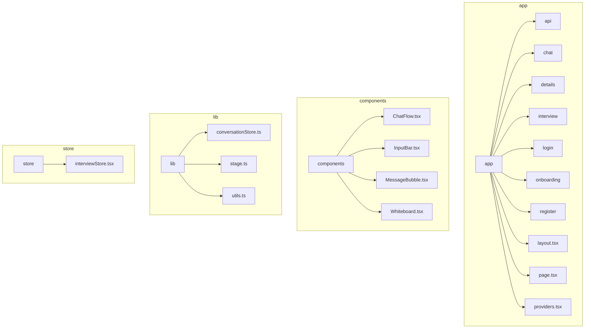
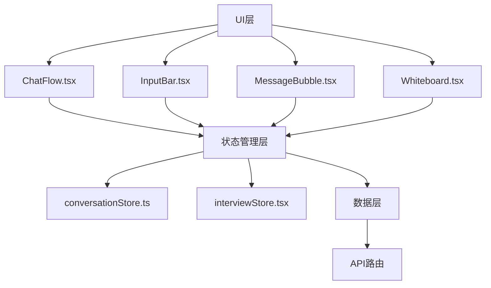
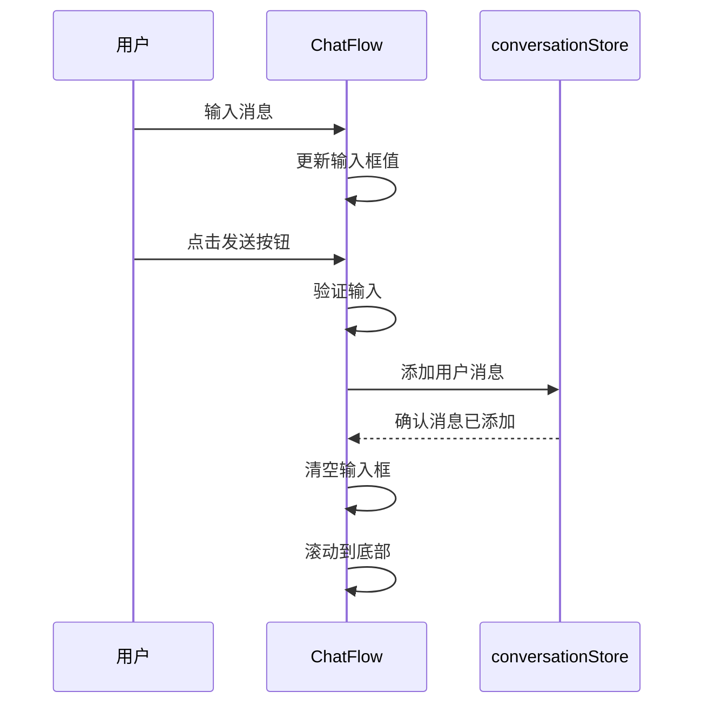
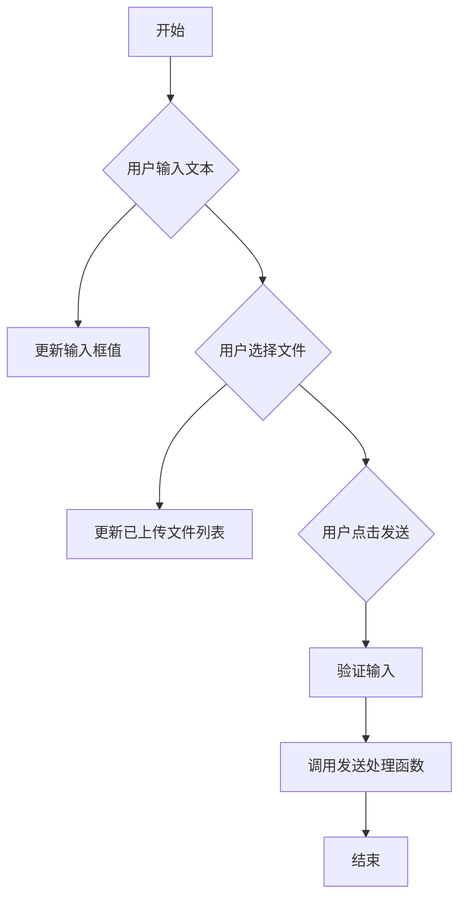
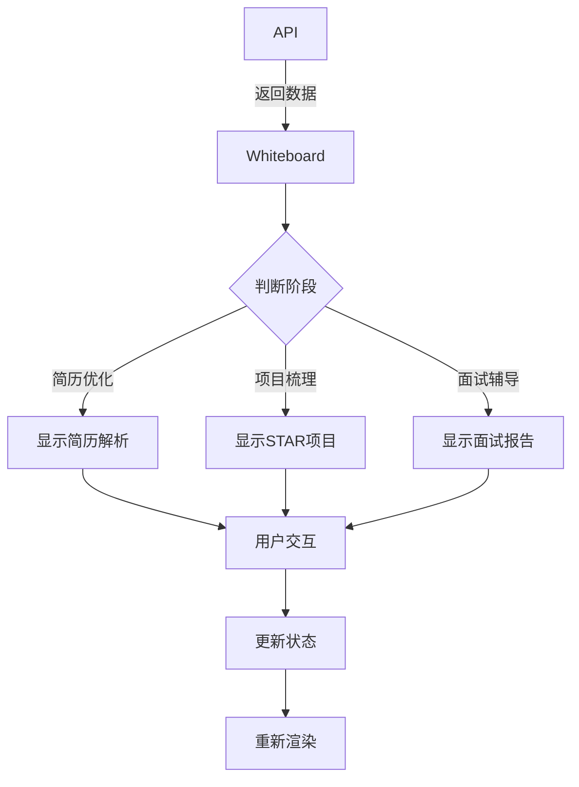
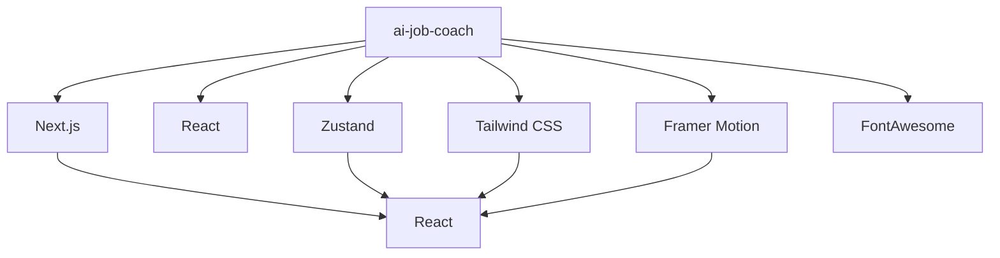

# 前端架构

<cite>
**本文档引用文件**   
- [app/layout.tsx](file://app/layout.tsx)
- [app/chat/page.tsx](file://app/chat/page.tsx)
- [app/providers.tsx](file://app/providers.tsx)
- [components/ChatFlow.tsx](file://components/ChatFlow.tsx)
- [components/InputBar.tsx](file://components/InputBar.tsx)
- [components/MessageBubble.tsx](file://components/MessageBubble.tsx)
- [components/LoadingDots.tsx](file://components/LoadingDots.tsx)
- [components/Whiteboard.tsx](file://components/Whiteboard.tsx)
- [lib/conversationStore.ts](file://lib/conversationStore.ts)
- [lib/stage.ts](file://lib/stage.ts)
- [lib/utils.ts](file://lib/utils.ts)
- [store/interviewStore.tsx](file://store/interviewStore.tsx)
- [app/globals.css](file://app/globals.css)
</cite>

## 目录
1. [简介](#简介)
2. [项目结构](#项目结构)
3. [核心组件](#核心组件)
4. [架构概览](#架构概览)
5. [详细组件分析](#详细组件分析)
6. [依赖分析](#依赖分析)
7. [性能考虑](#性能考虑)
8. [故障排除指南](#故障排除指南)
9. [结论](#结论)

## 简介
本文档旨在全面阐述ai-job-coach项目的前端架构，重点聚焦于Next.js App Router下的组件体系、状态管理机制与UI交互设计。文档详细描述了页面结构如何响应不同面试阶段，layout.tsx如何统一布局，ChatFlow.tsx如何驱动对话流程并与conversationStore.ts集成实现消息持久化。同时，深入分析了Zustand状态管理器在跨组件共享对话状态中的关键作用，以及InputBar、MessageBubble等基础UI组件的复用策略与交互逻辑。此外，文档还涵盖了样式系统（Tailwind CSS）的应用规范与响应式设计实践，提供了组件通信模式、动画实现（Framer Motion）及可访问性考虑的指导原则。

## 项目结构
ai-job-coach项目采用Next.js App Router架构，项目结构清晰，模块化程度高。主要目录包括app、components、lib、store等。app目录下包含各个页面和API路由，components目录存放可复用的UI组件，lib目录包含业务逻辑和工具函数，store目录管理全局状态。这种结构有利于代码的维护和扩展。



**图源**
- [app](file://app)
- [components](file://components)
- [lib](file://lib)
- [store](file://store)

**本节来源**
- [app](file://app)
- [components](file://components)
- [lib](file://lib)
- [store](file://store)

## 核心组件
本项目的核心组件包括ChatFlow.tsx、InputBar.tsx、MessageBubble.tsx和Whiteboard.tsx。这些组件共同构成了应用的主要交互界面。ChatFlow.tsx负责管理聊天消息的显示和输入，InputBar.tsx提供用户输入界面，MessageBubble.tsx用于显示单条消息，Whiteboard.tsx则展示面试过程中的关键信息。

**本节来源**
- [components/ChatFlow.tsx](file://components/ChatFlow.tsx)
- [components/InputBar.tsx](file://components/InputBar.tsx)
- [components/MessageBubble.tsx](file://components/MessageBubble.tsx)
- [components/Whiteboard.tsx](file://components/Whiteboard.tsx)

## 架构概览
ai-job-coach前端架构基于Next.js App Router，采用组件化设计，通过Zustand进行状态管理，利用Tailwind CSS实现响应式设计。整体架构分为UI层、状态管理层和数据层。UI层由多个可复用的组件构成，状态管理层负责管理应用的全局状态，数据层则处理与后端API的交互。



**图源**
- [components/ChatFlow.tsx](file://components/ChatFlow.tsx)
- [components/InputBar.tsx](file://components/InputBar.tsx)
- [components/MessageBubble.tsx](file://components/MessageBubble.tsx)
- [components/Whiteboard.tsx](file://components/Whiteboard.tsx)
- [lib/conversationStore.ts](file://lib/conversationStore.ts)
- [store/interviewStore.tsx](file://store/interviewStore.tsx)
- [app/api](file://app/api)

**本节来源**
- [components](file://components)
- [lib](file://lib)
- [store](file://store)
- [app/api](file://app/api)

## 详细组件分析
### ChatFlow组件分析
ChatFlow组件是聊天界面的核心，负责管理聊天消息的显示和用户输入。它通过props接收消息列表、输入值、输入变化处理函数和发送消息处理函数。组件内部使用useRef来引用消息列表的末尾，以便在新消息添加时自动滚动到底部。

#### 组件交互流程


**图源**
- [components/ChatFlow.tsx](file://components/ChatFlow.tsx)
- [lib/conversationStore.ts](file://lib/conversationStore.ts)

**本节来源**
- [components/ChatFlow.tsx](file://components/ChatFlow.tsx)
- [lib/conversationStore.ts](file://lib/conversationStore.ts)

### InputBar组件分析
InputBar组件提供用户输入界面，支持文本输入和文件上传。它通过props接收输入值、输入变化处理函数、发送消息处理函数、加载状态和禁用状态。组件内部使用useState来管理已上传文件列表，使用useRef来引用文件输入元素。

#### 组件交互流程


**图源**
- [components/InputBar.tsx](file://components/InputBar.tsx)

**本节来源**
- [components/InputBar.tsx](file://components/InputBar.tsx)

### MessageBubble组件分析
MessageBubble组件用于显示单条消息，根据消息类型（用户或AI）显示不同的样式。它通过props接收消息内容、消息类型和时间戳。组件内部根据isUser属性决定消息的对齐方式和背景颜色。

#### 组件样式设计
```mermaid
classDiagram
class MessageBubble {
+content : string
+isUser : boolean
+timestamp : Date
-renderAvatar() : JSX.Element
-renderTimestamp() : JSX.Element
}
MessageBubble --> "1" "1" UserAvatar
MessageBubble --> "1" "1" Timestamp
```

**图源**
- [components/MessageBubble.tsx](file://components/MessageBubble.tsx)

**本节来源**
- [components/MessageBubble.tsx](file://components/MessageBubble.tsx)

### Whiteboard组件分析
Whiteboard组件展示面试过程中的关键信息，如项目经历、简历优化建议、面试报告等。它通过props接收白板数据、当前阶段、更新处理函数等。组件内部使用motion.div实现动画效果，根据当前阶段显示不同的内容。

#### 组件数据流


**图源**
- [components/Whiteboard.tsx](file://components/Whiteboard.tsx)

**本节来源**
- [components/Whiteboard.tsx](file://components/Whiteboard.tsx)

## 依赖分析
项目依赖关系清晰，主要依赖包括Next.js、React、Zustand、Tailwind CSS等。Next.js提供服务端渲染和路由功能，React用于构建UI组件，Zustand管理全局状态，Tailwind CSS实现响应式设计。此外，项目还使用了一些UI库和工具函数。



**图源**
- [package.json](file://package.json)

**本节来源**
- [package.json](file://package.json)

## 性能考虑
项目在性能方面做了多项优化。首先，使用Next.js的静态生成和服务器端渲染功能，提高了首屏加载速度。其次，通过Zustand的状态管理，避免了不必要的组件重渲染。此外，使用Tailwind CSS的原子化CSS，减少了CSS文件大小。最后，通过懒加载和代码分割，进一步优化了加载性能。

## 故障排除指南
### 消息未显示
如果消息未在聊天界面显示，请检查以下几点：
1. 确认消息是否已正确添加到conversationStore
2. 检查ChatFlow组件的messages prop是否已更新
3. 查看浏览器控制台是否有错误信息

### 文件上传失败
如果文件上传失败，请检查以下几点：
1. 确认文件类型是否符合要求（PDF、DOCX、TXT）
2. 检查网络连接是否正常
3. 查看API返回的错误信息

### 白板数据未更新
如果白板数据未更新，请检查以下几点：
1. 确认analyze API是否正常返回数据
2. 检查Whiteboard组件的data prop是否已更新
3. 查看浏览器控制台是否有错误信息

**本节来源**
- [components/ChatFlow.tsx](file://components/ChatFlow.tsx)
- [components/InputBar.tsx](file://components/InputBar.tsx)
- [components/Whiteboard.tsx](file://components/Whiteboard.tsx)
- [lib/conversationStore.ts](file://lib/conversationStore.ts)

## 结论
ai-job-coach前端架构设计合理，组件化程度高，状态管理清晰，性能优化到位。通过Next.js App Router、Zustand和Tailwind CSS等技术的结合，实现了高效、可维护的前端应用。未来可以进一步优化用户体验，增加更多交互功能，提升应用的整体质量。