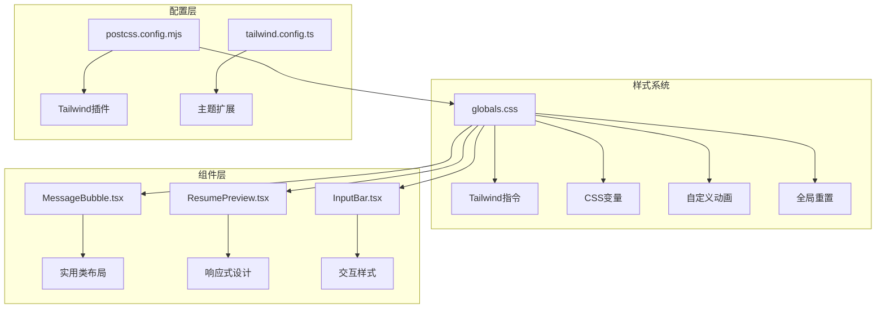
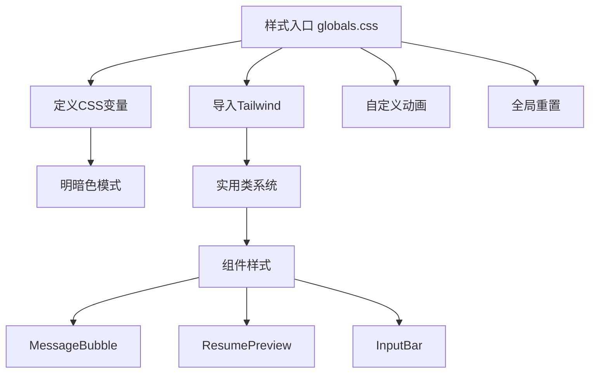
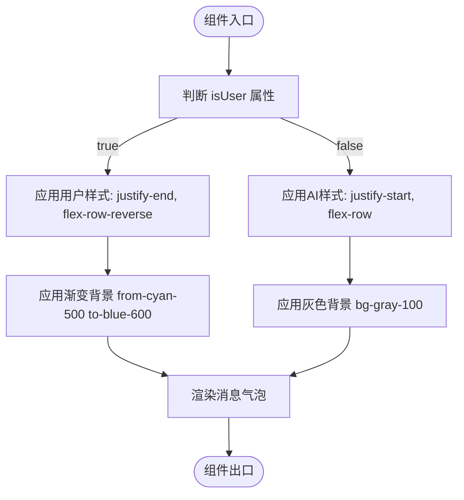

# 样式策略

<cite>
**本文档中引用的文件**   
- [globals.css](file://app/globals.css)
- [MessageBubble.tsx](file://components/MessageBubble.tsx)
- [ResumePreview.tsx](file://components/resume/ResumePreview.tsx)
- [postcss.config.mjs](file://postcss.config.mjs)
- [layout.tsx](file://app/layout.tsx)
- [LoadingDots.tsx](file://components/LoadingDots.tsx)
- [InputBar.tsx](file://components/InputBar.tsx)
- [ChatFlow.tsx](file://components/ChatFlow.tsx)
</cite>

## 目录
1. [项目结构](#项目结构)
2. [核心组件](#核心组件)
3. [架构概述](#架构概述)
4. [详细组件分析](#详细组件分析)
5. [依赖分析](#依赖分析)
6. [性能考虑](#性能考虑)
7. [故障排除指南](#故障排除指南)
8. [结论](#结论)

## 项目结构
ai-job-coach项目采用Next.js App Router架构，其样式系统以Tailwind CSS为核心，结合CSS自定义属性和实用类进行工程化管理。项目根目录下的`app`文件夹包含页面路由和全局样式，`components`文件夹存放可复用的UI组件。样式策略通过`globals.css`集中管理全局重置、自定义主题变量和关键帧动画，并通过PostCSS集成Tailwind。



**Diagram sources**
- [globals.css](file://app/globals.css)
- [postcss.config.mjs](file://postcss.config.mjs)

**Section sources**
- [globals.css](file://app/globals.css)
- [postcss.config.mjs](file://postcss.config.mjs)

## 核心组件
本项目的核心UI组件如`MessageBubble`、`ResumePreview`和`InputBar`均采用Tailwind CSS的实用类进行样式构建，实现了高度的响应式布局和视觉一致性。这些组件通过组合式类名直接在JSX中定义样式，避免了传统CSS文件的分散管理，同时利用CSS变量和自定义指令增强了主题的可维护性。

**Section sources**
- [MessageBubble.tsx](file://components/MessageBubble.tsx)
- [ResumePreview.tsx](file://components/resume/ResumePreview.tsx)
- [InputBar.tsx](file://components/InputBar.tsx)

## 架构概述
项目的样式架构遵循原子化CSS原则，将样式分解为最小的实用类单元，通过组合这些单元来构建复杂的UI。`globals.css`作为样式入口，首先引入Google Fonts和Tailwind基础指令，然后定义了一套基于CSS变量的主题系统，支持明暗色模式切换。组件层完全依赖实用类进行布局和样式定义，确保了代码的可读性和可维护性。



**Diagram sources**
- [globals.css](file://app/globals.css)
- [MessageBubble.tsx](file://components/MessageBubble.tsx)
- [ResumePreview.tsx](file://components/resume/ResumePreview.tsx)

## 详细组件分析

### 消息气泡组件分析
`MessageBubble`组件展示了如何使用Tailwind实用类构建响应式聊天界面。该组件根据`isUser`属性动态调整布局方向，用户消息右对齐，AI消息左对齐。通过`max-w-[80%]`限制气泡最大宽度，防止在小屏幕上溢出。颜色方案使用了渐变背景，用户消息采用`from-cyan-500 to-blue-600`的渐变，增强了视觉层次。



**Diagram sources**
- [MessageBubble.tsx](file://components/MessageBubble.tsx)

**Section sources**
- [MessageBubble.tsx](file://components/MessageBubble.tsx)

### 简历预览组件分析
`ResumePreview`组件采用Flexbox布局实现响应式设计。组件分为两个主要区域：顶部工具栏和内容区域。工具栏使用`flex items-center justify-between`实现左右对齐，内容区域使用`flex-1 overflow-y-auto`实现可滚动的主体内容。通过`truncate`和`max-w-none`等实用类处理文本溢出，确保在不同屏幕尺寸下都能良好显示。

```mermaid
classDiagram
class ResumePreview {
+resumeId : string
+fileName : string
+fileUrl : string
+parsedText : string | null
+onDelete() : void
+onDownload() : void
}
class FileIcon {
+getFileIcon() : JSX.Element
}
class FileSize {
+getFileSize() : string | null
}
ResumePreview --> FileIcon : "使用"
ResumePreview --> FileSize : "使用"
ResumePreview --> "div" : "渲染"
```

**Diagram sources**
- [ResumePreview.tsx](file://components/resume/ResumePreview.tsx)

**Section sources**
- [ResumePreview.tsx](file://components/resume/ResumePreview.tsx)

## 依赖分析
项目通过`package.json`声明了对Tailwind CSS和相关工具的依赖。`devDependencies`中包含`tailwindcss`和`@tailwindcss/postcss`，确保了构建时的样式处理。`postcss.config.mjs`配置文件将Tailwind作为PostCSS插件引入，实现了与Next.js构建系统的无缝集成。这种依赖管理方式确保了样式工具链的稳定性和可维护性。

```mermaid
graph LR
A[package.json] --> B[tailwindcss]
A --> C[@tailwindcss/postcss]
D[postcss.config.mjs] --> E[Tailwind插件]
B --> D
C --> D
D --> F[globals.css]
```

**Diagram sources**
- [package.json](file://package.json)
- [postcss.config.mjs](file://postcss.config.mjs)

**Section sources**
- [package.json](file://package.json)
- [postcss.config.mjs](file://postcss.config.mjs)

## 性能考虑
项目的样式系统在性能方面进行了优化。通过将Google Fonts的导入移至`globals.css`并考虑替换为本地字体，减少了构建时的网络请求。使用CSS变量定义主题颜色，配合`prefers-color-scheme`媒体查询实现明暗色模式切换，避免了JavaScript的介入，提升了渲染性能。实用类的使用也使得Tree Shaking能够有效移除未使用的CSS，减小了最终的CSS文件体积。

## 故障排除指南
当遇到样式问题时，首先检查`globals.css`中的CSS变量定义是否正确，特别是明暗色模式的变量。对于布局问题，确认是否正确使用了Flexbox或Grid的实用类。动画问题通常与自定义动画类名有关，如`animate-fade-in`和`animate-bounce`需要在`globals.css`中正确定义。响应式设计问题应检查断点类名的使用，确保在不同屏幕尺寸下应用了正确的样式。

**Section sources**
- [globals.css](file://app/globals.css)
- [layout.tsx](file://app/layout.tsx)
- [LoadingDots.tsx](file://components/LoadingDots.tsx)

## 结论
ai-job-coach项目的样式策略成功地将Tailwind CSS的实用类系统与CSS变量、自定义动画相结合，构建了一个高效、可维护的前端样式架构。通过`globals.css`集中管理全局样式和主题变量，组件层使用实用类实现响应式布局，项目在保持视觉一致性的同时，也确保了代码的可读性和可维护性。这种工程化的方法为大型React应用的样式管理提供了优秀的实践范例。