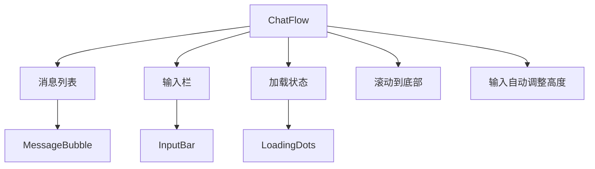
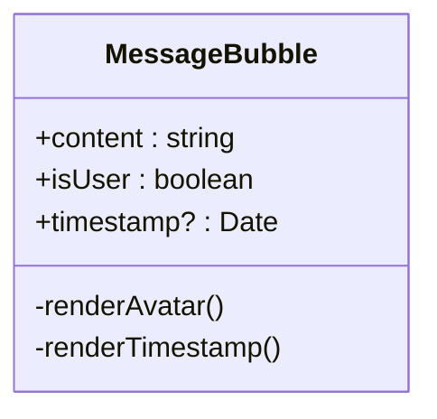
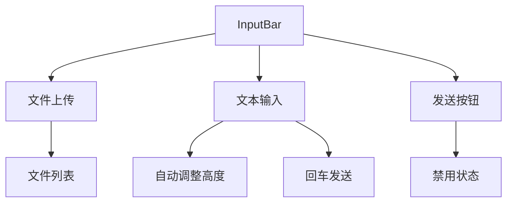
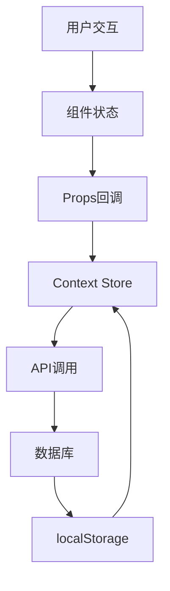

# 组件体系

<cite>
**本文档引用的文件**
- [ChatFlow.tsx](file://components/ChatFlow.tsx)
- [MessageBubble.tsx](file://components/MessageBubble.tsx)
- [InputBar.tsx](file://components/InputBar.tsx)
- [ResumeUploadBox.tsx](file://components/resume/ResumeUploadBox.tsx)
- [QuestionCard.tsx](file://components/interview/QuestionCard.tsx)
- [DynamicBoard.tsx](file://components/DynamicBoard.tsx)
- [Whiteboard.tsx](file://components/Whiteboard.tsx)
- [LoadingDots.tsx](file://components/LoadingDots.tsx)
- [EditableField.tsx](file://components/EditableField.tsx)
- [EditableList.tsx](file://components/EditableList.tsx)
- [EditableProjects.tsx](file://components/EditableProjects.tsx)
- [interviewStore.tsx](file://store/interviewStore.tsx)
- [conversationStore.ts](file://lib/conversationStore.ts)
- [stage.ts](file://lib/stage.ts)
- [page.tsx](file://app/chat/page.tsx)
</cite>

## 目录
1. [简介](#简介)
2. [核心组件概览](#核心组件概览)
3. [聊天流程组件](#聊天流程组件)
4. [消息气泡组件](#消息气泡组件)
5. [输入栏组件](#输入栏组件)
6. [业务场景组件](#业务场景组件)
7. [状态管理与数据流](#状态管理与数据流)
8. [可访问性与响应式设计](#可访问性与响应式设计)
9. [性能优化策略](#性能优化策略)
10. [组件组合模式](#组件组合模式)

## 简介
ai-job-coach 组件体系是一套专为求职辅导场景设计的可复用UI组件库，核心围绕对话式交互体验构建。该体系通过ChatFlow组件协调对话流程，集成消息气泡、输入栏与白板等组件，形成完整的交互闭环。组件设计遵循单一职责原则，通过清晰的Props接口和事件回调机制实现高内聚低耦合，支持在不同业务场景（如简历优化、模拟面试）中灵活复用。本文档将深入分析核心组件的设计与实现，阐述其如何协同工作以提供流畅的用户体验。

## 核心组件概览
ai-job-coach的组件体系以聊天界面为核心，包含多个可复用的UI组件。ChatFlow作为主控组件，负责协调消息列表、输入栏和加载状态的展示。MessageBubble组件根据消息来源（用户/AI）渲染不同样式的气泡，并支持富文本内容展示。InputBar组件处理用户输入、文件上传和发送逻辑。此外，体系还包含ResumeUploadBox、QuestionCard等针对特定业务场景的专用组件。这些组件通过清晰的接口定义和事件机制进行通信，形成了一个模块化、可扩展的UI架构。

**Section sources**
- [ChatFlow.tsx](file://components/ChatFlow.tsx#L1-L167)
- [MessageBubble.tsx](file://components/MessageBubble.tsx#L1-L53)
- [InputBar.tsx](file://components/InputBar.tsx#L1-L122)

## 聊天流程组件
ChatFlow组件是聊天界面的核心控制器，负责协调整个对话流程。它接收消息列表、输入值、输入变更和发送事件等Props，通过内部状态管理实现消息滚动到底部、输入自动调整高度等交互功能。组件将消息列表渲染为MessageBubble组件的集合，并在AI响应时显示LoadingDots加载动画。输入栏被固定在视口底部，确保在任何滚动位置都可访问。ChatFlow通过useEffect钩子监听消息和加载状态的变化，自动触发滚动到底部的动画，保证最新的消息始终可见。

**Diagram sources**
- [ChatFlow.tsx](file://components/ChatFlow.tsx#L1-L167)

**Section sources**
- [ChatFlow.tsx](file://components/ChatFlow.tsx#L1-L167)
- [LoadingDots.tsx](file://components/LoadingDots.tsx#L1-L15)

## 消息气泡组件
MessageBubble组件根据消息的来源（用户或AI）渲染不同样式的对话气泡。当isUser为true时，气泡显示在右侧，使用蓝青色渐变背景和白色文字；当isUser为false时，气泡显示在左侧，使用浅灰色背景和深色文字。组件通过flex布局的flex-row-reverse属性实现左右对齐的切换。AI消息会显示一个默认头像，而用户消息则显示一个带有"我"字样的占位头像。消息内容使用whitespace-pre-wrap样式保留换行和空格，支持富文本展示。时间戳根据角色使用不同的颜色，并在用户消息中显示为浅蓝色，在AI消息中显示为灰色。

**Diagram sources**
- [MessageBubble.tsx](file://components/MessageBubble.tsx#L1-L53)

**Section sources**
- [MessageBubble.tsx](file://components/MessageBubble.tsx#L1-L53)

## 输入栏组件
InputBar组件处理用户的输入和发送逻辑。它接收输入值、值变更回调和发送回调等Props，内部管理已上传文件的列表状态。用户可以通过文件上传按钮选择PDF或DOCX格式的文件，组件会显示已上传文件的名称列表，并支持删除单个文件。输入框支持回车键发送消息（Shift+回车换行），并会在输入时自动调整高度。发送按钮在输入为空或处于加载状态时被禁用。组件通过ref引用文件输入元素，实现点击按钮触发文件选择对话框的功能。所有交互元素都具有悬停效果和禁用状态样式，提供良好的视觉反馈。

**Diagram sources**
- [InputBar.tsx](file://components/InputBar.tsx#L1-L122)

**Section sources**
- [InputBar.tsx](file://components/InputBar.tsx#L1-L122)

## 业务场景组件
### 简历上传组件
ResumeUploadBox组件为简历上传场景提供专用的UI。它显示一个虚线边框的上传区域，包含上传图标、标题和格式说明。用户点击区域后会触发文件选择对话框。组件通过useCallback优化事件处理函数，避免不必要的重渲染。文件输入元素被隐藏，通过ref引用和点击事件触发。该组件设计简洁直观，引导用户完成简历上传操作。

**Section sources**
- [ResumeUploadBox.tsx](file://components/resume/ResumeUploadBox.tsx#L1-L56)

### 面试问题卡片组件
QuestionCard组件用于显示面试问题，但根据代码注释，该组件已被禁用，新的面试系统已迁移到其他页面。组件原本设计为显示问题内容、题号、状态和用户回答，使用framer-motion实现进入动画。它通过props接收问题对象、当前题号和总题数，动态生成Q1/5这样的题号标识。尽管当前未使用，但其设计模式体现了组件化和状态驱动的UI理念。

**Section sources**
- [QuestionCard.tsx](file://components/interview/QuestionCard.tsx#L1-L76)

## 状态管理与数据流
ai-job-coach通过多种机制管理应用状态。对于全局的面试流程状态，使用React Context API实现的interviewStore.tsx进行管理，存储会话ID、用户ID、问题列表、对话历史等信息，并提供一系列操作方法。对于跨阶段的对话历史，使用conversationStore.ts进行管理，按用户阶段分类存储消息，并实现localStorage持久化。组件间通过props传递数据和回调函数进行通信，如ChatFlow将输入值和变更函数传递给InputBar。白板数据通过onUpdate回调在DynamicBoard和父组件间同步。这种分层的状态管理策略确保了数据的一致性和可维护性。

**Diagram sources**
- [interviewStore.tsx](file://store/interviewStore.tsx#L1-L789)
- [conversationStore.ts](file://lib/conversationStore.ts#L1-L258)
- [stage.ts](file://lib/stage.ts#L1-L85)

**Section sources**
- [interviewStore.tsx](file://store/interviewStore.tsx#L1-L789)
- [conversationStore.ts](file://lib/conversationStore.ts#L1-L258)
- [stage.ts](file://lib/stage.ts#L1-L85)

## 可访问性与响应式设计
组件体系充分考虑了可访问性和响应式设计。所有交互元素都具有适当的aria标签和键盘导航支持，如按钮的disabled状态会同时禁用点击和键盘操作。文本区域支持Shift+回车换行，符合用户习惯。组件使用Tailwind CSS的响应式前缀，如md:w-[70%]确保在移动设备上输入栏不会过宽。消息气泡使用max-w-[80%]限制宽度，防止在小屏幕上溢出。白板组件在不同阶段显示相应的内容，通过条件渲染实现内容的动态适应。整体设计遵循移动优先原则，确保在各种设备上都有良好的用户体验。

**Section sources**
- [ChatFlow.tsx](file://components/ChatFlow.tsx#L1-L167)
- [InputBar.tsx](file://components/InputBar.tsx#L1-L122)
- [Whiteboard.tsx](file://components/Whiteboard.tsx#L1-L541)

## 性能优化策略
组件体系采用了多种性能优化策略。对于可编辑组件（EditableField、EditableList、EditableProjects），使用useCallback和useEffect的依赖数组优化，避免不必要的重渲染。文件上传和API调用使用异步处理，防止阻塞主线程。对话历史的分析使用防抖技术（debounce），避免在用户快速输入时频繁调用分析API。消息列表的滚动使用smooth行为，提供流畅的动画体验。组件结构清晰，职责单一，便于后续进行React.memo等更高级的优化。通过合理使用ref和回调函数，减少了不必要的状态提升，保持了组件树的扁平化。

**Section sources**
- [EditableField.tsx](file://components/EditableField.tsx#L1-L118)
- [EditableList.tsx](file://components/EditableList.tsx#L1-L133)
- [EditableProjects.tsx](file://components/EditableProjects.tsx#L1-L147)
- [page.tsx](file://app/chat/page.tsx#L1-L800)

## 组件组合模式
在实际应用中，组件通过组合模式形成完整的用户界面。例如，在聊天页面中，ChatFlow组件集成MessageBubble和InputBar，形成基本的聊天界面。Whiteboard组件作为侧边栏，与主聊天区并列，展示从对话中提取的关键信息。在简历优化阶段，Whiteboard会显示简历摘要和优化建议，并提供查看对比的入口。这种组合模式使得UI结构清晰，各组件职责明确。通过将通用组件（如输入栏、消息气泡）与业务组件（如简历上传、问题卡片）结合，实现了功能的灵活扩展和代码的高效复用，体现了组件化开发的优势。

**Section sources**
- [page.tsx](file://app/chat/page.tsx#L1-L800)
- [DynamicBoard.tsx](file://components/DynamicBoard.tsx#L1-L247)
- [Whiteboard.tsx](file://components/Whiteboard.tsx#L1-L541)