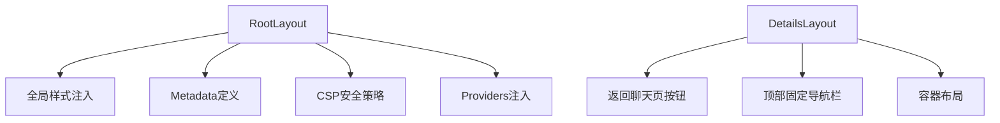
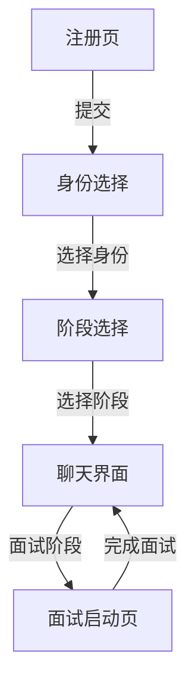
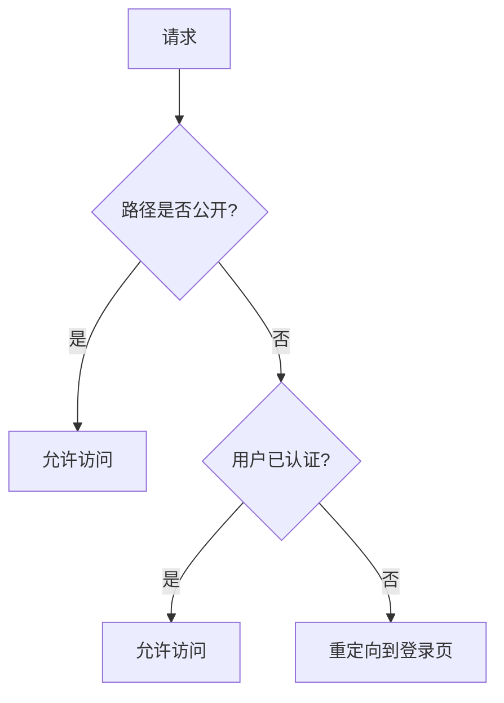
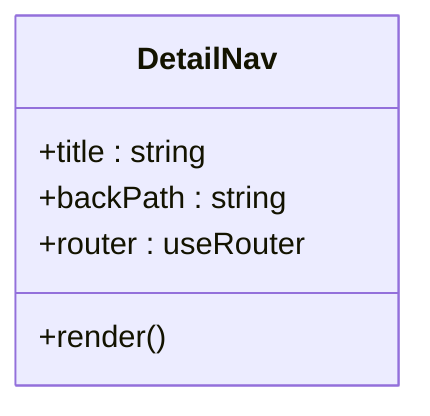

# 路由与导航

<cite>
**本文档引用文件**   
- [app\layout.tsx](file://app/layout.tsx)
- [app\page.tsx](file://app/page.tsx)
- [app\details\layout.tsx](file://app/details/layout.tsx)
- [app\chat\page.tsx](file://app/chat/page.tsx)
- [app\interview\start\page.tsx](file://app/interview/start/page.tsx)
- [app\login\page.tsx](file://app/login/page.tsx)
- [app\register\page.tsx](file://app/register/page.tsx)
- [app\onboarding\identity-select\page.tsx](file://app/onboarding/identity-select/page.tsx)
- [components\detail-nav.tsx](file://components/detail-nav.tsx)
- [middleware.ts](file://middleware.ts)
</cite>

## 目录
1. [简介](#简介)
2. [项目结构与路由映射](#项目结构与路由映射)
3. [核心路由组件分析](#核心路由组件分析)
4. [布局系统与嵌套路由](#布局系统与嵌套路由)
5. [页面导航与跳转逻辑](#页面导航与跳转逻辑)
6. [动态路由与参数处理](#动态路由与参数处理)
7. [路由守卫与认证机制](#路由守卫与认证机制)
8. [加载状态与SEO配置](#加载状态与seo配置)
9. [客户端与服务端渲染策略](#客户端与服务端渲染策略)
10. [详情页内部导航](#详情页内部导航)
11. [结论](#结论)

## 简介
本文档全面阐述了基于Next.js App Router架构的前端路由与导航系统。系统通过app目录下的文件结构实现路由映射，支持静态路由、动态路由和嵌套路由。用户流程从注册开始，经过身份选择，最终进入核心聊天界面。路由系统集成了认证守卫、加载状态管理、SEO优化和客户端/服务端渲染切换等高级功能，为用户提供流畅的求职辅导体验。

## 项目结构与路由映射
Next.js App Router通过app目录下的文件和文件夹结构自动映射到相应的路由路径。每个page.tsx文件对应一个具体的路由端点。

```mermaid
graph TD
A[app] --> B[/]
A --> C[/chat]
A --> D[/login]
A --> E[/register]
A --> F[/onboarding/identity-select]
A --> G[/interview/start]
A --> H[/details/interview[id]]
A --> I[/chat/interview[round]]
A --> J[/chat/interview-report[id]]
```

**图示来源**
- [app\page.tsx](file://app/page.tsx)
- [app\chat\page.tsx](file://app/chat/page.tsx)
- [app\login\page.tsx](file://app/login/page.tsx)
- [app\register\page.tsx](file://app/register/page.tsx)
- [app\onboarding\identity-select\page.tsx](file://app/onboarding/identity-select/page.tsx)
- [app\interview\start\page.tsx](file://app/interview/start/page.tsx)

## 核心路由组件分析
系统包含多个核心路由组件，每个组件负责特定的功能模块。根页面（page.tsx）作为应用入口，根据会话状态决定跳转到聊天页或显示主页。

**页面来源**
- [app\page.tsx](file://app/page.tsx#L1-L126)
- [app\chat\page.tsx](file://app/chat/page.tsx#L1-L800)
- [app\login\page.tsx](file://app/login/page.tsx#L1-L388)

## 布局系统与嵌套路由
布局系统通过layout.tsx文件实现，提供全局和局部布局。根布局定义了HTML文档结构、元数据和全局样式，而详情页布局提供了特定的导航功能。



**图示来源**
- [app\layout.tsx](file://app/layout.tsx#L1-L58)
- [app\details\layout.tsx](file://app/details/layout.tsx#L1-L39)

**页面来源**
- [app\layout.tsx](file://app/layout.tsx#L1-L58)
- [app\details\layout.tsx](file://app/details/layout.tsx#L1-L39)

## 页面导航与跳转逻辑
页面间导航通过useRouter钩子和router.push方法实现。系统定义了清晰的用户流程：注册→选择身份→进入聊天界面。导航逻辑确保用户在不同阶段能够顺畅跳转。



**图示来源**
- [app\register\page.tsx](file://app/register/page.tsx#L1-L26)
- [app\onboarding\identity-select\page.tsx](file://app/onboarding/identity-select/page.tsx#L1-L252)
- [app\chat\page.tsx](file://app/chat/page.tsx#L1-L800)
- [app\interview\start\page.tsx](file://app/interview/start/page.tsx#L1-L712)

## 动态路由与参数处理
系统广泛使用动态路由来处理可变内容。方括号[]语法定义动态段，如[interview/round]用于面试轮次，[id]用于详情页标识。这些动态参数在页面组件中通过params对象访问。

**页面来源**
- [app\chat\interview\[round]\page.tsx](file://app/chat/interview/[round]/page.tsx)
- [app\details\interview\[id]\page.tsx](file://app/details/interview/[id]/page.tsx)
- [app\chat\interview-report\[id]\page.tsx](file://app/chat/interview-report/[id]/page.tsx)

## 路由守卫与认证机制
路由守卫通过middleware.ts实现，拦截未认证用户的访问请求。系统保护除登录、注册和API路由外的所有路径，确保只有经过认证的用户才能访问核心功能。



**图示来源**
- [middleware.ts](file://middleware.ts#L1-L170)

**页面来源**
- [middleware.ts](file://middleware.ts#L1-L170)

## 加载状态与SEO配置
系统实现了加载状态管理，通过isLoading状态变量控制UI反馈。SEO配置在layout.tsx中通过Metadata对象定义，包括页面标题和描述，提升搜索引擎可见性。

**页面来源**
- [app\layout.tsx](file://app/layout.tsx#L7-L10)
- [app\chat\page.tsx](file://app/chat/page.tsx#L18-L20)
- [app\interview\start\page.tsx](file://app/interview/start/page.tsx#L43-L44)

## 客户端与服务端渲染策略
系统采用混合渲染策略。根布局和页面使用服务端渲染获取初始数据，而交互组件标记为客户端组件，实现动态交互。这种策略平衡了性能和用户体验。

**页面来源**
- [app\layout.tsx](file://app/layout.tsx#L1)
- [app\page.tsx](file://app/page.tsx#L1)
- [app\chat\page.tsx](file://app/chat/page.tsx#L1)

## 详情页内部导航
detail-nav.tsx组件提供详情页的内部导航功能，包含返回按钮和可选标题。该组件作为客户端组件，使用useRouter实现导航控制，确保在详情页间切换时保持用户体验一致性。



**图示来源**
- [components\detail-nav.tsx](file://components/detail-nav.tsx#L1-L34)

**页面来源**
- [components\detail-nav.tsx](file://components/detail-nav.tsx#L1-L34)

## 结论
本路由与导航系统基于Next.js App Router构建，实现了清晰的路由映射、灵活的布局继承和安全的访问控制。通过动态路由、参数处理和混合渲染策略，系统为用户提供高效、安全的求职辅导体验。未来可进一步优化加载状态和错误处理，提升整体用户体验。