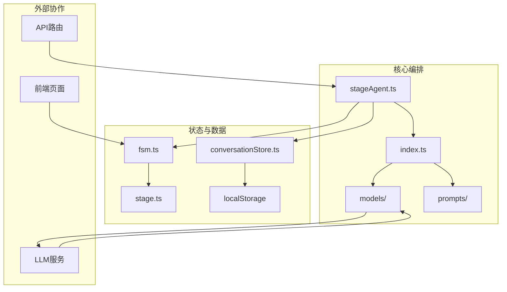
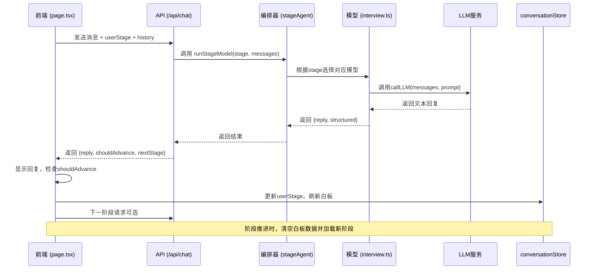
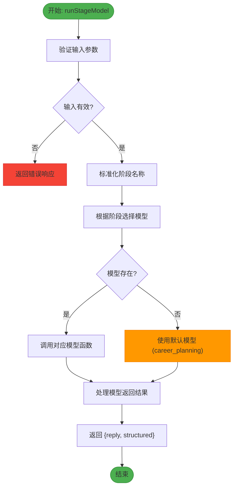
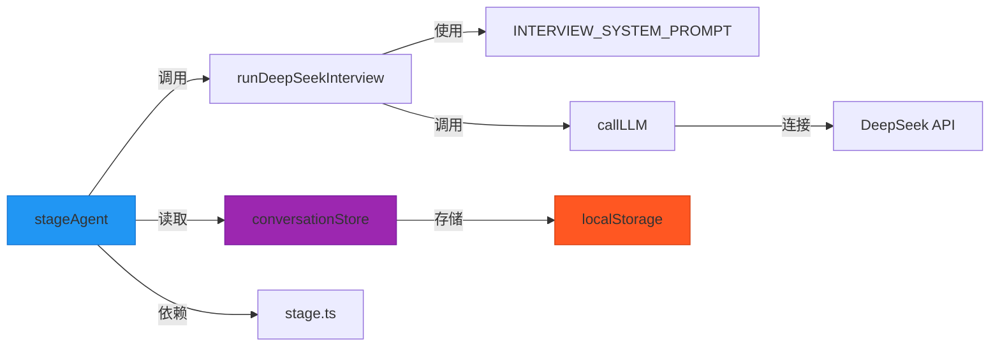

# AI流程编排器

<cite>
**本文档引用文件**   
- [stageAgent.ts](file://lib/orchestrator/stageAgent.ts)
- [index.ts](file://lib/orchestrator/index.ts)
- [fsm.ts](file://lib/fsm.ts)
- [conversationStore.ts](file://lib/conversationStore.ts)
- [stage.ts](file://lib/stage.ts)
- [interview.ts](file://lib/orchestrator/models/interview.ts)
- [interview.ts](file://lib/orchestrator/prompts/interview.ts)
- [stage_implementation.md](file://lib/stage_implementation.md)
- [README.md](file://lib/orchestrator/README.md)
</cite>

## 目录
1. [简介](#简介)
2. [项目结构](#项目结构)
3. [核心组件](#核心组件)
4. [架构概述](#架构概述)
5. [详细组件分析](#详细组件分析)
6. [依赖分析](#依赖分析)
7. [性能考虑](#性能考虑)
8. [故障排除指南](#故障排除指南)
9. [结论](#结论)

## 简介
AI流程编排器是求职教练系统的核心组件，负责根据用户当前所处的求职阶段（如简历优化、模拟面试、薪资谈判等）动态切换AI的行为策略。该系统基于有限状态机（FSM）实现阶段管理，通过`stageAgent.ts`协调不同阶段的模型逻辑与提示词模板，驱动AI在各阶段间流转。编排器与对话存储（conversationStore）和LLM调用链紧密协作，确保上下文连贯性和状态一致性。本文档深入解析其状态流转机制、核心方法执行逻辑、错误恢复策略及扩展方式，并提供调试建议与测试方案。

## 项目结构
AI流程编排器的逻辑主要集中在`lib/orchestrator`目录下，通过模块化设计实现阶段驱动的AI行为切换。系统采用分层架构，将状态管理、对话存储、模型调用与提示词定义分离，确保高内聚低耦合。



**图示来源**
- [stageAgent.ts](file://lib/orchestrator/stageAgent.ts#L1-L99)
- [index.ts](file://lib/orchestrator/index.ts#L1-L126)
- [fsm.ts](file://lib/fsm.ts#L1-L125)
- [conversationStore.ts](file://lib/conversationStore.ts#L1-L258)

**本节来源**
- [stageAgent.ts](file://lib/orchestrator/stageAgent.ts#L1-L99)
- [fsm.ts](file://lib/fsm.ts#L1-L125)
- [conversationStore.ts](file://lib/conversationStore.ts#L1-L258)

## 核心组件
AI流程编排器的核心由`stageAgent.ts`驱动，它作为统一的阶段路由，根据`UserStage`状态决定调用哪个具体模型。每个阶段（如`interview`、`resume_optimization`）都有对应的模型实现和提示词模板，确保AI行为的专业性和针对性。`conversationStore`负责管理各阶段的独立对话历史，而`fsm.ts`则提供前端UI的状态机支持，两者协同确保用户体验的连贯性。尽管当前代码中LangChain相关逻辑被禁用，但其设计保留了未来启用复杂编排的扩展性。

**本节来源**
- [stageAgent.ts](file://lib/orchestrator/stageAgent.ts#L1-L99)
- [conversationStore.ts](file://lib/conversationStore.ts#L1-L258)
- [fsm.ts](file://lib/fsm.ts#L1-L125)

## 架构概述
AI流程编排器采用基于有限状态机的架构，实现从职业规划到Offer获取的全流程引导。系统通过`UserStage`枚举定义了七个标准阶段，并利用`runStageModel`函数作为路由中枢，根据当前阶段加载对应的模型逻辑和提示词。整个流程由前端、后端API和数据存储三部分协同完成。



**图示来源**
- [stageAgent.ts](file://lib/orchestrator/stageAgent.ts#L35-L70)
- [interview.ts](file://lib/orchestrator/models/interview.ts#L27-L69)
- [conversationStore.ts](file://lib/conversationStore.ts#L46-L258)
- [stage_implementation.md](file://lib/stage_implementation.md#L35-L322)

## 详细组件分析
### stageAgent.ts 分析
`stageAgent.ts`是AI流程编排的核心，它定义了`runStageModel`函数作为阶段路由的入口。该函数接收当前`UserStage`和对话消息，通过`switch`语句选择并调用对应阶段的模型函数（如`runDeepSeekInterview`）。尽管当前所有子模块调用被注释（LangChain disabled），但其设计清晰地展示了如何通过阶段名称标准化（`normalizeStage`）来处理可能的输入变体，确保路由的健壮性。该文件还定义了`UserStage`联合类型，明确列出了所有支持的求职阶段。

#### 核心方法执行逻辑


**图示来源**
- [stageAgent.ts](file://lib/orchestrator/stageAgent.ts#L35-L70)

**本节来源**
- [stageAgent.ts](file://lib/orchestrator/stageAgent.ts#L1-L99)

### 模型与提示词加载机制
系统通过`lib/orchestrator/models`和`lib/orchestrator/prompts`两个目录分别管理各阶段的业务逻辑和提示词。以`interview`阶段为例，`models/interview.ts`中的`runDeepSeekInterview`函数负责构建包含`INTERVIEW_SYSTEM_PROMPT`的完整消息序列，并调用底层LLM服务。提示词模板（如`prompts/interview.ts`中的`INTERVIEW_SYSTEM_PROMPT`）被设计为常量字符串，明确界定了AI在该阶段的角色、任务、原则和输出要求，实现了逻辑与配置的分离。

```mermaid
classDiagram
class runDeepSeekInterview {
+messages : {role, content}[]
+INTERVIEW_SYSTEM_PROMPT : string
+callLLM() : Promise~{reply, structured}~
+runDeepSeekInterview(messages) : Promise~InterviewResult~
}
class INTERVIEW_SYSTEM_PROMPT {
+role : string
+tasks : string[]
+principles : string[]
+outputRequirements : string[]
}
class callLLM {
+messages : {role, content}[]
+options : {temperature, maxTokens, provider}
+callLLM(messages, options) : Promise~string~
}
runDeepSeekInterview --> INTERVIEW_SYSTEM_PROMPT : "使用"
runDeepSeekInterview --> callLLM : "调用"
```

**图示来源**
- [interview.ts](file://lib/orchestrator/models/interview.ts#L27-L69)
- [interview.ts](file://lib/orchestrator/prompts/interview.ts#L5-L32)
- [llm.ts](file://lib/llm.ts)

**本节来源**
- [interview.ts](file://lib/orchestrator/models/interview.ts#L1-L69)
- [interview.ts](file://lib/orchestrator/prompts/interview.ts#L1-L32)

### 编排器与协作组件关系
AI流程编排器与`conversationStore`和潜在的LLM调用链（chains）构成核心协作网络。`conversationStore`作为单例，管理着所有阶段的对话历史，其`getAllHistoryForStage`方法为编排器提供了完整的上下文信息。编排器在调用模型前，会将当前阶段及历史对话整合，确保AI响应的连贯性。虽然当前`chains`目录存在，但主要逻辑仍集中在直接的LLM调用上。



**图示来源**
- [stageAgent.ts](file://lib/orchestrator/stageAgent.ts#L35-L70)
- [conversationStore.ts](file://lib/conversationStore.ts#L75-L121)
- [stage.ts](file://lib/stage.ts#L6-L85)

**本节来源**
- [stageAgent.ts](file://lib/orchestrator/stageAgent.ts#L1-L99)
- [conversationStore.ts](file://lib/conversationStore.ts#L1-L258)
- [stage.ts](file://lib/stage.ts#L1-L85)

## 依赖分析
AI流程编排器的依赖关系清晰，体现了模块化设计原则。其核心依赖包括`stage.ts`提供的阶段定义与工具函数、`conversationStore.ts`提供的对话历史管理，以及`lib/llm.ts`提供的底层LLM调用能力。各阶段模型（如`interview.ts`）依赖于`prompts/`目录下的提示词常量。前端组件通过`fsm.ts`的React Hook与编排器状态保持同步。这种设计使得新增阶段（如`career_planning`）只需在`models`和`prompts`中添加对应文件，并在`runStageModel`中添加`case`分支即可，扩展性良好。

```mermaid
graph TD
A[stageAgent.ts] --> B[stage.ts]
A --> C[conversationStore.ts]
A --> D[models/interview.ts]
A --> E[models/resume_optimization.ts]
A --> F[models/salary_talk.ts]
D --> G[prompts/interview.ts]
E --> H[prompts/resume_optimization.ts]
F --> I[prompts/salary_talk.ts]
D --> J[llm.ts]
E --> J
F --> J
K[fsm.ts] --> B
L[page.tsx] --> K
M[/api/chat] --> A
style A fill:#3F51B5,stroke:#303F9F
style B fill:#009688,stroke:#00796B
style C fill:#9C27B0,stroke:#7B1FA2
style J fill:#FF9800,stroke:#F57C00
```

**图示来源**
- [stageAgent.ts](file://lib/orchestrator/stageAgent.ts#L18-L25)
- [stage.ts](file://lib/stage.ts#L6-L85)
- [conversationStore.ts](file://lib/conversationStore.ts#L5-L6)
- [interview.ts](file://lib/orchestrator/models/interview.ts#L5-L6)

**本节来源**
- [stageAgent.ts](file://lib/orchestrator/stageAgent.ts#L1-L99)
- [stage.ts](file://lib/stage.ts#L1-L85)
- [conversationStore.ts](file://lib/conversationStore.ts#L1-L258)

## 性能考虑
当前编排器的设计在性能方面有明确考量。`conversationStore`通过`localStorage`实现了对话历史的持久化，避免了重复加载，提升了用户体验。`fsm.ts`使用`useMemo`优化了返回对象的引用，防止不必要的组件重渲染。然而，由于所有模型调用均在服务器端进行，且每次请求都需构建完整上下文，网络延迟和LLM响应时间是主要性能瓶颈。未来可通过实现缓存机制（如缓存常见问题的回复）和优化上下文长度（如仅传递最近N条消息）来提升性能。

## 故障排除指南
当AI流程编排器出现异常时，可遵循以下步骤进行排查：
1.  **检查阶段状态**：确认前端`userStage`与后端接收到的`userStage`一致，可通过`localStorage`中的`ajc_userStage`手动验证。
2.  **验证API响应**：使用浏览器开发者工具检查`/api/chat`的请求与响应。确保返回的JSON包含`reply`，并检查`shouldAdvance`和`nextStage`字段是否符合预期。
3.  **审查提示词**：如果AI行为偏离预期，检查对应阶段的`prompts/*.ts`文件，确认系统提示词（system prompt）是否准确描述了该阶段的任务和原则。
4.  **模拟测试**：通过`fetch` API手动发送测试请求，验证编排器路由逻辑。例如，发送`"我完成了"`应触发`shouldAdvance: true`。
5.  **检查依赖**：确保`stage.ts`中定义的`UserStage`与`stageAgent.ts`中的`switch`分支完全匹配，避免因阶段名称不一致导致的路由失败。

**本节来源**
- [stage_implementation.md](file://lib/stage_implementation.md#L230-L271)
- [conversationStore.ts](file://lib/conversationStore.ts#L186-L227)
- [stageAgent.ts](file://lib/orchestrator/stageAgent.ts#L35-L70)

## 结论
AI流程编排器通过`stageAgent.ts`实现了基于有限状态机的智能求职流程引导。它通过`UserStage`状态精确控制AI在不同求职阶段（简历优化、模拟面试、薪资谈判等）的行为策略，利用模块化的模型和提示词设计实现了动态响应生成。编排器与`conversationStore`和`fsm`紧密协作，确保了对话上下文的连贯性和用户界面的一致性。尽管当前LangChain功能被禁用，但其架构为未来的复杂流程编排预留了空间。系统具备良好的扩展性，新增阶段只需遵循既定模式添加模型和提示词文件。通过遵循文档提供的调试和测试方案，可以有效保障系统的稳定运行。