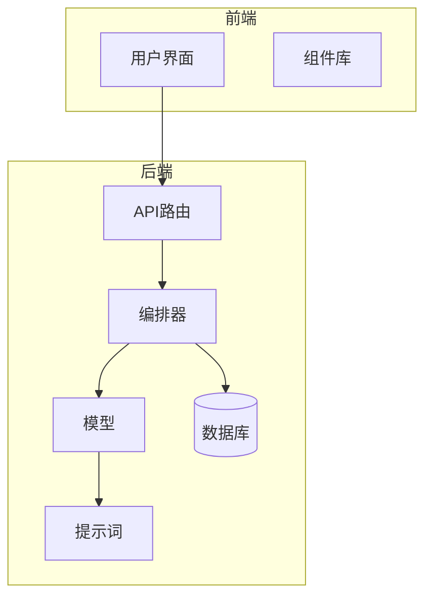
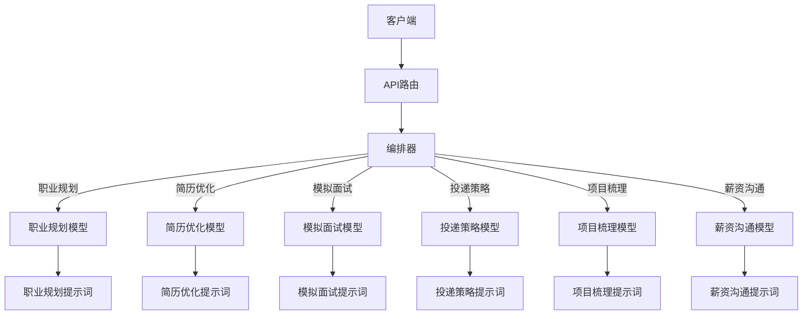
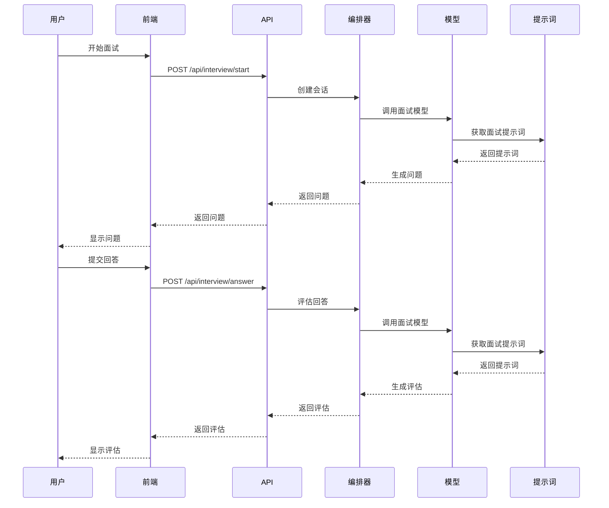
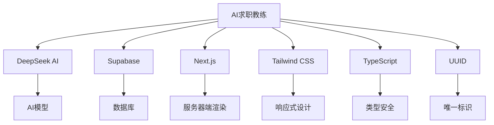

# 提示词管理

<cite>
**本文档引用文件**  
- [interview.ts](file://lib/orchestrator/prompts/interview.ts)
- [resume_optimization.ts](file://lib/orchestrator/prompts/resume_optimization.ts)
- [career_planning.ts](file://lib/orchestrator/prompts/career_planning.ts)
- [application_strategy.ts](file://lib/orchestrator/prompts/application_strategy.ts)
- [project_review.ts](file://lib/orchestrator/prompts/project_review.ts)
- [salary_talk.ts](file://lib/orchestrator/prompts/salary_talk.ts)
- [interview.ts](file://lib/orchestrator/models/interview.ts)
- [resume_optimization.ts](file://lib/orchestrator/models/resume_optimization.ts)
- [career_planning.ts](file://lib/orchestrator/models/career_planning.ts)
- [route.ts](file://app/api/interview/route.ts)
- [start/route.ts](file://app/api/interview/start/route.ts)
- [answer/route.ts](file://app/api/interview/answer/route.ts)
- [types.ts](file://lib/interview/types.ts)
- [index.ts](file://lib/orchestrator/index.ts)
- [stageAgent.ts](file://lib/orchestrator/stageAgent.ts)
- [README.md](file://README.md)
</cite>

## 目录
1. [介绍](#介绍)
2. [项目结构](#项目结构)
3. [核心组件](#核心组件)
4. [架构概述](#架构概述)
5. [详细组件分析](#详细组件分析)
6. [依赖分析](#依赖分析)
7. [性能考虑](#性能考虑)
8. [故障排除指南](#故障排除指南)
9. [结论](#结论)

## 介绍
AI求职教练是一个基于Next.js和DeepSeek AI的智能求职助手应用，旨在帮助用户优化简历、准备面试、进行薪资谈判等求职相关任务。该系统通过多阶段提示词模板设计，引导AI生成符合特定求职场景的专业回复，并支持动态上下文注入。系统涵盖了职业规划、简历优化、模拟面试、投递策略、项目梳理、薪资沟通等多个求职阶段，每个阶段都有专门设计的提示词模板和业务逻辑。

## 项目结构
项目采用模块化设计，主要分为API路由、UI组件、业务逻辑和配置文件四个部分。API路由位于`app/api/`目录下，处理各种求职场景的请求；UI组件位于`components/`目录下，提供可复用的界面元素；业务逻辑集中在`lib/`目录下，包含提示词管理、模型调用和状态管理等核心功能；配置文件和文档位于根目录和`docs/`目录下。



**图源**  
- [README.md](file://README.md#L130-L145)

## 核心组件
系统的核心组件包括提示词管理系统、多模型编排器、面试API和简历优化功能。提示词管理系统为每个求职阶段设计了专门的系统提示词，引导AI生成专业回复。多模型编排器根据用户当前阶段自动选择对应的模型和提示词。面试API支持完整的面试流程，包括开始面试、回答问题、获取评估和生成总结报告。简历优化功能帮助用户改进简历内容，突出核心技能和项目成果。

**章节来源**  
- [interview.ts](file://lib/orchestrator/prompts/interview.ts#L1-L32)
- [resume_optimization.ts](file://lib/orchestrator/prompts/resume_optimization.ts#L1-L31)
- [career_planning.ts](file://lib/orchestrator/prompts/career_planning.ts#L1-L25)

## 架构概述
系统采用分层架构设计，前端通过API路由与后端交互，后端通过编排器协调各个模型和提示词。每个求职阶段都有对应的提示词模板和模型，编排器根据用户阶段选择合适的模型进行处理。系统支持两种模式：当配置了DeepSeek API密钥时使用真实AI模型，否则使用stub模式返回预设响应。



**图源**  
- [index.ts](file://lib/orchestrator/index.ts#L8-L116)
- [stageAgent.ts](file://lib/orchestrator/stageAgent.ts#L8-L63)

## 详细组件分析
### 模拟面试组件分析
模拟面试组件是系统的核心功能之一，支持完整的面试流程。用户可以创建面试会话，系统根据职位描述生成针对性的面试问题。用户回答问题后，系统会进行评估并提供改进建议。完成一轮面试后，系统会生成详细的总结报告。

#### 模拟面试序列图


**图源**  
- [start/route.ts](file://app/api/interview/start/route.ts#L1-L175)
- [answer/route.ts](file://app/api/interview/answer/route.ts#L1-L205)

#### 模拟面试提示词设计
模拟面试的系统提示词定义了AI作为专业面试官的角色和任务，包括根据岗位要求设计面试问题、进行模拟面试、评估用户回答质量和提供改进建议。提示词还规定了面试原则和引导原则，确保面试过程的专业性和有效性。

```mermaid
classDiagram
class InterviewPrompt {
+string INTERVIEW_SYSTEM_PROMPT
+核心任务
+面试原则
+引导原则
+输出要求
}
InterviewPrompt : 核心任务 : 1. 设计面试问题<br/>2. 进行模拟面试<br/>3. 评估回答质量<br/>4. 提供改进建议
InterviewPrompt : 面试原则 : - 问题要有针对性<br/>- 使用STAR法则评估<br/>- 多维度评分<br/>- 提供具体建议
InterviewPrompt : 引导原则 : - 每次问一个问题<br/>- 等待回答后再评估<br/>- 给出评分和反馈<br/>- 继续下一个问题
InterviewPrompt : 输出要求 : - 自然对话回复<br/>- 完成面试后生成报告
```

**图源**  
- [interview.ts](file://lib/orchestrator/prompts/interview.ts#L1-L32)

### 简历优化组件分析
简历优化组件帮助用户改进简历内容，突出核心技能和项目成果。系统分析用户提供的简历内容，提供具体的优化建议，帮助用户用更专业的语言描述经历，突出量化成果和核心技能。

#### 简历优化提示词设计
简历优化的系统提示词定义了AI作为专业简历优化顾问的角色和任务，包括分析简历内容、提供优化建议、帮助用户用专业语言描述经历和突出量化成果。提示词还规定了优化原则和引导原则，确保优化建议的专业性和实用性。

```mermaid
classDiagram
class ResumeOptimizationPrompt {
+string RESUME_OPTIMIZATION_SYSTEM_PROMPT
+核心任务
+优化原则
+引导原则
+输出要求
}
ResumeOptimizationPrompt : 核心任务 : 1. 分析简历内容<br/>2. 提供优化建议<br/>3. 帮助专业描述<br/>4. 突出量化成果
ResumeOptimizationPrompt : 优化原则 : - 用动词开头<br/>- 量化成果<br/>- 突出技术栈<br/>- 避免空泛描述
ResumeOptimizationPrompt : 引导原则 : - 询问优化部分<br/>- 提供原句和优化对比<br/>- 解释优化原因<br/>- 每次聚焦一个部分
ResumeOptimizationPrompt : 输出要求 : - 自然对话回复<br/>- 提供优化建议
```

**图源**  
- [resume_optimization.ts](file://lib/orchestrator/prompts/resume_optimization.ts#L1-L31)

### 职业规划组件分析
职业规划组件引导用户明确职业方向，帮助用户确定目标岗位，识别核心技能和优势，并提供个性化的职业建议。

#### 职业规划提示词设计
职业规划的系统提示词定义了AI作为资深职业顾问的角色和任务，包括引导用户明确职业方向、帮助确定目标岗位、识别核心技能和优势，以及提供个性化职业建议。提示词还规定了引导原则和输出要求，确保职业规划过程的有效性和专业性。

```mermaid
classDiagram
class CareerPlanningPrompt {
+string CAREER_PLANNING_SYSTEM_PROMPT
+核心任务
+引导原则
+输出要求
}
CareerPlanningPrompt : 核心任务 : 1. 引导明确职业方向<br/>2. 帮助确定目标岗位<br/>3. 识别核心技能<br/>4. 提供个性化建议
CareerPlanningPrompt : 引导原则 : - 多提开放性问题<br/>- 语气温和鼓励<br/>- 输出简洁<br/>- 逐步缩小职业范围
CareerPlanningPrompt : 输出要求 : - 自然对话回复<br/>- 提取意向岗位<br/>- 识别核心技能
```

**图源**  
- [career_planning.ts](file://lib/orchestrator/prompts/career_planning.ts#L1-L25)

### 投递策略组件分析
投递策略组件帮助用户制定精准的投递策略，包括确定目标公司列表、分析岗位匹配度、制定投递优先级和提供投递时间建议。

#### 投递策略提示词设计
投递策略的系统提示词定义了AI作为专业求职投递策略顾问的角色和任务，包括帮助用户确定目标公司列表、分析岗位匹配度、制定投递优先级和提供投递时间建议。提示词还规定了策略原则和引导原则，确保投递策略的科学性和有效性。

```mermaid
classDiagram
class ApplicationStrategyPrompt {
+string APPLICATION_STRATEGY_SYSTEM_PROMPT
+核心任务
+策略原则
+引导原则
+输出要求
}
ApplicationStrategyPrompt : 核心任务 : 1. 确定目标公司<br/>2. 分析岗位匹配度<br/>3. 制定投递优先级<br/>4. 提供投递建议
ApplicationStrategyPrompt : 策略原则 : - 匹配用户技能<br/>- 分析匹配度<br/>- 提供投递顺序<br/>- 考虑行业因素
ApplicationStrategyPrompt : 引导原则 : - 询问目标公司<br/>- 分析匹配度<br/>- 提供投递建议<br/>- 聚焦策略建议
ApplicationStrategyPrompt : 输出要求 : - 自然对话回复<br/>- 确定目标公司
```

**图源**  
- [application_strategy.ts](file://lib/orchestrator/prompts/application_strategy.ts#L1-L30)

### 项目梳理组件分析
项目梳理组件帮助用户按照STAR法则深度挖掘项目价值，包括梳理项目背景、任务、行动和结果，深挖项目细节、成果和影响，帮助用户提炼项目亮点。

#### 项目梳理提示词设计
项目梳理的系统提示词定义了AI作为专业项目经历梳理顾问的角色和任务，包括按照STAR格式帮助用户梳理项目经历、深挖项目细节和成果、帮助用户提炼项目亮点，以及确保项目描述能够突出用户的能力和贡献。提示词还规定了STAR结构和引导原则，确保项目梳理的完整性和专业性。

```mermaid
classDiagram
class ProjectReviewPrompt {
+string PROJECT_REVIEW_SYSTEM_PROMPT
+核心任务
+STAR结构
+引导原则
+输出要求
}
ProjectReviewPrompt : 核心任务 : 1. 梳理项目经历<br/>2. 深挖项目细节<br/>3. 提炼项目亮点<br/>4. 突出用户能力
ProjectReviewPrompt : STAR结构 : - Situation : 项目背景<br/>- Task : 具体职责<br/>- Action : 采取行动<br/>- Result : 项目成果
ProjectReviewPrompt : 引导原则 : - 逐一深挖STAR要素<br/>- 多问"为什么"和"怎么样"<br/>- 帮助量化成果<br/>- 每次聚焦一个方面
ProjectReviewPrompt : 输出要求 : - 自然对话回复<br/>- 完成STAR梳理
```

**图源**  
- [project_review.ts](file://lib/orchestrator/prompts/project_review.ts#L1-L31)

### 薪资沟通组件分析
薪资沟通组件帮助用户制定薪资谈判策略，包括确定目标薪资范围、提供市场薪资数据参考、制定谈判策略和话术，以及帮助用户准备谈判要点。

#### 薪资沟通提示词设计
薪资沟通的系统提示词定义了AI作为专业薪资谈判顾问的角色和任务，包括帮助用户确定目标薪资范围、提供市场薪资数据参考、制定谈判策略和话术，以及帮助用户准备谈判要点。提示词还规定了策略原则和引导原则，确保薪资谈判策略的合理性和有效性。

```mermaid
classDiagram
class SalaryTalkPrompt {
+string SALARY_TALK_SYSTEM_PROMPT
+核心任务
+策略原则
+引导原则
+输出要求
}
SalaryTalkPrompt : 核心任务 : 1. 确定目标薪资<br/>2. 提供市场数据<br/>3. 制定谈判策略<br/>4. 准备谈判要点
SalaryTalkPrompt : 策略原则 : - 基于能力经验<br/>- 提供谈判时机<br/>- 准备谈判要点<br/>- 考虑非现金部分
SalaryTalkPrompt : 引导原则 : - 了解期望薪资<br/>- 分析市场行情<br/>- 制定谈判策略<br/>- 提供话术建议
SalaryTalkPrompt : 输出要求 : - 自然对话回复<br/>- 制定薪资策略
```

**图源**  
- [salary_talk.ts](file://lib/orchestrator/prompts/salary_talk.ts#L1-L31)

## 依赖分析
系统依赖于多个外部服务和库，包括DeepSeek AI服务、Supabase数据库、Next.js框架和Tailwind CSS。这些依赖关系通过模块化设计进行管理，确保系统的可维护性和可扩展性。



**图源**  
- [package.json](file://package.json)
- [README.md](file://README.md#L14-L20)

## 性能考虑
系统在设计时考虑了性能因素，包括API调用的超时设置、重试机制和降级策略。当无法连接到DeepSeek AI服务时，系统会自动降级到stub模式，返回预设响应，确保用户体验的连续性。此外，系统还实现了数据库连接池和缓存机制，提高数据访问效率。

## 故障排除指南
### 问题：AI对话重复输出相同内容
**原因**：环境变量未配置或配置错误

**解决方案**：
1. 检查`.env.local`文件中是否有`DEEPSEEK_API_KEY`
2. 如果是Vercel部署，检查Dashboard中的环境变量配置
3. 确认API Key是否有效

### 问题：构建失败
**解决方案**：
1. 确保所有依赖已安装
2. 检查TypeScript错误：`npm run lint`
3. 查看构建日志获取详细错误信息

**章节来源**  
- [README.md](file://README.md#L164-L178)

## 结论
AI求职教练通过精心设计的提示词管理系统，为用户提供全面的求职支持。系统涵盖了求职的各个阶段，从职业规划到薪资谈判，每个阶段都有专门设计的提示词模板和业务逻辑。通过多模型编排器，系统能够根据用户阶段自动选择合适的模型和提示词，提供专业、个性化的求职建议。系统的模块化设计和降级策略确保了高可用性和良好的用户体验。