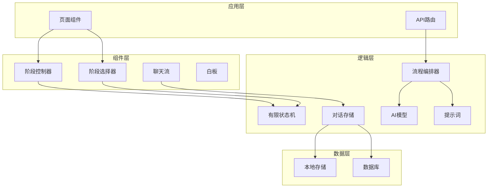
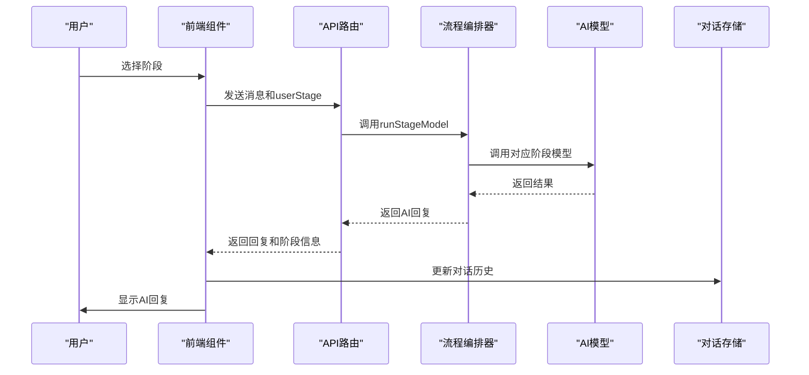
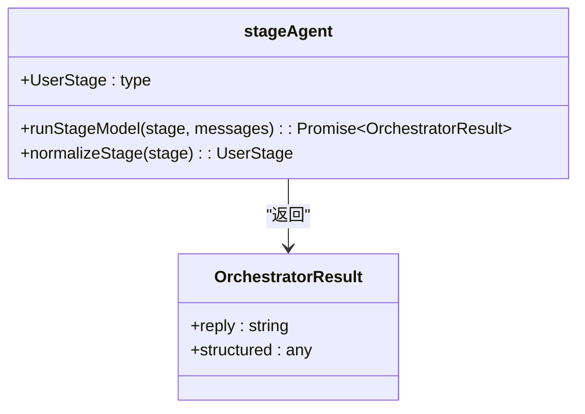
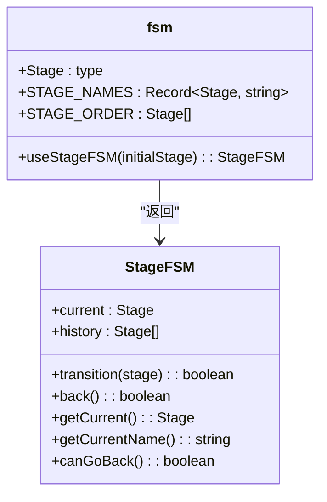
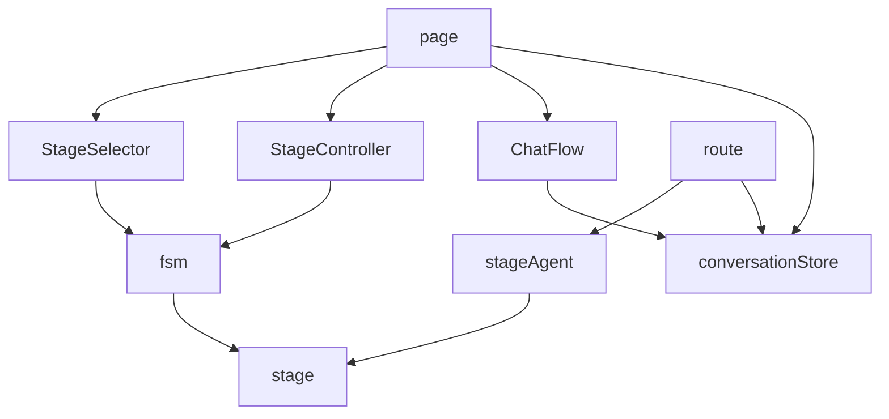

# 架构设计

<cite>
**本文档引用的文件**
- [stageAgent.ts](file://lib/orchestrator/stageAgent.ts)
- [fsm.ts](file://lib/fsm.ts)
- [conversationStore.ts](file://lib/conversationStore.ts)
- [stage.ts](file://lib/stage.ts)
- [index.ts](file://lib/orchestrator/index.ts)
- [resume_optimization.ts](file://lib/orchestrator/models/resume_optimization.ts)
- [interview.ts](file://lib/orchestrator/models/interview.ts)
- [stage_implementation.md](file://lib/stage_implementation.md)
- [route.ts](file://app/api/chat/route.ts)
- [page.tsx](file://app/chat/page.tsx)
- [StageSelector.tsx](file://components/StageSelector.tsx)
- [StageController.tsx](file://components/StageController.tsx)
</cite>

## 目录
1. [简介](#简介)
2. [项目结构](#项目结构)
3. [核心组件](#核心组件)
4. [架构概述](#架构概述)
5. [详细组件分析](#详细组件分析)
6. [依赖分析](#依赖分析)
7. [性能考虑](#性能考虑)
8. [故障排除指南](#故障排除指南)
9. [结论](#结论)

## 简介
本文档旨在阐述AI流程编排器的架构设计，重点分析基于有限状态机（FSM）的多阶段AI行为调度机制。系统通过`stageAgent.ts`实现阶段代理路由，利用`UserStage`类型与`StageOrder`流程顺序的映射关系，结合`getNextStage`/`getPrevStage`函数实现阶段跳转逻辑。编排器通过标准化接口统一调用不同求职阶段的模型逻辑（如简历优化、模拟面试等），并集成`conversationStore`进行上下文管理。文档详细说明了在当前LangChain禁用状态下的代理模式与未来扩展方案，提供了架构决策依据、模块解耦设计原则及异常处理策略。

## 项目结构
本项目采用分层架构设计，主要分为应用层、组件层、逻辑层和数据层。应用层包含API路由和页面组件，负责处理HTTP请求和用户界面渲染。组件层提供可复用的UI组件，如阶段控制器和选择器。逻辑层包含核心业务逻辑，特别是`lib/orchestrator`目录下的模型和提示词管理。数据层通过`conversationStore`管理对话历史和状态持久化。



**图表来源**
- [fsm.ts](file://lib/fsm.ts)
- [conversationStore.ts](file://lib/conversationStore.ts)
- [stageAgent.ts](file://lib/orchestrator/stageAgent.ts)

**章节来源**
- [fsm.ts](file://lib/fsm.ts)
- [conversationStore.ts](file://lib/conversationStore.ts)
- [stageAgent.ts](file://lib/orchestrator/stageAgent.ts)

## 核心组件
系统的核心组件包括`stageAgent.ts`、`fsm.ts`、`conversationStore.ts`和`stage.ts`。`stageAgent.ts`作为统一的阶段代理路由器，根据用户阶段自动选择对应的编排器模型。`fsm.ts`实现了有限状态机，管理用户在求职流程中的阶段转换。`conversationStore.ts`负责管理各阶段的独立对话历史，确保上下文的连续性。`stage.ts`定义了用户求职流程的阶段类型和相关工具函数，为整个系统提供类型安全和逻辑支持。

**章节来源**
- [stageAgent.ts](file://lib/orchestrator/stageAgent.ts)
- [fsm.ts](file://lib/fsm.ts)
- [conversationStore.ts](file://lib/conversationStore.ts)
- [stage.ts](file://lib/stage.ts)

## 架构概述
系统采用基于有限状态机的多阶段AI行为调度架构。当用户进入系统时，首先通过`StageSelector`选择初始阶段，然后`StageController`显示当前阶段信息。用户与AI的交互通过`ChatFlow`组件进行，所有消息被发送到`/api/chat`路由。该路由根据`userStage`参数调用相应的编排器模型，处理完成后返回结果。`conversationStore`负责管理对话历史，确保上下文的连续性。阶段转换由`fsm`管理，支持前进、后退和直接跳转到任意阶段。



**图表来源**
- [stageAgent.ts](file://lib/orchestrator/stageAgent.ts)
- [conversationStore.ts](file://lib/conversationStore.ts)
- [route.ts](file://app/api/chat/route.ts)

## 详细组件分析
### stageAgent.ts分析
`stageAgent.ts`是系统的统一阶段代理路由器，负责根据用户阶段自动选择对应的编排器模型。该文件定义了`UserStage`联合类型，包含七个求职阶段：职业规划、项目梳理、简历优化、投递策略、模拟面试、薪资沟通和Offer。`runStageModel`函数是核心调度函数，接收用户阶段和消息数组作为参数，返回模型结果。



**图表来源**
- [stageAgent.ts](file://lib/orchestrator/stageAgent.ts)

**章节来源**
- [stageAgent.ts](file://lib/orchestrator/stageAgent.ts)

### fsm.ts分析
`fsm.ts`实现了有限状态机，管理用户在求职流程中的阶段转换。该文件定义了`Stage`类型和`STAGE_ORDER`数组，确保阶段转换的有序性。`useStageFSM`钩子函数提供了状态管理功能，包括`transition`、`back`、`getCurrent`等方法。



**图表来源**
- [fsm.ts](file://lib/fsm.ts)

**章节来源**
- [fsm.ts](file://lib/fsm.ts)

### conversationStore.ts分析
`conversationStore.ts`负责管理各阶段的独立对话历史，确保上下文的连续性。该文件实现了`ConversationStore`类，包含`getStageHistory`、`addMessage`、`getAllHistoryForStage`等方法。

```mermaid
classDiagram
class conversationStore {
+ConversationMessage : type
+StageConversations : type
+conversationStore : ConversationStore
}
class ConversationStore {
+conversations : StageConversations
+currentUserId : string | null
+setUserId(userId) : void
+getStageHistory(stage) : ConversationMessage[]
+addMessage(stage, message) : void
+getAllHistoryForStage(currentStage) : {role, content}[]
+clearStage(stage) : void
+clearAll() : void
+clearUserData(userId) : void
+saveToLocalStorage(userId) : void
+loadFromLocalStorage(userId) : void
+initializeWelcomeMessage(stage) : void
}
conversationStore --> ConversationStore : "实例化"
```

**图表来源**
- [conversationStore.ts](file://lib/conversationStore.ts)

**章节来源**
- [conversationStore.ts](file://lib/conversationStore.ts)

## 依赖分析
系统各组件之间存在明确的依赖关系。`stageAgent.ts`依赖`stage.ts`中的`UserStage`类型定义，`fsm.ts`依赖`stage.ts`中的`Stage`类型和`STAGE_ORDER`数组。`conversationStore.ts`独立于其他组件，但被所有需要管理对话历史的组件使用。`StageSelector`和`StageController`组件都依赖`fsm.ts`来获取当前阶段信息。



**图表来源**
- [stageAgent.ts](file://lib/orchestrator/stageAgent.ts)
- [fsm.ts](file://lib/fsm.ts)
- [conversationStore.ts](file://lib/conversationStore.ts)
- [StageSelector.tsx](file://components/StageSelector.tsx)
- [StageController.tsx](file://components/StageController.tsx)
- [page.tsx](file://app/chat/page.tsx)
- [route.ts](file://app/api/chat/route.ts)

**章节来源**
- [stageAgent.ts](file://lib/orchestrator/stageAgent.ts)
- [fsm.ts](file://lib/fsm.ts)
- [conversationStore.ts](file://lib/conversationStore.ts)

## 性能考虑
系统在性能方面做了多项优化。首先，`conversationStore`使用`localStorage`进行持久化存储，避免了频繁的网络请求。其次，`fsm`使用`useMemo`优化返回对象的引用，避免不必要的重新渲染。`debouncedAnalyze`函数使用防抖技术，避免频繁调用分析API。此外，系统在前端维护`userStage`状态，减少了与后端的通信次数。

## 故障排除指南
系统实现了完善的错误处理机制。在`conversationStore`中，所有`localStorage`操作都包含try-catch块，防止存储失败导致应用崩溃。`route.ts`中的API路由对输入进行严格验证，防止无效数据进入系统。`stageAgent.ts`中的`runStageModel`函数包含默认处理逻辑，当遇到未知阶段时会使用职业规划模型作为默认值。前端组件通过`onError`回调处理网络请求失败的情况。

**章节来源**
- [conversationStore.ts](file://lib/conversationStore.ts)
- [route.ts](file://app/api/chat/route.ts)
- [stageAgent.ts](file://lib/orchestrator/stageAgent.ts)

## 结论
AI流程编排器通过有限状态机实现了多阶段AI行为调度，提供了清晰的阶段转换逻辑和上下文管理机制。系统采用模块化设计，各组件职责明确，耦合度低。尽管当前LangChain功能被禁用，但系统架构为未来扩展留下了良好基础。通过`stageAgent.ts`的统一代理模式，系统可以轻松集成新的AI模型和功能。整体架构设计合理，具备良好的可维护性和扩展性。