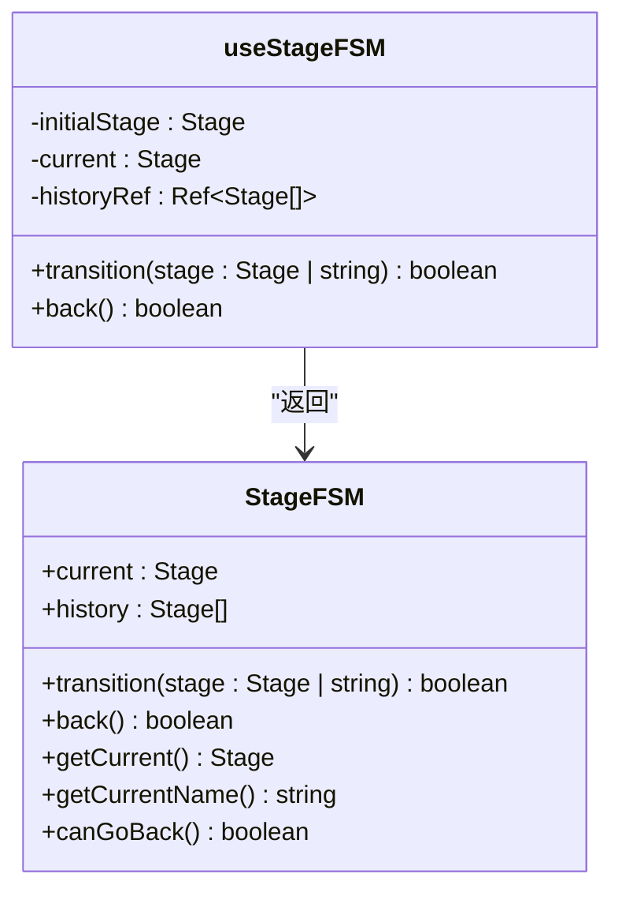
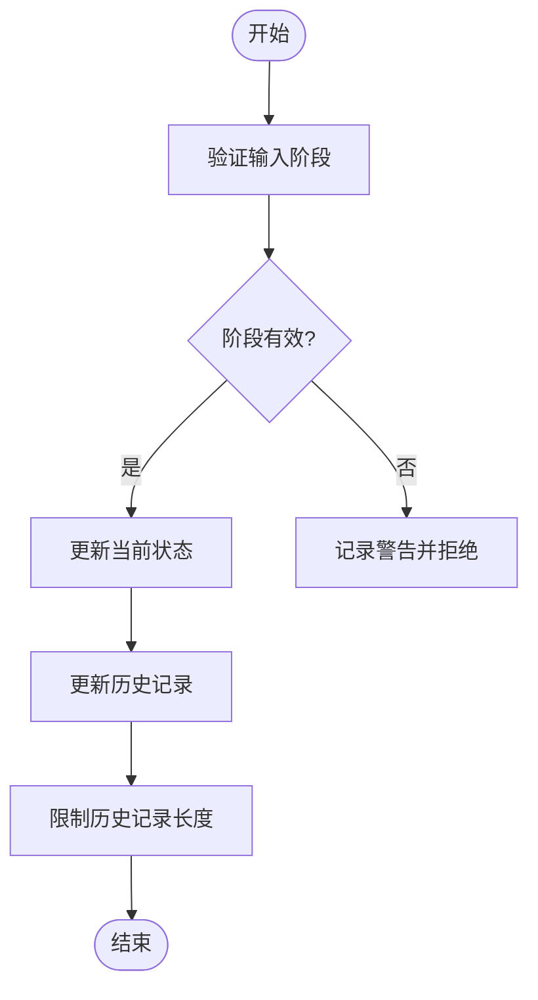
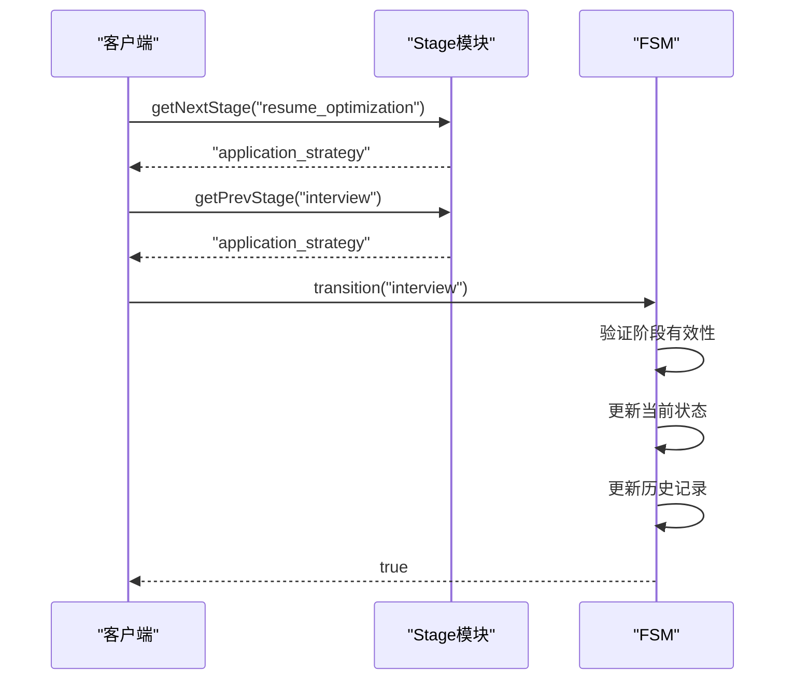
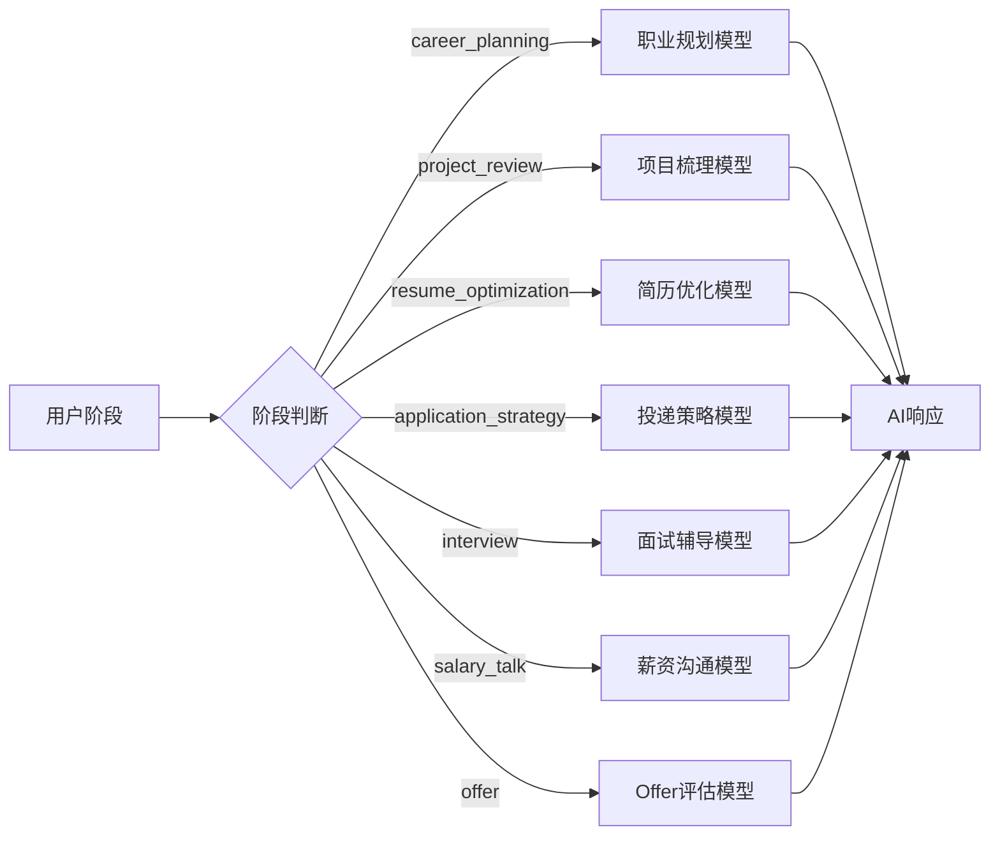
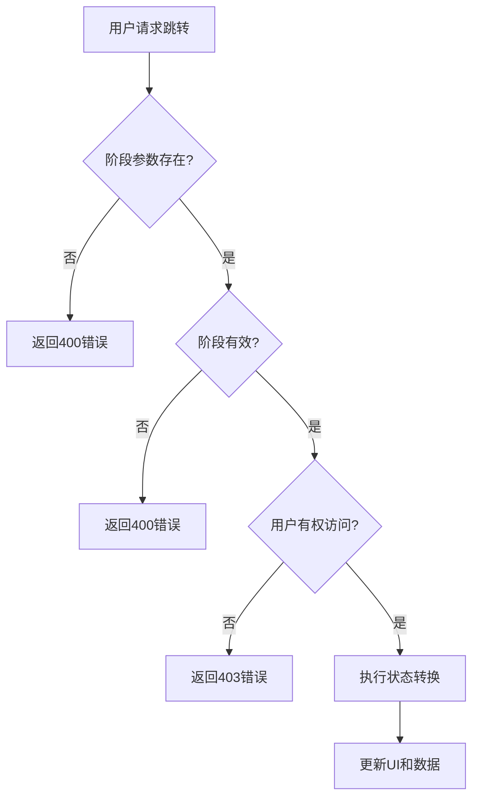
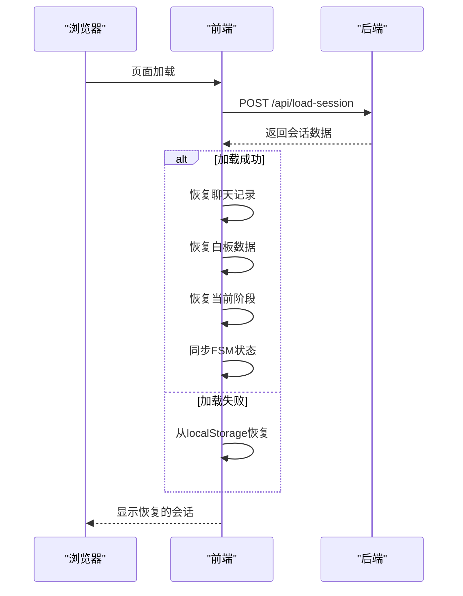
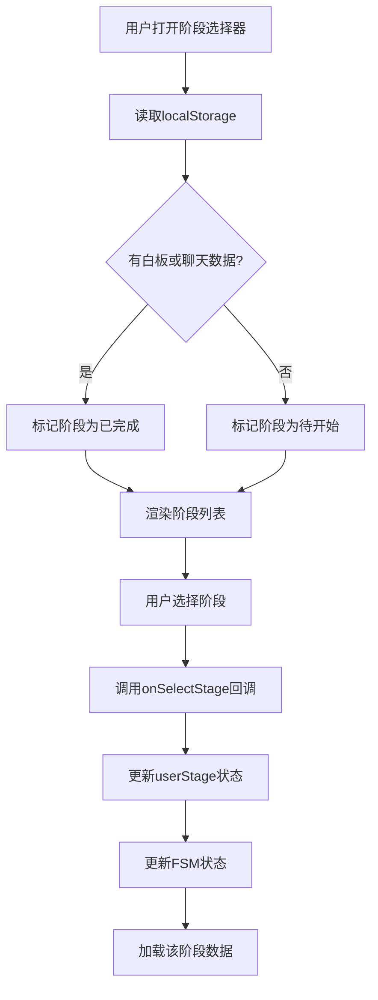

# 状态机与流程控制

<cite>
**本文档引用的文件**   
- [fsm.ts](file://lib/fsm.ts)
- [stage.ts](file://lib/stage.ts)
- [stageAgent.ts](file://lib/orchestrator/stageAgent.ts)
- [StageSelector.tsx](file://components/StageSelector.tsx)
- [StageController.tsx](file://components/StageController.tsx)
- [conversationStore.ts](file://lib/conversationStore.ts)
- [chat/page.tsx](file://app/chat/page.tsx)
- [machine.ts](file://src/lib/state/machine.ts)
- [load-session/route.ts](file://app/api/load-session/route.ts)
- [stage-greeting/route.ts](file://app/api/stage-greeting/route.ts)
</cite>

## 目录
1. [简介](#简介)
2. [核心数据结构](#核心数据结构)
3. [状态机实现](#状态机实现)
4. [阶段流转控制](#阶段流转控制)
5. [状态监听与AI行为](#状态监听与ai行为)
6. [状态迁移表](#状态迁移表)
7. [非法跳转拦截机制](#非法跳转拦截机制)
8. [会话恢复与状态重建](#会话恢复与状态重建)
9. [典型流程控制场景](#典型流程控制场景)
10. [边界情况处理策略](#边界情况处理策略)

## 简介
本系统采用多层状态机架构来管理用户在AI求职教练中的流程导航。系统通过`stage.ts`定义核心求职阶段，使用`fsm.ts`实现前端状态机，结合`stageAgent.ts`进行AI行为路由，并通过`StageSelector`和`StageController`组件提供用户界面交互。状态机确保了用户在职业规划、项目梳理、简历优化、投递策略、面试辅导、薪资沟通和Offer评估等阶段间的合法流转。

## 核心数据结构

### StageOrder
`StageOrder`定义了用户求职流程的完整阶段顺序，按照实际求职流程的逻辑顺序排列。该数组作为阶段流转的基础，确保了流程的线性推进和导航的合理性。

**Section sources**
- [stage.ts](file://lib/stage.ts#L18-L26)

### StageNames
`StageNames`是一个记录类型，将阶段枚举值映射到对应的中文名称，用于界面显示。这种设计实现了代码逻辑与用户界面的分离，便于国际化和界面定制。

**Section sources**
- [stage.ts](file://lib/stage.ts#L31-L39)

### StageDescriptions
`StageDescriptions`为每个阶段提供了详细的描述文本，这些描述不仅用于界面提示，还作为AI模型的提示词（prompt）输入，确保AI能够根据当前阶段提供恰当的指导。

**Section sources**
- [stage.ts](file://lib/stage.ts#L44-L52)

## 状态机实现

### 有限状态机（FSM）
系统通过`useStageFSM` Hook实现了一个基于React的状态机，该状态机使用`useState`和`useRef`来管理当前状态和历史记录。状态机支持任意阶段间的跳转，同时维护一个有限长度的历史栈，用于实现"返回"功能。

**Diagram sources **
- [fsm.ts](file://lib/fsm.ts#L20-L123)

### 状态验证与转换
`isValidStage`函数使用类型谓词（type predicate）来验证输入的阶段字符串是否为有效的`UserStage`。该函数通过检查`StageOrder`数组来确认阶段的有效性，是防止非法状态跳转的第一道防线。

**Diagram sources **
- [stage.ts](file://lib/stage.ts#L81-L83)
- [fsm.ts](file://lib/fsm.ts#L57-L60)

## 阶段流转控制

### getNextStage与getPrevStage
这两个函数实现了基于`StageOrder`数组的顺序导航。`getNextStage`返回当前阶段的下一个阶段，如果已经是最后一个阶段则返回null；`getPrevStage`返回上一个阶段，如果已经是第一个阶段则返回null。这种设计确保了阶段流转的线性逻辑。

**Diagram sources **
- [stage.ts](file://lib/stage.ts#L59-L74)
- [fsm.ts](file://lib/fsm.ts#L34-L84)

## 状态监听与AI行为

### stageAgent阶段路由
`stageAgent.ts`文件中的`runStageModel`函数根据当前阶段路由到相应的AI模型。虽然目前LangChain相关逻辑被禁用，但该函数的设计体现了阶段感知的AI行为模式，能够根据用户所处的求职阶段调用不同的专业模型。

**Diagram sources **
- [stageAgent.ts](file://lib/orchestrator/stageAgent.ts#L35-L71)

## 状态迁移表

| 当前阶段 | 允许的下一阶段 | 允许的上一阶段 | 备注 |
|---------|--------------|--------------|------|
| 职业规划 | 项目梳理、简历优化、投递策略、面试辅导、薪资沟通、Offer | 无 | 起始阶段 |
| 项目梳理 | 简历优化、投递策略、面试辅导、薪资沟通、Offer | 职业规划 | |
| 简历优化 | 投递策略、面试辅导、薪资沟通、Offer | 职业规划、项目梳理 | |
| 投递策略 | 面试辅导、薪资沟通、Offer | 职业规划、项目梳理、简历优化 | |
| 面试辅导 | 薪资沟通、Offer | 职业规划、项目梳理、简历优化、投递策略 | |
| 薪资沟通 | Offer | 职业规划、项目梳理、简历优化、投递策略、面试辅导 | |
| Offer | 无 | 所有阶段 | 终止阶段 |

**Section sources**
- [stage.ts](file://lib/stage.ts#L18-L26)

## 非法跳转拦截机制

系统通过多层验证机制防止非法状态跳转：
1. **类型验证**：`isValidStage`函数确保只有预定义的阶段值被接受
2. **FSM内部验证**：`useStageFSM`在转换前验证目标阶段的有效性
3. **API层验证**：后端API对阶段参数进行校验
4. **默认值处理**：无效阶段请求会被拒绝或回退到默认阶段

**Diagram sources **
- [fsm.ts](file://lib/fsm.ts#L57-L60)
- [stage-greeting/route.ts](file://app/api/stage-greeting/route.ts#L29-L34)

## 会话恢复与状态重建

### 会话加载流程
系统在用户重新访问时，通过`load-session` API和本地存储恢复会话状态。状态重建过程包括从数据库或localStorage加载用户ID、会话ID、聊天记录、白板数据和当前阶段。

**Diagram sources **
- [chat/page.tsx](file://app/chat/page.tsx#L43-L136)
- [load-session/route.ts](file://app/api/load-session/route.ts#L4-L29)

### 状态同步机制
当从持久化存储恢复`userStage`时，系统会将其映射到FSM的阶段表示，并调用`transition`方法同步状态机。这种设计确保了UI状态与状态机状态的一致性。

**Section sources**
- [chat/page.tsx](file://app/chat/page.tsx#L106-L124)

## 典型流程控制场景

### 阶段选择器交互
`StageSelector`组件允许用户在不同阶段间直接跳转。组件根据`StageOrder`渲染阶段列表，并通过`completedStages`状态显示已完成的阶段，为用户提供清晰的流程导航。

**Diagram sources **
- [StageSelector.tsx](file://components/StageSelector.tsx#L14-L204)

## 边界情况处理策略

### 初始状态处理
当用户首次访问系统时，状态机以"职业规划"为初始阶段。系统会检查localStorage中是否存在用户数据，如果不存在则使用默认值，确保系统始终处于一个确定的状态。

### 异常恢复策略
系统采用降级恢复策略：当从数据库加载会话失败时，自动回退到从localStorage加载。这种设计提高了系统的容错能力，确保用户数据不会因单一故障点而丢失。

### 并发状态更新
通过React的`useCallback`和`useMemo`优化，状态机确保了状态更新的稳定性和性能。`transition`和`back`方法被包裹在`useCallback`中，避免了不必要的重新渲染。

**Section sources**
- [fsm.ts](file://lib/fsm.ts#L30-L123)
- [chat/page.tsx](file://app/chat/page.tsx#L128-L133)