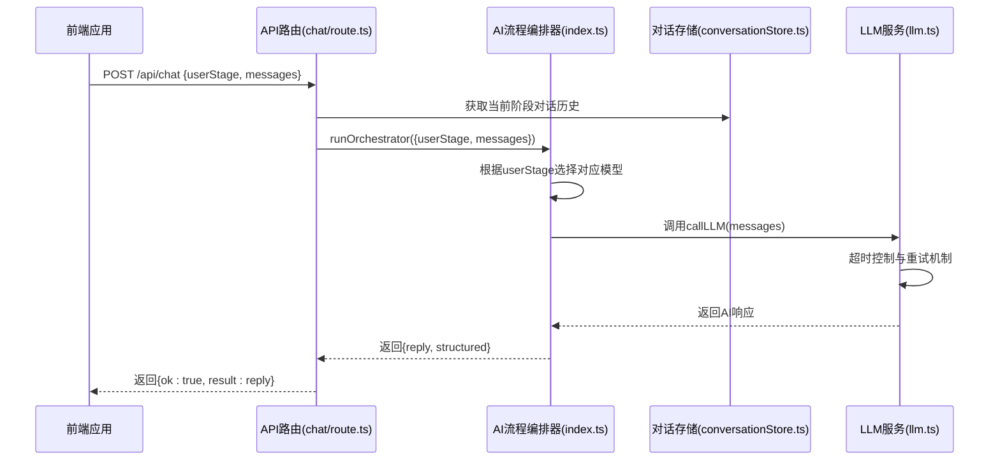
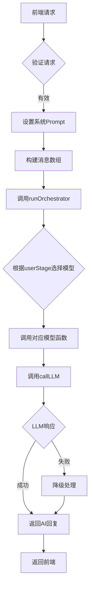
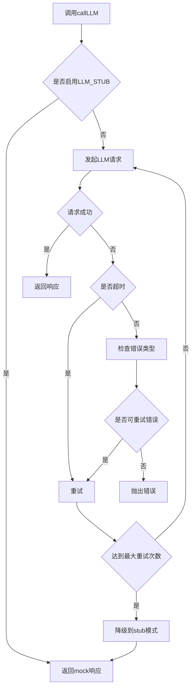

# 系统集成与扩展

<cite>
**本文档引用的文件**   
- [chat/route.ts](file://app/api/chat/route.ts)
- [llm.ts](file://lib/interview/llm.ts)
- [conversationStore.ts](file://lib/conversationStore.ts)
- [index.ts](file://lib/orchestrator/index.ts)
- [stage.ts](file://lib/stage.ts)
- [llm.ts](file://lib/llm.ts)
- [career_planning.ts](file://lib/orchestrator/models/career_planning.ts)
- [career_planning.ts](file://lib/orchestrator/prompts/career_planning.ts)
- [types.ts](file://lib/interview/types.ts)
</cite>

## 目录
1. [系统集成概述](#系统集成概述)
2. [核心组件协同工作流程](#核心组件协同工作流程)
3. [AI流程编排器架构](#ai流程编排器架构)
4. [依赖注入与异步处理](#依赖注入与异步处理)
5. [超时控制与降级策略](#超时控制与降级策略)
6. [新增求职阶段扩展流程](#新增求职阶段扩展流程)
7. [集成调试与性能监控](#集成调试与性能监控)

## 系统集成概述

本系统采用模块化架构，通过AI流程编排器协调对话系统、LLM服务和API路由三大核心组件。编排器作为中枢，根据用户当前求职阶段（userStage）动态选择对应的AI模型，实现个性化求职指导。系统通过`conversationStore`管理各阶段的独立对话历史，并通过`chat/route.ts`API端点接收前端请求，最终调用LLM服务生成AI响应。

**Section sources**
- [chat/route.ts](file://app/api/chat/route.ts)
- [conversationStore.ts](file://lib/conversationStore.ts)
- [stage.ts](file://lib/stage.ts)

## 核心组件协同工作流程



**Diagram sources **
- [chat/route.ts](file://app/api/chat/route.ts)
- [index.ts](file://lib/orchestrator/index.ts)
- [conversationStore.ts](file://lib/conversationStore.ts)
- [llm.ts](file://lib/llm.ts)

**Section sources**
- [chat/route.ts](file://app/api/chat/route.ts)
- [index.ts](file://lib/orchestrator/index.ts)
- [conversationStore.ts](file://lib/conversationStore.ts)
- [llm.ts](file://lib/llm.ts)

## AI流程编排器架构

AI流程编排器是系统的核心调度组件，负责根据用户当前阶段选择对应的AI模型。编排器通过`runOrchestrator`接口接收前端请求，包含用户阶段和消息历史，然后根据预定义的阶段映射关系调用相应的模型处理函数。

编排器采用模块化设计，每个求职阶段都有独立的模型实现和系统提示词。当用户处于"职业规划"阶段时，编排器调用`runDeepSeekCareer`函数；当处于"简历优化"阶段时，则调用`runDeepSeekResume`函数。这种设计实现了关注点分离，便于维护和扩展。

```mermaid
classDiagram
class Orchestrator {
+runOrchestrator(input : OrchestratorInput) : Promise~OrchestratorResult~
}
class CareerPlanningModel {
+runDeepSeekCareer(messages : Message[]) : Promise~CareerPlanningResult~
}
class ProjectReviewModel {
+runDeepSeekProjectReview(messages : Message[]) : Promise~ProjectReviewResult~
}
class ResumeOptimizationModel {
+runDeepSeekResume(messages : Message[]) : Promise~ResumeOptimizationResult~
}
class ApplicationStrategyModel {
+runDeepSeekStrategy(messages : Message[]) : Promise~ApplicationStrategyResult~
}
class InterviewModel {
+runDeepSeekInterview(messages : Message[]) : Promise~InterviewResult~
}
class SalaryTalkModel {
+runDeepSeekSalary(messages : Message[]) : Promise~SalaryTalkResult~
}
class OfferModel {
+runDeepSeekOffer(messages : Message[]) : Promise~OfferResult~
}
Orchestrator --> CareerPlanningModel : "职业规划"
Orchestrator --> ProjectReviewModel : "项目梳理"
Orchestrator --> ResumeOptimizationModel : "简历优化"
Orchestrator --> ApplicationStrategyModel : "投递策略"
Orchestrator --> InterviewModel : "模拟面试"
Orchestrator --> SalaryTalkModel : "薪资沟通"
Orchestrator --> OfferModel : "Offer"
```



**Diagram sources **
- [index.ts](file://lib/orchestrator/index.ts)
- [career_planning.ts](file://lib/orchestrator/models/career_planning.ts)

**Section sources**
- [index.ts](file://lib/orchestrator/index.ts)
- [career_planning.ts](file://lib/orchestrator/models/career_planning.ts)
- [career_planning.ts](file://lib/orchestrator/prompts/career_planning.ts)

## 依赖注入与异步处理

系统采用依赖注入模式，将对话历史、用户阶段等上下文信息注入到LLM调用中。`conversationStore`负责管理各阶段的独立对话历史，通过`getAllHistoryForStage`方法为AI提供完整的上下文信息。

异步处理模式采用Promise-based架构，所有LLM调用都返回Promise对象。编排器通过async/await语法处理异步操作，确保在获取LLM响应后才返回结果给前端。这种模式提高了系统的响应性和可扩展性。



**Diagram sources **
- [chat/route.ts](file://app/api/chat/route.ts)
- [index.ts](file://lib/orchestrator/index.ts)
- [llm.ts](file://lib/llm.ts)

**Section sources**
- [chat/route.ts](file://app/api/chat/route.ts)
- [index.ts](file://lib/orchestrator/index.ts)
- [llm.ts](file://lib/llm.ts)

## 超时控制与降级策略

系统实现了多层次的超时控制和降级策略，确保在LLM服务不可用时仍能提供基本功能。`callLLM`函数包含超时和重试机制，通过`Promise.race`实现超时控制，当请求超过指定时间后自动终止。

降级策略采用多级降级模式：
1. 首先尝试重试，最多重试2次
2. 如果重试失败，检查是否启用stub模式
3. 在stub模式下，返回预定义的mock响应
4. 如果stub模式未启用，则返回错误信息

这种策略确保了系统的高可用性，即使在LLM服务暂时不可用的情况下，用户仍能继续使用系统。



**Diagram sources **
- [llm.ts](file://lib/llm.ts)

**Section sources**
- [llm.ts](file://lib/llm.ts)

## 新增求职阶段扩展流程

新增求职阶段需要遵循以下完整扩展流程：

### 1. 扩展UserStage类型

在`lib/stage.ts`文件中扩展`UserStage`联合类型，添加新的求职阶段：

```typescript
export type UserStage =
  | "career_planning"
  | "project_review"
  | "resume_optimization"
  | "application_strategy"
  | "interview"
  | "salary_talk"
  | "offer"
  | "skill_enhancement"; // 新增技能提升阶段
```

### 2. 更新StageOrder

在`StageOrder`数组中添加新阶段，确定其在求职流程中的位置：

```typescript
export const StageOrder: UserStage[] = [
  "career_planning",
  "project_review",
  "resume_optimization",
  "application_strategy",
  "interview",
  "salary_talk",
  "offer",
  "skill_enhancement", // 新增阶段
];
```

### 3. 开发新模型与提示词

创建新的模型实现和系统提示词文件：

- `lib/orchestrator/models/skill_enhancement.ts`
- `lib/orchestrator/prompts/skill_enhancement.ts`

模型实现需要导出`runDeepSeekSkillEnhancement`函数，遵循统一的返回格式：

```typescript
export async function runDeepSeekSkillEnhancement(
  messages: Array<{ role: "user" | "assistant"; content: string }>
): Promise<{
  reply: string;
  structured: any;
}>
```

### 4. 更新编排器

在`lib/orchestrator/index.ts`中添加新的case分支：

```typescript
case "skill_enhancement": {
  const result = await runDeepSeekSkillEnhancement(messages);
  return {
    reply: result.reply,
    structured: result.structured,
  };
}
```

### 5. 测试验证

通过以下步骤验证新阶段功能：

1. 在前端设置userStage为"skill_enhancement"
2. 发送测试请求到`/api/chat`端点
3. 验证返回的AI响应是否符合预期
4. 检查structured数据是否正确生成
5. 测试阶段推进逻辑是否正常工作

**Section sources**
- [stage.ts](file://lib/stage.ts)
- [index.ts](file://lib/orchestrator/index.ts)

## 集成调试与性能监控

### 集成调试技巧

1. **环境变量检查**：确保`DEEPSEEK_API_KEY`正确配置
2. **Stub模式调试**：设置`LLM_STUB=1`进行本地调试
3. **日志追踪**：通过console.warn和console.error监控关键流程
4. **API测试**：使用curl或Postman直接测试API端点

### 日志追踪建议

1. 在关键函数入口添加日志记录
2. 记录LLM调用的输入和输出
3. 记录错误信息和堆栈跟踪
4. 使用结构化日志格式便于分析

### 性能监控指标

1. **API响应时间**：监控`/api/chat`端点的平均响应时间
2. **LLM调用成功率**：统计LLM调用的成功率和错误率
3. **超时率**：监控因超时导致的失败请求比例
4. **重试次数**：统计平均重试次数，识别潜在性能问题
5. **并发处理能力**：监控系统在高并发下的表现

**Section sources**
- [llm.ts](file://lib/llm.ts)
- [chat/route.ts](file://app/api/chat/route.ts)