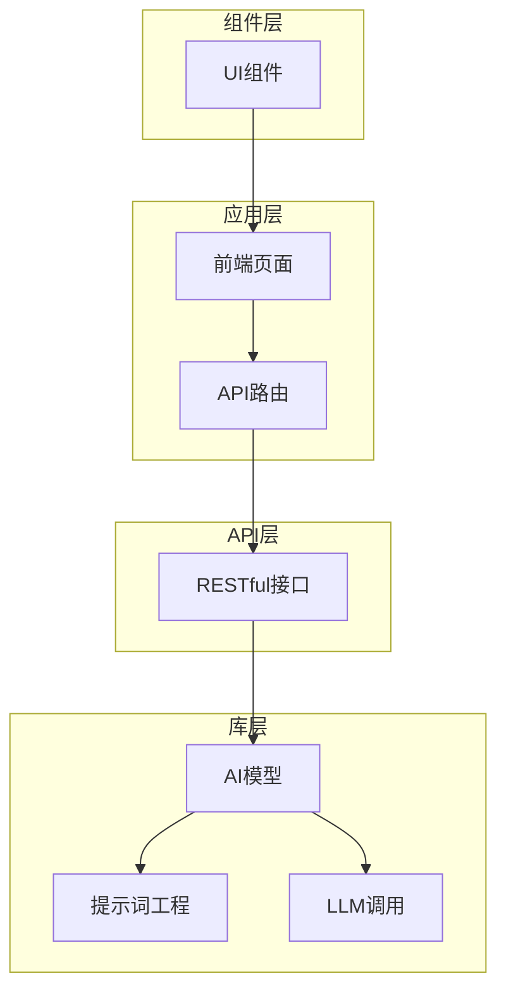
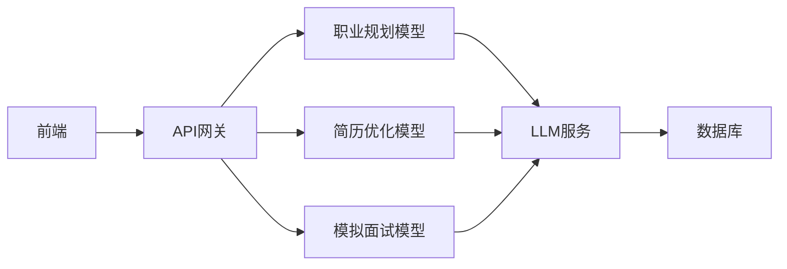
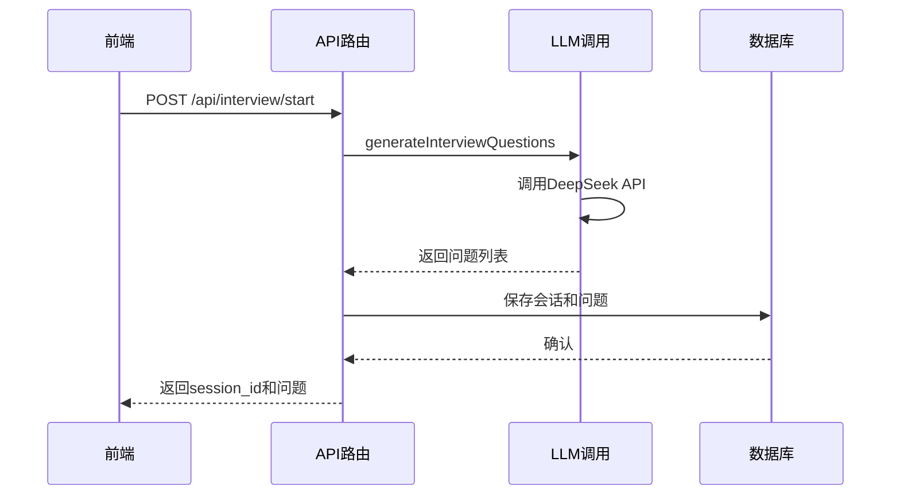
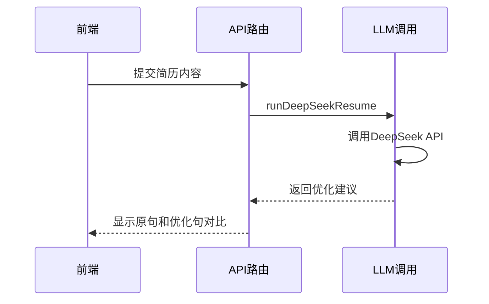
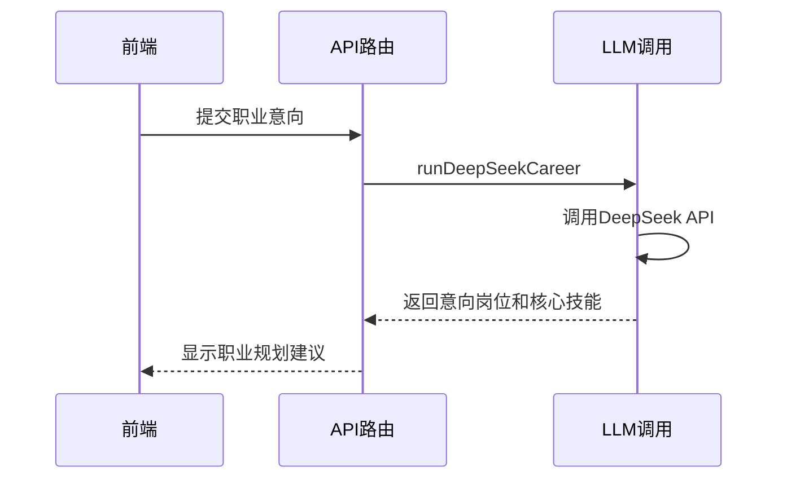
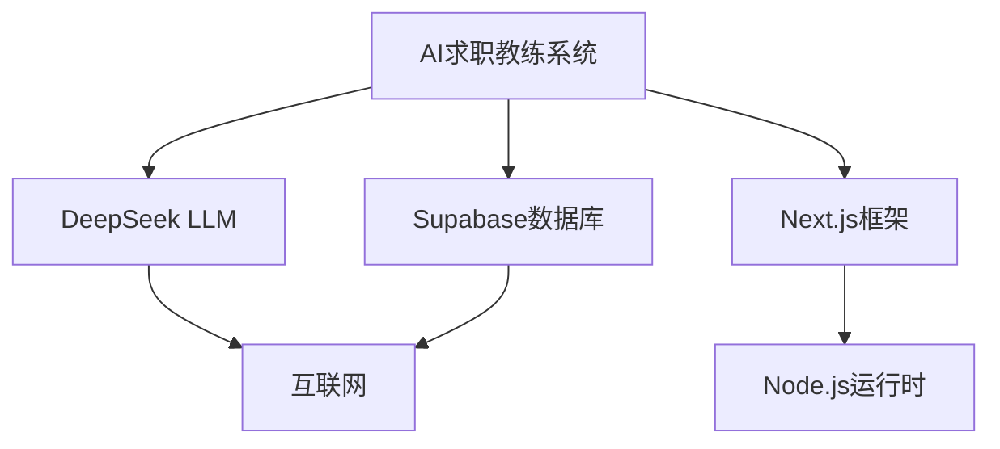

# 阶段模型实现

<cite>
**本文档引用的文件**  
- [interview.ts](file://lib/orchestrator/models/interview.ts)
- [resume_optimization.ts](file://lib/orchestrator/models/resume_optimization.ts)
- [career_planning.ts](file://lib/orchestrator/models/career_planning.ts)
- [stageAgent.ts](file://lib/orchestrator/stageAgent.ts)
- [interview/types.ts](file://lib/interview/types.ts)
- [interview/llm.ts](file://lib/interview/llm.ts)
- [llm.ts](file://lib/llm.ts)
- [app/api/interview/start/route.ts](file://app/api/interview/start/route.ts)
- [app/api/interview/answer/route.ts](file://app/api/interview/answer/route.ts)
- [app/api/interview/route.ts](file://app/api/interview/route.ts)
- [prompts/interview.ts](file://lib/orchestrator/prompts/interview.ts)
- [prompts/resume_optimization.ts](file://lib/orchestrator/prompts/resume_optimization.ts)
- [prompts/career_planning.ts](file://lib/orchestrator/prompts/career_planning.ts)
</cite>

## 目录
1. [简介](#简介)
2. [项目结构](#项目结构)
3. [核心组件](#核心组件)
4. [架构概述](#架构概述)
5. [详细组件分析](#详细组件分析)
6. [依赖分析](#依赖分析)
7. [性能考虑](#性能考虑)
8. [故障排除指南](#故障排除指南)
9. [结论](#结论)

## 简介
本项目是一个AI求职教练系统，旨在通过人工智能技术帮助用户完成求职过程中的各个关键阶段。系统涵盖了职业规划、简历优化、模拟面试等核心模块，每个模块都由专门的AI模型驱动。这些模型基于大语言模型（LLM）技术，结合精心设计的提示词工程和结构化输出机制，为用户提供个性化、专业化的求职指导。系统采用模块化设计，通过统一的stageAgent进行路由，确保各阶段模型能够无缝集成和协同工作。此外，系统还实现了完善的错误恢复机制和测试用例，保证了服务的稳定性和可靠性。

## 项目结构
项目采用分层架构设计，主要分为应用层、组件层、库层和API层。应用层包含前端页面和API路由，负责用户交互和请求处理。组件层封装了可复用的UI组件，如面试面板、简历编辑器等。库层是系统的核心，包含了各个求职阶段的AI模型、提示词定义、LLM调用封装等关键逻辑。API层提供了RESTful接口，连接前端与后端服务。这种清晰的分层结构使得系统易于维护和扩展。

**图源**  
- [app/api/interview/route.ts](file://app/api/interview/route.ts)
- [components/interview/InterviewPanel.tsx](file://components/interview/InterviewPanel.tsx)
- [lib/orchestrator/models/interview.ts](file://lib/orchestrator/models/interview.ts)
- [lib/orchestrator/prompts/interview.ts](file://lib/orchestrator/prompts/interview.ts)
- [lib/llm.ts](file://lib/llm.ts)

**本节来源**  
- [app/api/interview/route.ts](file://app/api/interview/route.ts)
- [lib/orchestrator/models/interview.ts](file://lib/orchestrator/models/interview.ts)
- [lib/llm.ts](file://lib/llm.ts)

## 核心组件
系统的核心组件包括三个主要的AI模型：职业规划模型、简历优化模型和模拟面试模型。这些模型分别对应求职过程中的不同阶段，每个模型都有其特定的提示词设计和输出结构。职业规划模型帮助用户明确职业方向和目标岗位；简历优化模型提供专业的简历修改建议；模拟面试模型则通过结构化的问题生成和评估机制，帮助用户提升面试表现。这些模型通过统一的接口与前端交互，确保了用户体验的一致性。

**本节来源**  
- [lib/orchestrator/models/career_planning.ts](file://lib/orchestrator/models/career_planning.ts)
- [lib/orchestrator/models/resume_optimization.ts](file://lib/orchestrator/models/resume_optimization.ts)
- [lib/orchestrator/models/interview.ts](file://lib/orchestrator/models/interview.ts)

## 架构概述
系统采用微服务架构，各求职阶段的AI模型作为独立的服务运行，通过统一的API网关进行管理。这种设计使得每个模型可以独立开发、测试和部署，提高了系统的灵活性和可维护性。模型之间的通信通过标准化的JSON格式进行，确保了数据的一致性和互操作性。系统还实现了stub模式，用于在没有真实LLM服务的情况下进行降级处理，保证了服务的可用性。

**图源**  
- [lib/orchestrator/stageAgent.ts](file://lib/orchestrator/stageAgent.ts)
- [lib/llm.ts](file://lib/llm.ts)
- [lib/db.ts](file://lib/db.ts)

## 详细组件分析

### 模拟面试模型分析
模拟面试模型是系统中最复杂的组件之一，它需要生成有针对性的面试问题，并对用户的回答进行专业评估。模型通过分析职位描述（JD）来定制问题，确保问题与目标岗位高度相关。评估机制采用多维度评分，包括准确性、语法、细节和自信度等，为用户提供全面的反馈。

#### 对于API/服务组件：

**图源**  
- [app/api/interview/start/route.ts](file://app/api/interview/start/route.ts)
- [lib/interview/llm.ts](file://lib/interview/llm.ts)
- [lib/db.ts](file://lib/db.ts)

**本节来源**  
- [app/api/interview/start/route.ts](file://app/api/interview/start/route.ts)
- [lib/interview/llm.ts](file://lib/interview/llm.ts)

### 简历优化模型分析
简历优化模型专注于提升用户简历的专业性和竞争力。模型通过分析用户提供的简历内容，识别出需要改进的部分，并提供具体的优化建议。这些建议包括使用更专业的动词、量化成果、突出技术栈等，帮助用户打造更具吸引力的简历。

#### 对于API/服务组件：

**图源**  
- [app/api/resume/parse/route.ts](file://app/api/resume/parse/route.ts)
- [lib/orchestrator/models/resume_optimization.ts](file://lib/orchestrator/models/resume_optimization.ts)

**本节来源**  
- [lib/orchestrator/models/resume_optimization.ts](file://lib/orchestrator/models/resume_optimization.ts)
- [lib/orchestrator/prompts/resume_optimization.ts](file://lib/orchestrator/prompts/resume_optimization.ts)

### 职业规划模型分析
职业规划模型旨在帮助用户明确职业发展方向。模型通过与用户的对话，了解其兴趣、能力和价值观，进而推荐合适的目标岗位。模型还会识别用户的核心技能，为后续的简历优化和面试准备提供指导。

#### 对于API/服务组件：

**图源**  
- [app/api/career_planning/route.ts](file://app/api/career_planning/route.ts)
- [lib/orchestrator/models/career_planning.ts](file://lib/orchestrator/models/career_planning.ts)

**本节来源**  
- [lib/orchestrator/models/career_planning.ts](file://lib/orchestrator/models/career_planning.ts)
- [lib/orchestrator/prompts/career_planning.ts](file://lib/orchestrator/prompts/career_planning.ts)

## 依赖分析
系统依赖于多个外部服务和库，其中最重要的是DeepSeek LLM服务。系统通过`callLLM`函数封装了与LLM服务的交互，实现了超时和重试机制，确保了服务的稳定性。此外，系统还依赖于Supabase数据库服务，用于存储用户数据和面试记录。这些依赖关系通过环境变量进行配置，使得系统可以在不同环境中灵活部署。

**图源**  
- [lib/llm.ts](file://lib/llm.ts)
- [lib/db.ts](file://lib/db.ts)
- [package.json](file://package.json)

**本节来源**  
- [lib/llm.ts](file://lib/llm.ts)
- [lib/db.ts](file://lib/db.ts)
- [package.json](file://package.json)

## 性能考虑
系统的性能主要受LLM调用延迟的影响。为了优化性能，系统实现了多个策略：首先，通过设置合理的超时时间（10-60秒）和重试机制，确保在LLM服务不稳定时仍能提供服务；其次，采用stub模式作为降级方案，当LLM服务不可用时，系统仍能返回预设的响应；最后，通过异步处理和数据库优化，减少请求响应时间。这些措施共同保证了系统的高可用性和用户体验。

## 故障排除指南
当系统出现问题时，可以按照以下步骤进行排查：首先检查环境变量配置，确保`DEEPSEEK_API_KEY`和数据库连接信息正确；其次查看日志输出，定位具体的错误信息；最后，尝试使用stub模式运行系统，以确定问题是否与外部服务有关。对于常见的LLM调用失败，可以检查API配额和网络连接。

**本节来源**  
- [lib/llm.ts](file://lib/llm.ts)
- [lib/db.ts](file://lib/db.ts)

## 结论
本AI求职教练系统通过整合多个专业的AI模型，为用户提供了一站式的求职服务。系统的设计充分考虑了实用性、稳定性和可扩展性，能够有效帮助用户提升求职成功率。未来可以进一步优化模型的准确性，增加更多求职阶段的支持，如薪资谈判和offer选择等，为用户提供更全面的职业发展指导。