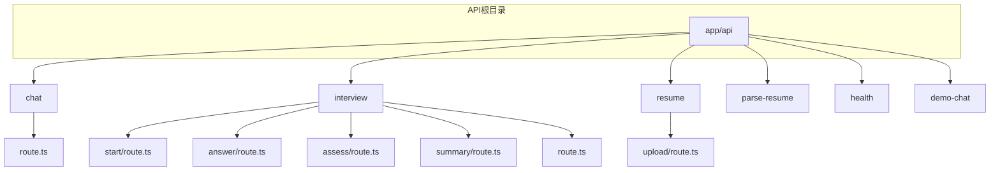
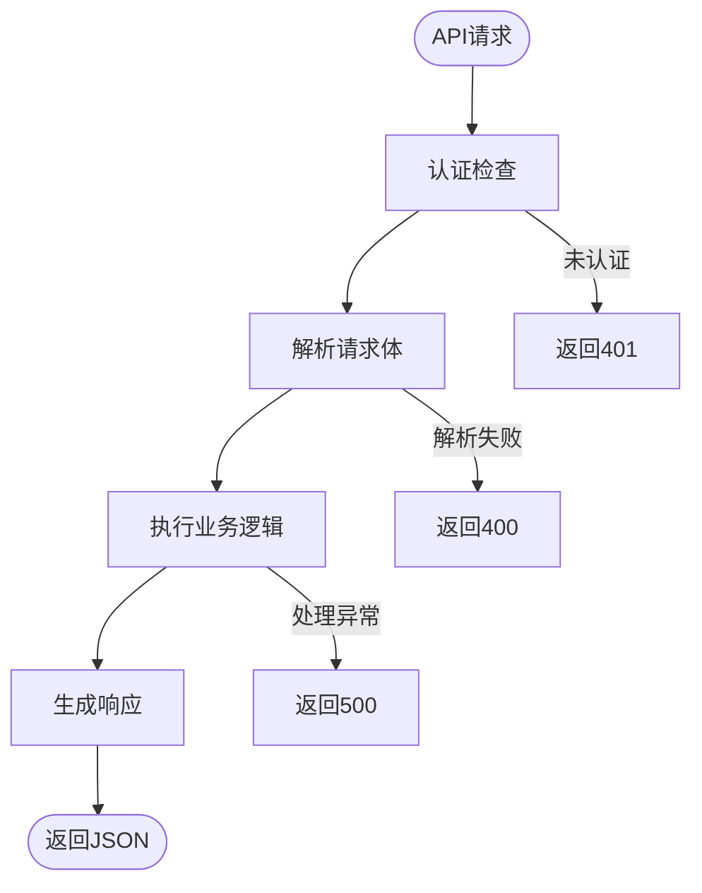
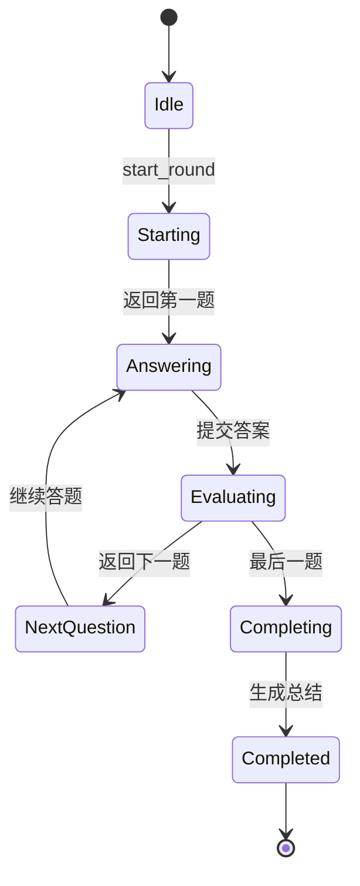
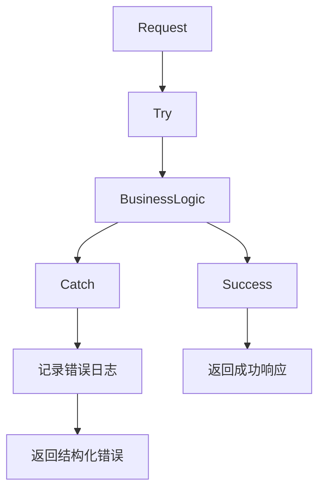

# API路由设计

<cite>
**本文档引用的文件**   
- [chat/route.ts](file://app/api/chat/route.ts)
- [interview/route.ts](file://app/api/interview/route.ts)
- [interview/start/route.ts](file://app/api/interview/start/route.ts)
- [interview/answer/route.ts](file://app/api/interview/answer/route.ts)
- [interview/assess/route.ts](file://app/api/interview/assess/route.ts)
- [interview/summary/route.ts](file://app/api/interview/summary/route.ts)
- [resume/upload/route.ts](file://app/api/resume/upload/route.ts)
- [parse-resume/route.ts](file://app/api/parse-resume/route.ts)
- [demo-chat/route.ts](file://app/api/demo-chat/route.ts)
- [health/route.ts](file://app/api/health/route.ts)
- [README.md](file://app/api/README.md)
- [types.ts](file://lib/interview/types.ts)
</cite>

## 目录
1. [项目结构概述](#项目结构概述)
2. [核心API路由机制](#核心api路由机制)
3. [聊天接口设计](#聊天接口设计)
4. [面试系列接口](#面试系列接口)
5. [简历解析流程](#简历解析流程)
6. [错误处理与异常捕获](#错误处理与异常捕获)
7. [API版本控制与路径规范](#api版本控制与路径规范)
8. [健康检查与演示接口](#健康检查与演示接口)

## 项目结构概述

项目采用Next.js App Router架构，API路由集中存放在`app/api`目录下，通过文件系统路由机制实现RESTful接口。每个API端点由`route.ts`文件定义，支持标准HTTP方法（GET、POST等）。目录结构清晰，按功能模块划分，如`/chat`、`/interview`、`/resume`等。



**图示来源**
- [app/api](file://app/api)

## 核心API路由机制

Next.js App Router通过文件系统实现API路由，每个`route.ts`文件导出HTTP方法处理器（如POST、GET）。API运行时强制使用Node.js环境（`export const runtime = "nodejs"`），确保支持文件操作和LLM调用。请求处理遵循标准流程：认证检查、请求解析、业务逻辑处理、响应生成。



**图示来源**
- [chat/route.ts](file://app/api/chat/route.ts#L1-L238)
- [interview/route.ts](file://app/api/interview/route.ts#L1-L809)

## 聊天接口设计

`/api/chat`接口是核心聊天功能，支持流式AI响应。通过`POST`方法接收用户消息，结合会话历史和用户阶段生成个性化回复。接口支持多种求职辅导场景，通过`stage`参数区分职业规划、简历优化等不同模式。

### 请求参数
- `messages`: 消息数组，包含用户和助手的对话历史
- `stage`: 当前辅导阶段（如career_planning, resume_optimization）
- `userId`: 用户标识

### 响应结构
```json
{
  "ok": true,
  "result": "AI回复内容"
}
```

### 流式响应实现
接口通过`callLLM`函数调用语言模型，实现流式数据传输。前端可逐字接收AI回复，提升用户体验。系统根据`stage`参数动态加载对应的系统提示词（System Prompt），确保回复风格与场景匹配。

**本节来源**
- [chat/route.ts](file://app/api/chat/route.ts#L145-L236)
- [README.md](file://app/api/README.md#L108-L163)

## 面试系列接口

面试功能由多个协同接口组成，管理面试状态与轮次逻辑。主接口`/api/interview`通过`action`参数区分不同操作，而专用接口如`/start`、`/answer`提供更简洁的调用方式。

### 面试状态管理
面试流程通过会话ID（sessionId）和题目ID（questionId）维护状态。系统使用数据库表`interview_sessions`、`interview_questions`和`interview_answers`持久化面试数据，确保状态可恢复。



**图示来源**
- [interview/route.ts](file://app/api/interview/route.ts#L703-L799)
- [types.ts](file://lib/interview/types.ts#L5-L117)

### 核心接口说明

#### `/api/interview/start`
启动新面试会话，生成指定数量的面试题。

**请求参数**
```json
{
  "jd": "职位描述",
  "roundType": "业务面",
  "questionCount": 5
}
```

**响应结构**
```json
{
  "session_id": "uuid",
  "questions": [...]
}
```

**本节来源**
- [interview/start/route.ts](file://app/api/interview/start/route.ts#L33-L175)
- [types.ts](file://lib/interview/types.ts#L76-L86)

#### `/api/interview/answer`
提交面试答案并获取评估。

**请求参数**
```json
{
  "session_id": "uuid",
  "question_id": "uuid",
  "answer": "用户回答内容"
}
```

**响应结构**
```json
{
  "question_id": "uuid",
  "assessment": {...}
}
```

**本节来源**
- [interview/answer/route.ts](file://app/api/interview/answer/route.ts#L33-L205)
- [types.ts](file://lib/interview/types.ts#L89-L99)

#### `/api/interview/assess`
评估单个面试回答，返回详细评分。

**请求参数**
```json
{
  "round": "业务面",
  "question": "问题内容",
  "answer": "回答内容"
}
```

**响应结构**
```json
{
  "score": 75,
  "breakdown": {
    "accuracy": 75,
    "completeness": 80,
    "logic": 70,
    "communication": 85
  },
  "feedback": {
    "strengths": ["优点"],
    "improvements": ["改进建议"],
    "overall": "总体评价"
  }
}
```

**本节来源**
- [interview/assess/route.ts](file://app/api/interview/assess/route.ts#L30-L167)

#### `/api/interview/summary`
获取整轮面试总结报告。

**请求方式**: GET  
**查询参数**: `session_id`

**响应结构**
```json
{
  "session_id": "uuid",
  "overallScore": 75,
  "strengths": ["优势"],
  "weaknesses": ["薄弱点"],
  "suggestions": ["建议"]
}
```

**本节来源**
- [interview/summary/route.ts](file://app/api/interview/summary/route.ts#L28-L143)
- [types.ts](file://lib/interview/types.ts#L102-L108)

## 简历解析流程

简历解析通过`/resume/upload`和`/parse-resume`两个接口协同完成，实现文件上传与内容解析的分离。

### 流程架构
```mermaid
flowchart LR
A[前端] --> B[/resume/upload]
B --> C[Supabase存储]
C --> D[/parse-resume]
D --> E[LLM解析]
E --> F[结构化JSON]
```

**图示来源**
- [resume/upload/route.ts](file://app/api/resume/upload/route.ts)
- [parse-resume/route.ts](file://app/api/parse-resume/route.ts)

### `/api/resume/upload`
处理简历文件上传，支持PDF、DOC、DOCX格式。

**请求方式**: POST (multipart/form-data)  
**字段**: `file`

**响应结构**
```json
{
  "ok": true,
  "resume_id": "uuid",
  "file_url": "文件访问链接"
}
```

**本节来源**
- [resume/upload/route.ts](file://app/api/resume/upload/route.ts#L12-L140)

### `/api/parse-resume`
解析PDF简历为结构化JSON数据。

**请求方式**: POST (multipart/form-data)  
**字段**: `file` (PDF文件)

**响应结构**
```json
{
  "ok": true,
  "rawText": "原始文本",
  "parsed": {
    "summary": "个人简介",
    "skills": ["技能"],
    "education": [...],
    "experiences": [...],
    "projects": [...]
  }
}
```

**本节来源**
- [parse-resume/route.ts](file://app/api/parse-resume/route.ts#L12-L196)

## 错误处理与异常捕获

API实现完善的错误处理机制，使用标准HTTP状态码和结构化错误响应。

### 错误码设计
| 状态码 | 含义 | 示例 |
|--------|------|------|
| 400 | 请求错误 | JSON格式无效、缺少必填字段 |
| 401 | 未认证 | 用户未登录 |
| 403 | 禁止访问 | 无权访问他人数据 |
| 404 | 资源不存在 | 会话ID无效 |
| 500 | 服务器错误 | 数据库连接失败、LLM调用异常 |

### 异常捕获
所有API端点使用try-catch包裹，确保未处理异常不会导致服务崩溃。错误信息通过`console.error`记录，同时返回用户友好的错误消息。



**本节来源**
- [chat/route.ts](file://app/api/chat/route.ts#L229-L235)
- [interview/start/route.ts](file://app/api/interview/start/route.ts#L162-L173)
- [parse-resume/route.ts](file://app/api/parse-resume/route.ts#L184-L193)

## API版本控制与路径规范

项目当前未实现显式API版本控制，但通过清晰的路径命名规范确保接口可维护性。

### 路径命名规范
- **资源导向**: 使用名词复数形式（`/interviews`）
- **层级清晰**: 通过目录结构表示资源关系（`/interview/start`）
- **动词分离**: 将操作作为子路径而非动词（`/interview/summary`而非`/getSummary`）
- **一致性**: 所有接口使用小写字母和连字符分隔

### 最佳实践
- 所有POST接口返回200或错误状态码
- GET接口用于数据检索，不修改状态
- 敏感操作（如文件上传）进行严格认证
- 防止前端提交LLM密钥（安全检查）

**本节来源**
- [README.md](file://app/api/README.md)
- 所有API路由文件

## 健康检查与演示接口

### `/api/health`
简单的健康检查端点，用于部署监控。

**请求方式**: GET  
**响应**: `{ "ok": true }`

**本节来源**
- [health/route.ts](file://app/api/health/route.ts#L9-L11)

### `/api/demo-chat`
演示聊天接口，用于快速测试。

**请求方式**: POST  
**用途**: 演示目的，不调用真实LLM

**本节来源**
- [demo-chat/route.ts](file://app/api/demo-chat/route.ts#L15-L63)