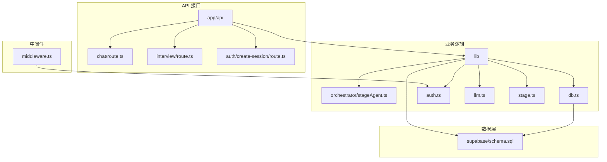

# 后端架构

<cite>
**本文档中引用的文件**  
- [app/api/chat/route.ts](file://app/api/chat/route.ts)
- [app/api/interview/route.ts](file://app/api/interview/route.ts)
- [app/api/interview/start/route.ts](file://app/api/interview/start/route.ts)
- [app/api/interview/answer/route.ts](file://app/api/interview/answer/route.ts)
- [lib/db.ts](file://lib/db.ts)
- [lib/orchestrator/stageAgent.ts](file://lib/orchestrator/stageAgent.ts)
- [middleware.ts](file://middleware.ts)
- [lib/auth.ts](file://lib/auth.ts)
- [lib/llm.ts](file://lib/llm.ts)
- [lib/stage.ts](file://lib/stage.ts)
- [supabase/schema.sql](file://supabase/schema.sql)
</cite>

## 目录
1. [简介](#简介)
2. [项目结构](#项目结构)
3. [API路由设计](#api路由设计)
4. [认证机制](#认证机制)
5. [数据库抽象层](#数据库抽象层)
6. [AI流程控制器](#ai流程控制器)
7. [API安全性与错误处理](#api安全性与错误处理)
8. [性能监控与日志记录建议](#性能监控与日志记录建议)
9. [结论](#结论)

## 简介

ai-job-coach 是一个基于 Next.js 构建的 AI 求职教练平台，其后端架构围绕用户求职流程的多个阶段（职业规划、项目梳理、简历优化、投递策略、模拟面试、薪资沟通、Offer 评估）进行设计。系统通过 API 路由处理 HTTP 请求，利用 Supabase 实现用户认证与数据持久化，并通过一个“编排器”模式的 AI 流程控制器，根据用户所处的阶段动态调整 AI 的行为策略。本文档将深入解析其核心组件，包括 API 路由、认证机制、数据库抽象层和 AI 编排器，以及相关的安全性和错误处理机制。

## 项目结构

该项目采用典型的 Next.js App Router 结构，核心后端逻辑分布在 `app/api` 目录下，而业务逻辑和工具函数则组织在 `lib` 目录中。`components` 目录包含可复用的 UI 组件。`supabase` 目录定义了数据库的 Schema。

**图源**
- [app/api](file://app/api)
- [lib](file://lib)
- [supabase/schema.sql](file://supabase/schema.sql)

## API路由设计

`app/api` 目录下的每个 `route.ts` 文件都定义了一个独立的 API 端点。这些端点遵循 RESTful 风格，主要通过 `POST` 方法处理请求，并返回 JSON 格式的响应。系统通过不同的路由路径来区分不同的功能模块。

### /chat 接口处理逻辑

`/chat` 接口是与 AI 进行对话的核心入口。它接收包含用户消息和当前阶段（`stage`）的请求体，根据阶段动态生成系统提示词（System Prompt），并调用 LLM 生成回复。

**处理流程：**
1.  **认证检查**：调用 `getCurrentUserFromRequest` 确保用户已登录。
2.  **请求解析**：解析 JSON 请求体，验证 `messages` 数组的有效性。
3.  **安全防护**：检查并拒绝任何包含 API Key 的请求，防止密钥泄露。
4.  **系统提示词注入**：根据请求中的 `stage` 参数，从 `STAGE_PROMPTS` 映射中获取对应的系统提示词。该提示词定义了 AI 在该阶段的角色、语气和交互规则。
5.  **消息构建**：将系统提示词作为第一条消息注入到用户的消息历史中。
6.  **LLM 调用**：调用 `callLLM` 函数，将构建好的消息数组发送给大语言模型。
7.  **响应返回**：将 LLM 的回复封装在 JSON 响应中返回给前端。

此接口的设计体现了“动态角色扮演”的思想，使得同一个 `/chat` 端点可以根据用户所处的求职阶段，展现出完全不同的专业能力和对话风格。

**本节来源**
- [app/api/chat/route.ts](file://app/api/chat/route.ts#L1-L238)

### /interview 系列接口处理逻辑

`/interview` 目录下的接口构成了一个完整的模拟面试系统，包括 `start`、`answer`、`assess` 和 `complete` 等子路由。

-   **`/interview/start`**：此接口用于启动一场新的模拟面试。它接收职位描述（JD）、面试轮次类型和题目数量。后端会创建一个面试会话（session），并调用 LLM 根据 JD 生成指定数量的面试问题。问题和会话信息会被持久化到数据库。
-   **`/interview/answer`**：用户提交对某个问题的回答后，此接口被调用。它会验证用户对该会话的访问权限，然后调用 LLM 对用户的回答进行评估，给出评分和改进建议。评估结果也会被保存。
-   **`/interview/assess`**：这是一个评估接口，接收问题、回答和轮次信息，返回一个包含分数、详细反馈和回答要点的结构化评估结果。
-   **`/interview/route.ts`**：这是一个统一的 API 入口，通过 `action` 参数（如 `start_round`, `answer`, `next_question`, `finish_round`）来分发处理不同的面试操作。它实现了“单一入口，多路分发”的设计模式，简化了前端的调用逻辑。

整个 `/interview` 系列接口的设计，将一个复杂的模拟面试流程分解为一系列原子化的 API 调用，使得前端可以灵活地控制面试的每一步。

**本节来源**
- [app/api/interview/route.ts](file://app/api/interview/route.ts#L1-L809)
- [app/api/interview/start/route.ts](file://app/api/interview/start/route.ts#L1-L175)
- [app/api/interview/answer/route.ts](file://app/api/interview/answer/route.ts#L1-L205)
- [app/api/interview/assess/route.ts](file://app/api/interview/assess/route.ts#L1-L167)

## 认证机制

系统的认证机制基于 Supabase Auth，并通过 `middleware.ts` 和 `lib/auth.ts` 两个核心文件实现。

### middleware.ts 拦截逻辑

`middleware.ts` 是 Next.js 的中间件，它在每个请求到达具体页面或 API 之前执行。其主要职责是拦截未认证用户的访问。

**拦截流程：**
1.  **路径放行**：首先检查请求路径，对 `/login`、`/invite`、`/api/*` 以及所有静态资源路径放行，允许匿名访问。
2.  **环境检查**：验证 `SUPABASE_URL` 和 `SUPABASE_ANON_KEY` 环境变量是否配置。
3.  **会话验证**：从 Cookie 中读取 `sb-access-token` 和 `sb-session-user-id`。它尝试通过多种方式验证会话的有效性：
    -   **Cookie 解析**：解析 `sb-access-token` 中的 JWT 信息，检查其是否过期，并验证 `userId` 的格式。
    -   **Authorization Header**：如果 Cookie 验证失败，检查请求头中的 `Bearer` Token，并通过 Supabase 的 `getUser` API 进行验证。
    -   **Admin API 验证**：如果配置了 `SUPABASE_SERVICE_ROLE_KEY`，则使用 Admin API 直接查询用户是否存在，这是最严格的验证方式。
4.  **重定向**：如果所有验证方式均失败，则将用户重定向到登录页，并附带原始请求路径作为 `redirect` 参数，以便登录后跳转。

这种多层验证机制确保了认证的安全性，同时兼顾了开发环境的容错性。

### lib/auth.ts 认证服务

`lib/auth.ts` 提供了在 API 路由内部进行认证的工具函数。

-   `getCurrentUserFromRequest`：该函数利用 `@supabase/auth-helpers-nextjs` 库，通过 `cookies()` 从请求中获取 Supabase 的会话信息，并调用 `supabase.auth.getUser()` 来获取当前用户对象。如果获取失败或用户未登录，则返回 `null`。这个函数被广泛用于各个需要认证的 API 端点中，作为第一道安全防线。

`middleware.ts` 负责全局的、粗粒度的访问控制，而 `lib/auth.ts` 则提供了在具体业务逻辑中进行细粒度认证的能力，两者相辅相成。

**本节来源**
- [middleware.ts](file://middleware.ts#L1-L170)
- [lib/auth.ts](file://lib/auth.ts#L1-L40)

## 数据库抽象层

`lib/db.ts` 文件封装了对 Supabase 数据库的所有操作，提供了一个统一、类型安全的数据访问接口。它隐藏了底层数据库客户端的复杂性，使得业务代码可以专注于逻辑，而无需关心数据库连接和错误处理的细节。

### 核心设计

-   **单例客户端**：`getDbClient` 函数使用单例模式，确保在整个应用生命周期内只创建一个数据库客户端实例，避免了重复连接的开销。
-   **环境适配**：代码中注释提到，为了兼容 Vercel Edge Runtime，仅使用 Supabase 客户端，而禁用了可能不兼容的原生 PostgreSQL 客户端。
-   **优雅降级**：如果环境变量未配置导致数据库客户端初始化失败，`getDbClient` 会返回 `null`，而不是抛出错误。上层业务函数（如 `saveMessage`）会检查此返回值，如果为 `null`，则静默失败或回退到本地存储（如 `localStorage`），保证了应用在无数据库环境下的基本可用性。

### 主要功能

该文件导出了多个针对不同业务实体的操作函数：

-   **消息管理**：`saveMessage` 和 `getMessages` 用于持久化和读取对话消息。
-   **白板状态管理**：`saveWhiteboard` 和 `getWhiteboard` 用于保存和恢复用户在白板上的操作状态。
-   **用户进度管理**：`setUserStage` 和 `getUserStage` 用于记录和查询用户当前所处的求职阶段。
-   **简历管理**：`saveResume` 用于保存用户上传的简历及其解析结果。

这些函数都遵循一致的错误处理模式：如果数据库操作失败，则抛出错误，由调用方（通常是 API 路由）捕获并返回相应的 HTTP 错误响应。

**本节来源**
- [lib/db.ts](file://lib/db.ts#L1-L327)
- [supabase/schema.sql](file://supabase/schema.sql#L1-L84)

## AI流程控制器

`lib/orchestrator/stageAgent.ts` 是整个 AI 系统的“大脑”，它实现了“编排器”（Orchestrator）模式的核心思想。该模式的核心是根据上下文（在这里是用户的 `stage`）动态地选择和执行不同的处理逻辑。

### 核心思想

在理想状态下，`runStageModel` 函数会根据传入的 `UserStage` 类型，调用对应的子模块（如 `runDeepSeekCareer`、`runDeepSeekResume` 等）。每个子模块都封装了针对特定求职阶段的复杂逻辑，例如调用不同的 LLM 提示词、处理特定的数据结构等。这样，上层应用（如 `/chat` 接口）只需调用 `runStageModel` 并传入当前阶段，即可获得正确的 AI 响应，而无需了解各个阶段的具体实现细节。

### 当前状态

根据代码注释 `/* LangChain disabled */`，当前所有与 LangChain 相关的子模块调用均被注释掉。`runStageModel` 函数目前只是一个“直通”（passthrough）函数，它直接返回用户最后一条消息的内容。这表明该编排器的功能目前处于禁用或开发中的状态，但其设计蓝图已经清晰地展现出来。

一旦启用，这个编排器将成为连接用户状态与 AI 行为的关键枢纽，使得 AI 能够像一个真正的求职教练一样，根据用户在求职旅程中的位置，提供连贯且有针对性的指导。

**本节来源**
- [lib/orchestrator/stageAgent.ts](file://lib/orchestrator/stageAgent.ts#L1-L99)
- [lib/stage.ts](file://lib/stage.ts#L1-L85)

## API安全性与错误处理

系统在 API 安全性和错误处理方面采取了多项措施。

### 安全性措施

-   **CORS**：虽然代码中未显式配置 CORS，但 Next.js API 路由默认会处理 CORS。结合 Supabase 的认证，确保了 API 只能被授权的前端应用访问。
-   **JWT 验证**：通过 `middleware.ts` 和 `lib/auth.ts` 对 JWT Token 进行了多层验证，防止未授权访问。
-   **密钥防护**：在多个 API 路由（如 `/chat`、`/interview`）中，都显式检查了请求体中是否包含 `apiKey`、`key` 或 `token` 等字段。如果发现，立即返回 400 错误，有效防止了前端意外泄露 LLM API 密钥的风险。
-   **输入验证**：所有 API 端点都对请求体进行了解析和验证，确保数据格式正确，防止无效或恶意数据进入系统。

### 错误处理机制

-   **统一错误响应**：所有 API 端点都使用 `try...catch` 块捕获异常，并返回结构化的 JSON 错误响应，包含 `ok: false`、`error` 消息和相应的 HTTP 状态码。
-   **降级策略**：在 `lib/llm.ts` 中，`callLLM` 函数实现了超时和重试机制。当 LLM 调用失败时，会进行指数退避重试。如果配置了 `LLM_STUB=1`，则会进入“存根”（stub）模式，返回预设的 mock 响应，保证了在 LLM 服务不可用时，前端功能不会完全中断。
-   **日志记录**：所有关键的错误和警告信息都会通过 `console.error` 或 `console.warn` 输出，便于开发者监控和排查问题。

## 性能监控与日志记录建议

为了进一步提升系统的可观测性，建议实施以下性能监控与日志记录策略：

1.  **集成应用性能监控（APM）工具**：引入如 Sentry、Datadog 或 New Relic 等工具，可以自动捕获未处理的异常、监控 API 延迟、追踪数据库查询性能，并提供详细的错误堆栈信息。
2.  **结构化日志**：将 `console.log` 和 `console.error` 替换为结构化的日志库（如 `pino` 或 `winston`）。将日志输出为 JSON 格式，包含时间戳、日志级别、请求 ID、用户 ID 等元数据，便于集中收集（如通过 ELK Stack）和分析。
3.  **关键路径追踪**：在 `callLLM` 和数据库操作等关键函数中添加性能追踪，记录函数执行时间。这有助于识别性能瓶颈，例如某个 LLM 调用是否异常缓慢。
4.  **错误分类与告警**：对错误进行分类（如认证错误、数据库错误、LLM 错误），并设置告警规则。例如，当 LLM API 调用失败率超过 5% 时，向开发团队发送告警通知。
5.  **用户行为日志**：在不侵犯用户隐私的前提下，记录关键的用户行为事件（如开始面试、完成简历优化），用于分析用户使用模式和产品改进。

## 结论

ai-job-coach 的后端架构设计清晰，模块化程度高。其核心优势在于通过 `stageAgent` 体现的“编排器”模式思想，为实现一个能够理解用户上下文并提供个性化指导的 AI 教练奠定了坚实的基础。API 路由设计合理，认证和数据库层封装良好，具备一定的安全性和健壮性。未来的工作重点应是启用并完善 `stageAgent` 的功能，同时加强系统的性能监控和日志能力，以支撑更复杂的 AI 交互和更稳定的服务。