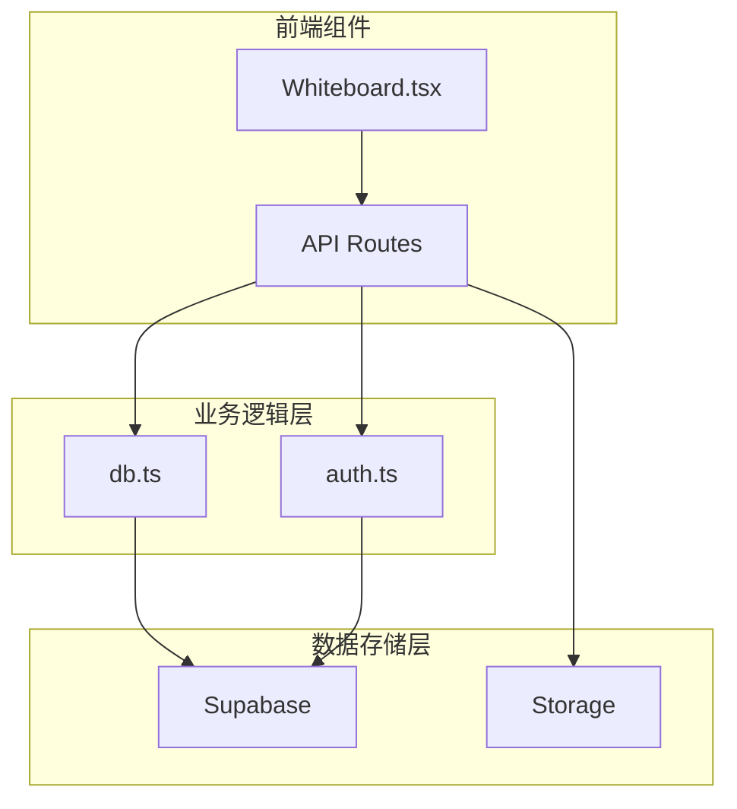
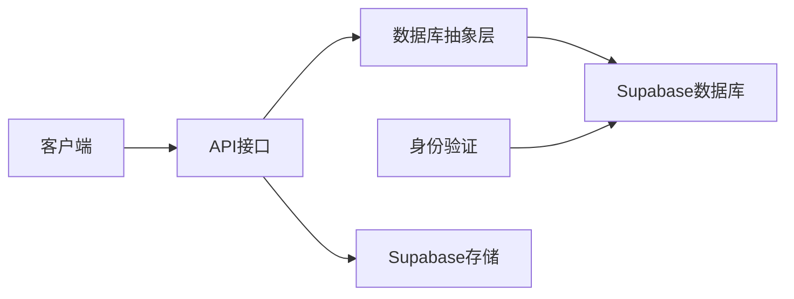
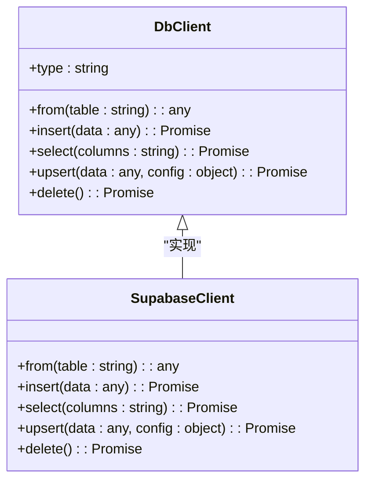
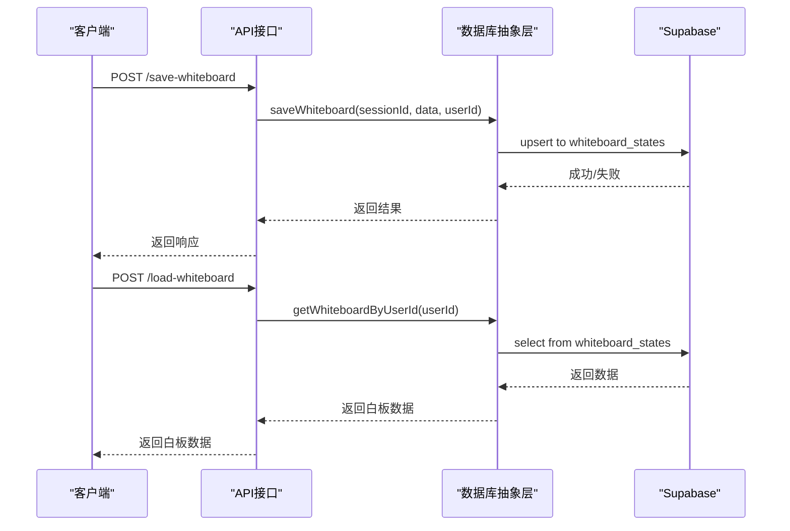
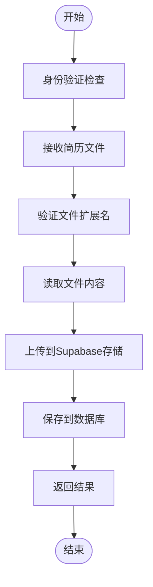
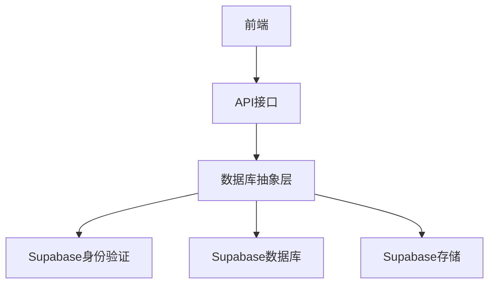

# 数据库抽象层

<cite>
**本文档引用的文件**   
- [db.ts](file://lib/db.ts)
- [auth.ts](file://lib/auth.ts)
- [load-whiteboard\route.ts](file://app/api/load-whiteboard/route.ts)
- [save-whiteboard\route.ts](file://app/api/save-whiteboard/route.ts)
- [schema.sql](file://supabase/schema.sql)
- [fix-whiteboard-schema.sql](file://fix-whiteboard-schema.sql)
- [resume\upload\route.ts](file://app/api/resume/upload/route.ts)
- [Whiteboard.tsx](file://components/Whiteboard.tsx)
</cite>

## 目录
1. [简介](#简介)
2. [项目结构](#项目结构)
3. [核心组件](#核心组件)
4. [架构概述](#架构概述)
5. [详细组件分析](#详细组件分析)
6. [依赖分析](#依赖分析)
7. [性能考虑](#性能考虑)
8. [故障排除指南](#故障排除指南)
9. [结论](#结论)

## 简介
本技术文档详细阐述了AI求职教练项目的数据库抽象层设计与实现。该系统通过`lib/db.ts`文件封装Supabase客户端，为用户提供类型安全、可复用的数据访问接口。文档重点说明了如何统一处理用户会话、白板数据和简历记录的增删改查操作，并屏蔽底层数据库差异。结合`/load-whiteboard`与`/save-whiteboard`接口调用实例，展示了数据持久化流程。同时解释了SQL schema设计原则，包括表结构、索引策略与外键关系，并提供性能优化建议。

## 项目结构
项目采用分层架构设计，将数据库访问逻辑集中于`lib/db.ts`文件中，通过统一的API暴露给上层应用。数据访问层与业务逻辑层分离，确保代码的可维护性和可扩展性。

**图表来源**
- [db.ts](file://lib/db.ts)
- [auth.ts](file://lib/auth.ts)
- [Whiteboard.tsx](file://components/Whiteboard.tsx)

**本节来源**
- [db.ts](file://lib/db.ts)
- [auth.ts](file://lib/auth.ts)

## 核心组件
数据库抽象层的核心是`lib/db.ts`文件，它提供了对Supabase客户端的封装，实现了类型安全的数据访问接口。该层统一处理用户会话、白板数据和简历记录的CRUD操作，屏蔽了底层数据库的复杂性。

**本节来源**
- [db.ts](file://lib/db.ts)

## 架构概述
系统采用客户端-服务器架构，通过RESTful API进行通信。数据库抽象层位于应用服务器端，负责处理所有数据持久化操作。身份验证使用Supabase Auth服务，数据存储使用Supabase PostgreSQL数据库。

**图表来源**
- [db.ts](file://lib/db.ts)
- [auth.ts](file://lib/auth.ts)
- [load-whiteboard\route.ts](file://app/api/load-whiteboard/route.ts)
- [save-whiteboard\route.ts](file://app/api/save-whiteboard/route.ts)

## 详细组件分析

### 数据库客户端封装分析
`lib/db.ts`文件实现了数据库客户端的封装，支持Supabase作为后端存储。通过环境变量配置，系统能够自动初始化Supabase客户端，并提供统一的访问接口。

#### 类图

**图表来源**
- [db.ts](file://lib/db.ts)

### 白板数据管理分析
白板数据管理是系统的核心功能之一，通过`saveWhiteboard`和`getWhiteboard`等方法实现数据的持久化。系统支持基于会话ID和用户ID的双重存储策略。

#### 序列图

**图表来源**
- [db.ts](file://lib/db.ts)
- [save-whiteboard\route.ts](file://app/api/save-whiteboard/route.ts)
- [load-whiteboard\route.ts](file://app/api/load-whiteboard/route.ts)

### 简历数据管理分析
简历数据管理涉及文件上传、解析和存储等多个环节。系统通过`saveResume`方法将简历数据持久化到数据库中。

#### 流程图

**图表来源**
- [db.ts](file://lib/db.ts)
- [resume\upload\route.ts](file://app/api/resume/upload/route.ts)

**本节来源**
- [db.ts](file://lib/db.ts)
- [save-whiteboard\route.ts](file://app/api/save-whiteboard/route.ts)
- [load-whiteboard\route.ts](file://app/api/load-whiteboard/route.ts)
- [resume\upload\route.ts](file://app/api/resume/upload/route.ts)

## 依赖分析
系统依赖于Supabase作为后端服务，包括身份验证、数据库和存储服务。通过环境变量进行配置，确保了部署的灵活性。

**图表来源**
- [db.ts](file://lib/db.ts)
- [auth.ts](file://lib/auth.ts)

**本节来源**
- [db.ts](file://lib/db.ts)
- [auth.ts](file://lib/auth.ts)

## 性能考虑
数据库抽象层在设计时考虑了多种性能优化策略：

1. **查询缓存**：对于频繁访问的数据，建议在应用层实现缓存机制。
2. **批量操作**：对于大量数据的写入操作，应使用批量插入而非逐条插入。
3. **连接池管理**：Supabase自动管理连接池，但应避免频繁创建和销毁客户端实例。
4. **索引优化**：在经常查询的字段上创建索引，如`user_id`和`session_id`。
5. **数据分页**：对于大量数据的查询，应实现分页机制，避免一次性加载过多数据。

## 故障排除指南
### 常见问题及解决方案
1. **数据库连接失败**
   - 检查环境变量`SUPABASE_URL`和`SUPABASE_ANON_KEY`是否正确配置
   - 确认网络连接正常

2. **数据无法保存**
   - 检查表结构是否与代码期望的结构匹配
   - 验证用户权限是否足够

3. **性能问题**
   - 检查是否有缺失的索引
   - 分析慢查询日志

4. **类型错误**
   - 确认数据类型与数据库字段类型匹配
   - 检查JSONB字段的结构是否正确

**本节来源**
- [db.ts](file://lib/db.ts)
- [auth.ts](file://lib/auth.ts)

## 结论
数据库抽象层成功实现了对Supabase客户端的封装，提供了类型安全、可复用的数据访问接口。通过统一的API，系统能够高效地处理用户会话、白板数据和简历记录的增删改查操作。SQL schema设计合理，包含了必要的索引和外键约束，确保了数据的完整性和查询性能。未来可以进一步优化，如实现更精细的缓存策略和查询优化。