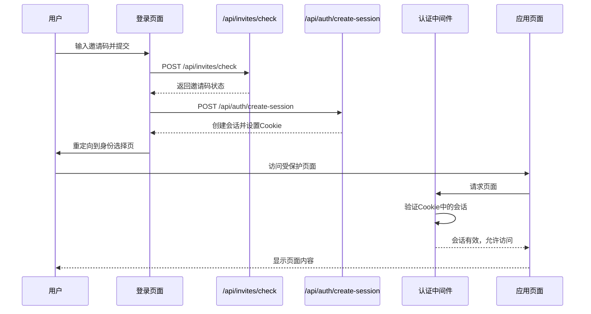

# 认证机制

<cite>
**本文档引用文件**  
- [middleware.ts](file://middleware.ts)
- [app/api/auth/create-session/route.ts](file://app/api/auth/create-session/route.ts)
- [app/api/verify/route.ts](file://app/api/verify/route.ts)
- [lib/auth.ts](file://lib/auth.ts)
- [lib/useAuth.ts](file://lib/useAuth.ts)
- [app/login/page.tsx](file://app/login/page.tsx)
- [SESSION_SYSTEM_README.md](file://SESSION_SYSTEM_README.md)
</cite>

## 目录
1. [简介](#简介)
2. [认证流程概述](#认证流程概述)
3. [核心组件分析](#核心组件分析)
4. [认证流程时序图](#认证流程时序图)
5. [Token传递与存储机制](#token传递与存储机制)
6. [会话管理策略](#会话管理策略)
7. [安全防护措施](#安全防护措施)
8. [常见认证问题排查](#常见认证问题排查)
9. [结论](#结论)

## 简介
本系统采用基于JWT的认证机制，结合Supabase身份验证服务，实现完整的用户会话管理。系统通过邀请码机制控制访问权限，使用中间件进行路径拦截，确保受保护资源的安全访问。认证体系包含前端状态维护、后端会话验证和自动重定向功能，为用户提供无缝的登录体验。

## 认证流程概述
系统的认证流程始于用户在登录页面输入邀请码。系统首先验证邀请码的有效性，然后创建Supabase会话并设置相应的Cookie。后续对受保护路径的访问将通过中间件进行拦截和验证，确保只有经过认证的用户才能访问应用核心功能。

**Section sources**
- [app/login/page.tsx](file://app/login/page.tsx#L1-L388)
- [SESSION_SYSTEM_README.md](file://SESSION_SYSTEM_README.md#L1-L205)

## 核心组件分析

### 中间件拦截机制
`middleware.ts`文件实现了对进入`/app/`下请求的路径匹配和认证拦截。该中间件配置了匹配规则，拦截除API路由、静态文件和特定页面外的所有请求。

中间件首先检查请求路径是否属于免认证范围（如登录页、邀请码页面、API路由等）。对于需要认证的路径，中间件从Cookie中提取`sb-access-token`和`sb-session-user-id`，并结合Supabase Admin API验证会话的有效性。如果会话无效，用户将被重定向到登录页面，并保留原始请求路径以便登录后重定向。

**Section sources**
- [middleware.ts](file://middleware.ts#L1-L170)

### 会话创建与验证
`/api/auth/create-session`接口负责在邀请码验证后创建用户会话。该接口使用Supabase Admin API检查或创建用户，并生成包含用户信息的Base64编码Token。Token中包含用户ID、伪造邮箱和7天后过期的时间戳。

`/api/verify`接口用于验证短信验证码，通过内存缓存机制存储验证码并检查其有效性。该接口实现了验证码的时效性控制，确保安全性。

**Section sources**
- [app/api/auth/create-session/route.ts](file://app/api/auth/create-session/route.ts#L1-L219)
- [app/api/verify/route.ts](file://app/api/verify/route.ts#L1-L39)

### 前端认证状态管理
`lib/auth.ts`提供了服务器端的认证工具函数，包括`getCurrentUserFromRequest`和`getCurrentUserId`，用于从请求中获取当前用户信息。这些函数使用Supabase Auth Helpers与Next.js Headers集成，实现服务端的用户身份验证。

`lib/useAuth.ts`是一个客户端React Hook，作为中间件的补充检查机制。它在客户端定期检查认证状态，如果发现用户未认证，则重定向到登录页面。该Hook检查Cookie中的会话信息或localStorage中的会话ID，确保客户端状态与服务器端一致。

**Section sources**
- [lib/auth.ts](file://lib/auth.ts#L1-L40)
- [lib/useAuth.ts](file://lib/useAuth.ts#L1-L59)

## 认证流程时序图

**Diagram sources**
- [app/login/page.tsx](file://app/login/page.tsx#L6-L109)
- [app/api/auth/create-session/route.ts](file://app/api/auth/create-session/route.ts#L22-L217)
- [middleware.ts](file://middleware.ts#L14-L152)

## Token传递与存储机制
系统采用多种方式传递和存储认证Token：

1. **Cookie存储**：主要的认证信息存储在HttpOnly Cookie中，包括`sb-access-token`和`sb-session-user-id`。这种存储方式可防止XSS攻击，提高安全性。

2. **Bearer Token**：系统也支持通过Authorization Header传递Bearer Token，为API调用提供灵活的认证方式。

3. **Token格式**：`sb-access-token`是Base64编码的JSON对象，包含用户ID、伪造邮箱和过期时间戳。这种自定义Token格式简化了会话管理，同时保持了JWT的核心特性。

4. **有效期**：所有会话的有效期设置为7天，符合"7天免登录"的设计目标。

**Section sources**
- [middleware.ts](file://middleware.ts#L78-L80)
- [app/api/auth/create-session/route.ts](file://app/api/auth/create-session/route.ts#L186-L190)

## 会话管理策略
系统实现了完善的会话管理策略，确保用户会话的安全性和一致性：

1. **单设备登录**：同一邀请码只能在一个设备上保持活跃会话。当用户在新设备登录时，旧设备的会话将被自动终止。

2. **会话有效期**：所有会话设置7天有效期，过期后需要重新登录。

3. **会话验证**：每次访问受保护资源时，中间件都会验证会话的有效性，包括检查Token格式、过期时间和用户存在性。

4. **数据绑定**：用户的聊天记录和白板内容与`user_id`绑定，实现跨设备的数据同步。

**Section sources**
- [SESSION_SYSTEM_README.md](file://SESSION_SYSTEM_README.md#L1-L205)

## 安全防护措施
系统实施了多层次的安全防护措施：

1. **CSRF防护**：使用HttpOnly Cookie存储会话信息，防止跨站请求伪造攻击。

2. **CORS配置**：通过环境变量控制API访问权限，确保只有授权的前端可以访问后端API。

3. **输入验证**：严格验证所有API请求参数，防止恶意输入。

4. **环境隔离**：开发环境和生产环境采用不同的安全配置，如Cookie的Secure属性仅在生产环境中启用。

5. **错误处理**：详细的错误日志记录有助于安全审计和问题排查，同时向用户返回通用的错误信息，避免信息泄露。

**Section sources**
- [middleware.ts](file://middleware.ts#L193-L207)
- [app/api/auth/create-session/route.ts](file://app/api/auth/create-session/route.ts#L192-L207)

## 常见认证问题排查

### 401错误处理
当用户遇到401未授权错误时，可能的原因包括：
- 会话已过期（超过7天未活动）
- 在其他设备登录导致当前会话被终止
- Cookie被清除或浏览器隐私设置阻止Cookie存储

解决方案：重新访问登录页面，输入邀请码重新创建会话。

### Token无效问题
Token无效的常见原因：
- Token格式损坏
- 用户ID与Token中的信息不匹配
- Supabase服务异常

排查步骤：
1. 检查浏览器Cookie中是否存在`sb-access-token`和`sb-session-user-id`
2. 验证Token的Base64解码是否成功
3. 检查Supabase服务状态和环境变量配置

### 重定向循环问题
如果出现登录后仍被重定向到登录页面的循环问题：
1. 检查`SUPABASE_URL`和`SUPABASE_ANON_KEY`环境变量是否正确配置
2. 验证Supabase服务是否正常运行
3. 检查浏览器是否阻止了第三方Cookie

**Section sources**
- [middleware.ts](file://middleware.ts#L142-L149)
- [lib/useAuth.ts](file://lib/useAuth.ts#L28-L31)

## 结论
本系统的认证机制设计合理，实现了安全性和用户体验的平衡。通过中间件拦截、JWT会话管理和前端状态维护的协同工作，系统提供了无缝的用户认证体验。邀请码机制有效控制了访问权限，而7天免登录策略提升了用户便利性。系统的安全防护措施到位，能够抵御常见的Web安全威胁。整体认证体系为AI求职教练应用提供了可靠的安全基础。