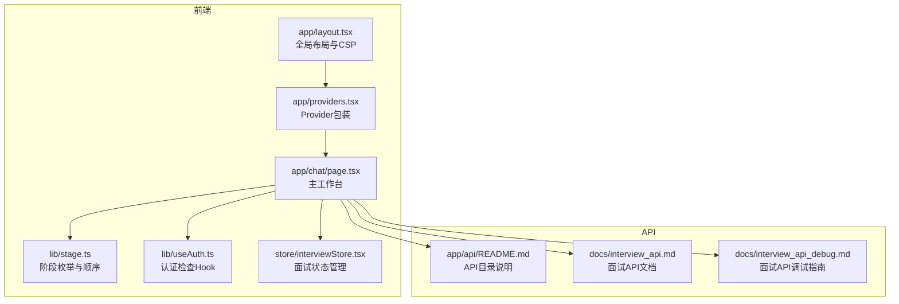
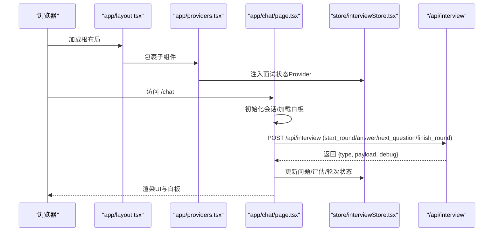
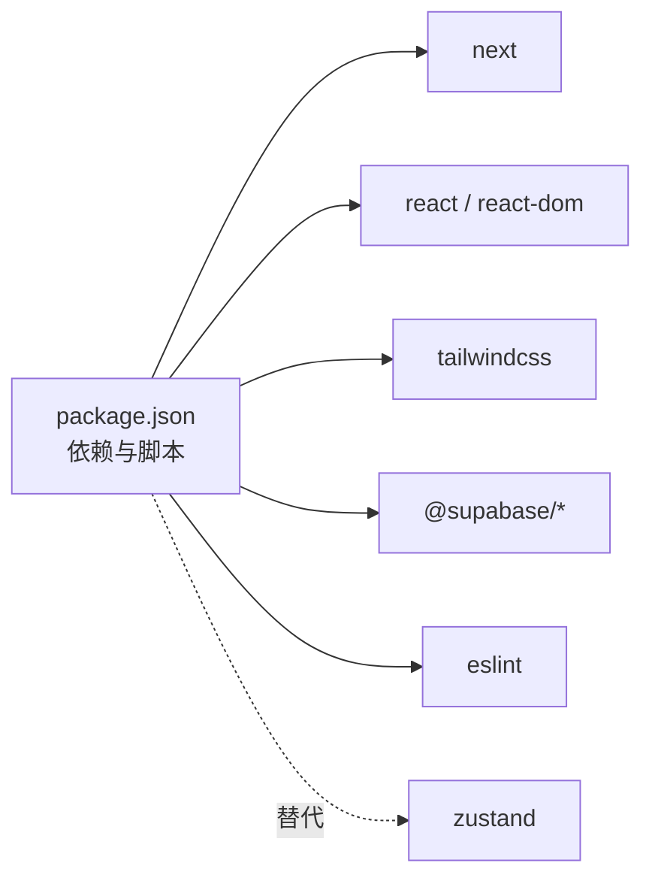

# 开发指南

<cite>
**本文引用的文件**
- [README.md](file://README.md)
- [GITHUB_PUSH_GUIDE.md](file://GITHUB_PUSH_GUIDE.md)
- [FRONTEND_PAGES.md](file://FRONTEND_PAGES.md)
- [INTERVIEW_START_STAGE_FIX.md](file://INTERVIEW_START_STAGE_FIX.md)
- [package.json](file://package.json)
- [docs/interview_api.md](file://docs/interview_api.md)
- [docs/interview_api_debug.md](file://docs/interview_api_debug.md)
- [app/api/README.md](file://app/api/README.md)
- [app/layout.tsx](file://app/layout.tsx)
- [app/providers.tsx](file://app/providers.tsx)
- [app/chat/page.tsx](file://app/chat/page.tsx)
- [lib/stage.ts](file://lib/stage.ts)
- [lib/useAuth.ts](file://lib/useAuth.ts)
- [store/interviewStore.tsx](file://store/interviewStore.tsx)
</cite>

## 目录
1. [简介](#简介)
2. [项目结构](#项目结构)
3. [核心组件](#核心组件)
4. [架构总览](#架构总览)
5. [详细组件分析](#详细组件分析)
6. [依赖关系分析](#依赖关系分析)
7. [性能考虑](#性能考虑)
8. [故障排查指南](#故障排查指南)
9. [结论](#结论)
10. [附录](#附录)

## 简介
本开发指南面向新贡献者，帮助你在本地快速搭建开发环境、理解项目结构与关键流程、掌握调试方法，并提供标准化的功能扩展流程（如新增AI辅导阶段）。文档内容均基于仓库现有文件整理，确保可操作性和准确性。

## 项目结构
项目采用 Next.js App Router 结构，前端页面集中在 app/ 目录，API 路由集中在 app/api/，状态管理使用 React Context（store/interviewStore.tsx），并与 Supabase 认证集成。整体目录概览如下：

图表来源
- [app/layout.tsx](file://app/layout.tsx#L1-L58)
- [app/providers.tsx](file://app/providers.tsx#L1-L13)
- [app/chat/page.tsx](file://app/chat/page.tsx#L1-L120)
- [lib/stage.ts](file://lib/stage.ts#L1-L85)
- [lib/useAuth.ts](file://lib/useAuth.ts#L1-L59)
- [store/interviewStore.tsx](file://store/interviewStore.tsx#L1-L120)
- [app/api/README.md](file://app/api/README.md#L1-L120)
- [docs/interview_api.md](file://docs/interview_api.md#L1-L60)
- [docs/interview_api_debug.md](file://docs/interview_api_debug.md#L1-L40)

章节来源
- [README.md](file://README.md#L1-L120)
- [package.json](file://package.json#L1-L42)

## 核心组件
- 全局布局与安全策略：全局 CSP 配置、字体与图标资源引入、主题变量。
- Provider 包装：在根布局中注入面试状态 Provider，使子组件可使用面试状态。
- 主工作台（ChatPage）：负责会话加载、消息发送、白板分析与持久化、阶段切换与面试入口。
- 面试状态管理（interviewStore）：封装面试流程的会话、轮次、问题、评估与历史记录。
- 阶段定义（stage）：定义求职阶段枚举、顺序与中文名称映射。
- 认证检查（useAuth）：客户端兜底校验，确保未登录用户跳转至登录页。

章节来源
- [app/layout.tsx](file://app/layout.tsx#L1-L58)
- [app/providers.tsx](file://app/providers.tsx#L1-L13)
- [app/chat/page.tsx](file://app/chat/page.tsx#L1-L200)
- [store/interviewStore.tsx](file://store/interviewStore.tsx#L1-L200)
- [lib/stage.ts](file://lib/stage.ts#L1-L85)
- [lib/useAuth.ts](file://lib/useAuth.ts#L1-L59)

## 架构总览
前端通过 App Router 管理页面与路由，ChatPage 作为主工作台承载对话、白板与阶段控制；面试流程通过 interviewStore 与 /api/interview 协作；认证通过 Supabase Cookie 与本地存储双重保障。

图表来源
- [app/layout.tsx](file://app/layout.tsx#L1-L58)
- [app/providers.tsx](file://app/providers.tsx#L1-L13)
- [app/chat/page.tsx](file://app/chat/page.tsx#L350-L520)
- [store/interviewStore.tsx](file://store/interviewStore.tsx#L420-L520)
- [docs/interview_api.md](file://docs/interview_api.md#L1-L120)

## 详细组件分析

### 本地开发与环境配置
- 克隆仓库与安装依赖：支持 npm/yarn/pnpm。
- 配置环境变量：复制 .env.example 为 .env.local，添加 DEEPSEEK_API_KEY。
- 启动开发服务器：npm run dev。
- 生产构建与启动：npm run build 与 npm start。
- 部署到 Vercel：通过 Dashboard 或 CLI，确保在 Environment Variables 中配置 DEEPSEEK_API_KEY。

章节来源
- [README.md](file://README.md#L22-L122)

### 提交规范与分支策略（GitHub 推送）
- 使用 Personal Access Token 推送，推荐权限仅包含 repo。
- 方法一：一次性推送（git push https://TOKEN@...）。
- 方法二：更新 remote URL 后常规 git push。
- 常见问题：权限不足、仓库不存在、凭证无效。
- 重要提示：Token 等同密码，妥善保管，避免泄露。

章节来源
- [GITHUB_PUSH_GUIDE.md](file://GITHUB_PUSH_GUIDE.md#L1-L98)

### 前端页面与路由配置（新增页面与导航）
- 根布局与入口：app/layout.tsx 提供全局 CSP、样式与 Providers。
- 主工作台：/chat（app/chat/page.tsx）承载对话、白板与阶段控制。
- 面试入口：当用户选择“模拟面试”阶段时，跳转到 /interview/start。
- 其他详情页：简历/项目/面试详情页位于 /details/* 与 /chat/*，由 details 布局包裹。
- 新增页面建议：遵循 App Router 结构，在 app/ 下创建新页面，并在需要时更新路由与导航。

章节来源
- [FRONTEND_PAGES.md](file://FRONTEND_PAGES.md#L1-L201)
- [app/layout.tsx](file://app/layout.tsx#L1-L58)
- [app/chat/page.tsx](file://app/chat/page.tsx#L400-L470)

### 调试模拟面试流程
- 前端调试：在浏览器控制台使用 fetch 直接调用 /api/interview，验证 start_round/answer/next_question/finish_round 的响应类型与结构。
- 使用 Postman 或 curl：提供 curl 示例，便于离线或自动化测试。
- 调试技巧：检查响应类型（type）、debug 字段、错误信息；验证数据字段范围与完整性。
- interviewStore 集成：前端调用 /api/interview 后，store 会按响应类型更新问题、评估与轮次状态。

章节来源
- [docs/interview_api_debug.md](file://docs/interview_api_debug.md#L1-L120)
- [docs/interview_api_debug.md](file://docs/interview_api_debug.md#L250-L320)
- [docs/interview_api.md](file://docs/interview_api.md#L1-L120)
- [store/interviewStore.tsx](file://store/interviewStore.tsx#L420-L520)

### 修复面试起始阶段识别问题
- 问题：/interview/start 页面被误识别为其他阶段。
- 修复要点：
  - 添加固定阶段常量 FIXED_STAGE = "interview"，避免读取 localStorage.current_stage。
  - 删除当 jd 为空时重定向到 /chat 的逻辑。
  - 更新 Whiteboard 组件 currentStage 使用 FIXED_STAGE。
  - 在初始化 useEffect 中明确注释页面不读取全局阶段状态。
- 验证步骤：清空 localStorage、设置其他阶段值、访问 /interview/start，确认不跳转、不显示其他阶段开场白。

章节来源
- [INTERVIEW_START_STAGE_FIX.md](file://INTERVIEW_START_STAGE_FIX.md#L1-L120)
- [INTERVIEW_START_STAGE_FIX.md](file://INTERVIEW_START_STAGE_FIX.md#L120-L220)
- [INTERVIEW_START_STAGE_FIX.md](file://INTERVIEW_START_STAGE_FIX.md#L220-L340)

### 新增功能模块（新增AI辅导阶段）标准化流程
- API 路由创建：
  - 在 app/api/ 下新增对应目录与 route.ts，参考 app/api/README.md 的结构与示例。
  - 设计请求/响应格式，确保与前端 store 的期望一致。
- 状态管理扩展：
  - 在 store/interviewStore.tsx 中扩展状态字段与方法（如新增轮次类型、历史记录字段等）。
  - 在组件中通过 useInterviewStore 调用新方法，保持 UI 与状态解耦。
- UI 集成：
  - 在 app/chat/page.tsx 中根据新阶段扩展 sendStageGreeting 与白板分析逻辑。
  - 在 StageController/StageSelector/StageTransitionModal 中联动展示与过渡提示。
- 阶段定义：
  - 在 lib/stage.ts 中新增阶段枚举、顺序与中文名称映射。
- 认证与路由：
  - 在 lib/useAuth.ts 中确保未登录用户跳转至登录页。
  - 在 app/chat/page.tsx 中处理阶段选择与路由跳转。

章节来源
- [app/api/README.md](file://app/api/README.md#L1-L120)
- [store/interviewStore.tsx](file://store/interviewStore.tsx#L1-L200)
- [app/chat/page.tsx](file://app/chat/page.tsx#L400-L470)
- [lib/stage.ts](file://lib/stage.ts#L1-L85)
- [lib/useAuth.ts](file://lib/useAuth.ts#L1-L59)

### 日志查看与调试工具
- 浏览器开发者工具：
  - Console：查看 fetch 响应、错误与 debug 信息。
  - Network：过滤 interview 相关请求，观察请求/响应与耗时。
  - Elements：检查白板与消息渲染。
- Postman/curl：离线测试 API，验证参数与响应。
- 前端全局变量：
  - 在 ChatPage 中暴露 analyzeConversation 与 fsm 至 window，便于控制台调试。
  - 在 interviewStore 中提供默认实现，避免 Provider 缺失导致的报错。

章节来源
- [docs/interview_api_debug.md](file://docs/interview_api_debug.md#L120-L220)
- [app/chat/page.tsx](file://app/chat/page.tsx#L690-L760)
- [store/interviewStore.tsx](file://store/interviewStore.tsx#L740-L789)

## 依赖关系分析
- 前端依赖：Next.js、React、Tailwind CSS、Supabase、Zustand（面试状态使用 React Context 替代）。
- 开发依赖：ESLint、TypeScript、TailwindCSS。
- API 依赖：DeepSeek API Key（可选 stub 模式）。

图表来源
- [package.json](file://package.json#L1-L42)

章节来源
- [package.json](file://package.json#L1-L42)

## 性能考虑
- 白板分析的防抖：debounce 1 秒，避免频繁调用 /api/analyze。
- 会话加载优先级：优先从数据库加载，失败后降级到 localStorage。
- 网络请求超时：/api/stage-greeting 设置 15 秒超时，失败后使用 fallback 文案。
- 图标与字体：移除外部字体导入，减少构建期网络请求。

章节来源
- [app/chat/page.tsx](file://app/chat/page.tsx#L550-L670)
- [app/chat/page.tsx](file://app/chat/page.tsx#L710-L760)
- [app/layout.tsx](file://app/layout.tsx#L1-L58)

## 故障排查指南
- AI 对话重复输出相同内容：
  - 检查 .env.local 是否包含 DEEPSEEK_API_KEY。
  - 在 Vercel Dashboard 中确认 Environment Variables 配置。
- 构建失败：
  - 确认依赖安装完成，执行 npm run lint 检查 TypeScript 错误。
- 推送失败：
  - 检查 PAT 权限、仓库是否存在、token 是否完整复制。
- 面试流程异常：
  - 使用 docs/interview_api_debug.md 的 Console/curl 测试，核对响应类型与 debug 字段。
  - 检查 /interview/start 页面是否读取 localStorage.current_stage 或自动重定向。

章节来源
- [README.md](file://README.md#L162-L191)
- [GITHUB_PUSH_GUIDE.md](file://GITHUB_PUSH_GUIDE.md#L54-L98)
- [docs/interview_api_debug.md](file://docs/interview_api_debug.md#L330-L433)
- [INTERVIEW_START_STAGE_FIX.md](file://INTERVIEW_START_STAGE_FIX.md#L178-L224)

## 结论
本指南提供了从本地开发到功能扩展的完整路径：快速启动、提交规范、前端页面与路由、面试流程调试、常见问题修复与新增模块的标准流程。建议在新增功能时，先在 app/api/ 设计好接口契约，再在 store/interviewStore.tsx 与 app/chat/page.tsx 中集成，最后通过 docs/interview_api_debug.md 的调试方法验证。

## 附录
- API 目录结构与测试示例：参见 app/api/README.md。
- 面试 API 文档与调试：参见 docs/interview_api.md 与 docs/interview_api_debug.md。
- 阶段定义与顺序：参见 lib/stage.ts。
- 认证检查：参见 lib/useAuth.ts。

章节来源
- [app/api/README.md](file://app/api/README.md#L1-L120)
- [docs/interview_api.md](file://docs/interview_api.md#L1-L120)
- [docs/interview_api_debug.md](file://docs/interview_api_debug.md#L1-L120)
- [lib/stage.ts](file://lib/stage.ts#L1-L85)
- [lib/useAuth.ts](file://lib/useAuth.ts#L1-L59)