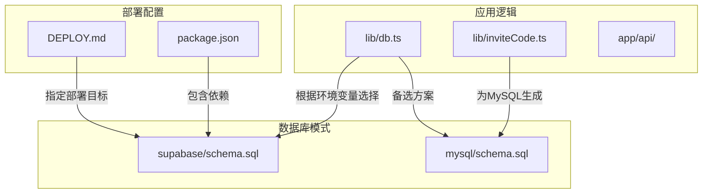
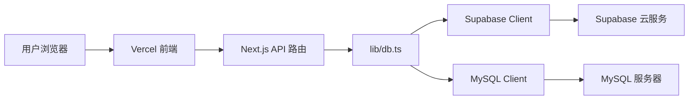

# 数据库模式对比

<cite>
**本文档引用的文件**   
- [supabase/schema.sql](file://supabase/schema.sql)
- [mysql/schema.sql](file://mysql/schema.sql)
- [lib/db.ts](file://lib/db.ts)
- [package.json](file://package.json)
- [DEPLOY.md](file://DEPLOY.md)
- [mysql/README.md](file://mysql/README.md)
- [lib/inviteCode.ts](file://lib/inviteCode.ts)
- [database-init.sql](file://database-init.sql)
- [fix-whiteboard-schema.sql](file://fix-whiteboard-schema.sql)
</cite>

## 目录
1. [引言](#引言)
2. [项目结构](#项目结构)
3. [核心组件](#核心组件)
4. [架构概述](#架构概述)
5. [详细组件分析](#详细组件分析)
6. [依赖分析](#依赖分析)
7. [性能考虑](#性能考虑)
8. [故障排除指南](#故障排除指南)
9. [结论](#结论)

## 引言
本项目 `ai-job-coach` 是一个基于 AI 的求职辅导系统，支持多种数据库后端。其核心功能包括简历解析、面试模拟、职业规划等，数据持久化依赖于灵活的数据库适配机制。项目最初设计支持 MySQL 和 Supabase（PostgreSQL）两种数据库模式，但最终部署方案选择了 Supabase。本文档将深入对比这两种数据库模式在设计上的关键差异，分析其技术选型背后的逻辑，并提供迁移建议。

## 项目结构
项目采用典型的 Next.js 应用结构，`app` 目录下包含所有 API 路由和页面组件。数据库模式定义文件分别位于 `supabase/` 和 `mysql/` 目录下。`lib/` 目录包含核心逻辑，特别是 `db.ts` 文件实现了数据库客户端的抽象和优先级选择逻辑。`package.json` 显示项目依赖 `@supabase/supabase-js`，而 `DEPLOY.md` 明确指出了 Vercel + Supabase 的部署目标。



**Diagram sources**
- [supabase/schema.sql](file://supabase/schema.sql)
- [mysql/schema.sql](file://mysql/schema.sql)
- [lib/db.ts](file://lib/db.ts)
- [lib/inviteCode.ts](file://lib/inviteCode.ts)
- [DEPLOY.md](file://DEPLOY.md)
- [package.json](file://package.json)

**Section sources**
- [supabase/schema.sql](file://supabase/schema.sql)
- [mysql/schema.sql](file://mysql/schema.sql)
- [lib/db.ts](file://lib/db.ts)
- [DEPLOY.md](file://DEPLOY.md)
- [package.json](file://package.json)

## 核心组件
项目的核心数据模型围绕用户（users）、会话（sessions）、对话消息（conversation_messages）、白板状态（whiteboard_states）和用户进度（user_progress）构建。`lib/db.ts` 文件是数据访问层的核心，它封装了对这些表的增删改查操作，并通过 `getDbClient()` 函数实现数据库客户端的动态选择。`lib/inviteCode.ts` 则专门处理 MySQL 模式下的邀请码生成逻辑。

**Section sources**
- [lib/db.ts](file://lib/db.ts)
- [lib/inviteCode.ts](file://lib/inviteCode.ts)

## 架构概述
系统采用分层架构，前端通过 API 路由与后端交互，后端逻辑层调用 `lib/db.ts` 进行数据持久化。数据库访问层根据环境变量优先选择 Supabase 客户端，若未配置则降级。这种设计实现了数据库的可插拔性。最终的部署架构明确指向 Vercel 作为前端托管，Supabase 作为全栈式后端服务（包含数据库、认证和存储）。



**Diagram sources**
- [lib/db.ts](file://lib/db.ts)
- [DEPLOY.md](file://DEPLOY.md)

## 详细组件分析

### Supabase (PostgreSQL) 模式分析
Supabase 模式充分利用了 PostgreSQL 的高级特性，设计更为现代化和健壮。

#### 优势分析
```mermaid
classDiagram
class users {
+id UUID
+phone TEXT
+email TEXT
+provider TEXT
+created_at TIMESTAMPTZ
+last_active TIMESTAMPTZ
}
class sessions {
+id UUID
+user_id UUID
+created_at TIMESTAMPTZ
+updated_at TIMESTAMPTZ
}
class whiteboard_states {
+id UUID
+session_id UUID
+whiteboard JSONB
+updated_at TIMESTAMPTZ
}
users "1" --> "0..*" sessions : 外键引用
sessions "1" --> "0..*" conversation_messages : 外键引用
sessions "1" --> "1" whiteboard_states : 一对一
users "1" --> "1" user_progress : 一对一
note right of users
UUID 主键，支持分布式生成
TEXT 类型，避免 VARCHAR 长度限制
end note
note right of whiteboard_states
JSONB 字段，支持高效查询和索引
updated_at 由触发器自动维护
end note
```

**Diagram sources**
- [supabase/schema.sql](file://supabase/schema.sql)

**Section sources**
- [supabase/schema.sql](file://supabase/schema.sql)

**UUID 主键**：使用 `UUID` 作为主键（`id`），通过 `gen_random_uuid()` 自动生成。这避免了自增整数的单点瓶颈，非常适合分布式系统和云环境，确保了全局唯一性。

**JSONB 字段类型**：`whiteboard_states` 表使用 `JSONB` 存储白板状态。`JSONB` 是二进制格式，支持对 JSON 内容进行高效的索引、查询和修改，性能远超 MySQL 的 `JSON` 类型。

**PostgreSQL 触发器**：通过 `update_updated_at_column()` 函数和 `BEFORE UPDATE` 触发器，自动维护 `sessions`、`whiteboard_states` 和 `user_progress` 表的 `updated_at` 字段。这保证了数据更新时间的准确性，无需在应用层代码中手动处理。

**索引策略**：为所有外键（如 `user_id`, `session_id`）和时间戳字段创建了索引，显著提升了基于用户、会话和时间范围的查询性能。

### MySQL 模式分析
MySQL 模式的设计体现了早期的业务需求，以邀请码为核心。

#### 实现特点
```mermaid
classDiagram
class users {
+invite_code VARCHAR(20)
+phone VARCHAR(20)
+email VARCHAR(100)
+nickname VARCHAR(50)
+provider VARCHAR(20)
+created_at TIMESTAMP
+last_active TIMESTAMP
}
class sessions {
+id VARCHAR(36)
+user_id VARCHAR(20)
+created_at TIMESTAMP
+updated_at TIMESTAMP
}
class whiteboard_states {
+id VARCHAR(36)
+session_id VARCHAR(36)
+whiteboard JSON
+updated_at TIMESTAMP
}
users "1" --> "0..*" sessions : 外键引用
sessions "1" --> "0..*" conversation_messages : 外键引用
sessions "1" --> "1" whiteboard_states : 一对一
users "1" --> "1" user_progress : 一对一
note right of users
邀请码作为主键
VARCHAR 存储 UUID
end note
note right of whiteboard_states
JSON 字段，查询效率较低
ON UPDATE CURRENT_TIMESTAMP 自动更新
end note
```

**Diagram sources**
- [mysql/schema.sql](file://mysql/schema.sql)

**Section sources**
- [mysql/schema.sql](file://mysql/schema.sql)
- [lib/inviteCode.ts](file://lib/inviteCode.ts)

**以邀请码作为用户主键**：`users` 表的主键是 `invite_code`（`VARCHAR(20)`），这是一个业务生成的字符串。这种方式简化了用户通过邀请码登录的流程，但限制了主键的通用性和扩展性。

**使用 VARCHAR 存储 UUID**：所有表的 ID 字段（如 `sessions.id`）都使用 `VARCHAR(36)` 来存储 UUID 字符串。这比 PostgreSQL 的原生 `UUID` 类型占用更多存储空间，且在比较和索引效率上稍逊一筹。

**JSON 字段支持**：MySQL 5.7+ 支持 `JSON` 数据类型，但其查询和索引能力不如 PostgreSQL 的 `JSONB`。对于复杂的白板状态查询，性能可能成为瓶颈。

**ON UPDATE CURRENT_TIMESTAMP 机制**：通过 `ON UPDATE CURRENT_TIMESTAMP` 子句，自动更新 `updated_at` 字段。这是一种简单有效的 MySQL 原生机制，但灵活性不如 PostgreSQL 的触发器。

### 模式异同对比
两种模式在核心数据模型上保持一致，但在实现细节上存在显著差异。

#### 用户标识
- **Supabase**：使用系统生成的 `UUID` 作为 `users.id`，更符合现代数据库设计规范。
- **MySQL**：使用业务生成的 `invite_code` 作为主键，直接服务于“邀请码登录”的业务场景。

#### 会话管理
- **相同点**：均支持多会话，通过 `sessions` 表关联用户。
- **不同点**：Supabase 的 `updated_at` 由触发器维护，MySQL 的 `updated_at` 由 `ON UPDATE` 子句维护。

#### 白板状态唯一性约束
- **相同点**：都通过 `UNIQUE` 约束确保每个会话只有一个白板状态。
- **不同点**：Supabase 使用 `TIMESTAMPTZ`（带时区的时间戳），MySQL 使用 `TIMESTAMP`。

#### 外键级联删除
- **相同点**：两种模式都使用 `ON DELETE CASCADE`，确保删除用户时，其所有会话、消息、进度等数据被自动清理，维护了数据完整性。

## 依赖分析
项目对数据库的依赖通过 `lib/db.ts` 进行了抽象。`package.json` 中明确列出了 `@supabase/supabase-js` 作为生产依赖，而 `mysql2` 未在依赖列表中，表明 MySQL 支持可能已过时或需要手动安装。`DEPLOY.md` 文件中提到的 `SUPABASE_URL` 和 `SUPABASE_KEY` 环境变量，是项目与 Supabase 服务通信的关键。

```mermaid
graph TD
A[lib/db.ts] --> B[@supabase/supabase-js]
A --> C[mysql2?]
B --> D[Supabase 云服务]
C --> E[MySQL 服务器]
F[DEPLOY.md] --> |配置| D
G[package.json] --> |依赖| B
```

**Diagram sources**
- [lib/db.ts](file://lib/db.ts)
- [package.json](file://package.json)
- [DEPLOY.md](file://DEPLOY.md)

**Section sources**
- [lib/db.ts](file://lib/db.ts)
- [package.json](file://package.json)
- [DEPLOY.md](file://DEPLOY.md)

## 性能考虑
从性能角度看，Supabase (PostgreSQL) 方案具有明显优势：
1.  **JSONB 性能**：对于存储和查询复杂的白板状态，`JSONB` 提供了更好的性能和更丰富的查询功能。
2.  **索引效率**：原生 `UUID` 类型的索引效率高于 `VARCHAR(36)`。
3.  **触发器灵活性**：PostgreSQL 触发器可以执行更复杂的逻辑，为未来的功能扩展提供了更多可能性。

## 故障排除指南
- **数据库连接失败**：检查 `SUPABASE_URL` 和 `SUPABASE_ANON_KEY` 环境变量是否正确配置。
- **白板状态丢失**：检查 `fix-whiteboard-schema.sql` 脚本是否已在 Supabase 中执行，以确保表结构正确。
- **邀请码功能异常**：如果尝试使用 MySQL 模式，确保 `mysql2` 包已安装，并且 `lib/inviteCode.ts` 的逻辑与数据库交互正常。

**Section sources**
- [DEPLOY.md](file://DEPLOY.md)
- [fix-whiteboard-schema.sql](file://fix-whiteboard-schema.sql)
- [lib/inviteCode.ts](file://lib/inviteCode.ts)

## 结论
尽管项目最初设计了 MySQL 模式并以邀请码为核心，但最终采用 Supabase 方案是必然且合理的选择。原因如下：
1.  **部署目标**：`DEPLOY.md` 明确指出部署目标是 Vercel + Supabase。Vercel 和 Supabase 同为现代化的云开发平台，集成度高，部署和运维极为简便。
2.  **技术先进性**：PostgreSQL 的 `UUID`、`JSONB` 和触发器等特性，为应用提供了更强大、更可靠的数据处理能力。
3.  **开发效率**：Supabase 不仅提供数据库，还提供认证、存储等服务，极大地减少了开发工作量。

**从 MySQL 迁移到 PostgreSQL 的注意事项和转换脚本建议**：
1.  **数据类型映射**：将 `VARCHAR(36)` 的 UUID 字段映射为 `UUID` 类型，将 `JSON` 字段映射为 `JSONB`。
2.  **时间戳处理**：将 `TIMESTAMP` 转换为 `TIMESTAMPTZ`，并确保时区设置正确。
3.  **主键转换**：如果需要保留邀请码，应将其作为 `users` 表的一个 `UNIQUE` 字段，而非主键。主键应使用 `UUID`。
4.  **触发器替代**：将 `ON UPDATE CURRENT_TIMESTAMP` 替换为 PostgreSQL 的触发器。
5.  **转换脚本**：建议使用 `pgloader` 工具进行自动化迁移，或编写自定义脚本，先将 MySQL 数据导出为 CSV，再通过 `COPY` 命令导入 PostgreSQL，并在导入后执行 `supabase/schema.sql` 中的触发器和索引创建语句。