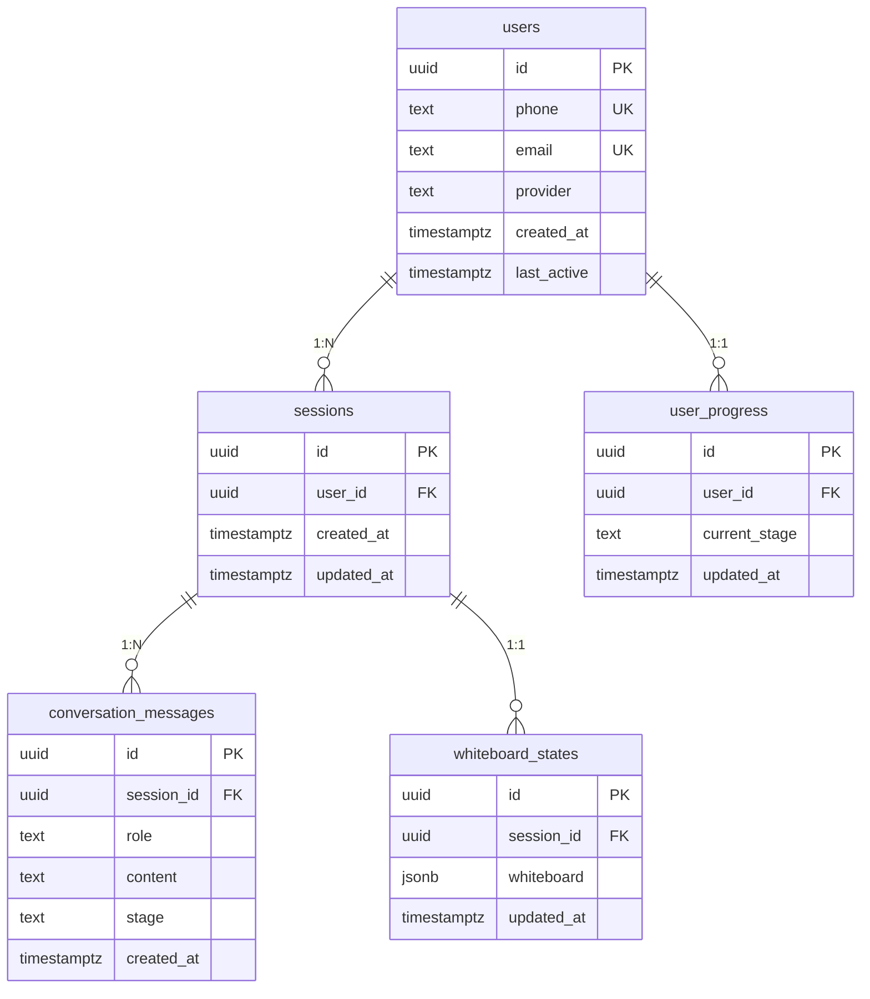
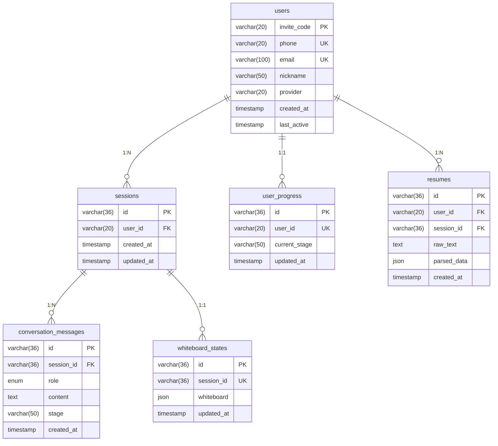
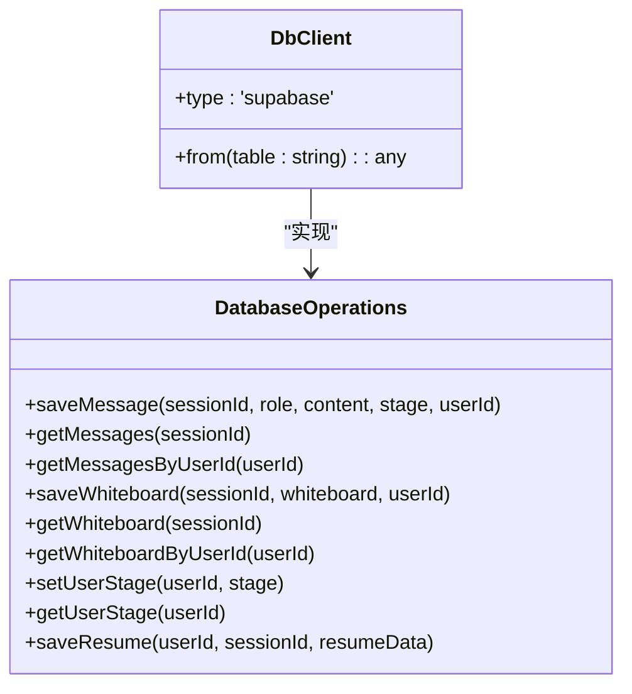
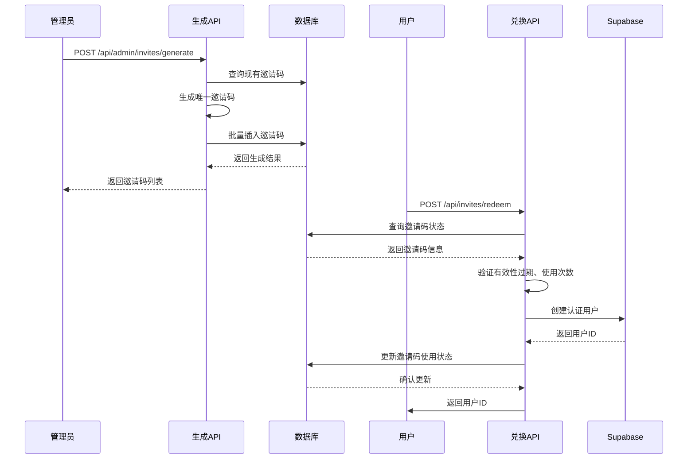
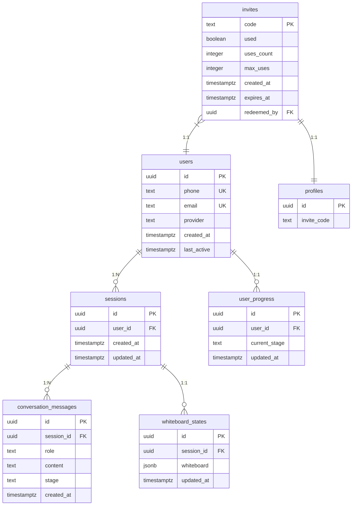

# 数据库设计

<cite>
**本文档引用的文件**   
- [supabase/schema.sql](file://supabase/schema.sql)
- [mysql/schema.sql](file://mysql/schema.sql)
- [lib/db.ts](file://lib/db.ts)
- [lib/inviteCode.ts](file://lib/inviteCode.ts)
- [database-init.sql](file://database-init.sql)
- [app/api/admin/invites/generate/route.ts](file://app/api/admin/invites/generate/route.ts)
- [app/api/invites/check/route.ts](file://app/api/invites/check/route.ts)
- [app/api/invites/redeem/route.ts](file://app/api/invites/redeem/route.ts)
</cite>

## 目录
1. [引言](#引言)
2. [Supabase Schema详解](#supabase-schema详解)
3. [MySQL Schema详解](#mysql-schema详解)
4. [Schema差异与迁移考量](#schema差异与迁移考量)
5. [数据库操作抽象层](#数据库操作抽象层)
6. [邀请码系统](#邀请码系统)
7. [数据完整性与访问控制](#数据完整性与访问控制)
8. [查询性能优化](#查询性能优化)
9. [实体关系图](#实体关系图)
10. [典型查询示例](#典型查询示例)

## 引言

ai-job-coach项目支持Supabase（PostgreSQL）和MySQL两种数据库后端，通过统一的抽象层进行操作。系统采用邀请码作为用户唯一标识符的核心设计，支持多会话、对话消息持久化、白板状态保存和用户进度跟踪等功能。本文档详细解析两种数据库的Schema定义、核心表结构、数据访问模式以及邀请码系统的实现机制。

## Supabase Schema详解

Supabase Schema定义在`supabase/schema.sql`文件中，基于PostgreSQL实现，包含用户、会话、对话消息、白板状态和用户进度等核心表。



**图示来源**
- [supabase/schema.sql](file://supabase/schema.sql#L5-L83)

**本节来源**
- [supabase/schema.sql](file://supabase/schema.sql#L5-L83)

### 用户表 (users)

用户表存储系统用户的基本信息，采用UUID作为主键。支持通过手机号、邮箱或第三方认证方式注册，其中手机号和邮箱字段具有唯一性约束。

**本节来源**
- [supabase/schema.sql](file://supabase/schema.sql#L5-L12)

### 会话表 (sessions)

会话表支持用户多端、多会话的使用场景。每个会话关联一个用户，通过外键约束实现级联删除。表中包含创建时间和更新时间戳，用于跟踪会话生命周期。

**本节来源**
- [supabase/schema.sql](file://supabase/schema.sql#L15-L20)

### 对话消息表 (conversation_messages)

对话消息表存储用户与AI教练之间的所有交互记录。消息按角色（用户、助手、系统）分类，并通过会话ID关联到具体会话。增加`stage`字段用于区分不同阶段的对话内容。

**本节来源**
- [supabase/schema.sql](file://supabase/schema.sql#L23-L30)

### 白板状态表 (whiteboard_states)

白板状态表以JSONB格式存储用户的白板数据，支持复杂的数据结构。通过会话ID建立唯一约束，确保每个会话只有一个白板状态记录。

**本节来源**
- [supabase/schema.sql](file://supabase/schema.sql#L33-L39)

### 用户进度表 (user_progress)

用户进度表跟踪用户在职业规划流程中的当前阶段，每个用户仅有一条进度记录。通过唯一约束确保数据一致性。

**本节来源**
- [supabase/schema.sql](file://supabase/schema.sql#L42-L48)

## MySQL Schema详解

MySQL Schema定义在`mysql/schema.sql`文件中，采用邀请码作为用户主键的设计，与Supabase版本存在显著差异。



**图示来源**
- [mysql/schema.sql](file://mysql/schema.sql#L9-L83)

**本节来源**
- [mysql/schema.sql](file://mysql/schema.sql#L9-L83)

### 用户表 (users)

MySQL版本的用户表以`invite_code`（邀请码）作为主键，长度为20位的VARCHAR类型。这种设计简化了用户标识，避免了UUID的存储开销，同时支持手机号和邮箱的可选绑定。

**本节来源**
- [mysql/schema.sql](file://mysql/schema.sql#L10-L21)

### 会话表 (sessions)

会话表使用VARCHAR(36)存储UUID格式的会话ID，与用户表通过邀请码建立外键关系。采用MySQL的`ON UPDATE CURRENT_TIMESTAMP`机制自动更新时间戳。

**本节来源**
- [mysql/schema.sql](file://mysql/schema.sql#L24-L32)

### 简历表 (resumes)

MySQL Schema特有的简历表，用于存储用户上传的简历文件及其解析结果。通过`parsed_data` JSON字段存储结构化的简历信息，支持后续的智能分析。

**本节来源**
- [mysql/schema.sql](file://mysql/schema.sql#L69-L81)

## Schema差异与迁移考量

Supabase和MySQL两种Schema在数据模型上存在关键差异，主要体现在用户标识、数据类型和约束机制上。

| 比较维度 | Supabase (PostgreSQL) | MySQL |
|---------|---------------------|-------|
| **用户标识** | UUID主键，独立于邀请码 | 邀请码作为主键 |
| **主键类型** | UUID | VARCHAR(36) |
| **JSON支持** | JSONB（二进制格式，性能更优） | JSON（原生JSON类型） |
| **枚举类型** | TEXT + CHECK约束 | 原生ENUM类型 |
| **时间戳** | TIMESTAMPTZ（带时区） | TIMESTAMP（自动时区转换） |
| **自动更新** | 触发器函数 | ON UPDATE CURRENT_TIMESTAMP |

**本节来源**
- [supabase/schema.sql](file://supabase/schema.sql)
- [mysql/schema.sql](file://mysql/schema.sql)

## 数据库操作抽象层

`lib/db.ts`文件实现了数据库操作的统一抽象层，支持Supabase客户端，并提供类型安全的查询接口。



**图示来源**
- [lib/db.ts](file://lib/db.ts#L6-L327)

**本节来源**
- [lib/db.ts](file://lib/db.ts#L6-L327)

### 客户端初始化

系统优先使用Supabase客户端，通过环境变量配置连接参数。当数据库不可用时，自动降级到本地存储模式，确保应用的可用性。

**本节来源**
- [lib/db.ts](file://lib/db.ts#L16-L48)

### 消息操作

提供保存和查询消息的接口，支持按会话ID或用户ID检索消息历史。查询结果按创建时间升序排列，确保对话顺序的正确性。

**本节来源**
- [lib/db.ts](file://lib/db.ts#L58-L112)

### 白板操作

白板状态采用upsert模式进行保存，当记录已存在时执行更新，否则插入新记录。针对不同查询场景提供按会话ID和用户ID的检索接口。

**本节来源**
- [lib/db.ts](file://lib/db.ts#L144-L207)

## 邀请码系统

邀请码系统是ai-job-coach的核心身份验证机制，通过`lib/inviteCode.ts`和相关API路由实现完整的生成、验证和使用流程。



**图示来源**
- [lib/inviteCode.ts](file://lib/inviteCode.ts#L1-L84)
- [app/api/admin/invites/generate/route.ts](file://app/api/admin/invites/generate/route.ts#L1-L232)
- [app/api/invites/redeem/route.ts](file://app/api/invites/redeem/route.ts#L1-L317)

**本节来源**
- [lib/inviteCode.ts](file://lib/inviteCode.ts#L1-L84)
- [app/api/admin/invites/generate/route.ts](file://app/api/admin/invites/generate/route.ts#L1-L232)
- [app/api/invites/redeem/route.ts](file://app/api/invites/redeem/route.ts#L1-L317)

### 生成流程

邀请码生成遵循6-20位大写字母和数字的组合规则，排除易混淆字符（0, O, I, 1）。系统提供`generateUniqueInviteCode`函数确保生成的邀请码在数据库中唯一。

**本节来源**
- [lib/inviteCode.ts](file://lib/inviteCode.ts#L12-L78)

### 验证流程

`/api/invites/check`接口支持GET和POST方式，检查邀请码的状态，包括有效、剩余次数、过期、已兑换和无效等状态。验证逻辑考虑了过期时间和使用次数限制。

**本节来源**
- [app/api/invites/check/route.ts](file://app/api/invites/check/route.ts#L1-L306)

### 使用流程

`/api/invites/redeem`接口实现邀请码的兑换功能，创建对应的用户账户并更新邀请码的使用状态。采用原子性更新确保并发安全，防止邀请码被重复使用。

**本节来源**
- [app/api/invites/redeem/route.ts](file://app/api/invites/redeem/route.ts#L1-L317)

## 数据完整性与访问控制

系统通过多种机制确保数据的完整性和安全性，包括外键约束、唯一性约束和行级安全策略。

### 外键约束

所有关联表均通过外键建立关系，并设置`ON DELETE CASCADE`策略，确保删除用户时自动清理相关数据，维护数据一致性。

**本节来源**
- [supabase/schema.sql](file://supabase/schema.sql)
- [mysql/schema.sql](file://mysql/schema.sql)

### 唯一性约束

关键字段如用户手机号、邮箱、会话ID等均设置唯一性约束，防止数据重复。白板状态表通过会话ID的唯一约束确保每个会话只有一个白板。

**本节来源**
- [supabase/schema.sql](file://supabase/schema.sql)
- [mysql/schema.sql](file://mysql/schema.sql)

## 查询性能优化

系统通过合理的索引策略和查询设计优化数据库性能，确保在高并发场景下的响应速度。

### 索引策略

在高频查询字段上创建索引，包括会话的用户ID、消息的会话ID和创建时间、进度的用户ID等，显著提升查询效率。

**本节来源**
- [supabase/schema.sql](file://supabase/schema.sql#L51-L55)

### 触发器优化

使用触发器自动更新`updated_at`字段，避免应用层手动维护时间戳，减少潜在的错误和性能开销。

**本节来源**
- [supabase/schema.sql](file://supabase/schema.sql#L58-L82)

## 实体关系图

以下ER图展示了ai-job-coach系统的核心实体及其关系：



**图示来源**
- [supabase/schema.sql](file://supabase/schema.sql#L5-L83)
- [mysql/schema.sql](file://mysql/schema.sql#L9-L83)

## 典型查询示例

以下是系统中常见的数据库查询操作示例：

### 获取用户会话消息
```sql
SELECT id, role, content, stage, created_at 
FROM conversation_messages 
WHERE session_id = 'session-uuid' 
ORDER BY created_at ASC;
```

### 更新用户进度
```sql
INSERT INTO user_progress (user_id, current_stage, updated_at) 
VALUES ('user-uuid', 'interview', NOW()) 
ON CONFLICT (user_id) 
DO UPDATE SET current_stage = 'interview', updated_at = NOW();
```

### 检查邀请码状态
```sql
SELECT code, used, uses_count, max_uses, expires_at 
FROM invites 
WHERE code = 'ABC12345';
```

**本节来源**
- [lib/db.ts](file://lib/db.ts#L58-L288)