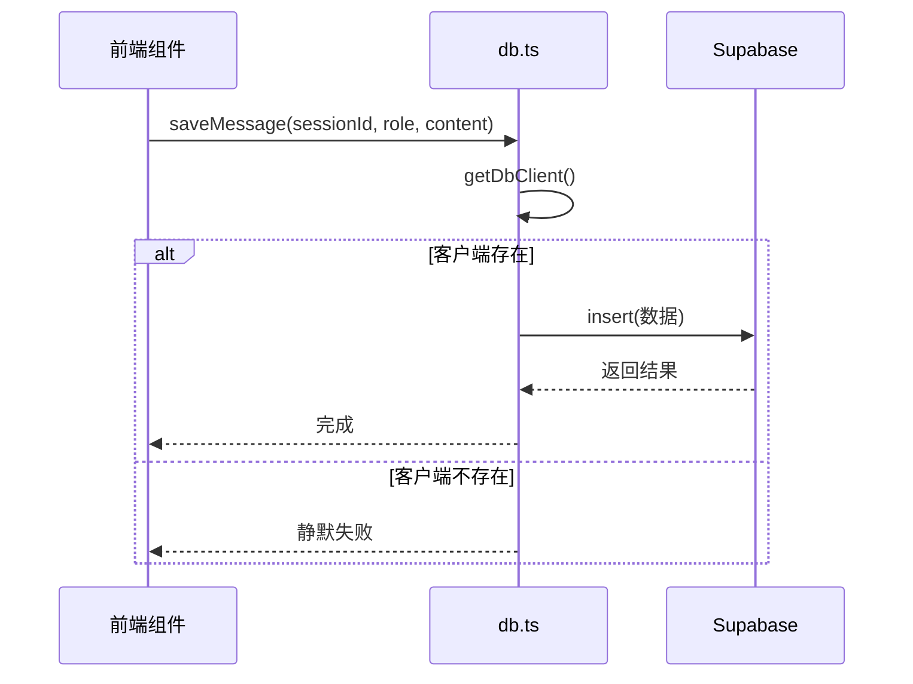
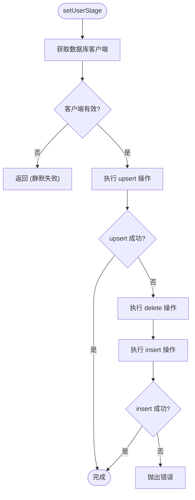

# 数据访问抽象层

<cite>
**本文档引用的文件**  
- [db.ts](file://lib/db.ts)
- [conversationStore.ts](file://lib/conversationStore.ts)
- [stage.ts](file://lib/stage.ts)
- [ChatFlow.tsx](file://components/ChatFlow.tsx)
- [DynamicBoard.tsx](file://components/DynamicBoard.tsx)
- [StageController.tsx](file://components/StageController.tsx)
- [page.tsx](file://app/chat/page.tsx)
</cite>

## 目录
1. [简介](#简介)
2. [项目结构](#项目结构)
3. [核心组件](#核心组件)
4. [架构概述](#架构概述)
5. [详细组件分析](#详细组件分析)
6. [依赖分析](#依赖分析)
7. [性能考虑](#性能考虑)
8. [故障排除指南](#故障排除指南)
9. [结论](#结论)

## 简介
本文档全面阐述了 `lib/db.ts` 中实现的数据库访问抽象层。该抽象层通过 `getDbClient()` 函数动态初始化 Supabase 客户端，并封装为统一接口，支持在无数据库环境降级使用 localStorage。文档详细说明了 `saveMessage`、`getMessages`、`saveWhiteboard`、`getWhiteboard`、`setUserStage`、`getUserStage`、`saveResume` 等核心函数的参数含义、调用流程、错误处理机制（如 upsert 失败后的 delete+insert 重试策略）及事务安全性。同时，阐述了类型安全查询的设计思路，包括返回数据的 TypeScript 接口定义与运行时类型校验，并提供了前端组件调用这些 API 的实际代码示例及其与 Zustand 状态管理(store)的集成方式。

## 项目结构
数据库访问抽象层的核心实现位于 `lib/db.ts` 文件中，该文件提供了一套与 Supabase 兼容的统一接口。该层被上层业务逻辑（如 `app/chat/page.tsx`）和状态管理模块（如 `lib/conversationStore.ts`）所调用。前端组件（如 `ChatFlow.tsx` 和 `DynamicBoard.tsx`）通过这些上层模块间接与数据库交互，实现了消息、白板状态和用户进度的持久化。

**Section sources**
- [db.ts](file://lib/db.ts)
- [conversationStore.ts](file://lib/conversationStore.ts)
- [page.tsx](file://app/chat/page.tsx)

## 核心组件
`lib/db.ts` 文件是数据访问抽象层的核心，它定义了 `DbClient` 类型并实现了 `getDbClient()` 函数来动态初始化数据库客户端。该文件导出了多个用于操作消息、白板、用户进度和简历数据的函数，如 `saveMessage`、`getMessages`、`saveWhiteboard`、`getWhiteboard`、`setUserStage`、`getUserStage` 和 `saveResume`。这些函数构成了应用与数据存储之间的主要交互接口。

**Section sources**
- [db.ts](file://lib/db.ts)

## 架构概述
该数据访问抽象层采用适配器模式，将具体的数据库实现（Supabase）与应用的业务逻辑解耦。其核心是 `getDbClient()` 函数，它根据环境变量的存在与否来决定是初始化 Supabase 客户端还是返回 `null`。当数据库不可用时，应用可以降级使用 localStorage，保证了应用的可用性。所有数据操作函数都依赖于 `getDbClient()` 返回的客户端，从而实现了统一的访问接口。

```mermaid
graph TB
subgraph "前端应用"
A[ChatPage] --> B[conversationStore]
A --> C[DynamicBoard]
B --> D[db.ts]
C --> D
end
subgraph "数据访问层"
D[db.ts] --> E{getDbClient()}
E --> |Supabase URL & Key| F[Supabase Client]
E --> |无配置| G[null]
F --> H[(Supabase Database)]
end
G --> I[localStorage]
```

**Diagram sources**
- [db.ts](file://lib/db.ts)
- [page.tsx](file://app/chat/page.tsx)

## 详细组件分析

### 数据库客户端初始化分析
`getDbClient()` 函数是整个数据访问层的入口。它首先检查是否已存在已初始化的客户端实例，以实现单例模式。然后，它检查 `SUPABASE_URL` 和 `SUPABASE_ANON_KEY` 环境变量。如果存在，则使用它们创建一个 Supabase 客户端实例，并将其包装成符合 `DbClient` 类型的对象，其中 `type` 属性被设置为 `'supabase'`。如果环境变量缺失或初始化失败，函数会发出警告并返回 `null`，允许应用在无数据库环境下运行。

**Section sources**
- [db.ts](file://lib/db.ts#L15-L48)

### 消息管理功能分析
`saveMessage` 和 `getMessages` 函数用于管理对话消息。`saveMessage` 函数接收会话ID、角色、内容等参数，构建插入数据对象，并通过 `from('conversation_messages').insert()` 将其插入数据库。`getMessages` 函数则通过 `from('conversation_messages').select()` 和 `.eq('session_id', sessionId)` 来查询特定会话的所有消息，并按创建时间排序。当数据库不可用时，`saveMessage` 静默失败，而 `getMessages` 返回空数组。



**Diagram sources**
- [db.ts](file://lib/db.ts#L58-L87)
- [db.ts](file://lib/db.ts#L89-L112)

### 白板状态管理分析
`saveWhiteboard` 和 `getWhiteboard` 函数用于管理白板状态。`saveWhiteboard` 使用 `upsert` 操作来更新或插入白板数据。其关键特性是错误处理机制：当 `upsert` 失败时（例如由于冲突），函数会先执行 `delete` 操作移除旧记录，然后再执行 `insert` 操作。这确保了数据最终能够被成功写入。`getWhiteboard` 函数则通过 `select` 和 `eq` 查询特定会话的白板状态。

**Section sources**
- [db.ts](file://lib/db.ts#L144-L187)
- [db.ts](file://lib/db.ts#L193-L207)

### 用户进度管理分析
`setUserStage` 和 `getUserStage` 函数用于管理用户的当前求职阶段。`setUserStage` 同样使用 `upsert` 操作，并在 `onConflict` 设置为 `'user_id'`，确保每个用户只有一条进度记录。其错误处理逻辑与 `saveWhiteboard` 相同，即在 `upsert` 失败后尝试 `delete` 再 `insert`。`getUserStage` 在查询失败或无数据时返回默认阶段 `'career_planning'`，保证了应用的健壮性。



**Diagram sources**
- [db.ts](file://lib/db.ts#L235-L268)
- [db.ts](file://lib/db.ts#L274-L288)

### 简历数据管理分析
`saveResume` 函数用于保存简历解析结果。它首先生成一个 UUID 作为简历ID，然后通过 `insert` 操作将简历数据（包括原始文本和解析结果）存入 `resumes` 表。当数据库不可用时，该函数会生成一个临时ID并返回，允许前端继续流程，但数据不会被持久化。

**Section sources**
- [db.ts](file://lib/db.ts#L295-L325)

### 前端集成与状态管理分析
前端页面 `app/chat/page.tsx` 在组件挂载时，通过调用 `/api/load-session` API 来加载会话数据。该 API 内部会调用 `db.ts` 中的函数来从数据库获取消息、白板状态和用户阶段。`conversationStore.ts` 模块负责管理内存中的对话历史，并在用户ID变化时，通过 `loadFromLocalStorage` 和 `saveToLocalStorage` 方法与 localStorage 同步数据。`DynamicBoard.tsx` 组件通过 `onUpdate` 回调接收白板数据的更新，并可能触发保存逻辑。

**Section sources**
- [page.tsx](file://app/chat/page.tsx#L43-L137)
- [conversationStore.ts](file://lib/conversationStore.ts#L35-L68)
- [DynamicBoard.tsx](file://components/DynamicBoard.tsx#L25-L34)

## 依赖分析
数据访问抽象层 `db.ts` 依赖于 `@supabase/supabase-js` 库来与 Supabase 服务通信，并依赖于 `uuid` 库来生成唯一标识符。上层模块 `conversationStore.ts` 依赖于 `db.ts` 来进行数据持久化。前端页面 `app/chat/page.tsx` 直接或间接地依赖于 `db.ts` 和 `conversationStore.ts` 来管理应用状态。`stage.ts` 文件定义了用户阶段的类型和常量，被 `db.ts` 中的函数所使用。

```mermaid
graph TD
A[db.ts] --> B[@supabase/supabase-js]
A --> C[uuid]
D[conversationStore.ts] --> A
E[page.tsx] --> D
E --> A
A --> F[stage.ts]
```

**Diagram sources**
- [db.ts](file://lib/db.ts#L6-L7)
- [conversationStore.ts](file://lib/conversationStore.ts#L5)
- [page.tsx](file://app/chat/page.tsx#L10-L11)

## 性能考虑
该数据访问层的设计考虑了性能和可用性。通过 `getDbClient()` 的单例模式避免了重复创建客户端的开销。`upsert` 操作结合 `onConflict` 策略可以高效地处理更新和插入。然而，错误处理中的 `delete` + `insert` 重试策略会增加一次数据库往返，可能影响性能。在无数据库环境下使用 localStorage 可以提供更快的读写速度，但数据持久性和共享性较差。

## 故障排除指南
- **数据库初始化失败**：检查 `SUPABASE_URL` 和 `SUPABASE_ANON_KEY` 环境变量是否正确配置。查看控制台警告信息以获取具体错误。
- **数据无法保存**：确认数据库客户端已成功初始化。检查 Supabase 项目的表权限（RLS 策略）是否允许匿名用户进行插入和更新操作。
- **白板或进度更新失败**：这可能是由于 `upsert` 冲突导致。检查 `onConflict` 字段（`user_id` 或 `session_id`）是否正确，并确认数据库中没有违反唯一性约束的旧数据。
- **数据加载为空**：确认查询的 `sessionId` 或 `userId` 是否正确。检查数据库中是否存在对应的数据记录。

**Section sources**
- [db.ts](file://lib/db.ts#L38-L41)
- [db.ts](file://lib/db.ts#L169-L187)
- [db.ts](file://lib/db.ts#L253-L267)

## 结论
`lib/db.ts` 实现了一个健壮且灵活的数据库访问抽象层。它成功地将 Supabase 作为主要数据存储，并通过优雅的降级方案（返回 `null` 并静默处理）保证了应用在无数据库环境下的基本功能。其核心函数提供了清晰的接口用于管理消息、白板、用户进度和简历数据。独特的 `upsert` 失败后 `delete` + `insert` 重试策略增强了数据写入的可靠性。该层与前端状态管理和 API 路由的集成良好，构成了整个应用数据持久化的基石。