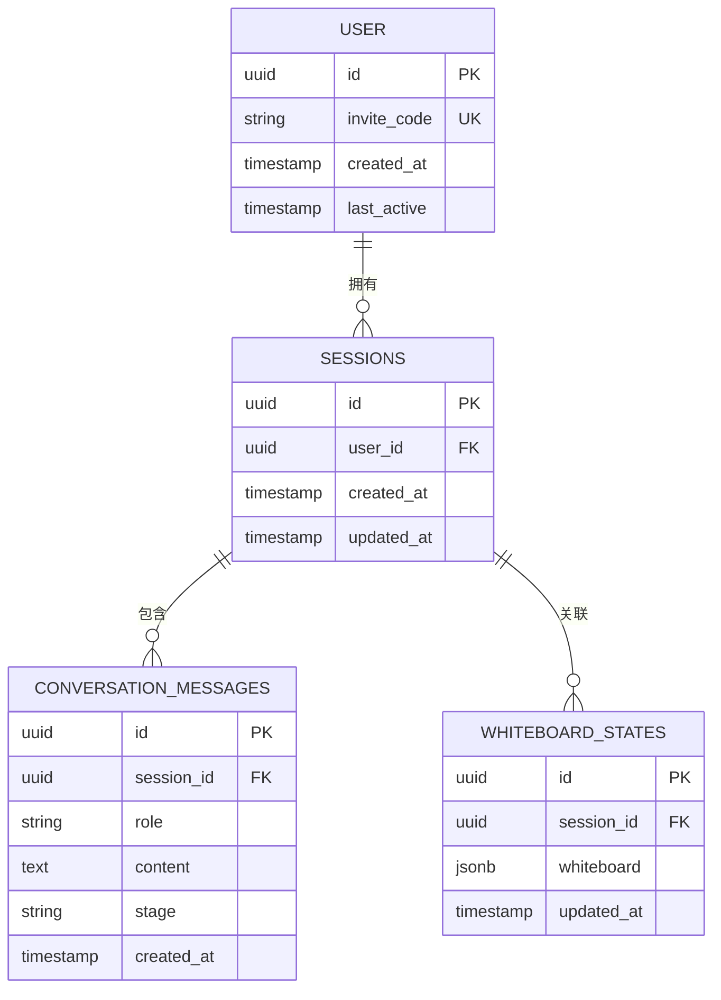
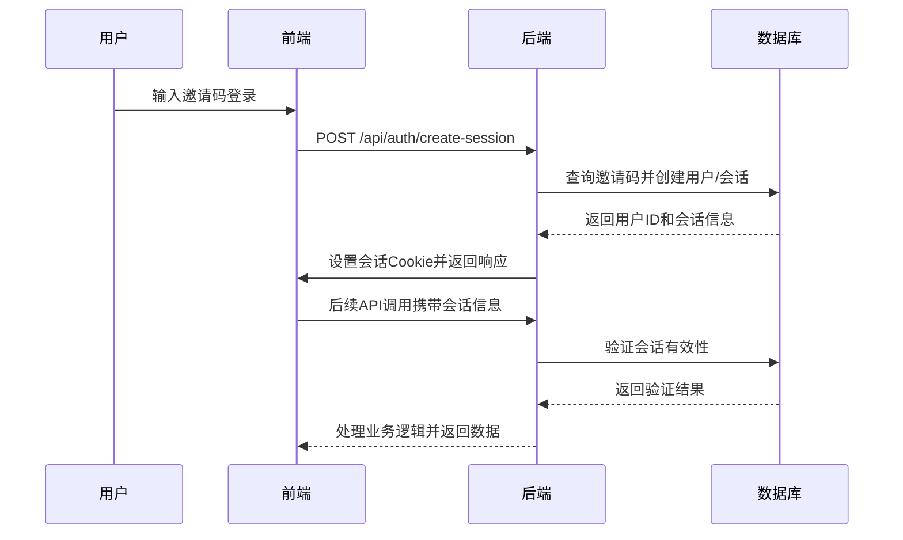
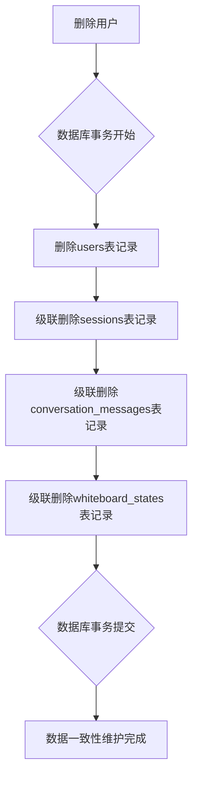
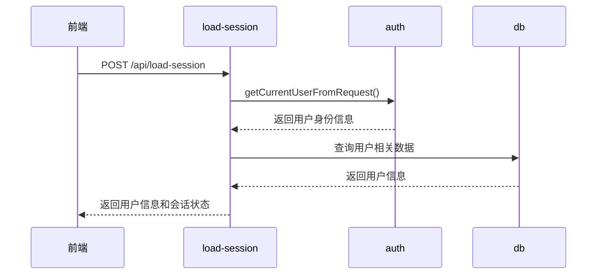
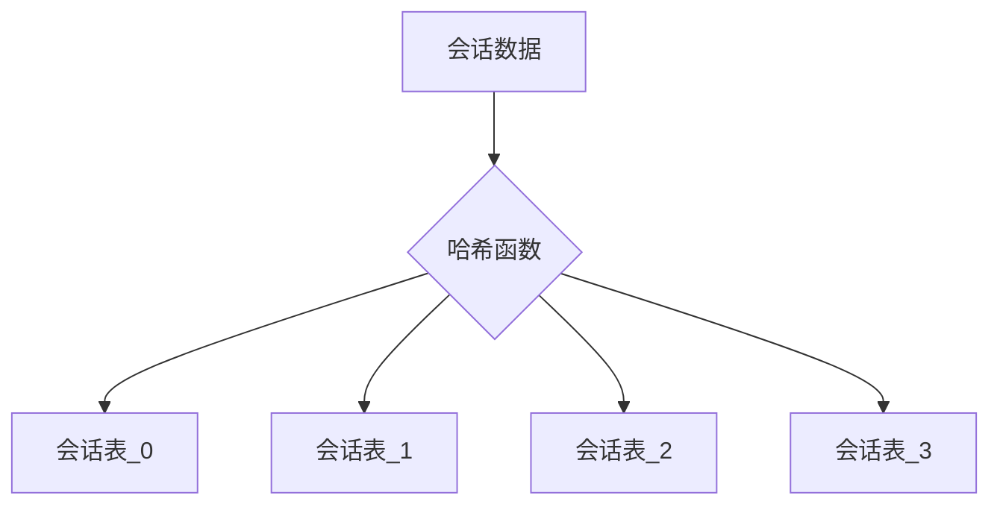

# 会话表 (sessions)

<cite>
**本文档中引用的文件**   
- [sessions](file://supabase/schema.sql#L15-L20)
- [sessions](file://mysql/schema.sql#L24-L32)
- [load-session/route.ts](file://app/api/load-session/route.ts)
- [conversationStore.ts](file://lib/conversationStore.ts)
- [db.ts](file://lib/db.ts)
- [SESSION_SYSTEM_README.md](file://SESSION_SYSTEM_README.md)
- [database-init.sql](file://database-init.sql)
- [auth.ts](file://lib/auth.ts)
- [create-session/route.ts](file://app/api/auth/create-session/route.ts)
</cite>

## 目录
1. [引言](#引言)
2. [会话表结构与字段设计](#会话表结构与字段设计)
3. [多会话支持的核心作用](#多会话支持的核心作用)
4. [字段设计逻辑分析](#字段设计逻辑分析)
5. [PostgreSQL与MySQL的存储差异](#postgresql与mysql的存储差异)
6. [级联删除机制与数据一致性](#级联删除机制与数据一致性)
7. [会话历史恢复与上下文延续机制](#会话历史恢复与上下文延续机制)
8. [索引性能优化分析](#索引性能优化分析)
9. [高并发场景下的分库分表可能性](#高并发场景下的分库分表可能性)
10. [结论](#结论)

## 引言

会话表（sessions）是AI求职教练系统中的核心数据表之一，承担着多会话支持、用户状态管理、数据一致性维护等关键职责。该表通过与用户表（users）、对话消息表（conversation_messages）、白板状态表（whiteboard_states）等建立关联，实现了跨设备、跨会话的用户数据持久化和上下文延续。本文将深入解析该表在系统架构中的核心作用，分析其字段设计逻辑，对比不同数据库的实现差异，并探讨其在高并发场景下的扩展可能性。

## 会话表结构与字段设计

会话表作为系统会话管理的核心，其结构设计体现了对多端支持、数据一致性和性能优化的综合考量。该表在不同数据库环境中有不同的实现方式，但核心功能保持一致。



**图表来源**
- [supabase/schema.sql](file://supabase/schema.sql#L15-L20)
- [mysql/schema.sql](file://mysql/schema.sql#L24-L32)

**本节来源**
- [supabase/schema.sql](file://supabase/schema.sql#L15-L20)
- [mysql/schema.sql](file://mysql/schema.sql#L24-L32)

## 多会话支持的核心作用

会话表在系统中扮演着连接用户与会话数据的桥梁角色，实现了真正的多会话支持。每个用户可以拥有多个会话记录，每个会话独立存储对话历史和白板状态，支持用户在不同设备、不同时间点继续之前的对话。

系统通过会话ID（session_id）作为唯一标识，将用户的对话消息、白板状态等数据与特定会话关联。当用户登录时，系统会创建新的会话记录，并在后续的API调用中通过会话验证机制确保数据安全。这种设计使得用户可以在手机、平板、电脑等多个设备上无缝切换，而不会丢失对话上下文。



**图表来源**
- [create-session/route.ts](file://app/api/auth/create-session/route.ts)
- [auth.ts](file://lib/auth.ts)

**本节来源**
- [SESSION_SYSTEM_README.md](file://SESSION_SYSTEM_README.md)
- [create-session/route.ts](file://app/api/auth/create-session/route.ts)

## 字段设计逻辑分析

会话表的字段设计体现了对用户会话生命周期的完整管理。核心字段包括id（会话标识）、user_id（外键关联）、created_at和updated_at（时间戳），每个字段都有其特定的设计目的和业务逻辑。

### id（会话标识）

会话ID作为主键，采用UUID格式生成，确保了全局唯一性。在PostgreSQL实现中，使用`gen_random_uuid()`函数作为默认值，而在MySQL实现中，虽然存储为VARCHAR(36)，但同样需要保证UUID格式的唯一性。这种设计避免了自增ID可能带来的安全风险，同时也支持分布式环境下的ID生成。

### user_id（外键关联）

user_id字段作为外键关联到用户表，建立了会话与用户的强关联关系。这一设计确保了所有会话数据都能追溯到具体的用户，为数据权限控制和用户数据隔离提供了基础。在PostgreSQL中，该字段直接引用users表的UUID主键，而在MySQL中，则引用users表的invite_code字段。

### created_at/updated_at设计逻辑

created_at和updated_at字段记录了会话的创建时间和最后更新时间。在PostgreSQL实现中，通过触发器函数自动更新updated_at字段，确保了数据的一致性。而在MySQL实现中，则利用`ON UPDATE CURRENT_TIMESTAMP`特性实现相同功能。这两个时间戳字段不仅用于业务逻辑判断（如会话过期检查），也为数据分析和用户行为追踪提供了重要依据。

**本节来源**
- [supabase/schema.sql](file://supabase/schema.sql#L16-L20)
- [mysql/schema.sql](file://mysql/schema.sql#L25-L29)
- [database-init.sql](file://database-init.sql#L14-L23)

## PostgreSQL与MySQL的存储差异

会话表在PostgreSQL和MySQL两种数据库环境中有显著的实现差异，这些差异反映了不同数据库系统的特点和优化策略。

### UUID默认值实现

在PostgreSQL中，会话ID的默认值通过`gen_random_uuid()`函数生成，这是PostgreSQL内置的UUID生成函数，能够保证生成的UUID符合标准且具有良好的随机性。这种实现方式简洁高效，充分利用了PostgreSQL的原生功能。

```sql
-- PostgreSQL 实现
CREATE TABLE sessions (
  id UUID PRIMARY KEY DEFAULT gen_random_uuid(),
  user_id UUID NOT NULL REFERENCES users(id) ON DELETE CASCADE,
  created_at TIMESTAMP WITH TIME ZONE DEFAULT NOW(),
  updated_at TIMESTAMP WITH TIME ZONE DEFAULT NOW()
);
```

而在MySQL中，由于缺乏原生的UUID生成函数支持，会话ID存储为VARCHAR(36)类型，需要在应用层生成UUID并插入。这种实现方式增加了应用层的复杂性，但保证了跨数据库的兼容性。

```sql
-- MySQL 实现
CREATE TABLE sessions (
  id VARCHAR(36) PRIMARY KEY COMMENT '会话ID（UUID）',
  user_id VARCHAR(20) NOT NULL COMMENT '用户邀请码',
  created_at TIMESTAMP DEFAULT CURRENT_TIMESTAMP COMMENT '创建时间',
  updated_at TIMESTAMP DEFAULT CURRENT_TIMESTAMP ON UPDATE CURRENT_TIMESTAMP COMMENT '更新时间',
  FOREIGN KEY (user_id) REFERENCES users(invite_code) ON DELETE CASCADE
);
```

### 数据类型与约束

PostgreSQL使用UUID数据类型，这是一种专门用于存储UUID的原生类型，具有更好的性能和存储效率。而MySQL使用VARCHAR(36)存储，虽然灵活性更高，但在存储空间和索引效率上不如原生UUID类型。

此外，PostgreSQL的`TIMESTAMP WITH TIME ZONE`类型能够精确处理时区信息，而MySQL的`TIMESTAMP`类型虽然也支持时区，但在配置和使用上更为复杂。这些差异反映了两种数据库在数据类型设计哲学上的不同。

**本节来源**
- [supabase/schema.sql](file://supabase/schema.sql#L16-L20)
- [mysql/schema.sql](file://mysql/schema.sql#L25-L32)

## 级联删除机制与数据一致性

ON DELETE CASCADE级联删除机制是保证数据一致性的关键设计。当用户记录被删除时，所有关联的会话记录将自动被删除，进而触发会话相关的对话消息和白板状态的级联删除。

这一机制通过数据库层面的约束实现，避免了应用层需要手动维护数据一致性的复杂性。在PostgreSQL和MySQL中，都通过外键约束实现了这一功能：

```sql
-- 外键约束中的级联删除
FOREIGN KEY (user_id) REFERENCES users(id) ON DELETE CASCADE
```

当执行删除用户操作时，数据库会自动按照依赖关系依次删除相关记录：
1. 首先删除users表中的用户记录
2. 级联删除sessions表中该用户的所有会话
3. 级联删除conversation_messages表中相关会话的所有消息
4. 级联删除whiteboard_states表中相关会话的白板状态

这种设计确保了数据的完整性，避免了孤儿记录的产生。同时，由于删除操作在数据库事务中完成，保证了操作的原子性和一致性。



**图表来源**
- [supabase/schema.sql](file://supabase/schema.sql#L17)
- [mysql/schema.sql](file://mysql/schema.sql#L29)

**本节来源**
- [supabase/schema.sql](file://supabase/schema.sql#L17)
- [mysql/schema.sql](file://mysql/schema.sql#L29)

## 会话历史恢复与上下文延续机制

会话表与load-session API和conversationStore.ts共同实现了会话历史恢复与上下文延续的核心功能。这一机制确保了用户在不同会话间能够无缝继续对话，保持上下文的连贯性。

### load-session API工作流程

load-session API是会话恢复的入口点，其工作流程如下：



该API首先通过认证模块验证用户身份，然后返回用户的基本信息。虽然当前实现中没有直接查询会话表，但为后续的会话恢复提供了用户上下文。

### conversationStore.ts的上下文管理

conversationStore.ts是前端会话状态管理的核心组件，它通过以下机制实现上下文延续：

1. **用户ID绑定**：通过`setUserId`方法将当前用户ID与会话存储绑定
2. **本地存储**：使用localStorage按用户ID存储对话历史，实现跨会话持久化
3. **阶段化管理**：将对话历史按职业规划、项目梳理、简历优化等阶段分类存储
4. **上下文整合**：通过`getAllHistoryForStage`方法整合所有阶段的历史，为AI提供完整的上下文

当用户登录后，conversationStore会自动从localStorage加载该用户的对话历史，恢复之前的对话状态。这种设计既保证了用户体验的连续性，又减少了对后端数据库的频繁查询。

**本节来源**
- [load-session/route.ts](file://app/api/load-session/route.ts)
- [conversationStore.ts](file://lib/conversationStore.ts)

## 索引性能优化分析

idx_sessions_user_id索引是提升用户会话列表查询性能的关键优化。该索引在user_id字段上创建，使得根据用户ID查询会话列表的操作从全表扫描变为索引查找，大大提高了查询效率。

在系统中，用户会话列表查询是一个高频操作，尤其是在用户登录后需要加载历史会话时。没有索引的情况下，数据库需要扫描整个sessions表来查找特定用户的会话记录，时间复杂度为O(n)。而有了idx_sessions_user_id索引后，查询时间复杂度降低到O(log n)，性能提升显著。

```sql
-- 索引创建语句
CREATE INDEX IF NOT EXISTS idx_sessions_user_id ON sessions(user_id);
```

该索引不仅用于直接的会话查询，还间接优化了通过会话关联的其他查询，如：
- 查询用户的所有对话消息
- 查询用户的白板状态
- 统计用户的会话数量

在高并发场景下，这个索引的作用更加明显，能够有效减少数据库的I/O压力和查询响应时间。

**本节来源**
- [supabase/schema.sql](file://supabase/schema.sql#L51)
- [mysql/schema.sql](file://mysql/schema.sql#L30)

## 高并发场景下的分库分表可能性

在高并发场景下，会话表可能成为系统性能瓶颈，分库分表是一种可行的扩展方案。基于会话表的特点，可以考虑以下几种分库分表策略：

### 按用户ID哈希分表

由于会话表的主要查询模式是基于user_id的，可以采用user_id作为分片键，通过哈希算法将数据分布到多个物理表中。这种策略能够均匀分布数据，避免热点问题。



### 时间范围分表

考虑到会话数据具有明显的时间属性，可以按时间范围（如按月）进行分表。这种策略有利于数据归档和清理，对于历史数据查询也有较好的性能表现。

### 读写分离

对于读多写少的场景，可以采用读写分离架构，将写操作集中在主库，读操作分散到多个只读副本。这种方案能够有效提升系统的整体吞吐量。

在实施分库分表时，需要考虑以下因素：
- 事务一致性：跨分片事务的处理
- 数据迁移：现有数据的平滑迁移
- 查询路由：如何确定数据所在的分片
- 运维复杂性：多实例的监控和管理

**本节来源**
- [supabase/schema.sql](file://supabase/schema.sql)
- [mysql/schema.sql](file://mysql/schema.sql)

## 结论

会话表（sessions）作为AI求职教练系统的核心组件，通过精心设计的字段结构、级联删除机制和索引优化，实现了多会话支持、数据一致性和高性能查询。其在PostgreSQL和MySQL中的不同实现方式体现了对不同数据库特性的适应能力。与load-session API和conversationStore.ts的协同工作，确保了用户会话历史的可靠恢复和上下文的无缝延续。在高并发场景下，通过合理的分库分表策略，该表架构具备良好的可扩展性，能够支持系统的持续增长和演进。