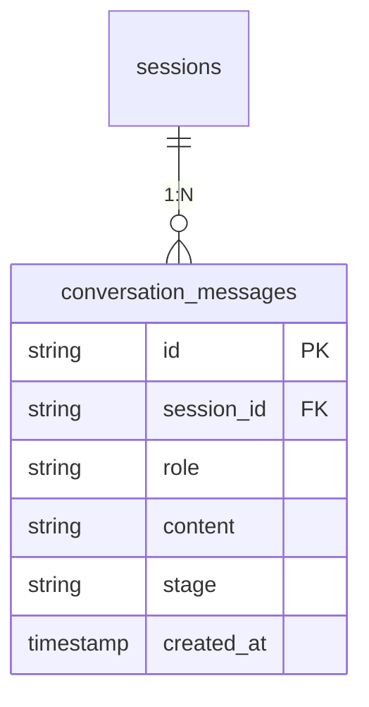
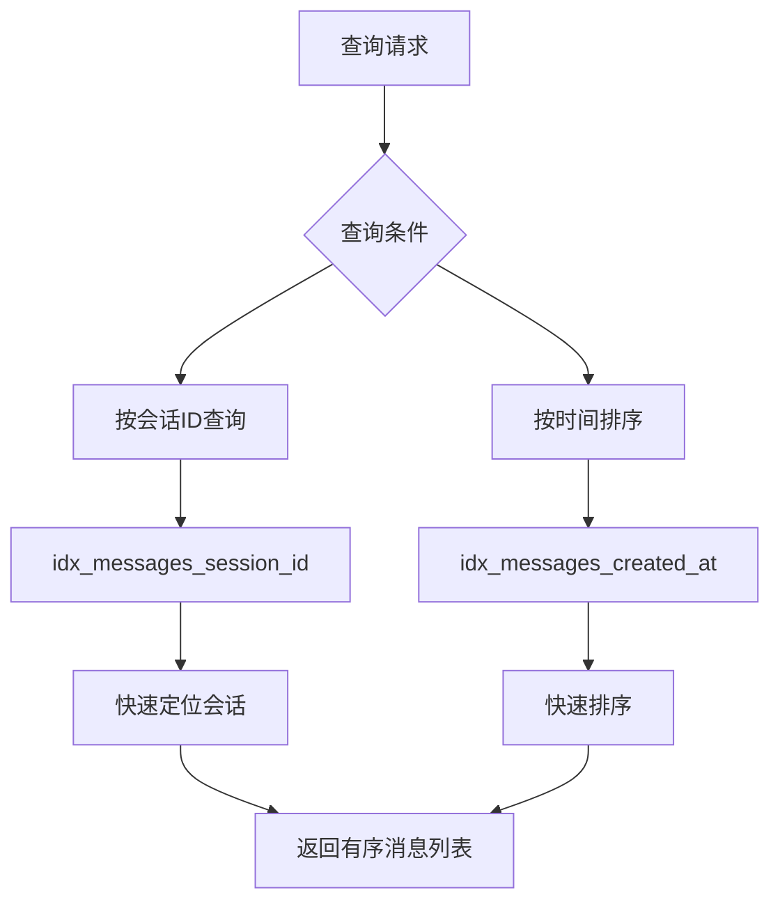
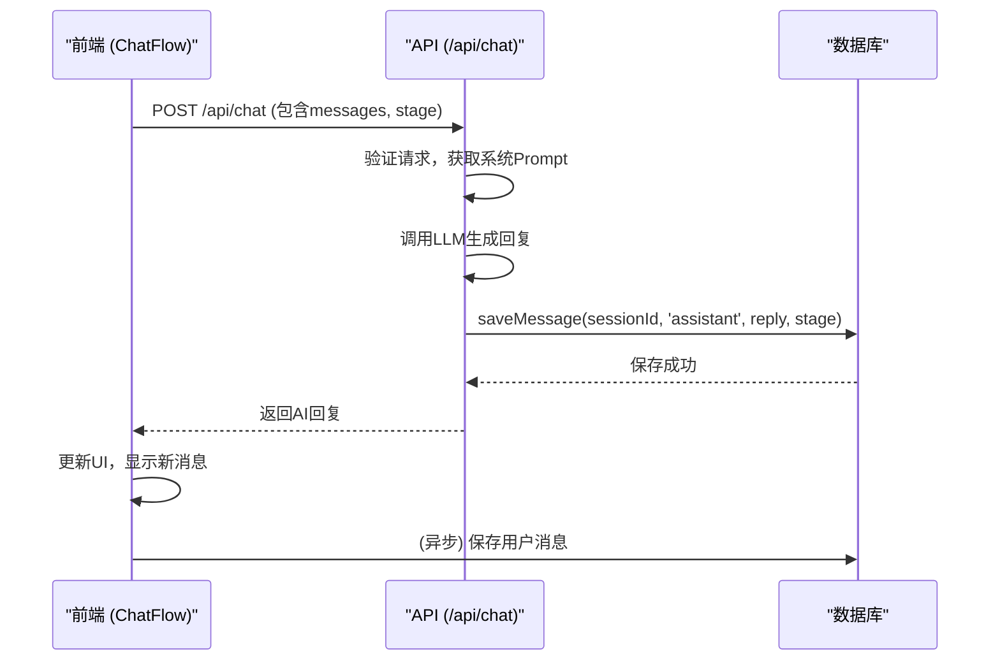
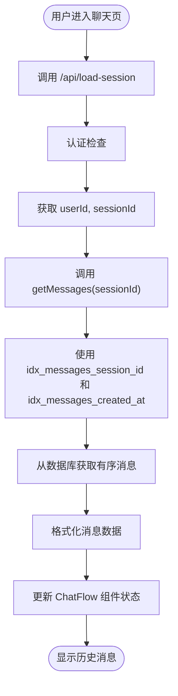

# 对话消息表 (conversation_messages)

<cite>
**本文档引用文件**   
- [supabase\schema.sql](file://supabase/schema.sql)
- [mysql\schema.sql](file://mysql/schema.sql)
- [app\api\chat\route.ts](file://app/api/chat/route.ts)
- [components\ChatFlow.tsx](file://components/ChatFlow.tsx)
- [lib\conversationStore.ts](file://lib/conversationStore.ts)
- [lib\db.ts](file://lib/db.ts)
- [lib\stage.ts](file://lib/stage.ts)
- [app\chat\page.tsx](file://app/chat/page.tsx)
- [app\api\stage-greeting\route.ts](file://app/api/stage-greeting/route.ts)
</cite>

## 目录
1. [引言](#引言)
2. [表结构与核心字段](#表结构与核心字段)
3. [数据合法性保证](#数据合法性保证)
4. [多阶段上下文隔离](#多阶段上下文隔离)
5. [内容存储与性能](#内容存储与性能)
6. [查询性能优化](#查询性能优化)
7. [实时对话流支撑](#实时对话流支撑)
8. [历史记录加载](#历史记录加载)
9. [AI上下文管理](#ai上下文管理)
10. [结论](#结论)

## 引言

`conversation_messages` 表是AI求职教练系统的核心持久化组件，作为对话系统的主数据表，它负责存储所有用户与AI之间的交互记录。该表设计精巧，不仅满足了基本的聊天消息存储需求，还通过 `role` 和 `stage` 字段实现了数据合法性校验和多阶段上下文隔离，是整个系统实现智能化引导的关键。本文将深入解析该表的设计原理，从数据库约束、存储差异、索引优化到与前端组件的协同工作，全面阐述其如何支撑一个复杂、多阶段的AI对话系统。

## 表结构与核心字段

`conversation_messages` 表在不同的数据库环境（PostgreSQL/Supabase 和 MySQL）中有着相似但略有差异的结构，这体现了系统对多数据库的支持能力。



**核心字段说明：**

- **`id`**: 消息的唯一标识符，使用UUID确保全局唯一性。
- **`session_id`**: 外键，关联到 `sessions` 表，用于将消息归集到特定的用户会话中。
- **`role`**: 标识消息的发送者角色，其约束机制是保证数据合法性的关键。
- **`content`**: 存储消息的实际文本内容，是对话的核心数据。
- **`stage`**: 记录消息所属的用户求职流程阶段，用于实现上下文隔离。
- **`created_at`**: 记录消息创建的时间戳，用于排序和查询。

**Diagram sources**
- [supabase\schema.sql](file://supabase/schema.sql#L23-L30)
- [mysql\schema.sql](file://mysql/schema.sql#L35-L46)

## 数据合法性保证

`role` 字段的设计是确保对话数据合法性的第一道防线。系统通过数据库级别的约束，强制 `role` 字段的值只能是预定义的三种之一：`user`、`assistant` 或 `system`。

在 **PostgreSQL (Supabase)** 环境中，使用了 **CHECK 约束**：
```sql
role TEXT NOT NULL CHECK (role IN ('user', 'assistant', 'system'))
```
这种约束在数据插入或更新时进行检查，任何不符合条件的值都会导致数据库操作失败，从而从源头上杜绝了非法数据的产生。

在 **MySQL** 环境中，使用了 **ENUM 类型**：
```sql
role ENUM('user', 'assistant', 'system') NOT NULL
```
ENUM 类型本质上是一个字符串对象，其值必须是预定义的枚举列表中的一个。它不仅提供了数据校验，还优化了存储空间和查询性能。

这两种不同的实现方式都达到了相同的目的：**强制数据完整性**。这确保了在后续的业务逻辑处理中，代码可以安全地假设 `role` 字段的值是有效的，无需进行额外的运行时校验，从而提高了系统的健壮性和性能。

**Section sources**
- [supabase\schema.sql](file://supabase/schema.sql#L26)
- [mysql\schema.sql](file://mysql/schema.sql#L38)

## 多阶段上下文隔离

求职流程被划分为多个阶段（如职业规划、简历优化、模拟面试等），`stage` 字段是实现多阶段上下文隔离的核心。

`stage` 字段的类型在两种数据库中均为字符串（PostgreSQL为`TEXT`，MySQL为`VARCHAR(50)`），其值来源于 `lib/stage.ts` 文件中定义的 `UserStage` 类型：
```typescript
export type UserStage =
  | "career_planning"
  | "project_review"
  | "resume_optimization"
  | "application_strategy"
  | "interview"
  | "salary_talk"
  | "offer";
```

这个设计允许系统将不同阶段的对话历史进行逻辑分组。例如，当用户处于“简历优化”阶段时，系统可以只加载 `stage = 'resume_optimization'` 的消息，从而为用户提供一个干净、专注的对话环境。同时，`lib/conversationStore.ts` 中的 `StageConversations` 类型也利用了 `stage` 字段，在前端内存中为每个阶段维护独立的对话历史，实现了高效的本地状态管理。

这种隔离机制使得AI能够根据当前阶段提供高度相关的引导和建议，避免了不同阶段的上下文相互干扰，极大地提升了用户体验。

**Section sources**
- [supabase\schema.sql](file://supabase/schema.sql#L28)
- [mysql\schema.sql](file://mysql/schema.sql#L40)
- [lib\stage.ts](file://lib/stage.ts#L6-L13)
- [lib\conversationStore.ts](file://lib/conversationStore.ts#L16-L18)

## 内容存储与性能

`content` 字段的存储方式在两种数据库中存在显著差异，这直接影响了存储效率和查询性能。

| 特性 | PostgreSQL (Supabase) | MySQL |
| :--- | :--- | :--- |
| **数据类型** | `TEXT` | `TEXT` |
| **JSON 支持** | 原生支持 `JSONB` 类型（用于 `whiteboard_states` 表） | 原生支持 `JSON` 类型（用于 `whiteboard_states` 表） |
| **存储效率** | `TEXT` 类型对长文本存储非常高效，`JSONB` 以二进制格式存储，查询性能极佳 | `TEXT` 类型同样高效，`JSON` 类型在MySQL 5.7+中性能良好 |
| **查询性能** | `JSONB` 支持Gin索引，可对JSON内部字段进行高速查询 | `JSON` 支持虚拟列和索引，可实现类似性能 |
| **适用场景** | 更适合需要复杂JSON查询和分析的场景 | 对于简单的JSON存储和检索，性能足够 |

虽然 `conversation_messages.content` 在两种数据库中都使用 `TEXT` 类型，但系统整体对JSON的支持表明，`content` 字段主要存储纯文本对话。这种设计简化了消息的存储和检索，避免了JSON解析的开销，对于以文本对话为主的场景是最佳选择。性能影响主要体现在长文本的I/O操作上，但由于现代数据库对 `TEXT` 类型的优化，这种影响通常可以忽略不计。

**Section sources**
- [supabase\schema.sql](file://supabase/schema.sql#L27)
- [mysql\schema.sql](file://mysql/schema.sql#L39)
- [supabase\schema.sql](file://supabase/schema.sql#L36)
- [mysql\schema.sql](file://mysql/schema.sql#L52)

## 查询性能优化

为了优化消息的拉取性能，系统在 `conversation_messages` 表上创建了两个关键的复合索引。



1.  **`idx_messages_session_id`**: 该索引基于 `session_id` 字段创建。当用户进入聊天界面时，系统需要根据 `session_id` 快速加载该会话的所有历史消息。此索引将 `O(n)` 的全表扫描降低为 `O(log n)` 的索引查找，极大地提升了查询速度。

2.  **`idx_messages_created_at`**: 该索引基于 `created_at` 字段创建，并在查询时与 `ORDER BY created_at ASC` 结合使用。这确保了消息能够按照时间顺序被高效地排序和返回，保证了对话历史的正确性。

这两个索引共同作用，使得 `lib/db.ts` 中的 `getMessages` 函数能够高效地执行以下查询：
```typescript
const { data } = await client
  .from('conversation_messages')
  .select('id, role, content, stage, created_at')
  .eq('session_id', sessionId)
  .order('created_at', { ascending: true });
```
`eq('session_id', sessionId)` 利用 `idx_messages_session_id` 快速过滤，`order('created_at', { ascending: true})` 则利用 `idx_messages_created_at` 高效排序，从而实现了最优的查询性能。

**Diagram sources**
- [supabase\schema.sql](file://supabase/schema.sql#L52-L53)
- [mysql\schema.sql](file://mysql/schema.sql#L43-L45)

**Section sources**
- [lib\db.ts](file://lib/db.ts#L92-L112)

## 实时对话流支撑

`conversation_messages` 表与前端 `ChatFlow.tsx` 组件紧密协作，共同支撑了实时对话流。



1.  **消息发送**: 当用户在 `ChatFlow` 组件中输入消息并点击发送时，`sendMessage` 函数被触发。
2.  **API调用**: 前端将当前对话历史（`messages`）、当前阶段（`userStage`）和会话ID等信息打包，通过 `fetch` 请求发送到 `/api/chat` 接口。
3.  **后端处理**: `/api/chat/route.ts` 接收请求，根据 `stage` 参数获取对应的系统Prompt，然后调用大语言模型（LLM）生成回复。
4.  **持久化**: LLM返回回复后，API调用 `lib/db.ts` 中的 `saveMessage` 函数，将AI的回复以 `role='assistant'` 的形式写入 `conversation_messages` 表。
5.  **前端更新**: 前端收到API响应后，立即更新UI，将AI的回复显示在聊天流中。

这一流程确保了每一次对话交互都能被实时记录和响应，形成了流畅的对话体验。

**Diagram sources**
- [components\ChatFlow.tsx](file://components/ChatFlow.tsx#L54-L65)
- [app\api\chat\route.ts](file://app/api/chat/route.ts#L145-L229)
- [lib\db.ts](file://lib/db.ts#L58-L87)

## 历史记录加载

系统通过 `getMessages` 函数实现了对话历史的加载，为用户提供了无缝的会话恢复体验。



1.  **会话初始化**: 当用户进入 `/chat` 页面时，`app/chat/page.tsx` 中的 `useEffect` 钩子会执行 `loadSession` 函数。
2.  **加载数据**: 该函数首先调用 `/api/load-session` API 获取用户和会话信息，然后调用 `lib/db.ts` 中的 `getMessages(sessionId)` 函数。
3.  **高效查询**: `getMessages` 函数利用 `idx_messages_session_id` 和 `idx_messages_created_at` 索引，高效地从数据库中拉取指定会话的所有消息，并按时间顺序排列。
4.  **状态恢复**: 前端将获取到的消息列表转换为 `ChatFlow` 组件所需的格式，并更新 `messages` 状态，从而在UI上完整地恢复了历史对话。

**Diagram sources**
- [app\chat\page.tsx](file://app/chat/page.tsx#L43-L137)
- [lib\db.ts](file://lib/db.ts#L92-L112)

## AI上下文管理

`conversation_messages` 表是AI上下文管理的数据基石。系统通过 `getAllHistoryForStage` 函数，为AI提供了完整的对话上下文。

`lib/conversationStore.ts` 中的 `getAllHistoryForStage` 函数会遍历所有阶段的对话历史，并将其转换为LLM所需的 `{ role, content }` 格式。这个过程可以看作是将分散在数据库中的消息，根据 `stage` 字段进行逻辑聚合，构建出一个连贯的对话历史。

此外，`/api/chat` 接口在处理请求时，会根据传入的 `stage` 参数动态选择系统Prompt（`STAGE_PROMPTS`），并将此Prompt作为第一条 `system` 消息注入到对话流中。这确保了AI在每个阶段都能遵循预设的角色和行为准则进行对话，实现了精准的上下文引导。

**Section sources**
- [lib\conversationStore.ts](file://lib/conversationStore.ts#L75-L121)
- [app\api\chat\route.ts](file://app/api/chat/route.ts#L8-L143)

## 结论

`conversation_messages` 表的设计体现了从数据完整性到系统性能的全面考量。通过 `role` 字段的CHECK/ENUM约束，系统在数据库层面保证了数据的合法性。`stage` 字段的引入，巧妙地实现了多阶段AI引导中的上下文隔离，使得对话逻辑清晰有序。尽管在PostgreSQL和MySQL中 `content` 字段的存储方式略有不同，但 `TEXT` 类型的选择都确保了高效的文本存储。`idx_messages_session_id` 和 `idx_messages_created_at` 这两个复合索引是查询性能的保障，使得消息的拉取和排序极为高效。最终，该表与 `ChatFlow.tsx`、`/api/chat` 等前后端组件紧密协作，共同支撑了实时对话流的呈现、历史记录的无缝加载以及AI上下文的精准管理，是整个AI求职教练系统稳定、高效运行的核心支柱。