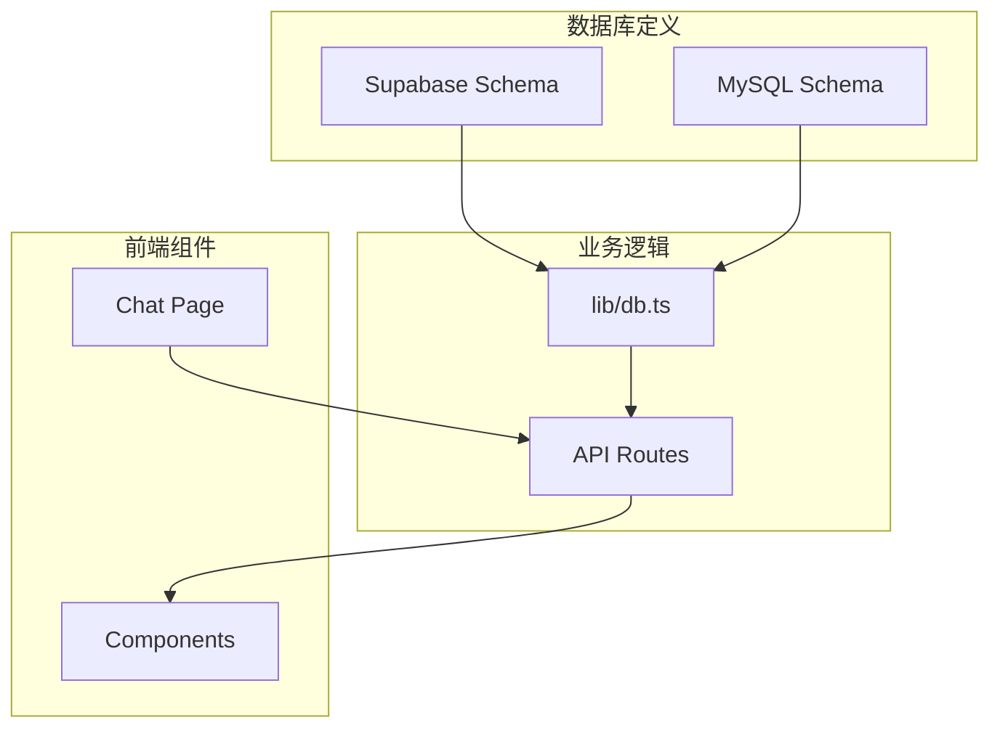
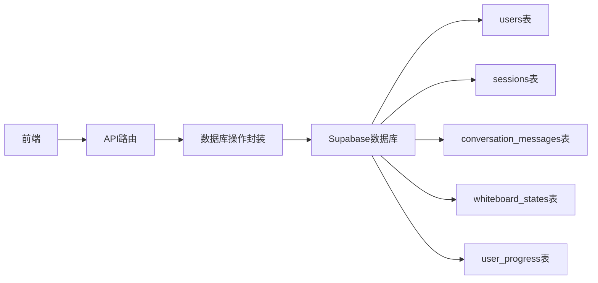
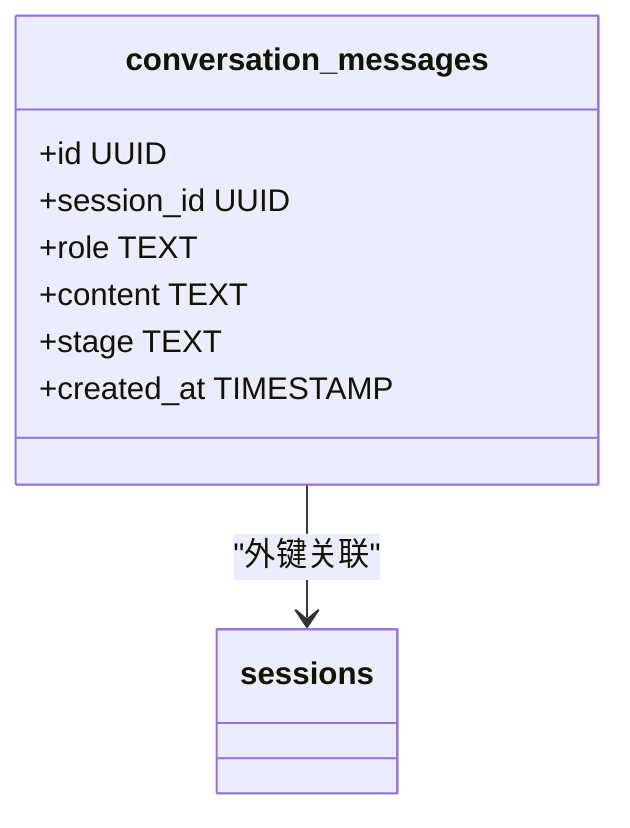
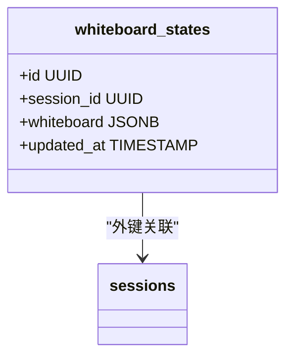
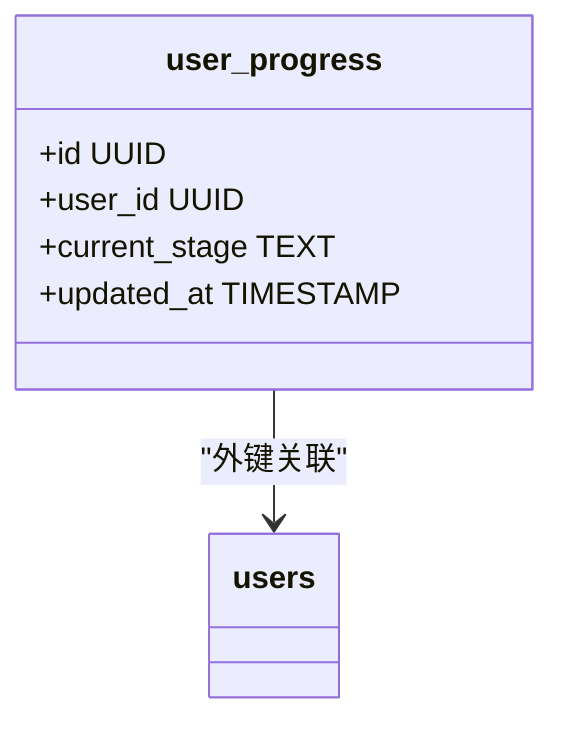
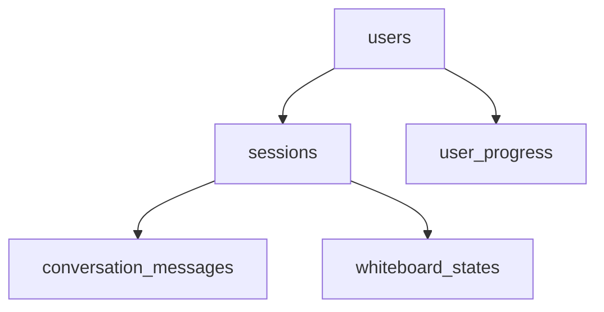

# 核心表结构详解

<cite>
**本文档引用的文件**  
- [supabase/schema.sql](file://supabase/schema.sql)
- [mysql/schema.sql](file://mysql/schema.sql)
- [fix-whiteboard-schema.sql](file://fix-whiteboard-schema.sql)
- [database-init.sql](file://database-init.sql)
- [lib/db.ts](file://lib/db.ts)
- [app/api/chat/route.ts](file://app/api/chat/route.ts)
- [app/api/load-whiteboard/route.ts](file://app/api/load-whiteboard/route.ts)
- [app/api/save-whiteboard/route.ts](file://app/api/save-whiteboard/route.ts)
- [lib/conversationStore.ts](file://lib/conversationStore.ts)
- [lib/stage.ts](file://lib/stage.ts)
- [lib/stage_selector_implementation.md](file://lib/stage_selector_implementation.md)
</cite>

## 目录
1. [引言](#引言)
2. [项目结构](#项目结构)
3. [核心组件](#核心组件)
4. [架构概述](#架构概述)
5. [详细组件分析](#详细组件分析)
6. [依赖分析](#依赖分析)
7. [性能考量](#性能考量)
8. [故障排除指南](#故障排除指南)
9. [结论](#结论)
10. [附录](#附录)（如有必要）

## 引言
本文档深入解析ai-job-coach数据库中的核心表结构，包括users、sessions、conversation_messages、whiteboard_states和user_progress五张关键表。针对每张表，详细说明其字段定义、数据类型选择、主外键关系、约束条件（如CHECK、UNIQUE）、索引设计目的及性能影响。特别说明conversation_messages表中role字段的枚举限制、stage字段的上下文作用，whiteboard_states表中JSONB数据的存储结构与查询效率，user_progress表的单记录限制等设计考量。结合实际业务场景（如多会话支持、阶段跳转、消息历史恢复）解释表结构如何支撑功能需求。

## 项目结构
ai-job-coach项目采用模块化设计，主要包含app、components、lib、mysql、supabase等目录。其中，数据库相关结构定义主要位于supabase和mysql目录下的schema.sql文件中，业务逻辑与数据库交互封装在lib/db.ts中，前端组件与API路由则分布在app/api目录下。

**图示来源**
- [supabase/schema.sql](file://supabase/schema.sql)
- [mysql/schema.sql](file://mysql/schema.sql)
- [lib/db.ts](file://lib/db.ts)

**本节来源**
- [supabase/schema.sql](file://supabase/schema.sql)
- [mysql/schema.sql](file://mysql/schema.sql)

## 核心组件
本项目核心组件围绕用户会话、对话消息、白板状态和用户进度四大功能模块展开，通过users、sessions、conversation_messages、whiteboard_states和user_progress五张表实现数据持久化。这些组件共同支撑了AI求职教练的多阶段引导、对话历史管理、状态同步等核心功能。

**本节来源**
- [supabase/schema.sql](file://supabase/schema.sql)
- [lib/db.ts](file://lib/db.ts)
- [lib/conversationStore.ts](file://lib/conversationStore.ts)

## 架构概述
系统采用前后端分离架构，前端通过API路由与后端交互，后端通过数据库操作封装与数据库通信。用户认证由Supabase Auth处理，会话状态通过cookie和localStorage维护。对话历史、白板状态和用户进度等数据通过Supabase客户端进行增删改查操作，确保数据一致性与实时同步。

**图示来源**
- [lib/db.ts](file://lib/db.ts)
- [app/api/chat/route.ts](file://app/api/chat/route.ts)
- [supabase/schema.sql](file://supabase/schema.sql)

## 详细组件分析

### 用户表（users）分析
users表作为系统的核心身份表，存储用户的基本信息。在Supabase版本中，使用UUID作为主键，支持通过手机号、邮箱或OAuth方式注册。在MySQL版本中，采用邀请码作为主键，体现了不同的用户管理体系。

**本节来源**
- [supabase/schema.sql](file://supabase/schema.sql#L5-L12)
- [mysql/schema.sql](file://mysql/schema.sql#L10-L21)

### 会话表（sessions）分析
sessions表支持多端、多会话场景，每个用户可拥有多个会话记录。通过user_id外键关联users表，实现用户会话的归属管理。索引设计优化了按用户查询会话的性能。

**本节来源**
- [supabase/schema.sql](file://supabase/schema.sql#L15-L20)
- [mysql/schema.sql](file://mysql/schema.sql#L24-L32)

### 对话消息表（conversation_messages）分析
conversation_messages表是对话历史的核心存储，通过session_id关联会话，记录每条消息的角色、内容和所属阶段。role字段通过CHECK约束限制为'user'、'assistant'、'system'三种枚举值，确保数据一致性。stage字段用于区分不同阶段的对话，支持跨阶段上下文理解。

**图示来源**
- [supabase/schema.sql](file://supabase/schema.sql#L23-L30)
- [mysql/schema.sql](file://mysql/schema.sql#L35-L46)

**本节来源**
- [supabase/schema.sql](file://supabase/schema.sql#L23-L30)
- [lib/db.ts](file://lib/db.ts#L58-L137)
- [app/api/chat/route.ts](file://app/api/chat/route.ts)

### 白板状态表（whiteboard_states）分析
whiteboard_states表采用JSONB类型存储白板的复杂状态数据，支持灵活的结构化存储。通过session_id外键关联会话，并设置UNIQUE约束确保每个会话只有一个白板状态。updated_at字段配合触发器实现自动更新，便于追踪状态变更。

**图示来源**
- [supabase/schema.sql](file://supabase/schema.sql#L33-L39)
- [fix-whiteboard-schema.sql](file://fix-whiteboard-schema.sql)

**本节来源**
- [supabase/schema.sql](file://supabase/schema.sql#L33-L39)
- [lib/db.ts](file://lib/db.ts#L144-L228)
- [app/api/save-whiteboard/route.ts](file://app/api/save-whiteboard/route.ts)
- [app/api/load-whiteboard/route.ts](file://app/api/load-whiteboard/route.ts)

### 用户进度表（user_progress）分析
user_progress表记录用户在求职流程中的当前阶段，通过user_id外键关联用户，并设置UNIQUE约束确保每个用户只有一条进度记录。current_stage字段默认值为'career_planning'，符合业务流程的起点。

**图示来源**
- [supabase/schema.sql](file://supabase/schema.sql#L42-L48)
- [lib/db.ts](file://lib/db.ts#L235-L288)

**本节来源**
- [supabase/schema.sql](file://supabase/schema.sql#L42-L48)
- [lib/db.ts](file://lib/db.ts#L235-L288)
- [lib/stage.ts](file://lib/stage.ts)
- [lib/stage_selector_implementation.md](file://lib/stage_selector_implementation.md)

## 依赖分析
系统各组件间存在明确的依赖关系。users表作为基础身份表，被sessions、user_progress等表依赖。sessions表作为会话容器，被conversation_messages和whiteboard_states表依赖。这种层级依赖关系确保了数据的完整性和一致性。

**图示来源**
- [supabase/schema.sql](file://supabase/schema.sql)
- [lib/db.ts](file://lib/db.ts)

**本节来源**
- [supabase/schema.sql](file://supabase/schema.sql)
- [lib/db.ts](file://lib/db.ts)

## 性能考量
数据库设计充分考虑了查询性能。通过在关键字段上创建索引（如idx_sessions_user_id、idx_messages_session_id），优化了按用户或会话查询的效率。JSONB类型的使用在PostgreSQL中支持高效的路径查询和索引，提升了白板状态的读写性能。触发器机制减少了应用层的更新逻辑，提高了数据一致性。

**本节来源**
- [supabase/schema.sql](file://supabase/schema.sql#L51-L55)
- [fix-whiteboard-schema.sql](file://fix-whiteboard-schema.sql)

## 故障排除指南
当遇到数据不一致或查询失败时，应首先检查外键约束和唯一性约束是否被违反。对于白板状态更新失败，需确认user_id或session_id的冲突处理逻辑。对话消息保存失败可能与role字段的枚举值不符有关。建议通过数据库日志和API错误信息进行排查。

**本节来源**
- [lib/db.ts](file://lib/db.ts)
- [supabase/schema.sql](file://supabase/schema.sql)

## 结论
ai-job-coach的数据库设计充分考虑了求职辅导场景的多阶段、多会话、状态同步等需求。通过合理的表结构设计、约束条件和索引优化，实现了数据的高效存储与查询。结合前端组件和API路由，形成了完整的用户引导与数据管理闭环，为AI求职教练功能提供了坚实的数据基础。