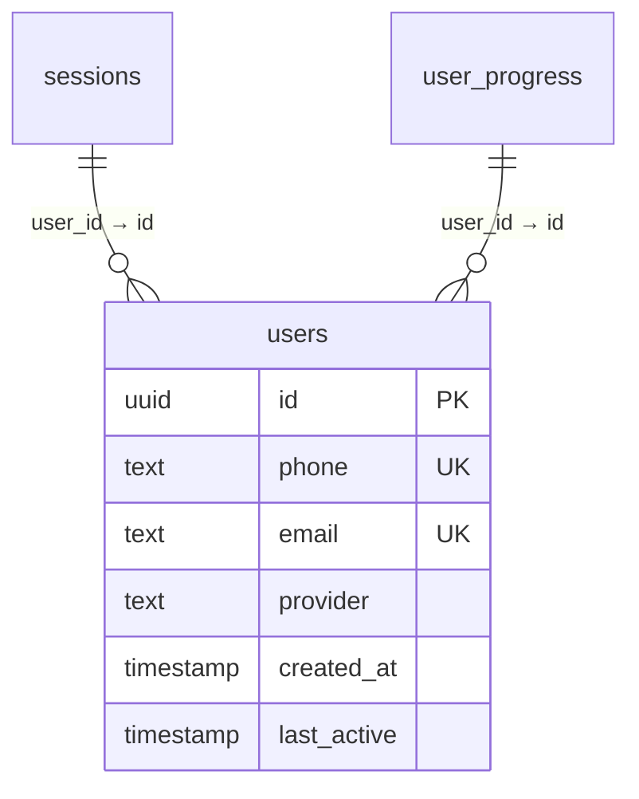
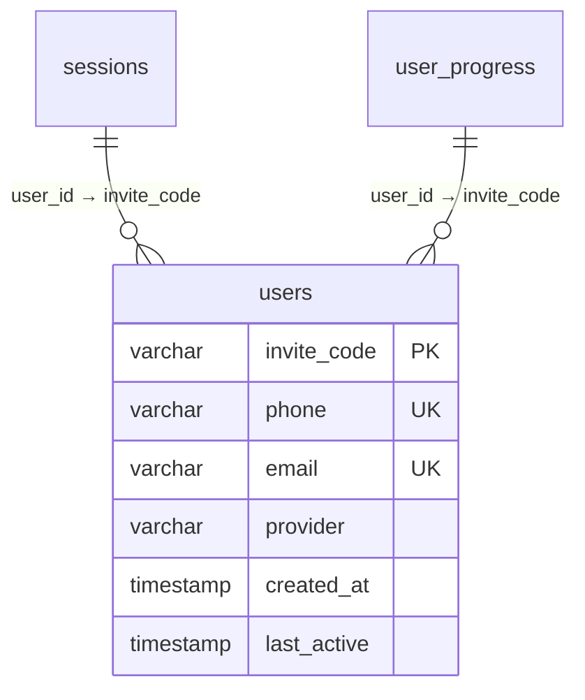
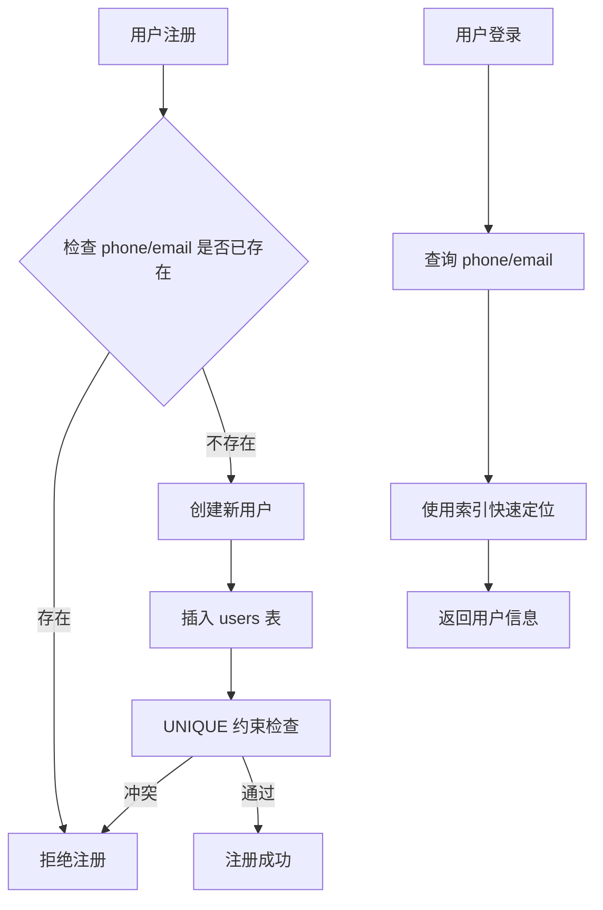
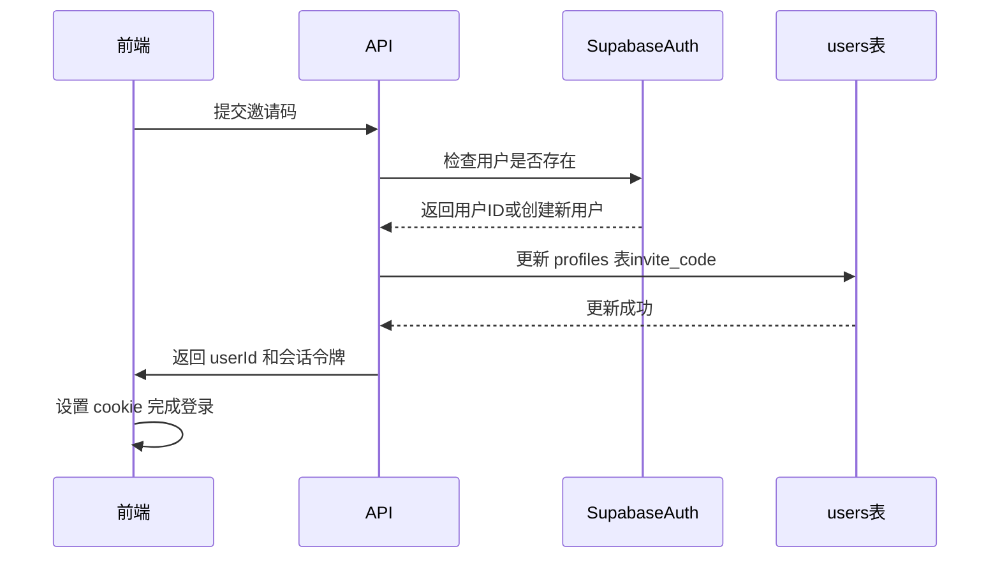
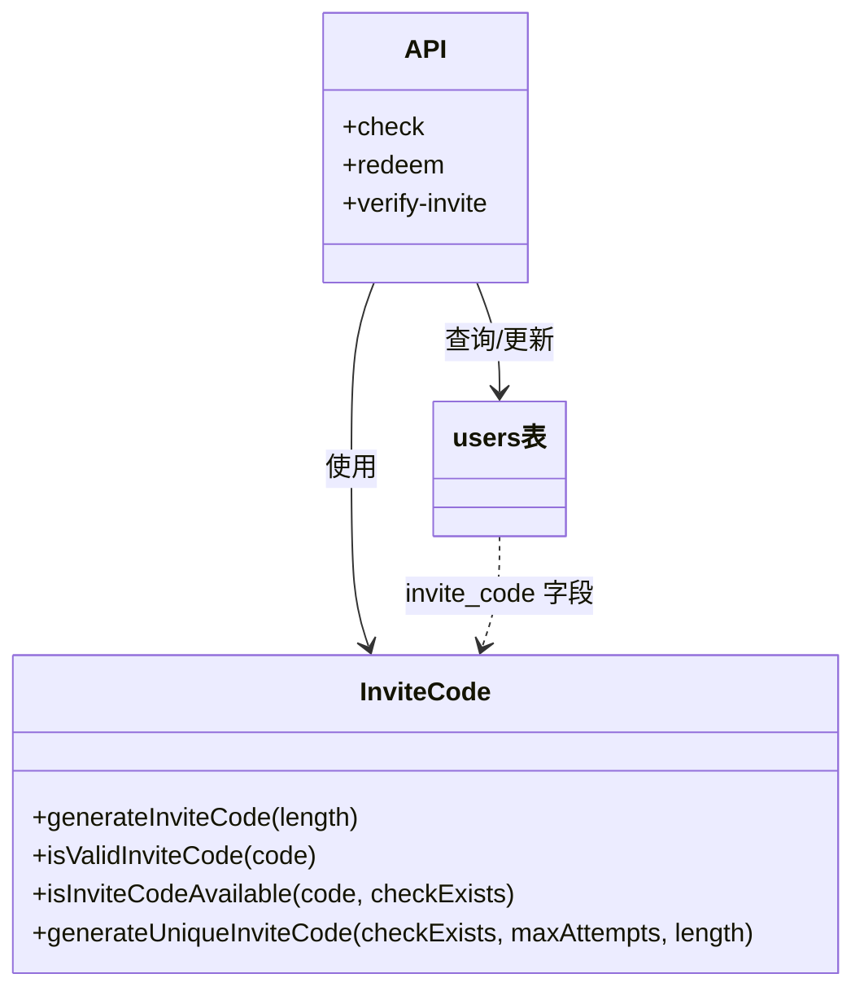

# 用户表 (users)

<cite>
**本文档引用的文件**  
- [supabase\schema.sql](file://supabase/schema.sql)
- [mysql\schema.sql](file://mysql/schema.sql)
- [lib\auth.ts](file://lib/auth.ts)
- [lib\inviteCode.ts](file://lib/inviteCode.ts)
- [lib\db.ts](file://lib/db.ts)
- [app\api\auth\create-session\route.ts](file://app/api/auth/create-session/route.ts)
- [app\api\invites\check\route.ts](file://app/api/invites/check/route.ts)
- [app\api\invites\redeem\route.ts](file://app/api/invites/redeem/route.ts)
- [app\api\verify-invite\route.ts](file://app/api/verify-invite/route.ts)
</cite>

## 目录
1. [引言](#引言)
2. [Supabase（PostgreSQL）版本设计](#supabasepostgresql-版本设计)
3. [MySQL版本设计](#mysql版本设计)
4. [字段设计目的详解](#字段设计目的详解)
5. [唯一约束与索引机制](#唯一约束与索引机制)
6. [认证系统集成](#认证系统集成)
7. [邀请码系统集成](#邀请码系统集成)
8. [架构对比总结](#架构对比总结)

## 引言
本文件深入解析`users`表在Supabase（PostgreSQL）与MySQL两种数据库环境下的结构设计差异。重点阐述其在用户认证与邀请码系统中的核心作用，分析字段设计哲学、主键策略、时间戳管理机制以及去中心化业务主键的设计理念。

## Supabase（PostgreSQL）版本设计

**图表来源**  
- [supabase\schema.sql](file://supabase/schema.sql#L5-L12)

**本节来源**  
- [supabase\schema.sql](file://supabase/schema.sql#L5-L12)

Supabase版本采用标准的PostgreSQL设计范式，以UUID作为主键，确保全局唯一性和分布式系统的兼容性。该设计与Supabase Auth深度集成，`id`字段直接映射到Supabase Auth用户的ID，实现无缝的身份管理。

`created_at`和`last_active`字段均使用`NOW()`作为默认值，确保用户创建时自动记录时间戳。虽然当前schema中未为`users`表设置更新触发器，但其设计风格与`sessions`、`whiteboard_states`等表保持一致，体现了统一的时间管理策略。

## MySQL版本设计

**图表来源**  
- [mysql\schema.sql](file://mysql/schema.sql#L10-L21)

**本节来源**  
- [mysql\schema.sql](file://mysql/schema.sql#L10-L21)

MySQL版本采用了显著不同的设计哲学——**去中心化业务主键**。`invite_code`字段被设计为用户的唯一ID和主键，这使得用户身份直接与业务逻辑（邀请码）绑定。

该设计的核心优势在于：
- **业务语义明确**：用户ID本身就是可读的邀请码，便于追踪和管理。
- **去中心化注册**：无需依赖中心化身份服务，用户通过邀请码即可完成注册。
- **简化查询**：在邀请码系统中，可直接使用`invite_code`进行高效查询。

`last_active`字段使用`ON UPDATE CURRENT_TIMESTAMP`，确保用户每次活跃时自动更新时间戳，精确追踪用户行为。

## 字段设计目的详解

### id（UUID主键）
在Supabase版本中，`id`字段作为UUID主键，由`gen_random_uuid()`函数自动生成。此设计确保了：
- **全局唯一性**：避免分布式环境下的ID冲突。
- **安全性**：不可预测的ID防止枚举攻击。
- **与Supabase Auth集成**：直接使用Supabase生成的用户ID，简化身份验证流程。

**本节来源**  
- [supabase\schema.sql](file://supabase/schema.sql#L6)
- [lib\auth.ts](file://lib/auth.ts#L5-L7)

### phone/email（唯一约束）
两个版本均对`phone`和`email`字段施加了`UNIQUE`约束，其设计目的包括：
- **防止重复注册**：确保同一手机号或邮箱只能注册一个账户。
- **数据完整性**：维护用户联系信息的唯一性。
- **支持多方式登录**：为基于手机号或邮箱的登录提供数据基础。

**本节来源**  
- [supabase\schema.sql](file://supabase/schema.sql#L7-L8)
- [mysql\schema.sql](file://mysql/schema.sql#L12-L13)

### provider（认证方式枚举）
`provider`字段用于标识用户的注册/登录方式，可能的值包括`phone`、`email`、`oauth`（Supabase）或`anonymous`（MySQL）。此字段的作用是：
- **区分认证源**：系统可根据此字段选择相应的认证逻辑。
- **支持匿名用户**：MySQL版本的`anonymous`值支持无需注册的访客模式。

**本节来源**  
- [supabase\schema.sql](file://supabase/schema.sql#L9)
- [mysql\schema.sql](file://mysql/schema.sql#L15)

### created_at/last_active（时间戳）
- `created_at`：记录用户创建时间，用于分析用户增长趋势和生命周期。
- `last_active`：记录用户最后活跃时间，在MySQL版本中通过`ON UPDATE CURRENT_TIMESTAMP`自动更新，在Supabase版本中虽无触发器，但可通过应用层逻辑维护。

**本节来源**  
- [supabase\schema.sql](file://supabase/schema.sql#L10-L11)
- [mysql\schema.sql](file://mysql/schema.sql#L16-L17)

## 唯一约束与索引机制

**图表来源**  
- [supabase\schema.sql](file://supabase/schema.sql#L7-L8)
- [mysql\schema.sql](file://mysql/schema.sql#L12-L13)

**本节来源**  
- [supabase\schema.sql](file://supabase/schema.sql#L7-L8)
- [mysql\schema.sql](file://mysql/schema.sql#L12-L13)

`UNIQUE`约束在防止重复注册中扮演关键角色。当尝试插入重复的`phone`或`email`时，数据库会抛出唯一性冲突错误，应用层捕获此错误并返回“该手机号/邮箱已被注册”的提示。

此外，`phone`和`email`字段上的索引（MySQL显式创建，PostgreSQL由UNIQUE约束隐式创建）极大地优化了登录查询性能。系统可以通过索引快速定位用户，避免全表扫描，确保登录响应的高效性。

## 认证系统集成

**图表来源**  
- [app\api\invites\redeem\route.ts](file://app/api/invites/redeem/route.ts)
- [lib\auth.ts](file://lib/auth.ts)

**本节来源**  
- [app\api\auth\create-session\route.ts](file://app/api/auth/create-session/route.ts)
- [app\api\invites\redeem\route.ts](file://app/api/invites/redeem/route.ts)
- [lib\auth.ts](file://lib/auth.ts)

`users`表通过`lib\auth.ts`与Supabase Auth系统紧密集成。`getCurrentUserFromRequest`函数利用Supabase的cookie自动获取当前用户信息，实现了无感认证。认证流程如下：
1. 用户提交邀请码。
2. 后端调用Supabase Admin API检查或创建用户。
3. 将生成的用户ID与邀请码关联存储。
4. 返回会话令牌，前端设置cookie完成登录。

## 邀请码系统集成

**图表来源**  
- [lib\inviteCode.ts](file://lib/inviteCode.ts)
- [app\api\invites\check\route.ts](file://app/api/invites/check/route.ts)

**本节来源**  
- [lib\inviteCode.ts](file://lib/inviteCode.ts)
- [app\api\invites\check\route.ts](file://app/api/invites/check/route.ts)
- [app\api\invites\redeem\route.ts](file://app/api/invites/redeem/route.ts)
- [app\api\verify-invite\route.ts](file://app/api/verify-invite/route.ts)

`lib\inviteCode.ts`是邀请码系统的核心，提供了生成、验证和检查可用性的工具函数。`users`表中的`invite_code`字段（MySQL）或`profiles`表中的同名字段（Supabase）是该系统与用户数据的桥梁。

关键API：
- `check`：检查邀请码状态（有效、已用、过期）。
- `redeem`：兑换邀请码，创建用户并绑定关系。
- `verify-invite`：简化版验证，仅检查存在性和过期时间。

## 架构对比总结

| 特性 | Supabase (PostgreSQL) | MySQL |
| :--- | :--- | :--- |
| **主键** | UUID (`id`) | 业务主键 (`invite_code`) |
| **ID生成** | `gen_random_uuid()` | 应用层生成（`inviteCode.ts`） |
| `last_active`更新 | 应用层维护 | 数据库触发器 (`ON UPDATE CURRENT_TIMESTAMP`) |
| **认证集成** | 深度集成 Supabase Auth | 自主实现邀请码认证 |
| **设计哲学** | 标准化、中心化身份 | 去中心化、业务驱动 |

两种设计各有侧重：Supabase版本充分利用了BaaS平台的能力，实现了快速开发和标准化管理；MySQL版本则通过业务主键的设计，实现了更高的灵活性和对业务逻辑的直接支持。